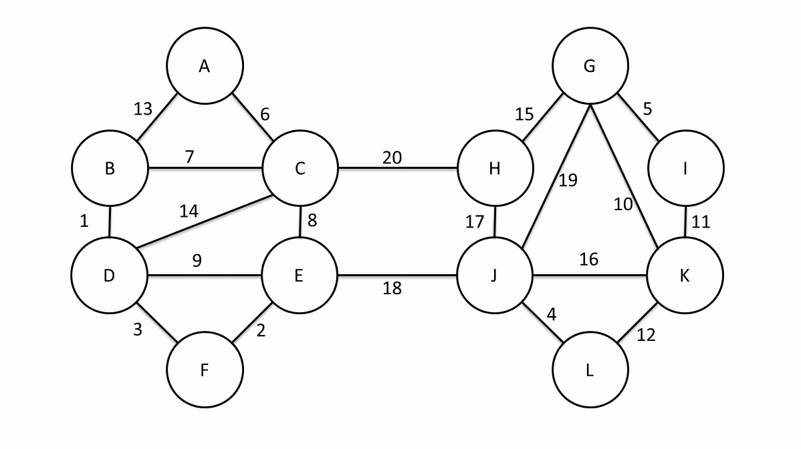

# 链接

https://ac.nowcoder.com/acm/contest/15801?&headNav=www

# B Graph


## 题意

n个点的带权树，你可以删边，但要保证删边后图联通，可以加边，但要保证加边后所有简单环的异或和为0。

现在你可以随便操作，需要操作后的树的边权和最小。

## 题解

题目中的两个操作都不会影响两个顶点之间路径的异或和。所以实际上相当于给了一个完全图，两个点之间的边权就是原始树上这两个点之间的路径的异或和，你要求一个最小生成树。

很多人都知道最小生成树有Kruskal算法和Prim算法，但是很少有人知道第三个算法：Boruvka算法，因为这个算法不常用。


<!-- more -->

大体来说就是首先我们有n个顶点，他们现在是n个联通块，我们使用某种算法（暴力啊贪心啊排序啊什么的瞎搞搞）得到了每个联通块到离他最近的联通块的边，然后一次性把这些边全部连起来。最终我们得到了少于$\frac{n}{2}$个联通块。然后继续前面的算法，直到只剩下一个联通块，这时候就是最小生成树。下面是一个偷来的例子。



回到这题中，我们把原始树根到每个点的路径的异或和求出来，定义为$w$, 即根节点到点$u$的路径的异或和为$w(u)$，那么如果我们在生成树中点$u$到点$v$那条边的权就是$w(u)异或w(v)$。

我们对每个点的权放入字典树，然后执行Boruvka算法，显然最开始的时候，n个联通块对应n个叶子结点，联通块到离他最近的联通块的距离就是他的在字典树上的兄弟。当我们合并以后，会发现新的联通块对应字典树上的一个子树，合并的时候依然是找他的兄弟，所以这个算法就执行完毕了。


# C Easy

## 题意

a是一个和为n长度为k的正数序列，b是一个和为m长度为k的正数序列，定义$\begin{aligned}p=\prod_{i=1}^k\min(a_i,b_i)\end{aligned}$ , 对所有的a和b，求其对应的p的和。

## 题解

考虑生成函数
$$
\begin{aligned}
f&= \sum_{1\le i}\sum_{1\le j} \min(i,j)x^iy^j
\\&= \sum_{1\le i\lt j} ix^iy^j + \sum_{1\le j \lt i} jx^iy^j + \sum_{1\le i} ix^iy^i
\end{aligned}
$$

$$
\begin{aligned}
&\sum_{1\le i\lt j} ix^iy^j 
\\=&\sum_{1\le i} ix^i\frac{y^{i+1}}{1-y}
\\=&\frac{y}{1-y}\sum_{1\le i} ix^iy^i
\end{aligned}
$$


$$
\begin{aligned}
f&= \sum_{1\le i\lt j} ix^iy^j + \sum_{1\le j \lt i} jx^iy^j + \sum_{1\le i} ix^iy^i
\\&= 
\frac{y}{1-y}\sum_{1\le i} ix^iy^i 
+ \frac{x}{1-x}\sum_{1\le i} ix^iy^i 
+ \sum_{1\le i} ix^iy^i
\\&= (\frac{y}{1-y}+\frac{x}{1-x}+1)\sum_{1\le i} ix^iy^i
\\&= (\frac{y}{1-y}+\frac{x}{1-x}+1)\frac{xy}{(1-xy)^2}
\\&=\frac{xy}{(1-x)(1-y)(1-xy)}
\end{aligned}
$$


由于需要计算$f^k$的$x^ny^m$的次数， 我们得到了
$$
\begin{aligned}
&f^k
\\=&(xy)^k(1-x)^{-k}(1-y)^{-k}(1-xy)^{-k}
\end{aligned}
$$
这里需要我们枚举$(1-xy)^{-k}$的次数$i$,则$(1-x)^{-k}$的次数必须是$n-k-i$, 则$(1-y)^i$的次数必须是$m-k-i$
$$
\begin{aligned}
&\sum_{i=0}^{min(n-k,m-k)} 
C_{-k}^i (-1)^i \cdot
C_{-k}^{n-k-i} (-1)^{n-k-i} \cdot
C_{-k}^{m-k-i} (-1)^{m-k-i}
\\=&\sum_{i=0}^{min(n-k,m-k)} 
C_{i+k-1}^{k-1} \cdot
C_{n-i-1}^{k-1} \cdot
C_{m-i-1}^{k-1}
\end{aligned}
$$

```c++
#include <bits/stdc++.h>


using namespace std;
typedef long long ll;

const int mod = 998244353;

int qpow(int a, int b) {
    int ret = 1;
    while (b) {
        if (b & 1) ret = 1ll * ret * a % mod;
        a = 1ll * a * a % mod;
        b >>= 1;
    }
    return ret;
}

const int maxn = 2e6 + 10;
int fac[maxn], invfac[maxn];

void init() {
    fac[0] = 1;
    for (int i = 1; i < maxn; i++) {
        fac[i] = 1ll * fac[i - 1] * i % mod;
    }
    invfac[maxn - 1] = qpow(fac[maxn - 1], mod - 2);
    for (int i = maxn - 2; i >= 0; i--) {
        invfac[i] = invfac[i + 1] * (i + 1ll) % mod;
    }
}

// C_a^b
int c(int a, int b) {
    return 1ll * fac[a] * invfac[b] % mod * invfac[a - b] % mod;
}

int main() {
    init();
    int t;
    cin >> t;
    while (t--) {
        int n, m, k;
        cin >> n >> m >> k;
        int up = min(n - k, m - k);
        int ans = 0;
        for (int i = 0; i <= up; i++) {
            ans += 1ll * c(i + k - 1, k - 1) * c(n - i - 1, k - 1) % mod * c(m - i - 1, k - 1) % mod;
            ans %= mod;
        }
        cout << ans << "\n";
    }
}
```

# D Drop Voicing

## 题意

给你一个排列，你可以随意使用下面的两个操作

- 把排列$P$变为 $P_{n-1},P_1,P_2...P_{n-3},P_{n-2},P_n$
- 把排列$P$变为 $P_2,P_3...P_{n-2},P_n,P_{n-1},P_1$

多个连续的第一个操作可以合并为一次multi操作，问你最少进行多少个multi操作，能把这个排列还原为$1,2,3...n$

## 数据范围

排列长度小于500

## 题解

我们考虑一次第一个操作以后，紧接着来一次第二个操作，则排列变成了

$P_1,P_2,...P_{n-3},P_{n-2},P_{n},P_{n-1}$

我们考虑两次第一个操作以后，紧接着来两次第二个操作，则排列变成了

$P_1,P_2,...P_{n-3},P_{n},P_{n-2},P_{n-1}$

很容易发现，第一个操作等价于选择最后一个元素，然后插入到任意一个地方，而第二个操作等等价于旋转数组。

于是，我们如果考虑把数组想想成一个环，则第二个操作就不用考虑了，第一个操作等价于选择一个元素，插入到环的任何地方。

最后，只需要枚举环状数组的起点，然后求lis即可。


# E Bogo Sort

## 题意

给你一个置换，问你有多少个数组可以通过有限次这个置换还原为$1,2,3...n$


## 数据范围

置换长度小于$10^5$


## 题解

等价于计算以置换P为生成元的循环子群所在的集合的大小。把置换$P$分解为循环乘积，所有循环乘积的长度的lcm即为答案。


# H Interval

## 题意

给你一个数列，q组询问，每次询问一个区间，问你这个区间的所有子串的按位与所构成的集合的大小。

## 数据范围

数列长度$10^5$

## 题解

每个点作为右端点，最多有log个值，于是想到了从左到右构建主席树，则每一个前缀我们都可以获得一个全值线段树。

当以某个点位右端点询问时，取出这个主席树，后面的解决方案就和求区间内不同的数的个数一摸一样了。

## 感想

看到不同的数的个数，应该往主席树考虑。


# I Hard Math Problem

## 题意

有一个$n\times m$的农田，你可以在每个格子种植农作物、挖坑放水或者放置自动收割机。

每个农作物的上下左右四个格子中必须至少有一个水坑和一个自动收割机，这样的农作物才有效，否则这个农作物无效。

问你当n和m趋于无穷大的时候，在所有的$n\times m$个方格中，你能种植农作物的格子所占总格子的比例最大是多少。

## 题解

$\frac{2}{3}$


| 水   |      |      | 收   |      |      | 水   |      |      | 收   |      |      | 水   |      |      |
| ---- | ---- | ---- | ---- | ---- | ---- | ---- | ---- | ---- | ---- | ---- | ---- | ---- | ---- | ---- |
|      | 收   |      |      | 水   |      |      | 收   |      |      | 水   |      |      | 收   |      |
|      |      | 水   |      |      | 收   |      |      | 水   |      |      | 收   |      |      | 水   |
| 水   |      |      | 收   |      |      | 水   |      |      | 收   |      |      | 水   |      |      |
|      | 收   |      |      | 水   |      |      | 收   |      |      | 水   |      |      | 收   |      |
|      |      | 水   |      |      | 收   |      |      | 水   |      |      | 收   |      |      | 水   |
| 水   |      |      | 收   |      |      | 水   |      |      | 收   |      |      | 水   |      |      |
|      | 收   |      |      | 水   |      |      | 收   |      |      | 水   |      |      | 收   |      |
|      |      | 水   |      |      | 收   |      |      | 水   |      |      | 收   |      |      | 水   |
| 水   |      |      | 收   |      |      | 水   |      |      | 收   |      |      | 水   |      |      |
|      | 收   |      |      | 水   |      |      | 收   |      |      | 水   |      |      | 收   |      |
|      |      | 水   |      |      | 收   |      |      | 水   |      |      | 收   |      |      | 水   |
| 水   |      |      | 收   |      |      | 水   |      |      | 收   |      |      | 水   |      |      |
|      | 收   |      |      | 水   |      |      | 收   |      |      | 水   |      |      | 收   |      |
|      |      | 水   |      |      | 收   |      |      | 水   |      |      | 收   |      |      | 水   |


