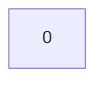
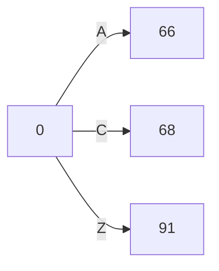
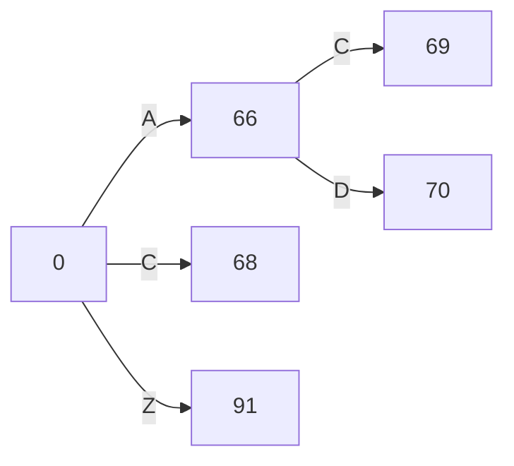
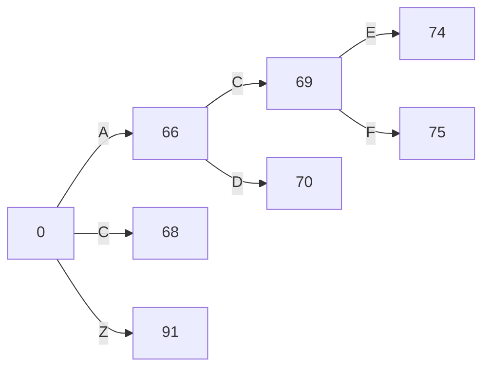

# 0. 前置知识

[需要提前有字典树的知识](https://fightinggg.github.io/Q79RYN.html)

# 1. 双数组字典树介绍

双数组字典树英文名为DoubleArrayTrie，他的特点就是使用两个数组来表示一颗字典树，这里有比较有趣了，两个数组是怎么表达出字典树的呢？


# 2. 双数组介绍

顾名思义，有两个数组，一个是base，另一个是check。

首先介绍数组的下标，数组的下标代表字典树上节点的编号，一个下标对应一个节点。

其实base数组的作用是用来记录一个基础值，这个值可以是随机值，只要不产生冲突就可以了，所以这个值可以用随机数算法获取，当然这样效率不高，高效的做法应该是使用指针枚举技术，ok，现在你已经明白了，base数组是一个不产生冲突的随机数组。

最后，check数组，check数组与base数组相互照应，如果`base[i]=check[j]` 则说明j是i的儿子，而且i到j的边权恰好为`j-base[i]`，也可以写作`j-check[j]`好好理解这句话

从另一个方面而言，双数组字典树的base数组，应该是一个指针数组，他指向了一个长度为字符集大小的数组的首地址，而check数组是一种hash碰撞思路，由于base数组疯狂指向自己，导致产生了很多碰撞，但是由于字典树是一个稀疏图，导致儿子节点指针利用率低，所以base数组疯狂复用这段空间，最后必须要依赖check来解决冲突，

双数组字典树相比于传统字典树，仅仅只在内存方面于增删改查占有优势，但是唯一不好的地方就是删和改会导致base数组内存分裂，难以回收，删和改如果占大头，那么传统字典树的内存效率更高

由于搜索领域几乎不涉及到删和改，所以这个数据结构很nice，字符集多大，就节省了多少倍的空间

数据结构很棒，但是在现在这个内存不值钱的时代，这些指针的储存用hashmap直接无脑顶掉，空间占用也高不了多少，hashmap顶多浪费两倍空间

两倍的空间算不上啥，除非这是唯一的优化点，否则不会优化到这个数据结构上来

<!-- more -->


# 3. 图解双数组字典树

首先我们直接给出一颗双数组字典树，下面是三列，第一列是下标，第二列是base，第三列是check， 我们来根据这个双数组还原那颗字典树

```
index base check
0 1 0
66 2 1
68 3 1
69 5 2
70 6 2
71 7 3
73 8 3
74 10 5
75 11 5
81 12 11
85 9 4
91 4 1
```

从第一行看起，base[0]=1, check[0]=0 ,这说明根节点是0号节点。




然后我们来找0节点的子节点，只需要哪些check值为base[0]即可，我们发现check[66],check[68],check[91]满足，所以他们都是0号节点的子节点

对于check[66], 边权为66-check[66]=65 ,是字符`A`

对于check[68], 边权67, 是字符`C`

对于check[91], 边权90，是字符`Z`

所以现在图成了




接着我们看66号节点，base[66]=2,那么他的子节点为69和70，边权分别为69-check[69]=67,70-check[70]=68,分别是C和D




69的字节点为74和75， 权重为74-5=69和75-5=70， 分别是E和F



当然，后面的笔者就不进行模拟了，到此为止。


# 4. 双数组字典树的构建算法

首先算法的第一步是构建一颗字典树，你需要将这颗字典树构建出来。字典树的代码如下,这个不用多说了

```C
void addTire(const char* str, int len) {
    int root = 1;
    for (int i = 0; i < len; i++) {
        if (tire[root][str[i]] == 0) {
            tire[root][str[i]] = ++tireTot;
        }
        root = tire[root][str[i]];
    }
}
```


第二步，就是在字典树上进行BFS，在BFS过程中增量构建双数组字典树，当我们BFS到某个节点U的时候，便开始寻找，当前还有哪个base值没有被使用，可以使得这个U的子节点的check值均为0， no BB , show code

先找到U的所有子节点

```C
        vector<int> sonTransList;
        for (int i = 0;i < maxCharest;i++) {
            if (tire[tireTop][i] != 0) {
                sonTransList.push_back(i);
                tireQ.push(tire[tireTop][i]);
            }
        }
        cout << "find son: " << sonTransList.size() << endl;;
```

然后寻找一个合适的base值，这个值储存在变量begin中

```C
        // find begin
        while (true) {
            begin++;
            bool ok = true;
            for (int son : sonTransList) {
                if (check[begin + code[son]] != 0) {
                    ok = false;
                    break;
                }
            }
            if (ok) {
                break;
            }
        }
```

最后就是赋值就好了.


# 5. 代码

最后附上一个很丑的代码，第三节中介绍的双数组就来源于这个代码的输出。

```C
// ConsoleApplication1.cpp : 此文件包含 "main" 函数。程序执行将在此处开始并结束。
//

#include <queue>
#include <iostream>
#include <string>
using namespace std;

string stringData[] = {
        "AC",
        "ACE",
        "ACFF",
        "AD",
        "CD",
        "CF",
        "ZQ"
};


const int maxCharest = 256;
int tire[1000][maxCharest], tireTot = 1;

void addTire(const char* str, int len) {
    int root = 1;
    for (int i = 0; i < len; i++) {
        if (tire[root][str[i]] == 0) {
            tire[root][str[i]] = ++tireTot;
        }
        root = tire[root][str[i]];
    }
}


int code[maxCharest];

void buildDAT() {
    // init code
    for (int i = 0;i < maxCharest;i++) {
        code[i] = i;
    }
    vector<int> tireState2DatState(1000);

    // TODO vector
    vector<int> check(1000), base(1000);

    // bfs
    queue<int> tireQ;
    tireQ.push(1);
    tireState2DatState[1] = 0;

    int begin = 0;

    while (!tireQ.empty()) {
        int tireTop = tireQ.front();
        tireQ.pop();

        vector<int> sonTransList;
        for (int i = 0;i < maxCharest;i++) {
            if (tire[tireTop][i] != 0) {
                sonTransList.push_back(i);
                tireQ.push(tire[tireTop][i]);
            }
        }
        cout << "find son: " << sonTransList.size() << endl;;

        // find begin
        while (true) {
            begin++;
            bool ok = true;
            for (int son : sonTransList) {
                if (check[begin + code[son]] != 0) {
                    ok = false;
                    break;
                }
            }
            if (ok) {
                break;
            }
        }

        base[tireState2DatState[tireTop]] = begin;
        for (int i = 0;i < maxCharest;i++) {
            if (tire[tireTop][i] != 0) {
                int son = i;
                if (check[begin + code[son]] != 0) {
                    exit(-1);
                }
                check[begin + code[son]] = begin;
                tireState2DatState[tire[tireTop][i]] = begin + code[son];
            }
        }
        for (int i = 0;i < 1000;i++) {
            if (check[i] != 0 || base[i] != 0) {
                cout << i << " " << base[i] << " " << check[i] << endl;
            }
        }
        cout <<begin<<"--------" << endl;
    }

  
}


int main() {

    for (int i = 0;i < 7;i++) {
        addTire(stringData[i].data(), stringData[i].size());
    }
    buildDAT();


}


```


