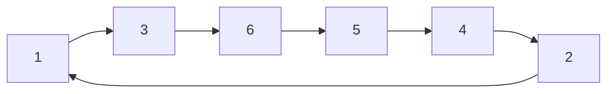
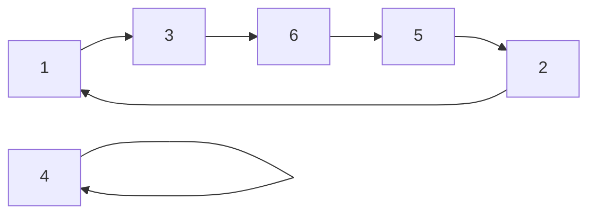
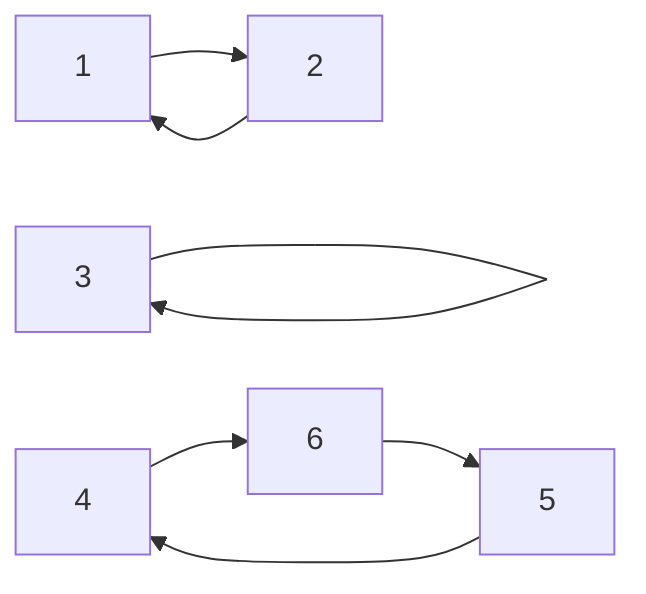

# 集合论

集合论是群论的基础，群论是建立在集合论上的。

## 集合的基本操作

### 集合的交

$$
A \cap B = \lbrace x \vert x \in A \wedge x \in B \rbrace
$$

### 集合的并

$$
A \cup B =  \lbrace x\vert x \in A \vee x \in B \rbrace
$$

### 集合的笛卡尔积

注意到笛卡尔积是一个二元组。
$$
A \times B = \lbrace (x,y) \vert x \in A \wedge y \in B \rbrace
$$

### 集合的映射

我们定义一个映射$f$满足 $f(x) = y $， 其中 $x\in A$， $y\in B$， 即映射可以把一个集合A中的元素映射到集合B中的一个元素。

可以称映射$f$作用于集合A，映射到集合B

<!-- more -->

# 群论

## 二元运算

给定集合$A$，不难发现$A\times A=\lbrace(x,y)\vert x\in A \vee y\in A\rbrace$

给定映射$f$作用于集合$A\times A$， 如果他依然映射到集合$A$， 即
$$
\exists x\in A,\exists y\in A 满足f((x,y)) \in A
$$
则$f$实现了二元运算，为了简化这种表示，我们常常使用符号$x\circ y$表示$f((x,y))$

## 半群

给定非空集合$A$， 给定二元运算$\circ$， 如果满足

- 封闭性: $\forall x \in A, \forall y \in A$, 都有$x\circ y \in A$

- 结合律: $\forall x \in A, \forall y \in A, \forall z \in A$,都有$(x\circ y)\circ z = x\circ( y \circ z)$

 则非空集合A和二元运算共同构成半群，也称$\lbrace A:\circ\rbrace$是一个半群。

## 幺半群

给定$\lbrace A:\circ\rbrace$是一个半群， 如果$\exists e_1 \in A$， $\forall x \in A$都有$e_1\circ x = x$， 则称$e_1$为左幺元，也称为左单位元。

给定$\lbrace A:\circ\rbrace$是一个半群， 如果$\exists e_2 \in A$， $\forall x \in A$都有$x\circ e_2 = x$， 则称$e_2$为右幺元，也称为右单位元。

给定$\lbrace A:\circ\rbrace$是一个半群， 如果左单位元与右单位元均存在，则$\lbrace A:\circ\rbrace$是一个幺半群。不难证明这时$e_1=e_2$（考虑$e_1\circ e_2$），所以我们常常称幺半群的单位元为$e$。

需要注意的是如果右幺元不存在，左幺元存在，则左幺元不一定唯一，参考如下半群, 其中所有元素都是左单位元，且不存在右单位元。
$$
A=\lbrace a_1,a_2,a_3,a_4\rbrace, \\
f((x,y)) = y
$$

## 群

给定$\lbrace A:\circ\rbrace$是一个幺半群，$e$为其单位元，如果$\forall x \in A$，都$\exists r_1 \in A$ 使得$r_1\circ x=e$, 则称$e_1$为左逆元。

给定$\lbrace A:\circ\rbrace$是一个幺半群，$e$为其单位元，如果$\forall x \in A$，都$\exists r_2 \in A$ 使得$x\circ r_2 =e$, 则称$e_2$为右逆元。

给定$\lbrace A:\circ\rbrace$是一个幺半群，如果$\forall x \in A$，其左逆元和右逆元均存在，则$\lbrace A:\circ\rbrace$是一个群。不难证明此时$r_1=r_2$（考虑$r_1\circ x\circ r_2$）, 所以我们常常称群的逆元为$r$。

## 交换群

给定$\lbrace A:\circ\rbrace$是一个群，如果$\forall x \in A ， \forall y \in A$ 都有$x\circ y = y\circ x$, 则称$\lbrace A:\circ\rbrace$是一个交换群。

# 整数模群

pass

# 素数模群

pass

# 置换群

给定一个排列$P=\lbrace p_1,p_2,p_3...p_n\rbrace$, 定义映射规则
$$
\begin{aligned}
1 \to p_1\\
2 \to p_2\\
3 \to p_3\\
...\\
n \to p_n
\end{aligned}
$$
于是我们得到了一个映射h,不妨把这个映射写做
$$
h=\begin{pmatrix}
1 & 2 & 3 &... &n\\\\
p_1 & p_2 & p_3 &... &p_n
\end{pmatrix}
$$

考虑排列的数量，我们一共有$n!$个映射，把这些映射构成的集合称为集合$A$。

考虑映射的复合运算$h(x)$复合$g(x)$得到了$h(g(x))$，我们也可写作$(h\circ g)(x)$, 我们把映射的复合运算称为$f$,则$f((h,g)) = (h \circ g)$

不难证明$\lbrace A:f\rbrace$是一个群。我们常常称这个群为$n$元置换群。

当然大部分置换群不定是交换群。

## 循环乘积

循环乘积只是置换的另一种表示方法。

考虑一个置换，如果按照他的的映射规则把其中的整数连接起来，如下
$$
\begin{pmatrix}
1 & 2 & 3 &4 &5 &6\\\\
3 & 1 & 6 &2 &4 &5
\end{pmatrix}
$$

他可以按照环的形式写作$(1\space3\space6\space5\space4 \space2)$

如果连接以后，有些一多余的点
$$
\begin{pmatrix}
1 & 2 & 3 &4 &5 &6\\\\
3 & 1 & 6 &4 &2 &5
\end{pmatrix}
$$

则可以写作$(1\space3\space6\space5\space2)\circ(4)$, 而其中长度为1的循环置换可以省略，故而也可写作$(1\space3\space6\space5\space2)$

如果某些置换有多个环，比如下面这个置换。
$$
\begin{pmatrix}
1 & 2 & 3 &4 &5 &6\\\\
2 & 1 & 3 &6 &4 &5
\end{pmatrix}
$$

对于这个置换，实际上他是两个置换的积，即
$$
\begin{pmatrix}
1 & 2 & 3 &4 &5 &6\\\\
2 & 1 & 3 &6 &4 &5
\end{pmatrix}=
\begin{pmatrix}
1 & 2 & 3 &4 &5 &6\\\\
2 & 1 & 3 &4 &5 &6
\end{pmatrix}\circ
\begin{pmatrix}
1 & 2 & 3 &4 &5 &6\\\\
1 & 2 & 3 &6 &4 &5
\end{pmatrix}
$$
而右边的两个置换可以分别写作$(2\space 1)$和$(4\space6\space5)$, 于是左边的置换理所当然的写成了$(2\space 1)\circ (4\space6\space5)$

所以一个置换一定可以写成多个循环乘积的复合。

## 置换群的交换律

当两个置换的循环乘积表示法中，不存在相同的数字的时候，满足交换律。例如$(1\space2\space3)\circ(4\space5\space6)=(4\space5\space6)\circ (1\space2\space3)$, 以及$(1\space2\space3)\circ(1\space5\space6)\ne(1\space5\space6)\circ (1\space2\space3)$

## 置换群的单位元

$(1)\circ(2)\circ(3)...(n)$

## 置换群的逆元

对于置换
$$
h=\begin{pmatrix}
1 & 2 & 3 &... &n\\\\
p_1 & p_2 & p_3 &... &p_n
\end{pmatrix}
$$
其逆元为
$$
h=\begin{pmatrix}
p_1 & p_2 & p_3 &... &p_n\\\\
1 & 2 & 3 &... &n
\end{pmatrix}
$$

## 置换群的整数幂

考虑一个n元置换$g$, 考虑$g\circ g$, 不妨写作$g^2$, 再考虑$g\circ g\circ g$, 不妨写作$g^3$, 如何快速计算$g^k$

**解法1**: 由于置换群满足结合律，所以可以直接使用快速幂算法，时间复杂度$O(n\cdot log(k))$

**解法2**:  对置换做幂，可将置换分解为不相交的循环乘积，然后分别做幂，最后合并，即如果$g=g_1\circ g_2$, 则$g^k=(g_1\circ g_2)^k=g_1^k\circ g_2^k$, 由于对循环乘积做幂，只需要在其对应的环上跳跃相同的长度即可，所以可以$O(n)$模拟，最终分解复杂度$O(n)$，对循环乘积做幂复杂度$O(n)$, 合并复杂度$O(n)$,总复杂度$O(n)$。

## 置换群的分数幂

考虑计算$g^\frac{a}{b}$

化简: $g^\frac{a}{b}=(g^\frac{1}{b})^a$  证明过程这里不做展开。

于是只需要计算$g^\frac{1}{b}$然后对其做整数幂即可。我们计算$(1\space2\space...n)^b$, 假设得到了$(a_1\space a_2\space ... a_n)$，由于循环乘积与数值无关，我们强制假设$(a_1\space a_2\space ... a_n)=g$，则可直接还原$g^\frac{1}{b}$

