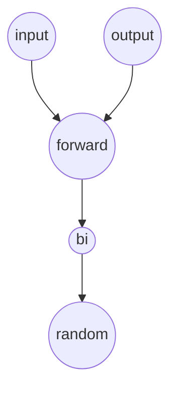

# 迭代器
 说白了就是个指针，但是他比指针更强大，更灵活。

# 迭代器类型
- input iterator 只读
- output iterator 只写
- forward iterator 单向迭代器
- bidirectional iterator 双向移动一个单位
- random access iterator 双向移动多个单位

## 类型
 首先为了实现的容易，得设计iterator_category为迭代器自己的类型，value_type为迭代器维护的具体数据的类型，diference_type为两个迭代器之间的距离的类型，pointer为原生指针，reference为原生引用。

