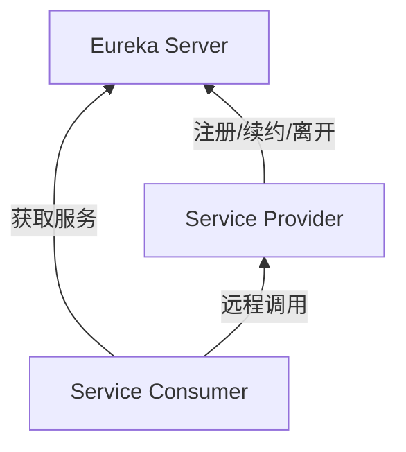

# Eureka
Netfilx在设计Eureka的时候遵守的就是AP原则,Eureka是一个Netfix的子模块， 也是核心模块之一，Eureka是一个基于REST的服务，用于实现云端中间层服务发现和故障转移，它的功能类似于dubbo的注册中心，比如Zookeeper

# Eureka架构

```mermaid
graph BT
  C[Eureka Server]
  A[Service Consumer]
  B[Service Provider]
  A--远程调用-->B
  A--获取服务-->C
  B--注册/续约/离开-->C
```

