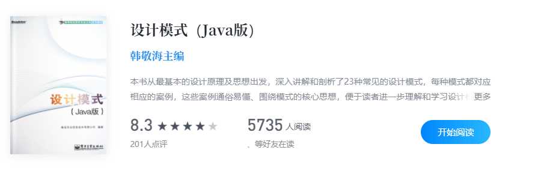
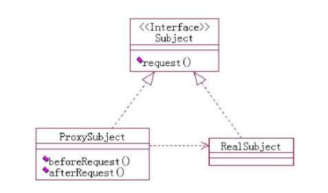
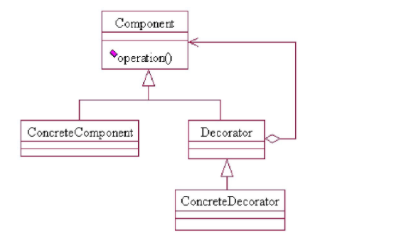
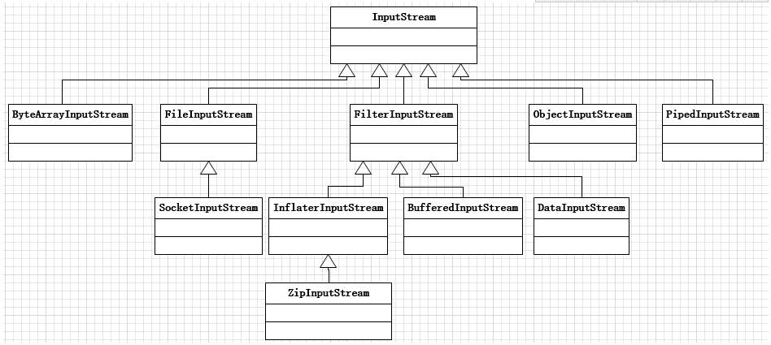
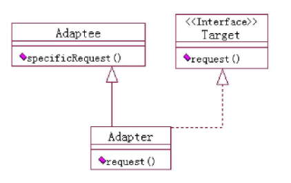
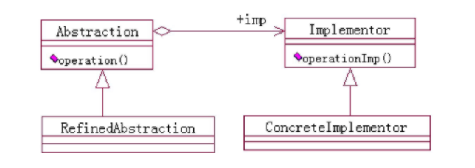
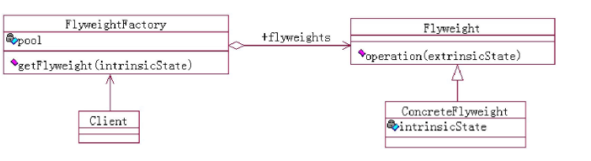
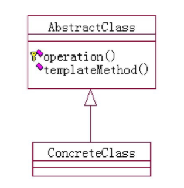
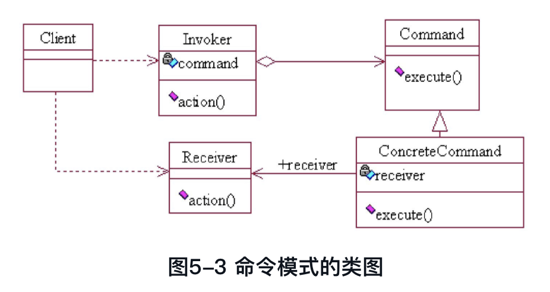

# 设计模式（JAVA版）

 

# 第四章 结构型模式

## 代理模式




在spring中，我们常用的动态代理就是代理模式，代理模式目的是代理对象，增强其原有的功能，例如日志打印，数据库事务等

 <!-- more -->

## 装饰模式



装饰模式的目的是拓展、增强原有功能，例如在Java中FilterInputStream

```java
InputStream inputStream = System.in;
DataInputStream dataInputStream = new DataInputStream(new BufferedInputStream(inputStream));
```

FilterInputStream的子类均为装饰器



### 装饰模式和代理模式的区别

代理模式侧重于代理，增强原有函数的能力，代理模式一般为硬编码，一般就一两层

装饰模式侧重于拓展，优化原有函数的能力，可以不断装饰，一层又一层


## 适配器模式



把一个类对另一个接口进行适配，让其可以被当作另一个接口使用，在Java中我们有Callable和Runnable， 此时如果我们有一个Runnable的对象，但是后面需要把它当作Callable来使用，这时候我们查看jdk8源码中的java.util.concurrent.Executors.RunnableAdapter

```java
/**
 * A callable that runs given task and returns given result.
 */
private static final class RunnableAdapter<T> implements Callable<T> {
    private final Runnable task;
    private final T result;
    RunnableAdapter(Runnable task, T result) {
        this.task = task;
        this.result = result;
    }
    public T call() {
        task.run();
        return result;
    }
    public String toString() {
        return super.toString() + "[Wrapped task = " + task + "]";
    }
}
```

### 适配器模式和代理模式的区别

适配器模式适配的结果不会对被适配者进行增强，只是执行接口转换，代理模式代理的结果会执行增强

### 适配器模式和装饰模式的区别

适配器模式的目的是适配，而不是拓展，适配结果不会改变逻辑，装饰模式要拓展接口，改进接口，让其具备更多的功能

适配结果往往让对象的能力更弱，装饰的结果往往让对象能力更强


## 组合模式


## 桥梁模式




## 外观模式


SLF4J，所有的日志将不再依赖具体的日志系统，而是依赖SLF4J日志门面


## 享元模式



即对象重用，通过享元工厂创建对象，对象在工厂中进行池化，Integer，String等都有体现


# 第五章 行为型模式

## 模板方法模式



> 使用模板方法模式的典型场景如下。
>
> ■ 多个子类有公共方法，并且逻辑基本相同时。
>
> ■ 可以把重要的、复杂的、核心算法设计为模板方法，周边的相关细节功能则由各个子类实现。
>
> ■ 重构时，模板方法模式是一个经常使用的模式，将相同的代码抽取到父类中。

```java
// JDK8 java.util.concurrent.locks.AbstractQueuedSynchronizer
public abstract class AbstractQueuedSynchronizer
    extends AbstractOwnableSynchronizer
    implements java.io.Serializable {
    
    protected boolean tryAcquire(int arg) {
        throw new UnsupportedOperationException();
    }
    
    public final void acquire(int arg) {
        if (!tryAcquire(arg))
            acquire(null, arg, false, false, false, 0L);
    }
```


# 命令模式


>命令模式( Command Pattern)又称为行动( Action)模式或交易( Transaction)模式。
>
>将一个请求封装成一个对象，从而让你使用不同的请求把客户端参数化，对请求排队或者记录请求日志，可以提供命令的撤销和恢复功能。




```java
class Receiver {
    void action() {
        System.out.println("hello");
    }
}

class MyRunnable implements Runnable {
    Receiver receiver;

    MyRunnable(Receiver receiver) {
        this.receiver = receiver;
    }

    @Override
    public void run() {
        receiver.action();
    }
}

public class Main{
    public static void (String[] args) {
        ThreadPoolExecutor threadPoolExecutor = null;
        
        threadPoolExecutor.submit(new MyRunnable(new Receiver()));
    }
}
```


我们思考Runnable， 他其实就是Command，

我们再思考ThreadPoolExecutor , 他其实就是 Invoker

我们思考MyRunnable，他其实就是ConcreteCommand

Receiver 就是Receiver

我们这里发现Receiver和ThreadPoolExecutor没有任何依赖关系


> 命令模式的优点有以下几个方面。
>
> ■ 类间解耦。调用者角色与接收者角色之间没有任何依赖关系，调用者实现功能时只需要调用Command中的execute()方法即可，不需要了解是哪个接收者执行。
>
> ■ 可扩展性。Command 的子类可以非常容易地扩展，而调用者Invoker和高层次的模块Client不产生严重的代码耦合。
>
> ■ 命令模式结合其他模式会更优秀。命令模式可以结合责任链模式，实现命令族解析任务，结合模板方法模式，则可以减少Command子类的膨胀问题。


