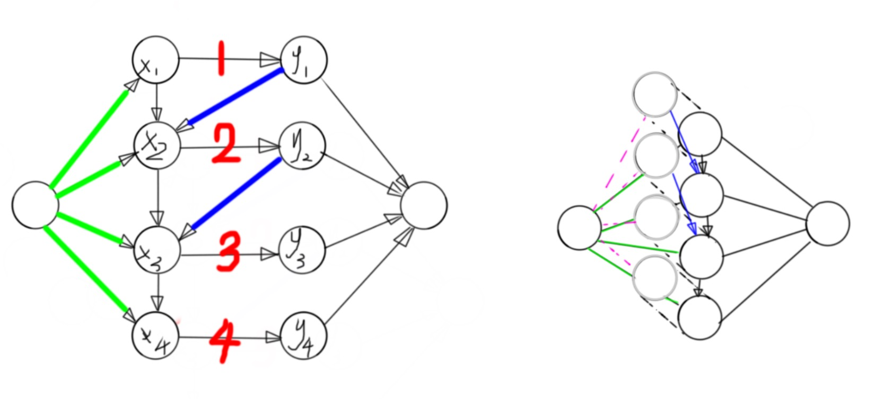

这是我自己给这类图取的名字

给出定义， 有五类边

- 第一类为原点到左边的点，容量无穷大,有费用

- 第二类为左边的点到右边的点，一对一，容量为任意常数，费用0

- 第三类为右边的点到汇点，容量无穷大，费用0

-  第四类为左边的点依次连i->i+1，容量无穷大，费用0

- 第五类从右边连向左边，容量无穷大，费用0

  

如下图左边的图 

给出问题,求当有容量的边的都满流时的最小费用

我们发现左图的最大流一定满足有容量的边是满流的，我们尝试将其转化为最小费用最大流 我们发现，如果我们对左边的图跑最大流，当左边的图有流量进入y点集的时候，他一定会进 入源点，不会流回x点集，这就很烦，我们要的不是最大流，而是指定边的满流，我们尝试“阻 止”这个过程，怎么阻止呢，我们在考虑一个z点集，从源点出发，每当y点集有流量流入汇点，就从源点流等量流量到对应的z点集，我们最后用z点集完全替代y点集的回流功能，这样以后， 最小费用最大流就成了我们要求的最小费用固定流。

再仔细想想，我们发现y点集已经没有作用了，删掉他们，最后成了上图的右边的图。 于是解决了。

对于流入汇点的流量，我们可以构造一个新的点集，每当有流量流入汇点，我们就从源点流入 新的点集，实现回流机制。