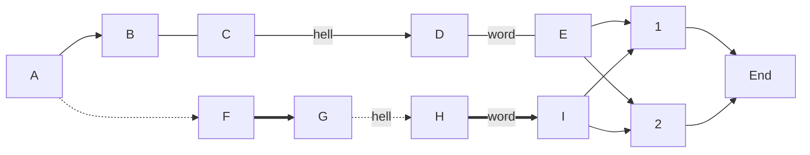
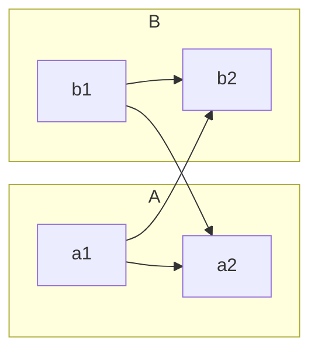
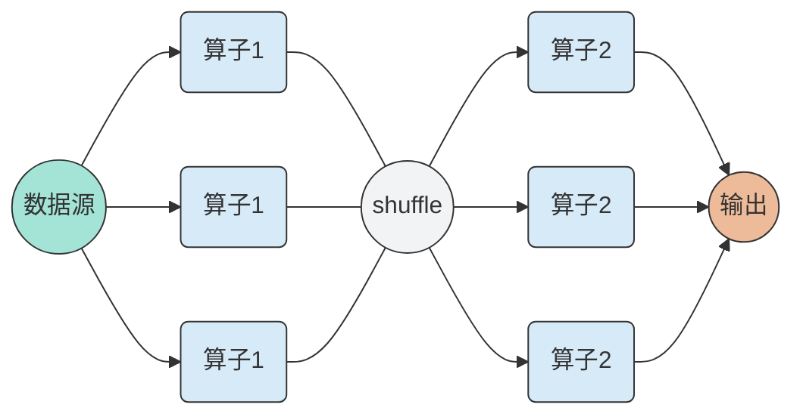
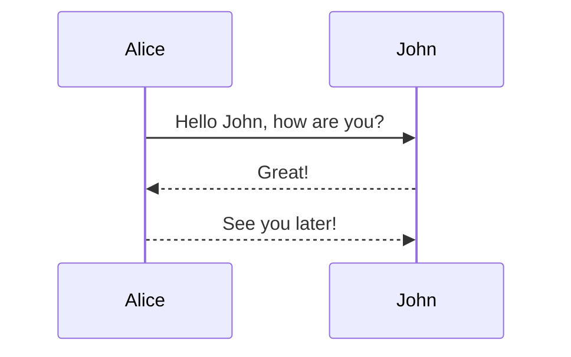

# Mermaid
这是一个画图的东西，他可以画有向图、无向图、流程图、时序图、类图、状态图等等，[官网在这](https://mermaid-js.github.io/mermaid/#/)
有一个坑，就是md文件第一非空行不可以是#mermaid, 否则渲染失败，所以我这用了Mermaid作为开头，

# why this blog
简单介绍一下用法，避免每次都去官网找半天

# 基础用法
参数|备注
:-:|:-:
TB | top bottom
BT | bottom top
RL | right left
LR | left right
TD | same as TB

<!-- more -->

## 节点形状
```txt
graph TB
  id1[id1]
  id2(id2)
  id3([id3])
  id4[(id4)]
  id5((id5))
```


## 有向边无向边
```txt
graph LR
  A-->B---C--hello-->D--word---E
  A-.->F==>G-.hello.->H==word==>I
  E & I-->1 & 2-->End
```


## 子图
```txt
graph LR
  a1-->b2
  b1-->a2
  subgraph A
  a1-->a2
  end
  subgraph B
  b1-->b2
  end
```



## 文字

```txt
graph LR
  A[我是文字]
```


## 颜色

```txt
graph LR
  A[红色]
  style A fill: yellow
```


# 例子







## 参考

[mermaid 给你的文档加层滤镜](https://zhuanlan.zhihu.com/p/166668789)