# 0. 一个错误的概念

```c++
int main() {
    int a = 111;
    int &b = a;
    b = 222;
    std::cout<<&a<<&b;
}
```

我们能看到这里输出的两个值相同。

- 错误1:

  很多人认为这里的b就是a，a就是b，a和b的地址是一样的，如下图。

  

  但是笔者要说，其实这个概念是有问题的，a是a，b是b，a和b并不是同一个地址。
  
  

<!-- more -->


 # 1. 从STD的tie类型说起

笔者在阅读ClickHouse源码的时候发现了有趣的现象，该源码中有如下代码，我们注意第7-9行，可以发现这使用了STD的tie，该类型让C++实现了一次性返回两个值的效果。下面的executeQueryImpl函数返回了两个值，分别写入到了ast和streams中。

```c++
BlockIO executeQuery(
    const String & query,
    ContextMutablePtr context,
    bool internal,
    QueryProcessingStage::Enum stage)
{
    ASTPtr ast;
    BlockIO streams;
    std::tie(ast, streams) = executeQueryImpl(query.data(), query.data() + query.size(), context, internal, stage, nullptr);

    if (const auto * ast_query_with_output = dynamic_cast<const ASTQueryWithOutput *>(ast.get()))
    {
        String format_name = ast_query_with_output->format
                ? getIdentifierName(ast_query_with_output->format)
                : context->getDefaultFormat();

        if (format_name == "Null")
            streams.null_format = true;
    }

    return streams;
}
```

# 2. 如何实现的

实际上C++中可以在结构体中指定一个引用字段，通过构造函数将外界的变量传递进结构体，再通过该结构体的拷贝构造函数实现赋值。


# 3. 结构体中如何储存引用

结构体如何储存其他值的引用？按照前文的说法，如果引用的地址是一样的，结构体如何储存其他值的引用呢，如下图。


实际上唯一的办法只能使用指针，让变量b指向变量a，当然这里的变量b的类型就是指针类型了，这么说肯定很多人不能接受，我定义的引用类型，怎么就成了指针了。


# 4. 揭秘结构体中的引用

先来看下面的代码,下面这两个函数，写法不一样，但是被GCC编译器编译以后的结果是一模一样的。

```c++
struct Ref {
    explicit Ref(int &ref) : ref(ref) {}

    int &ref;
    int value;
};

struct Point {
    explicit Point(int *ref) : ref(ref) {}

    int *ref;
    int value;
};

void ref() {
    int x = 222;
    Ref a(x);
    a.ref = 333;
    a.value = 444;
}

void point() {
    int x = 222;
    Point a(&x);
    *a.ref = 333;
    a.value = 444;
}

int main() {
}
```

读者可以通过指令` gcc -S -O0 main.cpp`来编译该文件。可以看到两个函数都被编译结果为下面的内容，注意14-15行，这里就是ref赋值的地方，我们很容易发现，第一步是把rbp栈寄存器指向的地址偏移24的位置的值放入了寄存器rax中，第二步是将数据333写入rax寄存器所指向的地址。所以引用不过是指针的另一种写法而已。

```assembly
__Z5pointv:                             ## @_Z5pointv
	.cfi_startproc
## %bb.0:
	pushq	%rbp
	.cfi_def_cfa_offset 16
	.cfi_offset %rbp, -16
	movq	%rsp, %rbp
	.cfi_def_cfa_register %rbp
	subq	$32, %rsp
	movl	$222, -4(%rbp)
	leaq	-24(%rbp), %rdi
	leaq	-4(%rbp), %rsi
	callq	__ZN5PointC1EPi
	movq	-24(%rbp), %rax
	movl	$333, (%rax)                    ## imm = 0x14D
	movl	$444, -16(%rbp)                 ## imm = 0x1BC
	addq	$32, %rsp
	popq	%rbp
	retq
	.cfi_endproc
                                        ## -- End function
	.globl	__ZN5PointC1EPi                 ## -- Begin function _ZN5PointC1EPi
	.weak_def_can_be_hidden	__ZN5PointC1EPi
	.p2align	4, 0x90
```


# 5. 普通引用是如何实现的

我们使用`gcc -S -O0 main.cpp`编译下面的代码

```c++
void check() {
    int a = 111;
    int &b = a;
    b = 222;
}

void check2() {
    int a = 111;
    int *b = &a;
    *b = 222;
}

int main() {
}
```

不难发现两个函数都被编译成了相同的代码,于是乎，现在应该不会再有人认为这里的b就是a，a就是b，a和b的地址是一样的了吧

很明显b就是指针啊，他怎么能是和a的地址相同呢？

```assembly
__Z5checkv:                             ## @_Z5checkv
	.cfi_startproc
## %bb.0:
	pushq	%rbp
	.cfi_def_cfa_offset 16
	.cfi_offset %rbp, -16
	movq	%rsp, %rbp
	.cfi_def_cfa_register %rbp
	movl	$111, -4(%rbp)
	leaq	-4(%rbp), %rax
	movq	%rax, -16(%rbp)
	movq	-16(%rbp), %rax
	movl	$222, (%rax)
	popq	%rbp
	retq
	.cfi_endproc
                                        ## -- End function
	.globl	__Z6check2v                     ## -- Begin function _Z6check2v
	.p2align	4, 0x90
```

正确的引用图应该是下面这张


