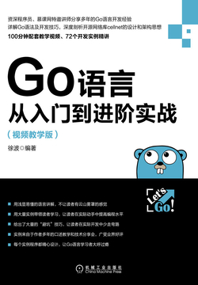
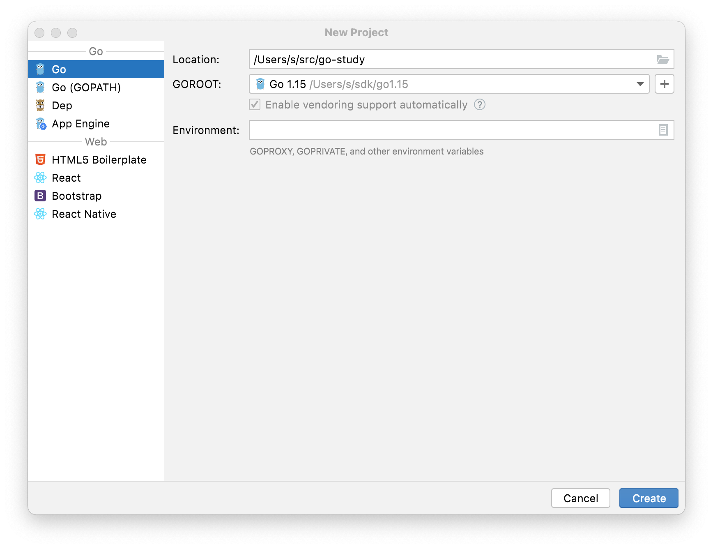
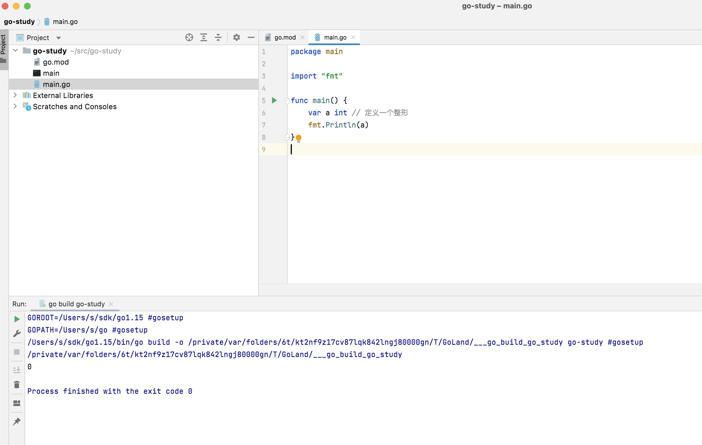

# 1. 开始学习Go

从一本书开始，这本书叫做[《Go语言从入门到进阶实战（视频教学版）》](https://weread.qq.com/web/reader/24d323407155597024d28a7kc81322c012c81e728d9d180),当然这篇Blog并不是所有的内容都来自这本书，毕竟书中也有不足之处。





# 2. Hello World

学啥语言的第一步都是Hello World, 第一步是搭建开发环境，直接下载[Goland](https://www.jetbrains.com/go/)，创建一个新的工程，点击create



<!--more-->

建好项目以后，项目应该是下面这个样子的，当然我们不用关注这个go.mod是干什么的，我们只是利用IDE编写代码，使用命令行运行。

```shell
s@HELLOWANG-MB1 go-study % tree
.
`-- go.mod

0 directories, 1 file

```

然后新建一个main.go的文件，其内容如下

```go
package main
import "fmt"
func main() {
    fmt.Println("hello world")
}
```

最后运行该文件

```shell
s@HELLOWANG-MB1 go-study % go run main.go
hello world
```

我们也可以编译为二进制文件，然后运行

```shell
s@HELLOWANG-MB1 go-study % go build main.go
s@HELLOWANG-MB1 go-study % ls
go.mod  main    main.go
s@HELLOWANG-MB1 go-study % ./main
hello world
```


# 3. Go的变量声明

变量的声明方式为`var <变量名> <变量类型>`

例如下面的程序

```go
package main

import "fmt"

func main() {
    var a int // 定义一个整形
    fmt.Println(a)
}

```

经过了命令行运行以后，可以转而使用IDE集成开发，点击按钮▶️



当然，还有更多的声明方式

```go
package main

import "fmt"

func main() {
    var a int // 定义一个整形
    fmt.Println(a)

    var b int = 1 // 定义并赋值
    fmt.Println(b)

    var c = 2 // 编译器自动推导
    fmt.Println(c)

    d := 3 // 精简写法
    fmt.Println(d)
}

```

最后还有一个小技巧，即函数返回可以是多个变量，用逗号分隔, `_`表示匿名变量，即忽略该位置的值。

```go
package main

import "fmt"

func main() {
    a := 1
    b := 2
    a, b = b, a
    c, _ := a, b
    _, d := a, b
    fmt.Println(a, b, c, d)
}

```


# 4. Go 的基础数据类型

## 4.1. 整形

有符号整型: `int8 int16 int32 int64`

无符号整型: `uint8 uint16 uint32 uint64`

平台自适应整形: `int uint`(自动根据平台决定整形的长度)

## 4.2. 浮点数

`float32 float64`

```go
package main

import "fmt"

func main() {
    var a float32 = 1.5
    var b float64 = 1.5
    fmt.Println(a, b)
}

```

## 4.3. 布尔型

```go
package main

import "fmt"

func main() {
    var a bool = true
    fmt.Println(a)
}

```

## 4.4. 字符串

```go
package main

import "fmt"

func main() {
    var a string = "123"
    fmt.Println(a)
}

```

多行字符串

```go
package main

import "fmt"

func main() {
    var a string = `  123你好
    abcsdaf
aslfnskflasjlfjoiwn
    `
    fmt.Println(a)
}

```


# 5. Go的控制流

## 5.1. 循环

```go
package main

import "fmt"

func main() {

    // 类似与C的while
    a := 1
    for a <= 3 {
        fmt.Println(a)
        a++
    }

    // 类似与C的while(true)
    for {
        fmt.Println("break")
        break
    }

    // 类似于C的for
    for i := 0; i < 3; i++ {
        fmt.Println("hello")
    }

}

```


## 5.2. 条件判断

```go
package main

import "fmt"

func main() {

    if 1+1 == 2 {
        fmt.Println("1+1=2")
    } else {
        fmt.Println("1+1!=2")
    }

}

```


## 5.3. switch

需要注意的是Go的switch自带break，下面的程序只会输出3

```go
package main

import "fmt"

func main() {

    switch 3 {
    case 3:
        fmt.Println(3)
    case 2:
        fmt.Println(2)
    case 1:
        fmt.Println(1)
    }

}

```


# 6. Go的容器/集合

## 6.1. Map

注意map需要指定key和value 的类型

```go
package main

import "fmt"

func main() {
    mp := make(map[string]int)
    mp["k1"] = 1
    mp["k2"] = 2
    fmt.Println(mp)

    delete(mp,"k1")
    fmt.Println(mp)
    
}

```

## 6.2. 数组

数组长度固定, 创建数组也有很多种写法

```go
package main

import "fmt"

func main() {
    var arr1 []int = make([]int, 3)
    arr1[0] = 1

    arr2 := [3]int{1, 2}
    arr3 := [...]int{1, 2}

    fmt.Println(arr1, arr2, arr3)
}
// [1 0 0] [1 2 0] [1 2]

```

注意对于由字面量组成的数组，如果长度小于等于4，那么它将直接被分配到栈上，否则分配到静态区

## 6.3. 切片

切片的创建可以是数组的一部分，也可以直接创建，切片可扩容

```go
package main

import "fmt"

func main() {
    var arr1 []int = make([]int, 3) // 数组

    slice1 := arr1[1:2]
    slice2 := []int{1, 2, 3}
    slice3 := make([]int, 3)

    fmt.Println(slice1, slice2, slice3)
}

// [0] [1 2 3] [0 0 0]

```

那么切片和数组有什么区别呢？其实切片只是数组的一个引用，任何一个切片，其背后一定有一个数组，当切片进行扩容的时候，会根据数组的剩余空间大小来决定附身到新的数组上，或者直接在原数组上扩容切片。

具体表现如下, 输出就在注释里面。

```go
package main

import "fmt"

func main() {
    arr1 := [...]int{0, 1, 2, 3, 4, 5, 6, 7, 8, 9}

    slice1 := arr1[2:5]
    slice2 := arr1[3:6]

    fmt.Println(slice1, slice2)
    arr1[4]=0
    fmt.Println(slice1, slice2)
}

// [2 3 4] [3 4 5]
// [2 3 0] [3 0 5]
```


## 6.3. 列表

列表可以自动伸缩

```go
package main

import (
    "container/list"
    "fmt"
)

func main() {
    ls := list.New()
    ls.PushBack(1)
    ls.PushBack(2)
    fmt.Println(ls)
}

```

# 7. Go的函数

返回值写在参数后面

```go
package main

import "fmt"

func plus(a int, b int) int {
    return a + b
}

func main() {
    a := 1
    b := 1
    fmt.Println(plus(a, b))
}

```

还可以选择返回多个值

```go
package main

import "fmt"

func swap(a int, b int) (int, int) {
    return b, a
}

func main() {
    a := 1
    b := 2
    fmt.Println(swap(a, b))
}

```

变长的参数

```go
package main

import "fmt"

func sum(a ...int) int {
    s := 0
    for i := 0; i < len(a); i++ {
        s += a[i]
    }
    return s
}

func main() {
    fmt.Println(sum(1, 2, 3))

    nums := []int{1, 2, 3, 4}
    fmt.Println(sum(nums...))
}

```

返回一个函数

```go
package main

import "fmt"

func increase() func() int {
    i := 0
    return func() int {
        i++
        return i
    }
}

func main() {
    fun := increase()
    fmt.Println(fun())
    fmt.Println(fun())
    fmt.Println(fun())
    fmt.Println(fun())

}
```

# 8. Go的指针

和C一样


# 9. Go 的结构体

## 9.1. 结构体定义

```go
type <类型名> struct {
    <字段1名> <字段1类型>
    <字段2名> <字段2类型>
    <字段3名> <字段3类型>
}
```

例子:

```go
type Point struct {
    X int32
    Y int32
}
```

## 9.2. 结构体实例化

```go
package main

import "fmt"

type Point struct {
    X int32
    Y int32
}

func main() {
    var p Point
    p.X = 1
    p.Y = 2
    fmt.Println(p.X, p.Y)
}

```

使用new实例化,注意此时得到的p2是指针

```go
package main

import "fmt"

type Point struct {
    X int32
    Y int32
}

func main() {
    p2 := new(Point)
    fmt.Println(p2)
}

```


## 9.3. 结构体函数

结构体函数定义比普通函数定义在func和函数名之间多了一个结构体对象，这个对象一般使用指针

```go
package main

import "fmt"

type Point struct {
    X int32
    Y int32
}

func (p *Point) getAndSet(X int32, Y int32) (int32, int32) {
    p.X, X = X, p.X // swap
    p.Y, Y = Y, p.Y // swap
    return X, Y
}

func main() {
    p := new(Point)
    p.X, p.Y = 1, 2
    fmt.Println(p.getAndSet(3, 4))
    fmt.Println(p.X, p.Y)
}


```

## 9.4. 结构体的Tag

结构体中的字段可以设置Tag，即给字段打上标签，就像Java中的注解一样。然后可以使用一种比较高级的技术（反射来获取这个标签）

```go
package main

import "reflect"

type Point struct {
    X int `name:"XXX" X:"你好"`
    Y int `name:"YYY"`
}

func main() {
    p := &Point{
        X: 1,
        Y: 2,
    }

    field, _ := reflect.TypeOf(*p).FieldByName("X")

    println(field.Tag)
}
// 输出:
// name:"XXX" X:"你好"asdf
```


# 10. Go的接口

接口定义

```go
type <接口类型名> interface{
    <方法1名> (<参数列表1>) 返回值列表1
    <方法2名> (<参数列表2>) 返回值列表2
}
```

让结构体实现接口, 只需要让结构体的函数与接口保持一致即可，

```go
package main

import "fmt"

type Point struct {
    X int32
    Y int32
}

type GetAndSet interface {
    invoke(X int32, Y int32) (int32, int32)
}

func (p *Point) invoke(X int32, Y int32) (int32, int32) {
    p.X, X = X, p.X // swap
    p.Y, Y = Y, p.Y // swap
    return X, Y
}

func main() {
    p := new(Point)
    p.X, p.Y = 1, 2

    var it GetAndSet = p
    fmt.Println(it.invoke(3, 4))
    fmt.Println(p.X, p.Y)
}

```


# 11. Go的包

回到最开始的Helloworld，注意到第一行中的`package main`， 在Go中，有这样一个约定

> 包名为main的包为应用程序的入口包，编译源码没有main包时，将无法编译输出可执行的文件。

```go
package main
import "fmt"
func main() {
    fmt.Println("hello world")
}
```


## 11.1. Go的包导出

在Go中，首字母为小写的变量只能在包内使用，首字母为大写的变量会自动导出，可以在其他包使用。

这是第一个文件`mylib/mylib.go`

```go
package mylib

func Add(a, b int32) int32 {
    return a + b
}

func add(a, b int32) int32 {
    return a + b
}

```

## 11.2. Go的包导入

然后是`main.go`, 注意到可以直接使用`Add`函数，但是不能使用`add`函数

```go
package main

import (
    "fmt"
    "go-study/mylib"
)

func main() {
    var a, b int32 = 1, 2
    fmt.Println(mylib.Add(a, b))
}

```


在导入的时候可以直接重命名，只需要在包名前加上一个名字即可

```go
package main

import (
    "fmt"
    lb "go-study/mylib"
)

func main() {
    var a, b int32 = 1, 2
    fmt.Println(lb.Add(a, b))
}
```


## 11.3. Go的包的init函数

一个包的init函数在包被引入时自动调用, 对于main包，init函数在main函数前运行

```go
package mylib

import "fmt"

func Add(a, b int32) int32 {
    return a + b
}

func add(a, b int32) int32 {
    return a + b
}

func init(){
    fmt.Println("hi")
}
```

```go
package main

import (
    "fmt"
    lb "go-study/mylib"
)

func init() {
    fmt.Println("hi main")
}

func main() {
    var a, b int32 = 1, 2
    fmt.Println(lb.Add(a, b))
}

```


# 12. Go的反射

## 12.1. Go反射类型

通过reflect包来进行反射，可以获得类型

```go
package main

import (
    "fmt"
    "reflect"
)

func main() {
    a := 1
    ta := reflect.TypeOf(a)
    fmt.Println(ta.Bits(), ta.Name(), ta.Kind())
}

```

对于name和kind的区别，看看下面这份代码就行了, name为Point，kind为struct

```go
package main

import (
    "fmt"
    "reflect"
)

type Point struct {
    X, Y int32
}

func main() {
    var a = Point{}
    ta := reflect.TypeOf(a)
    fmt.Println(ta.Name(), ta.Kind())
}

```

## 12.2. Go反射值

通过字段的名字获取属性

```go
package main

import (
    "fmt"
    "reflect"
)

type Point struct {
    X, Y int32
}

func main() {
    var a = Point{}
    ta := reflect.ValueOf(a)
    fmt.Println(ta.FieldByName("X"))
}


```


# 13. Go的并发

## 13.1. goroutine

在关键词go后跟着一个函数调用，那么该函数调用就变成了goroutine，这是一个异步调用，立即返回

```go
package main

import (
    "fmt"
    "time"
)

func running() {
    times := 1
    for {
        fmt.Println("tick", times)
        times++
        time.Sleep(time.Second)
    }
}

func main() {
    go running()
    for {
        time.Sleep(time.Second)
    }
}

```


## 13.2. Go的通道

下面的程序会依次输出0和`hello`， 通道先进先出 `<-`符号可以用来传输数据， 注意通道在发送和接受的时候都会阻塞,注意到最后一行有一个`time.Sleep(time.Second)`，这是为了等待goroutine完成，否则main退出以后goroutine会直接强制退出

```go
package main

import (
    "fmt"
    "time"
)

func main() {
    ch := make(chan interface{})

    go func() {
        ch <- 0
        fmt.Println("send: 0")
        ch <- "hello"
        fmt.Println("send: hello")
    }()

    time.Sleep(time.Second)

    data := <-ch
    fmt.Println("recv: ", data)

    time.Sleep(time.Second)

    data = <-ch
    fmt.Println("recv: ", data)

    time.Sleep(time.Second)
}
```

另一种接受方法是使用for循环，代码如下，注意这个循环需要手动退出

```go
package main

import (
    "fmt"
    "time"
)

func main() {
    ch := make(chan interface{})

    go func() {
        ch <- 0
        fmt.Println("send: 0")
        ch <- "hello"
        fmt.Println("send: hello")
        ch <- "break"
        fmt.Println("send: break")
    }()

    for data := range ch {
        fmt.Println("recv:", data)
        if data == "break" {
            break
        }
    }

    time.Sleep(time.Second)
}


```

最后通道还支持指定输入端和输出端，输入端只能做输入，输出端只能做输出

```go
package main

import (
    "fmt"
    "time"
)

func main() {
    ch := make(chan interface{})

    var send chan<- interface{} = ch
    var recv <-chan interface{} = ch

    go func() {
        send <- 0
    }()

    data := <-recv
    fmt.Println("recv:", data)

    time.Sleep(time.Second)
}

```


创建带有缓冲区的通道, 只需要在make的第二个参数中填入数字即可

```go
ch := make(chan interface{}, 10)
```

多路复用，使用select关键字，case区域写要选择的通道即可接收多个通道，下面的代码有时输出1，有时输出2

```go
package main

import (
    "fmt"
    "time"
)

func main() {
    ch1 := make(chan interface{})
    ch2 := make(chan interface{})

    go func() {
        ch1 <- 1
    }()

    go func() {
        ch2 <- 2
    }()

    time.Sleep(time.Second)

    select {
    case data := <-ch1:
        fmt.Println("recv from ch1: ", data)
    case data := <-ch2:
        fmt.Println("recv from ch2: ", data)
    }

    time.Sleep(time.Second)
}

```


