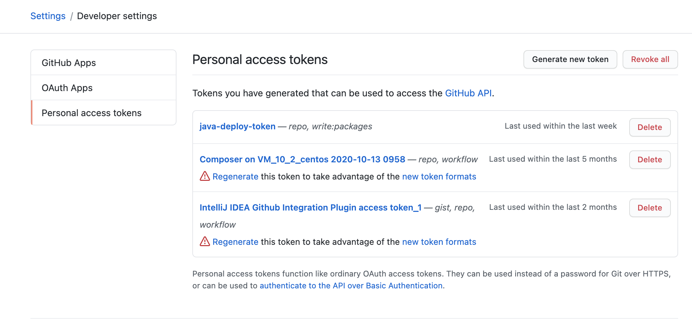

# 使用Github Packages Repository

这里主要介绍Github packages搭建私服，这种方案上传和下载都需要使用token

## 步骤1

访问[地址](https://github.com/settings/tokens) ,点击Generate new token 创建新的token，选择权限 write:packages




<!-- more -->

## 步骤2

配置settings.xml ,添加配置, 修改用户名和password(这里写token)

```xml
<servers>
    <server>
        <id>github</id>
        <username>fightinggg</username>
        <password>TOKEN</password>
    </server>
</servers>
```


## 步骤3

增加项目中的中央仓库, 注意修改url

```xml
    <distributionManagement>
        <repository>
            <id>github</id>
            <name>GitHub fightinggg Apache Maven Packages</name>
            <url>https://maven.pkg.github.com/fightinggg/maven-repository</url>
        </repository>
    </distributionManagement>
```


## 步骤4

增加项目的配置，选择github

```xml
    <properties>
        <github.global.server>github</github.global.server>
    </properties>
```


## 步骤5

```sh
 mvn clean deploy
```


# 使用Github Page

## 步骤1

在github创建一个仓库，比如我这里创建的是[这个](https://github.com/fightinggg/maven-repository)

## 步骤2

配置settings.xml中的密码, 细节参见第一种方法，注意这里的TOKEN要选择全部权限，而不仅仅是write:packages

```xml
<servers>
    <server>
        <id>github</id>
        <username>fightinggg</username>
        <password>TOKEN</password>
    </server>
</servers>
```

## 步骤3

增加pom.xml的配置和build插件

```xml
  <properties>
        <github.global.server>github</github.global.server>
        <java.version>8</java.version>
    </properties>

    <build>
        <plugins>
            <plugin>
                <artifactId>maven-deploy-plugin</artifactId>
                <version>2.8.1</version>
                <configuration>
                    <altDeploymentRepository>internal.repo::default::file://${project.build.directory}/mvn-repo
                    </altDeploymentRepository>
                </configuration>
            </plugin>
            <plugin>
                <groupId>com.github.github</groupId>
                <artifactId>site-maven-plugin</artifactId>
                <version>0.12</version>
                <configuration>
                    <message>Maven artifacts for ${project.version}</message>
                    <noJekyll>true</noJekyll>
                    <outputDirectory>${project.build.directory}/mvn-repo</outputDirectory>
                    <branch>refs/heads/${project.groupId}-${project.artifactId}-${project.version}</branch>
                    <includes>
                        <include>**/*</include>
                    </includes>
                    <repositoryName>maven-repository</repositoryName>
                    <!-- 对应github上创建的仓库名称 name -->
                    <repositoryOwner>fightinggg</repositoryOwner>
                    <!-- github 仓库所有者 -->
                </configuration>
                <executions>
                    <execution>
                        <goals>
                            <goal>site</goal>
                        </goals>
                        <phase>deploy</phase>
                    </execution>
                </executions>
            </plugin>
        </plugins>
    </build>
```

## 步骤4

```sh
mvn deploy
```


## 使用

```xml
    <repositories>
        <repository>
            <id>maven-repo-master</id>
            <url>https://github.com/fightinggg/maven-repository/raw/com.oj.polinoj-sandbox-open-api-0.0.1-SNAPSHOT/</url>
            <snapshots>
                <enabled>true</enabled>
                <updatePolicy>always</updatePolicy>
            </snapshots>
        </repository>
    </repositories>
```


# 参考

https://docs.github.com/en/packages/working-with-a-github-packages-registry/working-with-the-apache-maven-registry

https://blog.csdn.net/hwangfantasy/article/details/69389766