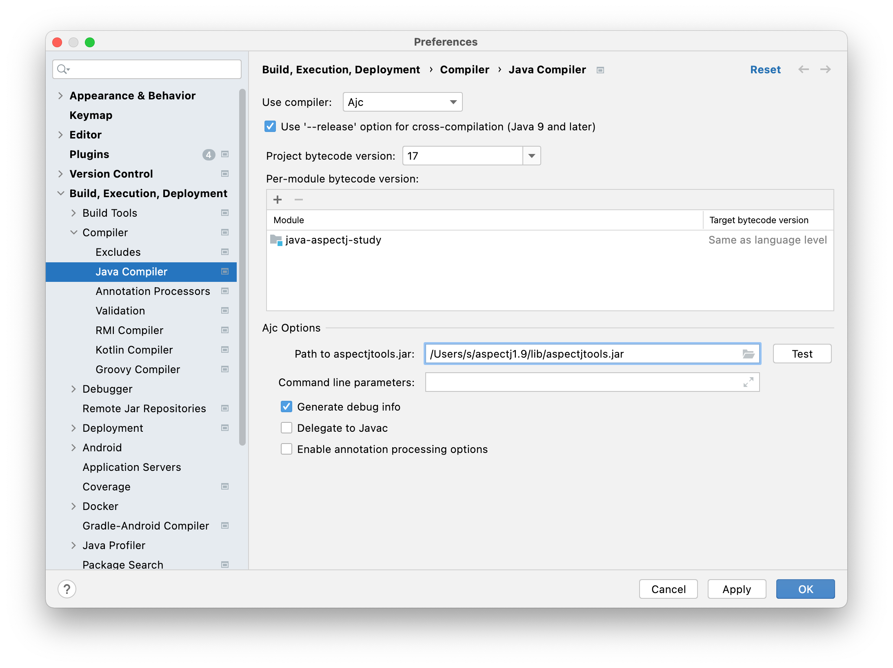
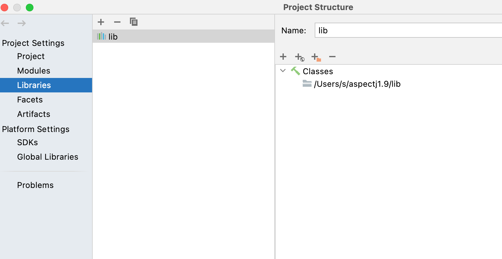

# 1. AspectJ

## 1.1. AspectJ介绍

AspectJ官网[^4]

AspectJ文档[^1]

### 1.1.1. pointcuts

pointcuts指的是程序中的某些链接点（某些时机），例如`call(void Point.setX(int))`表示：调用类`Point`的`setX(int)`方法时

pointcuts可以使用与或非表达式（`||,&&,!`）连接，比如 `call(void Point.setX(int)) ||
call(void Point.setY(int))`

pointcuts可以被定义为变量，如下面代码中的`move()`

```asp
pointcut move():
    call(void FigureElement.setXY(int,int)) ||
    call(void Point.setX(int))              ||
    call(void Point.setY(int))              ||
    call(void Line.setP1(Point))            ||
    call(void Line.setP2(Point));
```

当然pointcuts定义的时候还可以使用通配符，比如`call(void Figure.make*(..))`代表`Figure`的以make开头且返回值为void的方法（不关心参数）调用的时候。比如`call(public * Figure.* (..))`代表`Figure`的任何方法（不关心方法名，参数，返回值）调用的时候。

<!-- more -->

cflow是什么？


### 1.1.2. advice

pointcuts 指出了一些事件发生的时机，当这些事件真正发生的时候，我们需要advice表示该做些什么。advice如下，advice可以使用before代表在pointcuts发生以前做一些事情,如下

```
before(): move() {
    System.out.println("before move");
}
```

使用after代表在pointcuts发生以后做一些事情，如下

```
after(): move(){
    System.out.println("after move");
}
```

after还可以加上修饰符returning和throwing，分别表示在正常返回和在异常返回的情况，如下

```
after() returning: move(){
    System.out.println("after move");
}

after() throwing: move(){
    System.out.println("after move");
}
```

around表示环绕一个方法

### 1.1.3. aspect

aspect是一个特别的类型，在其中可以定义pointcut和advice，如下

```aj
aspect MyAspect{

    pointcut move():
        call(void FigureElement.setXY(int,int)) ||
        call(void Point.setX(int))              ||
        call(void Point.setY(int))              ||
        call(void Line.setP1(Point))            ||
        call(void Line.setP2(Point));
    
    after(): move(){
        System.out.println("after move");
    }
}
```

当然aspect兼容java，你也可以定义各种方法，变量

```
aspect MyAspect{

    private Integer intValue;
    
    public Integer getInt(){
        return intValue;
    }

    pointcut move():
        call(void FigureElement.setXY(int,int)) ||
        call(void Point.setX(int))              ||
        call(void Point.setY(int))              ||
        call(void Line.setP1(Point))            ||
        call(void Line.setP2(Point));
    
    after(): move(){
        System.out.println("after move");
    }
   
}
```


## 1.2. 在IntelliJ IDEA上安装AspectJ

### 1.2.1. 下载并安装AspectJ

在官网[^4]下载最新版本的jar包，笔者这里的最新版本是[aspectj-1.9.6.jar](http://www.eclipse.org/downloads/download.php?file=/tools/aspectj/aspectj-1.9.6.jar) ，下载以后双击运行进行安装。


### 1.2.2. 安装插件

安装AspectJ插件[^2]即可

### 1.2.3. 启用AJC编译器

在IDEA的设置中选择AJC编译器，并指定1.2.1中安装的ajctool的位置。



### 1.2.4. 给项目添加AJC依赖

把1.2.1中安装的lib包放到项目的依赖中。




## 1.3. Hello World

下面是一份Helloworld的代码,源程序只输出+号，但是被aspect所拦截，最终输出了` Hello + World! `

```java
class HelloWorld {

    public void hello(){
        System.out.print("+");
    }

    public static void main(String[] args) {
        new HelloWorld().hello();
    }
}


aspect HelloWorldAspect {
    before(): call(public * HelloWorld.*(..)){
        System.out.print(" Hello ");
    }
    after(): call(public * HelloWorld.*(..)){
        System.out.print(" World! ");
    }
}


```


## 1.4. Pointcuts表达式

- 执行一个特定的方法的时候
  ```java
  execution(void Point.setX(int))
  ```
  
  例如下面的代码
  
  ```java
  class HelloWorld {
  
      public void hello(){
          System.out.print("+");
      }
  
      public static void main(String[] args) {
          new HelloWorld().hello();
      }
  }
  
  
  aspect HelloWorldAspect {
      before(): execution(public * HelloWorld.hello(..)){
          System.out.print(" Hello ");
      }
      after(): execution(public * HelloWorld.hello(..)){
          System.out.print(" World! ");
      }
  }
  
  
  ```
  被编译为了
  
  ```java
  //
  // Source code recreated from a .class file by IntelliJ IDEA
  // (powered by FernFlower decompiler)
  //
  
  class HelloWorld {
      HelloWorld() {
      }
  
      public void hello() {
          try {
              HelloWorldAspect.aspectOf().ajc$before$HelloWorldAspect$1$75869607();
              System.out.print("+");
          } catch (Throwable var2) {
              HelloWorldAspect.aspectOf().ajc$after$HelloWorldAspect$2$75869607();
              throw var2;
          }
  
          HelloWorldAspect.aspectOf().ajc$after$HelloWorldAspect$2$75869607();
      }
  
      public static void main(String[] args) {
          (new HelloWorld()).hello();
      }
  }
  
  ```
  
  代码被直接写入到了hello方法执行的地方。
  
- 调用一个特定方法的时候

  ```java
  call(void Point.setX(int))
  ```
  
  例如下面的代码
  
  ```java
  class HelloWorld {
  
      public void hello(){
          System.out.print("+");
      }
  
      public static void main(String[] args) {
          new HelloWorld().hello();
      }
  }
  
  
  aspect HelloWorldAspect {
      before(): call(public * HelloWorld.*(..)){
          System.out.print(" Hello ");
      }
      after(): call(public * HelloWorld.*(..)){
          System.out.print(" World! ");
      }
  }
  
  ```
  
  被编译为了
  
  ```java
  //
  // Source code recreated from a .class file by IntelliJ IDEA
  // (powered by FernFlower decompiler)
  //
  
  class HelloWorld {
      HelloWorld() {
      }
  
      public void hello() {
          System.out.print("+");
      }
  
      public static void main(String[] args) {
          HelloWorld var10000 = new HelloWorld();
  
          try {
              HelloWorldAspect.aspectOf().ajc$before$HelloWorldAspect$1$cdc2ab29();
              var10000.hello();
          } catch (Throwable var2) {
              HelloWorldAspect.aspectOf().ajc$after$HelloWorldAspect$2$cdc2ab29();
              throw var2;
          }
  
          HelloWorldAspect.aspectOf().ajc$after$HelloWorldAspect$2$cdc2ab29();
      }
  }
  
  ```
  
  可以看到，是在调用hello方法的前后增加了一些内容。
  
- 处理异常的时候

  ```java
  handler(ArrayOutOfBoundsException)
  ```
  
  如下面的代码
  
  ```java
  class HelloWorld {
  
      public void hello() {
          try {
              System.out.print("+");
          } catch (Exception e) {
              System.out.print(e.getMessage());
          }
      }
  
      public static void main(String[] args) {
          new HelloWorld().hello();
      }
  }
  
  
  aspect HelloWorldAspect {
      before(): handler(Exception){
          System.out.print(" Hello ");
      }
  }
  
  
  ```
  
  被编译为了
  
  ```java
  //
  // Source code recreated from a .class file by IntelliJ IDEA
  // (powered by FernFlower decompiler)
  //
  
  class HelloWorld {
      HelloWorld() {
      }
  
      public void hello() {
          try {
              System.out.print("+");
          } catch (Exception var3) {
              HelloWorldAspect.aspectOf().ajc$before$HelloWorldAspect$1$ae9a1a78();
              System.out.print(var3.getMessage());
          }
  
      }
  
      public static void main(String[] args) {
          (new HelloWorld()).hello();
      }
  }
  
  ```
  
  可以发现就是在catch该exception后的第一步操作
  
  当然AspectJ还有很多很多可以定义point cut的关键词，笔者这里就不一一列举了，相见文档[^5]即可


## 1.5. 总结

所以AspectJ其实是对Java语法的拓展，通过特定的编译器，给Java带来了更强大的能力。

# 2. Spring 对 AspectJ的支持

官方文档[^3]

Spring支持AspectJ的一个子集,所支持的pointcut如下

>Spring AOP supports the following AspectJ pointcut designators (PCD) for use in pointcut expressions:
>
>- `execution`: For matching method execution join points. This is the primary pointcut designator to use when working with Spring AOP.
>- `within`: Limits matching to join points within certain types (the execution of a method declared within a matching type when using Spring AOP).
>- `this`: Limits matching to join points (the execution of methods when using Spring AOP) where the bean reference (Spring AOP proxy) is an instance of the given type.
>- `target`: Limits matching to join points (the execution of methods when using Spring AOP) where the target object (application object being proxied) is an instance of the given type.
>- `args`: Limits matching to join points (the execution of methods when using Spring AOP) where the arguments are instances of the given types.
>- `@target`: Limits matching to join points (the execution of methods when using Spring AOP) where the class of the executing object has an annotation of the given type.
>- `@args`: Limits matching to join points (the execution of methods when using Spring AOP) where the runtime type of the actual arguments passed have annotations of the given types.
>- `@within`: Limits matching to join points within types that have the given annotation (the execution of methods declared in types with the given annotation when using Spring AOP).
>- `@annotation`: Limits matching to join points where the subject of the join point (the method being run in Spring AOP) has the given annotation.

spring中的aspectJ，并非使用拓展java语法，而是使用注解来拓展，spring中的aspectj也不是使用的aspectj编译器，而是使用的spring aop来完成代理。但spring也支持通过开关使用原生aspectj[^6]。

aspect的类型用注解@Aspect表示

pointcut字段用@Pointcut表示

advice分别用@Before、@After、@Around来表示

# 3. 引用

[^1]: [AspectJ文档](https://www.eclipse.org/aspectj/doc/released/progguide/index.html)
[^2]: [AspectJ插件](https://plugins.jetbrains.com/plugin/4679-aspectj)
[^3]: [Spring对AspectJ的支持](https://docs.spring.io/spring-framework/docs/current/reference/html/core.html#aop-ataspectj)
[^4]: [AspectJ官网](https://www.eclipse.org/aspectj/downloads.php)
[^5]: [Aspect pointcut 文档](https://www.eclipse.org/aspectj/doc/released/progguide/quick.html#quick-pointcuts)
[^6]: [Spring中使用AspectJ编译器](https://docs.spring.io/spring-framework/docs/current/reference/html/core.html#aop-using-aspectj)
