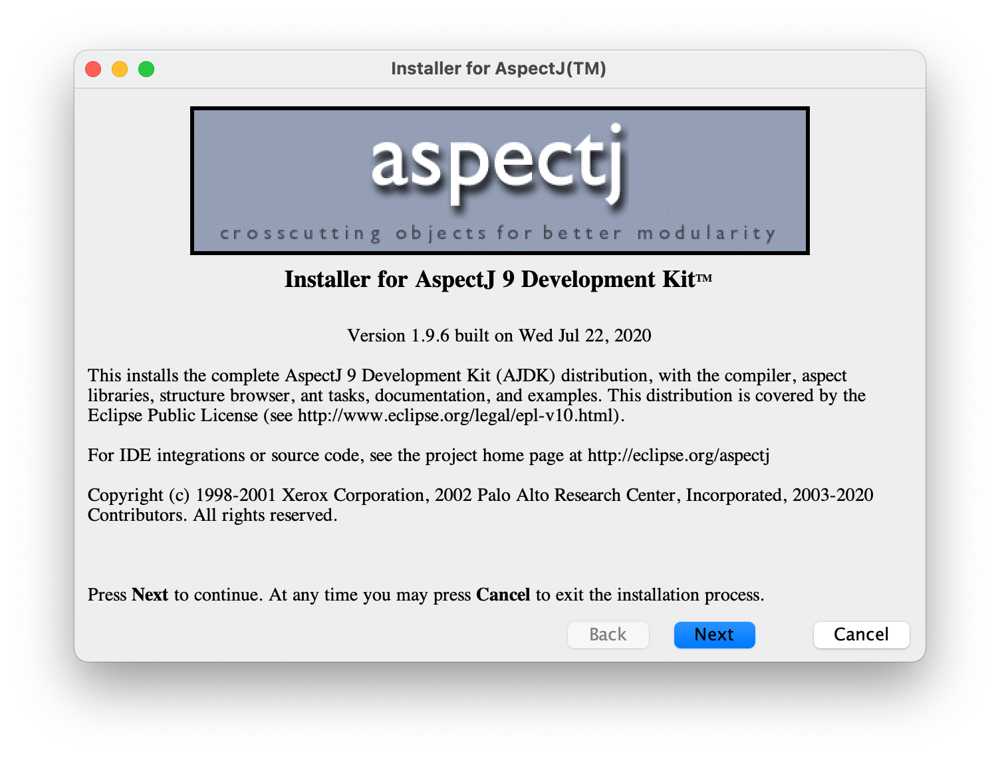

# 1. AspectJ

## 1.1. AspectJ介绍

AspectJ官网[^4]

AspectJ文档[^1]

### 1.1.1. pointcuts

pointcuts指的是程序中的某些链接点（某些时机），例如`call(void Point.setX(int))`表示：调用类`Point`的`setX(int)`方法时

pointcuts可以使用与或非表达式（`||,&&,!`）连接，比如 `call(void Point.setX(int)) ||
call(void Point.setY(int))`

pointcuts可以被定义为变量，如下面代码中的`move()`

```asp
pointcut move():
    call(void FigureElement.setXY(int,int)) ||
    call(void Point.setX(int))              ||
    call(void Point.setY(int))              ||
    call(void Line.setP1(Point))            ||
    call(void Line.setP2(Point));
```

当然pointcuts定义的时候还可以使用通配符，比如`call(void Figure.make*(..))`代表`Figure`的以make开头且返回值为void的方法（不关心参数）调用的时候。比如`call(public * Figure.* (..))`代表`Figure`的任何方法（不关心方法名，参数，返回值）调用的时候。

<!-- more -->

cflow是什么？


### 1.1.2. advice

pointcuts 指出了一些事件发生的时机，当这些事件真正发生的时候，我们需要advice表示该做些什么。advice如下，advice可以使用before代表在pointcuts发生以前做一些事情,如下

```
before(): move() {
    System.out.println("before move");
}
```

使用after代表在pointcuts发生以后做一些事情，如下

```
after(): move(){
    System.out.println("after move");
}
```

after还可以加上修饰符returning和throwing，分别表示在正常返回和在异常返回的情况，如下

```
after() returning: move(){
    System.out.println("after move");
}

after() throwing: move(){
    System.out.println("after move");
}
```


### 1.1.3. aspect

aspect是一个特别的类型，在其中可以定义pointcut和advice，如下

```aj
aspect MyAspect{

    pointcut move():
        call(void FigureElement.setXY(int,int)) ||
        call(void Point.setX(int))              ||
        call(void Point.setY(int))              ||
        call(void Line.setP1(Point))            ||
        call(void Line.setP2(Point));
    
    after(): move(){
        System.out.println("after move");
    }
}
```

当然aspect兼容java，你也可以定义各种方法，变量

```
aspect MyAspect{

    private Integer intValue;
    
    public Integer getInt(){
        return intValue;
    }

    pointcut move():
        call(void FigureElement.setXY(int,int)) ||
        call(void Point.setX(int))              ||
        call(void Point.setY(int))              ||
        call(void Line.setP1(Point))            ||
        call(void Line.setP2(Point));
    
    after(): move(){
        System.out.println("after move");
    }
   
}
```


## 1.2. 在IntelliJ IDEA上安装AspectJ

### 1.2.1. 下载并安装AspectJ

在官网[^4]下载最新版本的jar包，笔者这里的最新版本是[aspectj-1.9.6.jar](http://www.eclipse.org/downloads/download.php?file=/tools/aspectj/aspectj-1.9.6.jar) ，下载以后双击运行进行安装。



### 1.2.2. 安装插件

安装AspectJ插件[^2]即可

### 1.2.3. 启用AJC编译器

在IDEA的设置中选择AJC编译器，并指定1.2.1中安装的ajctool的位置。


### 1.2.4. 给项目添加AJC依赖

把1.2.1中安装的lib包放到项目的依赖中。


## 1.3. Hello World

下面是一份Helloworld的代码,源程序只输出+号，但是被aspect所拦截，最终输出了` Hello + World! `

```aj
class HelloWorld {

    public void hello(){
        System.out.print("+");
    }

    public static void main(String[] args) {
        new HelloWorld().hello();
    }
}


aspect HelloWorldAspect {
    before(): call(public * HelloWorld.*(..)){
        System.out.print(" Hello ");
    }
    after(): call(public * HelloWorld.*(..)){
        System.out.print(" World! ");
    }
}


```


# 2. Spring 对 AspectJ的支持

官方文档[^3]

## 2.1. 


# 3. 引用

[^1]: [AspectJ文档](https://www.eclipse.org/aspectj/doc/released/progguide/index.html)
[^2]: [AspectJ插件](https://plugins.jetbrains.com/plugin/4679-aspectj )
[^3]:[Spring对AspectJ的支持](https://docs.spring.io/spring-framework/docs/current/reference/html/core.html#aop-ataspectj)
[^4]: [AspectJ官网](https://www.eclipse.org/aspectj/downloads.php)
