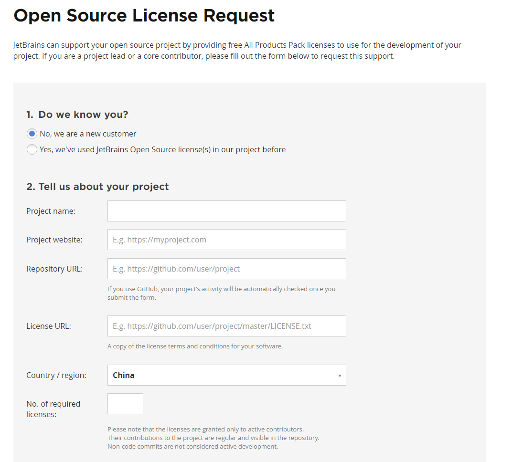
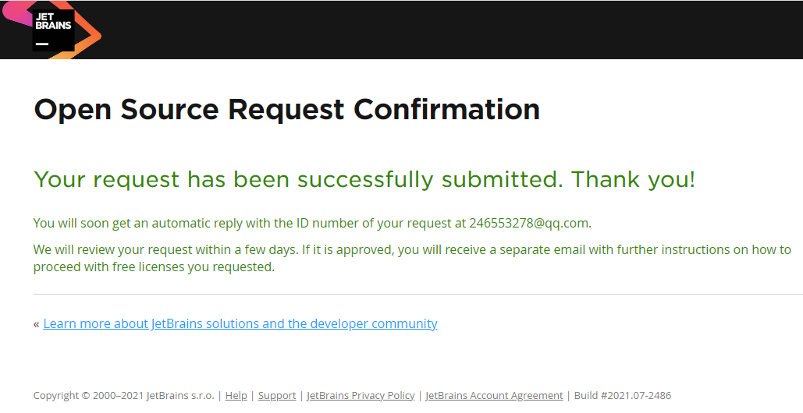

# JetBrains License

不要用破解版本的JetBrains软件OK？凭自己的能力获取他的License不行吗？

先来看看这个[页面](https://www.jetbrains.com/community/opensource/)，这里介绍了开源项目的定义

- 满足开源定义。
- 正在积极开发中，即在过去 3 个月内定期提交新代码提交。
- 不提供开源软件的付费版本或围绕开源项目的任何商业服务（例如付费支持、咨询等）。
- 不由商业公司或组织（非政府组织、教育、研究或政府）资助的。
- 不为核心项目开发商付钱。

换句话说，只要你有一个在过去 3 个月内定期提交的开源项目，且非商业模式，你就可以获取JB的License

然后你就来[这里](https://www.jetbrains.com/shop/eform/opensource)申请

几天后就能给你结果了

