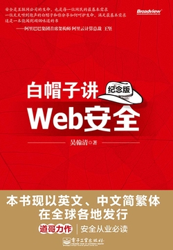

# 1. 总揽

很老的一本书，但是依然有阅读价值。

全书分为4个部分，其中比较重要的应该是第二章和第三章，第二章主要讲解客户端（浏览器）如何保障用户的安全，第三章主要讲解服务端如何保障用户安全。

# 2. 客户端安全

客户端这边容易受到攻击的主要有三个类型。

第一个是XSS攻击，全名跨站脚本攻击，通常指的是黑客通过某些手段，篡改了用户访问的页面，导致页面上执行了一些恶意的脚本。一个简单的例子：在你登陆淘宝之后，黑客篡改了你的淘宝页面（篡改了用户访问的页面），自动帮你购买了一些奇怪的东西（执行了一些恶意的脚本）。

第二个是CSRF攻击，全名跨站点请求伪造，通常指的是黑客通过某些手段，诱导用户访问某钓鱼页面，在该页面上完成了一些恶意的脚本。一个简单的例子： 在一些诱惑下你点开了一个页面（诱导用户访问某钓鱼页面），尽管你之后什么都没有做，但是你的淘宝购物车被恶意清空了（在该页面上完成了一些恶意的脚本）

第三个是ClickJacking攻击，全名点击劫持攻击，通常指的是黑客通过某些手段，诱导用户访问某钓鱼页面，该页面有个按钮，按钮上悬浮了一个透明的iframe，然后引诱你点击该按钮，当你点击该按钮时触发了iframe中的按钮。一个例子是：在一些诱惑下你点开了一个页面，然后在该页面的诱惑下你点击了一个按钮，结果你的淘宝购物车被恶意清空了。

<!--more-->

## 2.1. XSS

XSS的核心就是篡改用户访问的页面，攻击者是如何来实施篡改的呢？

### 2.1.1. 评论区XSS

很多博客都有一些评论区，用户可以在其中输入一些文本，然后这些文本会展示在评论区。

部分评论区直接把用户的文本解析为HTML语言，

但如果用户输入了一些别有用心的文本，其中包含了一些可执行的脚本，然后被浏览器执行了，这就是XSS攻击。

### 2.1.2. 总结

所以实际上XSS的是攻击者利用了系统的漏洞，导致系统没有按照开发者所期望的那样运行导致的。这种情况和SQL注入特别相似。

开发者所需要做的就是不要信任用户的输入，不要执行用户的输入内容即可，对于评论系统，可以只允许用户输入部分带限制的内容，借此来解决这个问题。

## 2.2. CSRF

CSRF的核心是跨站，很多开发者对跨站请求了解不多，在一些偶然的情况下，允许任何跨域请求来到自己的后台，这其实是非常危险的。

### 2.2.1. CSRF例子

开发者允许任何域的请求进行跨域，结果攻击者自己做了一个网站，在里面通过跨域调用，删除当前用户的所有数据，

这时候如果一个大冤种来到了这个网站，大冤种的数据就全部被删除了。

### 2.2.2. 总结

不要允许不可信任的域发起跨域请求就能解决这个问题。当然有些请求不涉及到跨域，比如GET请求，这种就要求开发者不要把一些重要的敏感度高的请求用GET实现。

## 2.3. ClickJacking

  点击劫持，多发生于，iframe页面，这个和iframe有关，这里知道原理就行，就是一个透明的iframe在作妖，具体细节笔者不感兴趣。

# 3...

后面的内容一般般了，不写了

