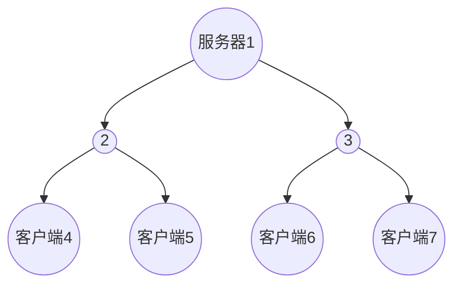
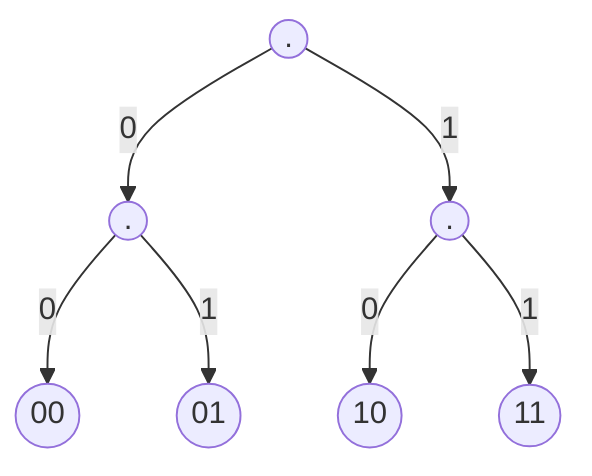
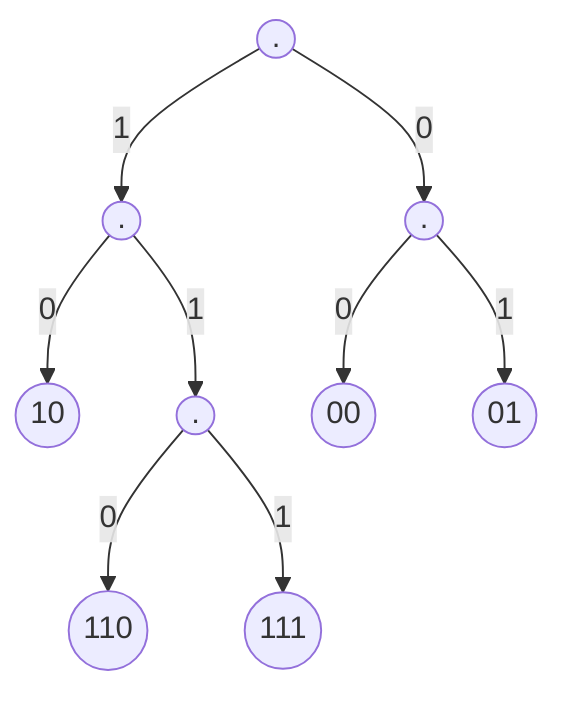
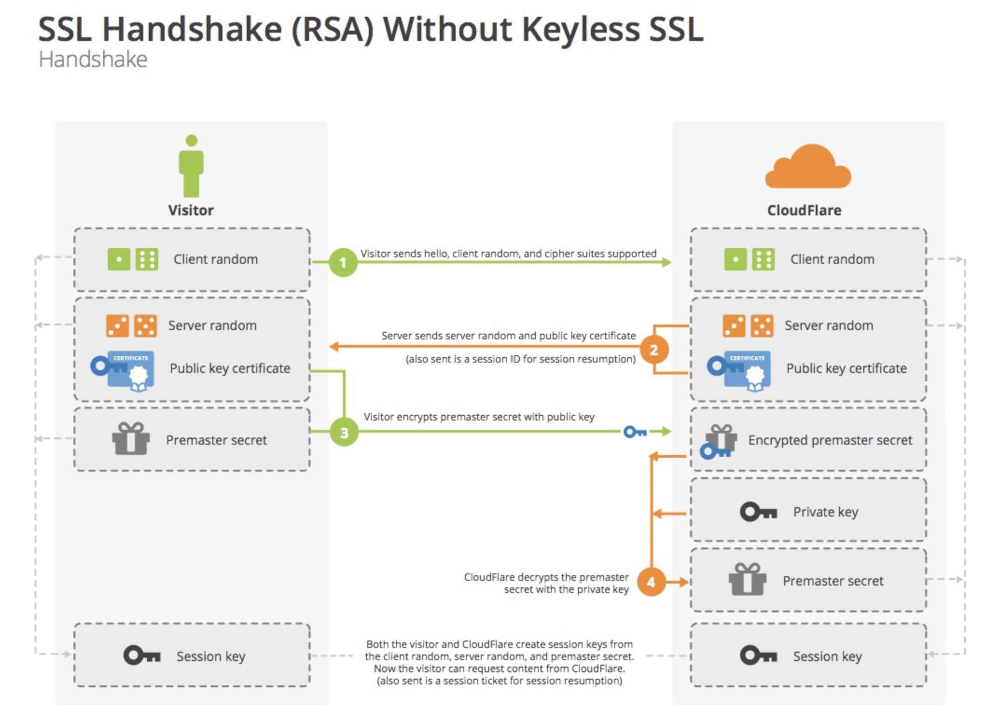

# 七层网络
- 应用层: 针对应用程序的通信服务，大多数文件传输需要第七层
- 表示层: 加密数据和定义数据格式(ASCII或者二进制)
- 会话层: 将断开的数据合并，完成回话，则表示层看到的数据是连续的
- 传输层: TCP、UDP
- 网络层: IP
- 链路层: 在单个链路上传输数据
- 物理层: 传输介质等东西

# 五层网络

- 应用层： HTTP，FTP，SMTP，DNS
- 传输层： TCP，UDP
- 网络层： IP，ICMP，ARP，RARP，DHCP
- 链路层：
- 物理层：

<!-- more -->

# UDP
- 无连接
- 包送达的顺序是任意的，因为包可能选择不同的路径
- UDP发包就行了，能不能到看脸，因此不会重传数据
- UDP的包会重复, 要是有些不敬业的程序员瞎操作，为了保证数据完整性，每个包都给你发5次，就重复了
- 无流控制
- 无拥塞控制

# TCP
- 面向连接，要连接和挂断
- 可靠的发送，按顺序送达，包丢失重传，包不会重复
- 接受用缓冲区控制速度
- 拥塞控制

# HTTP下载文件的过程
- 获得名字所对应的地址(DNS)
- 和地址对应的服务器建立连接(TCP)
- 发送获取页面的请求
- 等待响应
- 渲染HTML等文件
- 断开TCP连接

## PLT
 page load time ,从按下到看见页面的时间，与页面内容有关，与HTTP协议有关、与网络的RTT(Round Trip Time)和带宽有关。

## 早期的HTTP
早期HTTP/1.0使用单个TCP连接获取一个WEB资源，然后就断开TCP，很容易实现，但性能堪忧。
 尽管是访问同一个服务器的不同资源，也要串行，建立了多个TCP，断开了多个TCP，这是很耗时间的。并没有高效使用网络。
 每次TCP的连接都将导致三次握手和慢启动，在高RTT的时候，三次握手很慢，在传输大文件的时候慢启动很耗时。

## HTTP基本优化
- 利用缓存和代理来避免传输相同的内容(DNS缓存和网页缓存)
- 利用CDN让服务器里客户更近
- 文件压缩后传输

## HTTP1.1
- 改进HTTP协议
- 并行连接
- 持久连接： 在一个TCP连接上可以传送多个HTTP请求和响应，减少了建立和关闭连接的消耗和延迟，在HTTP1.1中默认开启长连接keep-alive，一定程度上弥补了HTTP1.0每次请求都要创建连接的缺点。
- 支持range头传输，即只传输文件的某一部分
-  支持Host域，在HTTP1.0中认为每台服务器都绑定一个唯一的IP地址，因此，请求消息中的URL并没有传递主机名（hostname），HTTP1.0没有host域。
- 缓存处理： 在HTTP1.0中主要使用header里的If-Modified-Since,Expires来做为缓存判断的标准，HTTP1.1则引入了更多的缓存控制策略例如Entity tag，If-Unmodified-Since, If-Match, If-None-Match等更多可供选择的缓存头来控制缓存策略。
-  错误码： 在HTTP1.1中新增了24个错误状态响应码，如409（Conflict）表示请求的资源与资源的当前状态发生冲突；410（Gone）表示服务器上的某个资源被永久性的删除。

## HTTPS
- HTTPS使用CA申请证书，证书一般需要交费
- HTTPS建立在SSL/TLS上，加密
- HTTPS使用443端口

## SPDY协议
- 多路复用降低延迟,多个流共享一个tcp,解决了HOL blocking(流水线会因为一个response阻塞导致全部阻塞).

- 请求优先级,优先响应html，而后是js等

- header压缩(DEFLATE，即LZ77+哈夫曼编码)

- 基于HTTPS

- 服务器推送，若客户端请求了sytle.css,服务器会吧style.js推送给客户端

  > 参考 https://juejin.cn/post/6844903608635359239

## HTTP2.0
- 基于SPDY
- 支持明文传输
- 使用HPACK压缩（和SPDY有一点区别）

## 并行连接
 让浏览器并行HTTP实例，但这导致了网络对突发带宽及丢包率

## 持久连接
 用一个连接处理多个HTTP请求,这时候的多个HTTP请求又可以使用流水线。这个技术被用于HTTP/1.1

## 持久连接的问题
 保持TCP连接多长时间？可能导致更慢。????????????

## 网页缓存
 询问服务器时间戳是否过时。

## 网页代理
- 大缓存+安全检查
- 禁止访问某些网站
缺点：
- 安全问题,银行不能缓存
- 动态内容不缓存
- 大量不常用信息在缓存中

## CDN
 内容分发网络，服务器就像树根，客户端就像树的叶子，CDN就是中间的东西，从服务器向客户端传输文件的时候，没有必要每次都从根向叶子传输，可能叶子的父亲就拥有正确的文件，直接让他给你传就好了。如下图，客户端4和客户端5先后要一个文件，我们从服务器1传个文件给CDN2，CDN2传给客户端4，当客户端5请求同一个文件的时候，服务器1没有必要再传文件给CDN2了，直接让CDN2给客户端5文件就行了。

# DNS服务器

 往往我们访问的网站是www.baidu.com，这个叫名字，他对应的IP为36.152.44.96,这个过程可以使用ping得到，名字到IP是谁为我们在提供服务呢？这时候就出现了DNS服务器，将名字映射为IP，

## 分布式DNS服务器

 这个必须分布式

## 层次化

 DNS服务器就像一棵决策树一样，每一层都在分类，最顶层是Zone,他知道.com, .edu, .net 等DNS服务器在哪， .edu服务器又知道 .washington.edu ， .cug.edu , .tingshua.edu在哪， 这样一层一层向下

<!---more-->

## 本地DNS服务器

 就是学校、公司的DNS服务器

## 一个例子

 比方一个地大的要找gaia.cs.umass.edu, 他就先找地大的DNS服务器dns.cug.edu.cn， 然后找到Zone，然后找到.edu服务器, 然后去找.umass.edu服务器, 然后去找.cs.umass.edu服务器，最后就找到了gaia.cs.umass.edu，然后就找到IP了。

## 递归还是非递归

 即我问了A，A替我去问B，B回答A，A回答我，这就是递归
 我问A，A说不知道并让我去问B，我去问B，B回答我，这就是非递归
 显然本地服务器采取递归，其他服务器采取非递归好。

## DNS缓存

缓存两天

## DNS插入新值

 花钱买域名

## 负载均衡

 多个IP地址对应一个名字，即服务端有多个IP，他们共用一个名字，这时候DNS服务器收到询问会轮流指向这些IP地址。

# P2P

 没有服务器，自组织传输，当规模庞大以后会遇到问题

## 发布内容很快

 当一个文件要发给所有客户端的时候，这个速度是呈现指数增长的。

## 动机

 上传助人，下载助己。你传给我，我就传给你，这样就能合作

## 分布式哈希表

 每个节点只储存一部分数据，从而在整个网络上寻址和储存，这样我们就能找到我们要的文件储存在哪。

## BitTorrent协议

将文件划分为小块，利用并行机制快速传输数据。

首先联系分布式哈希表，把自己加入其中，然后会得到一堆端(peers),与不同的端并行传输数据，优先和快的端传输

本身拥有文件但不给别的端传输的端，我们也不给他传文件。

# UDP 

 不可靠传输，Voice-over-IP、DNS、RPC、DHCP??????

## UDP头

 16位源端口，16位目标端口，16位UDP长度，16位checksum

## UDP问题

 长度受限制了，我们要将大文件分割成小文件，哪一层来负责？为什么要分为小块？更可靠，但是可能导致后发送的先到达。

## 不可靠传输的包的问题

- 丢失
- 损坏
- 乱序到达
- 延时到达
- 重复包

## 什么叫可靠？

- 正确、及时、高效、公正

<!---more-->

## 正确

 不丢失、不损坏、不乱序

## 丢失

### 包丢失解决方案1

-   频繁而快速地发送单个包
     正确，但效率差，缺乏接收端的反馈，不知道何时停止。

### 反馈

ACK:收到包了

NACK: 没有收到包(你确定？别人给你发包了吗？) —> 当损坏的时候使用

### 包丢失解决方案2

 收到ACK以前，一直重复发包，好吗？ 优化了时间效率，但浪费了带宽。特别是长延时网络。

### 包丢失解决方案3

 发送包以后设置时钟，在这段时间内收到ACK则结束，否则重发，但是时间设置为多少？？？？

### 多个包的问题

 单包方案在局域网不会出现问题，因为距离近，但是在更大的网络呢？效率非常差，带宽利用率过低。

### 多包的解决方案

使用流水线+滑动窗口，用窗口大小控制链路上包的数量

窗口的目的 限制带宽、限制接收端的缓冲区数量

为什么要限制带宽？ 用来拥塞控制

### 多包的反馈

累加ACK，ACK的时候回馈未收到的包的最小序号

完全ACK，回馈所有未收到的包序号，这个不常用,可能会与累加ACK一起使用

### 如何检测丢包

累加ACK多次返回同一个值的时候，那个包就丢包了，

### 如何响应丢包

检测到5号包丢失的时候，包5肯定要重发，包6呢？

## GO-BACK-N算法

当检测到5号包丢失的时候，把窗口滑向5，然后重新发送窗口中所有的包。

### GO-BACK-N缺点

- 丢失
- 顺坏
- 重排
- 延时
- 重复

## 完全应答ACK

基于窗口，在超时或者多次ACK用一个值后重发。

## 公正

基于窗口的AIMD,发现丢包以后滑动窗口减半，成功收到ACK后窗口增大1

# TCP

 TCP传输是一种可靠传输的实现

## 不可靠传输的问题

- 包丢失
- 包损坏
- 包乱序
- 包延时
- 包重复

## 建立TCP连接

 为什么TCP连接需要建立呢? 为了确保网络的可达性。

### 如何建立连接，为什么是三次握手

 考虑这样一个场景，有个人叫C在河边散步，他记得河对面有个人叫S，但是河上雾太大了，他看不清对面。他想和对面的人对话。
<!---more-->
 既然是你想和对面的人说话，你首先得喊一声吧: "喂喂喂！河对面的S在吗？"，这时候可能有多种情况发生，见1，2，3，4

  1. 突然河面上跳出一条大鱼，把你的声音盖住了，S没有听到你的声音。于是对话结束了吗？不你得多试几次。再去喊他，要是每次都被这条该死的鱼给盖住了，那就意味着你的消息无法送达到河对面。对不起，网络连接可能有问题。
  2. 你的声音传了过去，但是被河中间的河神偷偷改变了，于是对面听到"喂喂喂！河对面的S死了吗？"，这时候S可能就不高兴了，他尽量分析你的句子的意思，这时候如果他分析出来你想说"喂喂喂！河对面的S在吗？"，那就好这等价于下面的情况4，若分析不出，他可能就当你是个傻子说骚话了，就不管你了。
  3. 你的声音传了过去，对面不在，哦豁，这时你可能会再叫他，叫的次数多了就知道叫不通了。
  4. 你的声音传了过去，对面听到了，作为一个礼貌的人，S要回答你的话。他对你说"我S在河对面！"，这时候又得看大鱼跳还是不跳了和河神干不干坏事了,如5，6，7,8
  5. 大鱼跳了，S一看自己说话了半天，你不回答他，S就要再次说"我S在河对面！"，这就又重复到情况4去了，要是S说了多次你还不回答他,S就不理你了，而你可能还会以为他没有听到你说的"喂喂喂！对面的S在吗？"在不断的尝试。
  6. 河神干坏事了，结果你听到了"我lbw真的没有开挂！"，你就得发挥你机智的头脑，把这句话分析为"我S在河对面"。要是分析不出来，和情况5没啥区别，要是分析出来了就进入7,8
  7. 你的声音传了过去，对面听到了，给你说了"我S在河对面！"，你也听到了，很多人这就结束了，你是过瘾了，喊S说话，S理了你，但S呢，莫名其妙的有个人叫了自己，自己给他回了话，然后对面就不说话了，这是S可能就在担心，"哎！他听到我说我在河对面了吗？"，然后他为了验证自己的担心不是多余的，就一直继续说"我S在河对面！",时间长了S就会想，对面怕不会是个聋子吧。这个交流显然是失败的。
  8. 你的声音传了过去，对面听到了，给你说了"我S在河对面！"，你也听到了，这时候为了防止对面认为你是个聋子，你得再给他说一句，"很好很好，我知道你在河对面了"，这是有可能发生很多情况，就得看鱼和河神了。
     9.要是他俩又干坏事，S要么听不到你说话，认为你是个聋子，要么听见你说骚话，认为你是个傻子，这两种情况他都会不断地多次对你说，"我S在河对面"，要不就分析出你说"很好很好，我知道你在河对面了",认为你是个正常人。现在你们都认为对面是正常人了。谈话很愉快。

### 三次握手携带更多的信息

 通常我们在握手的时候，就告诉对面自己的初始包号，然后第二次和第三次握手的时候就能携带ACK数据了。

## 如何关闭连接，为什么是四次挥手

 原理一样的，我们忽略丢包和包损坏，不妨设C要准备去吃饭了，这时候S还在滔滔不绝的讲着他的故事，C对S说，"我要吃饭了"，S听到后说"好的，我听到你说你要去吃饭了，但是你先等我把这故事讲完再走"，这是C能离开吗？显然不能，他得等着，知道S说"我讲完了"，这时候已经挥手了三次了，你还不能走，你得根S说，"我听到你说讲完了"之后才能离开，为什么呢?因为你要是不说的话，对面可能以为你没听到他说的“我讲完了"，说一共是挥手4次。

## 滑动窗口超时问题

 多久没有收到ACK才代表着所有的包全部丢失？这个很难确定，我们可以让他自适应

### 自适应RTT

$$SRTT_n = 0.9*SRTT_{n-1} + 0.1*RTT_n$$ 这个代表RTT的期望
$$SVAR_n = 0.9*SVAR_{n-1} + 0.1*|RTT_n-SRTT_n|$$ 这个代表RTT的方差
 当一个包超过期望+3倍的方差仍未回应ACK，视为丢包

## 滑动窗口丢包问题

 3次ACK，则丢包

## 流控制

 我们一直在想办法加速我们的网络，用到了发送端滑动窗口，但是如果接收端的内存太小，受不起如此快的传输，就只能丢弃后面收到的包，尽管已经收到了，这时候我们常常让接收端告诉发送端自己还剩下多少缓存取，来放慢传输速率，高效利用网络。

## 拥塞控制

 由于网络上各个线路的带宽不同，可能导致拥堵，TCP协议是闭环，通过反馈信息来判断是否拥堵。

### AIMD

 没有阻塞的时候，滑动窗口大小+1，阻塞的时候除以2，

## ACK时钟启动

 发送端一次性发送大量的包，然后开始等待ACK，等到一个ACK就发下一个包，这样就能降低丢包和延时？？，刚开始会有网络的爆发，后面会平滑

## TCP慢启动

 使用指数的方式，先发一个包，然后每收到一个ACK，(滑动窗口增大1)发两个包，当拥塞的时候滑动窗口减半。

## 超时控制

 超时以后使用慢启动(AIMD),更好的检测丢包能保证更好的AIMD

## 快速重传快速恢复

 当3次ACK检测丢包后，认为丢包，重传一个段,然后积性减少滑动窗口

### 为什么是3次

 顺序重排也会导致多次ACK

### 为什么积性减少

 消除超时或丢失后的慢启动，因为重传了一个段，可能后面会收到大量的ACK，预先减少滑动窗口，防止拥塞

## ECN(Explicit Congestion Notification)

 显示拥塞通知,路由器通过队列检测拥塞，标记收影响的包，被标记的包送达时，接收端视为丢失，然后反馈给发送端拥塞消息。

# IPv4与IPv6

 IPv4使用32位地址,IPv6使用128位地址

## 早期的地址

 前八位为网络地址，后24位为主机地址，人们认为256个网络就足够了

## 类地址

 接下来人们设计了ABCDE类的地址

| 类别 | IP                                                           |
| ---- | ------------------------------------------------------------ |
| A类  | 0\*\*\*\*\*\*\* \*\*\*\*\*\*\*\* \*\*\*\*\*\*\*\* \*\*\*\*\*\*\*\* |
| B类  | 10\*\*\*\*\*\* \*\*\*\*\*\*\*\* \*\*\*\*\*\*\*\* \*\*\*\*\*\*\*\* |
| C类  | 110\*\*\*\*\* \*\*\*\*\*\*\*\* \*\*\*\*\*\*\*\* \*\*\*\*\*\*\*\* |
| D类  | 1110\*\*\*\* \*\*\*\*\*\*\*\* \*\*\*\*\*\*\*\* \*\*\*\*\*\*\*\* |
| E类  | 11110\*\*\* \*\*\*\*\*\*\*\* \*\*\*\*\*\*\*\* \*\*\*\*\*\*\*\* |

<!---more-->

 其中的E是不使用的，D是多播的
 C类地址太多了，路由器存不下

## 现在的路由表

- CIDR = 无类别域间路由
- 网络和主机地址间的划分是可变的
- 为了辨认这两个，提出了掩码，IP按位与掩码就是网络

| perfix         | Next Hop |
| -------------- | -------- |
| 192.24.0.0/19  | D        |
| 192.24.12.0/22 | B        |

### 如何寻路？ 

 匹配LCP(最长公共前缀),常用X快速前缀树这个数据结构，链接在这{ post_link X快速前缀树 }, 通过最佳匹配项，找到应该走的路径即可。

### 碰到环路

 为每一个IP包设置TTL，每一次寻路就让其减少1，减少到0的时候就丢掉这个包。

#### Traceroute

 发送TTL从1开始的包，可以用于网络检测

### 包太大怎么办

 又的路由器low一点，只能收小包,但是到底多大的包才是最合适的？分包会增加丢包率
 发现路径的最大传输单位，主机先发一个大包，路由器传输，若出错，返回最大支持的包大小。

## ICMP

 是IP的伴侣协议，提供转发时发生的错误信息，当路由器遇到错误，就发送一个ICMP给IP源地址

## 发送拥塞信号

 为包打标记，告知主机发生拥塞

## 如何获得IP地址

 过去手动配置，现在使用DHCP

### DHCP

 向其他节点发放IP地址，提供网络前缀，提供本地路由器地址，提供DNS服务器、时间服务器等
 节点只需要在网络上广播，DHCP服务器便会回应。

## IPV6

 从根本上而言，IPv6不与IPv4兼容，那我们怎么在IPv4网络中发送IPv6的包呢？我们在其包外封装一层IPv4头即可。

## NAT

 本质上就是将内网地址+端口映射到外网地址+端口

| Internal IP:port  | External IP: port |
| ----------------- | ----------------- |
| 192.168.1.12:5523 | 44.25.80.3:1500   |
| 192.168.1.13:5523 | 44.25.80.3:1502   |
| 192.168.1.20:5523 | 44.25.80.3:1505   |

- 缺点： 外网无法直接访问内网，需要内网先与外网建立链接
- 优点： 缓解IP地址压力，易于部署，私密

## 解决路由器环路

### flood 

 泛洪，由一个节点开始，向四周扩散，flood包最终会发给每个其他节点，于是大家都知道了如何到达第一个节点的路径

### 学习型交换机

 当包到达，查看源ID，已经进入的端口，将其存入路由表，并设置着一项的存活时间，如果不知道要怎么走，就发给所有相邻路由器

## 解决最短路径问题

分布式bellman-ford算法，记录一个矩阵，D(X,Y,Z)代表从X到Y经过Z的最佳距离，然后跑bellman-ford算法就可以了

## 毒性逆转

 有点复杂了，溜溜球

## 多径路由

 保存最短路dag，转发的时候就能选择多个后继节点发送，进行负载均衡

## 层次路由

 路由到一个区域而不是单个节点，先路由到区域，然后到区域内的IP前缀

## 策略路由

 ISP为客户提供路由服务，客户为ISP付费，ISP内的客户互相路由不付费

# 帧

 就是一串数字

## 字节计数

 每一帧的第一个数字记录了这一帧的长度,很辣鸡，错位就凉凉

## 字节填充

 前后加上特殊flag，就像字符串的写法一样，如abc"abc就写成了"abc\"abc",这样做导致flag要转码。
<!---more-->

## 位填充

 flag为6个连续的1，发送数据的时候五个连续的1后插入一个0，原理是什么?
 编码？下图是一个正常的编码。他只能识别00，01，10，11

 这样改进一下呢?（我太菜了mermaid用不好，第一层的1居然在左边)

 然后就能识别00，01，10，110，111,我们让111作文分割符，110表示11即可。
 为了能让这个更加棒，我们可以把树的高度弄大一点。这里我就不画了。

## 如何侦错

 搞两个拷贝，不同即错。太low了
 搞hash check sum，这个很棒
 internet校验和 定义函数f(x) = x>=n?f(x%n+x/n):x，n为一个二的幂， check = n-f(sum)-1, 验证： f(check+sum)=n-1，这个是显然的
 循环冗余校验 这个就是使用多项式在系数膜2的剩余体系下的除法运算，将得到的模数添加到最后面用于侦错。

## 如何纠错

 汉明码 通常使用二的幂-1对齐，如果我们放入k个检验位，则在最多出现一个错误的情况下可以保护2^k-1个位，为什么？二分！我们讲检验位放在1，2，4，8...等地方，然后使用二进制分类的方式对整个序列进行异或即可。解码的时候重新计算检验位，本质上就是在二分。得到的值位0，表示无错误，否则翻转后的位就是错误位。
 卷积码。

## 侦错还是纠错？

 需要根据错误率来选择

## 多路复用

 时分和频分

# 安全

加密，有两种，对称加密和非对称加密，先用非对称加密，然后用对称加密

加密 = 正确的发送者和完整性

## RSA加密

 两个大素数p,q相乘得到N，显然$\phi(N)=\phi(p)\ast\phi(q)=(p-1)\ast(q-1)$,找到两个数e,d满足$ed\%\phi(N)=1$,这里可以先随便生成一个e，然后利用exgcd算出d，显然e需要与$\phi(N)$互质，否则无解。

其中(e,N)为公钥，(d,N)为私钥。

 证明$x^{ed}\%N=x$,如果x与N互质，显然成立，如果x与N不互质，不是一般性，假设$x=kp$， 则$x^{ed}\%q=x\%q$, 于是$x^{ed}=x+tq$,这一步很细节，都知道$=x\%q+tq$成立，为什么这样也成立？则$x^{ed}\%p=(x+tq)\%p=tq\%p=0$，即tq同时是p和q的倍数，于是$x^{ed}\%N=(x+tq)\%N=x$

<!---more-->

## 数字签名

 和信息一起发送，让别人知道这条信息是自己发的，因为公钥解密后是签名

## 加速签名

 RSA性能不佳，只对摘要签名，摘要是校验和加认证加上时间戳，要不然别人拿着老消息断章取义

## 无线网安全

 防监听，防蹭网

## WPA2

## WEB安全

 监听c/s流量，篡改c/s消息，假冒web服务器

### SSL/TLS

~~浏览器通知服务器自己支持的加密协议，服务器选择协议并告诉浏览器证书，浏览器用CA的公钥鉴别证书，浏览器用公钥加密一个随机数发给服务器，服务器解密后把随机数和加密后的新的对称密钥返回给浏览器，双方开始对称加密。~~
 客户端请求SSL连接，发送一个随机数和客户端支持的加密算法，
 服务端回复加密算法，一个随机数，CA证书和签名，公钥
 客户端验证CA证书和签名，再生成一个随机数，并用公钥加密，返回给服务端
 服务端用私钥解密随机数，现在他应该知道3个随机数，用他们通过一定算法生产对称加密的密钥，然后尝试用这个给客户端发送一个消息来测试密钥

## DNS安全

 DNS伪装,使用加密。

## 防火墙

 防火墙对每个包，作出决策，接受或丢弃

### 无状态防火墙

 拒绝某些服务、端口、目标

### 有状态防火墙

 允许内部主机连接后接受TCP包

### 应用层防火墙

 查看包内容，进行安全检测

# VPN

## 隧道

 IP in IP，在IP外再次封装一层IP实现虚拟链路封包

# DoS

 畸形包、发送TCP连接请求但不发送接下来的，

## IP伪装

 将假的源地址放到包上，ISP要干一些事情来预防这种事件

# 密码学算法

## MD5算法和SHA1算法

 这是一个哈希函数，他很复杂，取了很多奇怪的数字，然后对数据分段，然后疯狂的加减和各种位运算，这导致了他不可逆

## CRC算法

 把数据看为一个二进制串，进而把每一位看作系数，于是成了一个多项式f(x)，让这个多项式乘以$x^k$,然后模上g(x),得到余数h(x), 我们传输的时候传输$F(x)=f(x)*x^k+h(x)$,验证的时候F(x)模g(x)为0即可

## 置换

 这个东西嘿嘿嘿，不是这篇博客的重点，了解一小下叫置换群：）
 只要知道置换是可逆的就行了

## AES算法

 把明文分组，每组128位即16字节
 先把一维的message做成一个二维的列优先矩阵[4\*4], 然后进行很多轮下述操作

- 字节置换， 把矩阵的每一个元素查表替换为另一个元素
- 行位移， 第一行不变，第二行向右移动一个单位，第三行移动两个，以此类推
- 列混淆，在模群下，让自己乘上一个矩阵A(确保A存在逆元)， 
- 轮密钥加，就是异或另一个矩阵B即可
  不难发现第四步可以再次异或B复原，第三步可以乘上A的逆复原，第二步可以向左移位复原，第一步可以查表复原，第

## DES算法

 把明文分组，每组64位即8字节

- 初始置换， 通过查表的方式，把每一位上的元素替换为另一个位上的元素
- 加密处理，共16轮，先把64位的数据拆为两个32位的数据L和R，$L_i=R_{i-1},R_i=L_{i-1}^f(R_{i-1],k_{n-1}})$ k是一个密钥
- 函数f 第一步，密钥置换 ， 用64位的密钥生成16个48位的子密钥，每一轮使用不同的子密钥，使用循环左移生成
- 函数f 第二步，拓展置换 ， 讲32位的R改变位的次序并重复某些位，拓展为48位，
- 函数f 第三步，S盒替换 ， 把48位的R分割为8个6位的小段，对每一个段使用S盒来替换，输出是4位，故而最终R又从48位变成了32位，
- 函数f 第四步，P盒置换 , 把32位的R再次和初始置换类似的方法置换即可
  解密一样的啦

## RSA算法

 基于大合数难以分解的原理，达到难以破解，基于模群的性质达到加密和解密

## ECC算法

 一个基于圆锥曲线的算法，非对称加密算法

# HPACK

HPACK: 专门为头部设计的压缩算法，使用两个索引表来把头部映射到索引值，一个是静态索引，一个是动态索引

静态索引表: 预先只有少量的值,但是这个表是固定的

动态索引表: 是一个先进先出的队列维护的空间有限的表，每个动态表只针对一个连接，

整形编码: 头+value，如果不够长度，则下一个字节为0+value(x-2^n+1)

字符串编码: H+len+data, 是否曼哈顿+字符串长度+数据， 有两种编码方式，看第一位如果为1就算哈夫曼编码，否则是原串

二进制编码: 然后就开始维护动态表

# 以太网

以太网是一种计算机局域网技术，工作于链路层，使用MAC地址寻址。

# 参考

[以太网，OSI与TCP/IP](https://blog.csdn.net/weixin_42490436/article/details/96725921)

[图解SSL/TLS协议](http://www.ruanyifeng.com/blog/2014/09/illustration-ssl.html)

[HTTP1.0和HTTP1.1和HTTP2.0的区别](https://blog.csdn.net/ailunlee/article/details/97831912)
