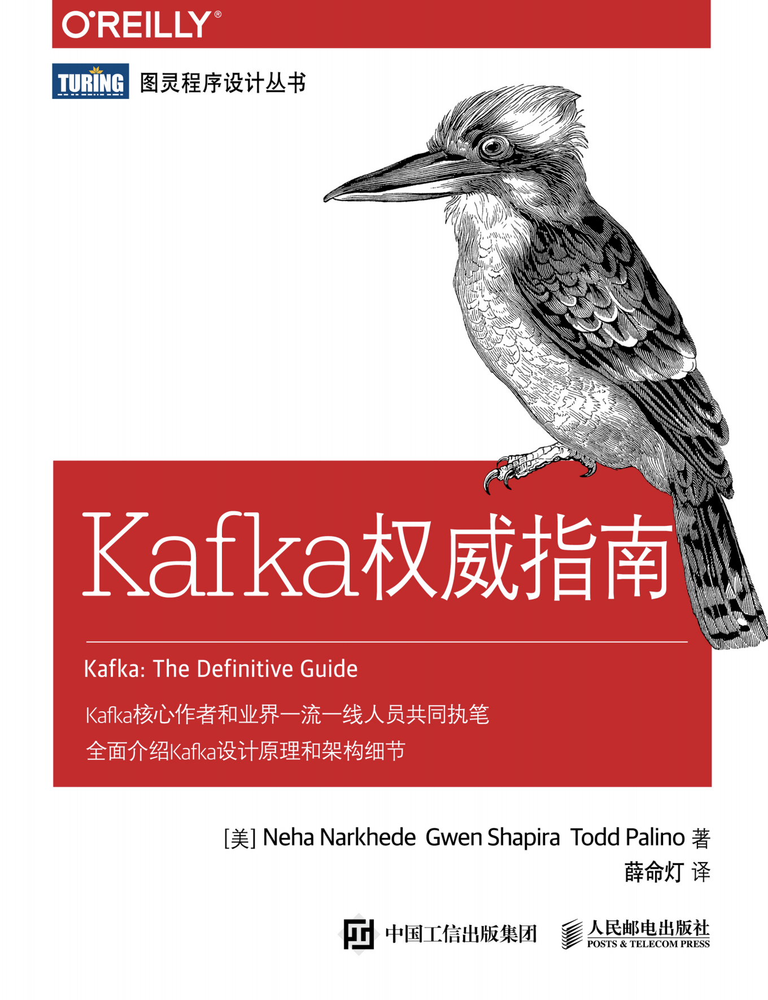

由于这是第三篇Kafka方面的学习资源，参见 [深入理解Kafka-核心设计与实践原理](/QQRN80.html)和[Kafka](/Q90SQR.html)，所以笔者对一些重复的部分进行了跳过，这里只写一些很重要的内容以及有趣的知识。

<!-- more -->

# 第三章 Kafka生产者-向kafka写入数据

## 生产者配置

### acks(再重复一遍这个配置)

>acks参数指定了必须要有多少个分区副本收到消息,生产者才会认为消息写入是成功的。这个参数对消息丢失的可能性有重要影响。该参数有如下选项
>
>如果acks=0,生产者在成功写入消息之前不会等待任何来自服务器的响应。也就是说如果当中出现了问题,导致服务器没有收到消息,那么生产者就无从得知,消息也就丢失了。不过,因为生产者不需要等待服务器的响应,所以它可以以网络能够支持的最大速度发送消息,从而达到很高的吞吐量
>
>如果acks=1,只要集群的首领节点收到消息,生产者就会收到一个来自服务器的成功响应。如果消息无法到达首领节点(比如首领节点崩溃,新的首领还没有被选举出来)生产者会收到一个错误响应,为了避免数据丢失,生产者会重发消息。不过,如果一个没有收到消息的节点成为新首领,消息还是会丢失。这个时候的吞吐量取决于使用的是同步发送还是异步发送。如果让发送客户端等待服务器的响应(通过调用 Future对象的get()方法),显然会增加延迟(在网络上传输一个来回的延退)。如果客户端使用回调,延迟问题就可以得到缓解,不过吞吐量还是会受发送中消息数量的限制(比如,生产者在收到服务器响应之前可以发送多少个消息)。
>
>如果acks=all,只有当所有参与复制的节点全部收到消息时,生产者オ会收到一个来自服务器的成功响应。这种模式是最安全的,它可以保证不止一个服务器收到消息,就算有服务器发生崩溃,整个集群仍然可以运行(第5章将讨论更多的细节)。不过,它的延迟比acks=1时更高,因为我们要等待不只一个服务器节点接收消息
>
>Page: 36


### max.in.flight.requests.per.connection

这个参数影响了消息能否乱序

>该参数指定了生产者在收到服务器响应之前可以发送多少个消息。它的值越高,就会占用越多的内存,不过也会提升吞吐量。把它设为1可以保证消息是按照发送的顺序写入服务器的,即使发生了重试
>
>Kafka 可以保证同一个分区里的消息是有序的。也就是说，如果生产者按照 一定的顺序发送消息，broker 就会按照这个顺序把它们写入分区，消费者也 会按照同样的顺序读取它们。在某些情况下，顺序是非常重要的。例如，往 一个账户存入 100 元再取出来，这个与先取钱再存钱是截然不同的！不过， 有些场景对顺序不是很敏感。 如果把 retries 设为非零整数，同时把 max.in.flight.requests.per.connection 设为比 1 大的数，那么，如果第一个批次消息写入失败，而第二个批次写入 成功，broker 会重试写入第一个批次。如果此时第一个批次也写入成功，那 么两个批次的顺序就反过来了。 一般来说，如果某些场景要求消息是有序的，那么消息是否写入成功也是 很关键的，所以不建议把 retries 设为 0。可以把 max.in.flight.requests. per.connection 设为 1，这样在生产者尝试发送第一批消息时，就不会有其 他的消息发送给 broker。不过这样会严重影响生产者的吞吐量，所以只有在 对消息的顺序有严格要求的情况下才能这么做。


# 第四章 Kafka消费者-从Kafka读取数据

如果一个消费者组中的消费者数量发生了变化，则会引发Kafka分区的重分配，这被称为**再均衡**

> 再均衡非常 重要，它为消费者群组带来了高可用性和伸缩性（我们可以放心地添加或移除消费者）， 不过在正常情况下，我们并不希望发生这样的行为。在再均衡期间，消费者无法读取消 息，造成整个群组一小段时间的不可用。另外，当分区被重新分配给另一个消费者时，消 费者当前的读取状态会丢失，它有可能还需要去刷新缓存，在它重新恢复状态之前会拖慢 应用程序。

消费者需要向broker的协调器发送心跳，如果消费者长时间不发，则被视为不活跃，会触发分区的重分配。

>**4.4 谁来执行rebalance和consumer group管理？**
>
>Kafka提供了一个角色：coordinator来执行对于consumer group的管理。坦率说kafka对于coordinator的设计与修改是一个很长的故事。最新版本的coordinator也与最初的设计有了很大的不同。这里我只想提及两次比较大的改变。
>
>首先是0.8版本的coordinator，那时候的coordinator是依赖zookeeper来实现对于consumer group的管理的。Coordinator监听zookeeper的/consumers/<group>/ids的子节点变化以及/brokers/topics/<topic>数据变化来判断是否需要进行rebalance。group下的每个consumer都自己决定要消费哪些分区，并把自己的决定抢先在zookeeper中的/consumers/<group>/owners/<topic>/<partition>下注册。很明显，这种方案要依赖于zookeeper的帮助，而且每个consumer是单独做决定的，没有那种“大家属于一个组，要协商做事情”的精神。
>
>基于这些潜在的弊端，0.9版本的kafka改进了coordinator的设计，提出了group coordinator——每个consumer group都会被分配一个这样的coordinator用于组管理和位移管理。这个group coordinator比原来承担了更多的责任，比如组成员管理、位移提交保护机制等。当新版本consumer group的第一个consumer启动的时候，它会去和kafka server确定谁是它们组的coordinator。之后该group内的所有成员都会和该coordinator进行协调通信。显而易见，这种coordinator设计不再需要zookeeper了，性能上可以得到很大的提升。后面的所有部分我们都将讨论最新版本的coordinator设计。
>
>原文链接： https://www.cnblogs.com/huxi2b/p/6223228.html

## 消费者配置

> - auto.offset.reset
>
> 该属性指定了消费者在读取一个没有偏移量的分区或者偏移量无效的情况下（因消费者长 时间失效，包含偏移量的记录已经过时并被删除）该作何处理。它的默认值是 latest，意 思是说，在偏移量无效的情况下，消费者将从最新的记录开始读取数据（在消费者启动之 后生成的记录）。另一个值是 earliest，意思是说，在偏移量无效的情况下，消费者将从 起始位置读取分区的记录。
>
> - enable.auto.commit 
>
> 我们稍后将介绍几种不同的提交偏移量的方式。该属性指定了消费者是否自动提交偏移 量，默认值是 true。为了尽量避免出现重复数据和数据丢失，可以把它设为 false，由自 己控制何时提交偏移量。如果把它设为 true，还可以通过配置 auto.commit.interval.ms 属性来控制提交的频率。
>
> Range: 该策略会把主题的若干个连续的分区分配给消费者。假设消费者 C1 和消费者 C2 同时 订阅了主题 T1 和主题 T2，并且每个主题有 3 个分区。那么消费者 C1 有可能分配到这 两个主题的分区 0 和分区 1，而消费者 C2 分配到这两个主题的分区 2。因为每个主题 拥有奇数个分区，而分配是在主题内独立完成的，第一个消费者最后分配到比第二个消 费者更多的分区。只要使用了 Range 策略，而且分区数量无法被消费者数量整除，就会 出现这种情况。
>
> RoundRobin:  该策略把主题的所有分区逐个分配给消费者。如果使用 RoundRobin 策略来给消费者 C1 和消费者 C2 分配分区，那么消费者 C1 将分到主题 T1 的分区 0 和分区 2 以及主题 T2 的分区 1，消费者 C2 将分配到主题 T1 的分区 1 以及主题 T2 的分区 0 和分区 2。一般 来说，如果所有消费者都订阅相同的主题（这种情况很常见），RoundRobin 策略会给所 有消费者分配相同数量的分区（或最多就差一个分区）。


## 自动提交偏移量

简单，但是后果是无法避免重复消息

## 手动提交偏移量

同步提交commitSync： 影响吞吐，只要没有发生不可恢复的错误，一直尝试直至提交成功

异步提交commitASync： 异步提交又会引发一个新的问题，异步提交失败了怎么办？

> 在成功提交或碰到无法恢复的错误之前，commitSync() 会一直重试，但是 commitAsync() 不会，这也是 commitAsync() 不好的一个地方。它之所以不进行重试，是因为在它收到 服务器响应的时候，可能有一个更大的偏移量已经提交成功。
>
> 解决办法：
>
> 我们可以使用一个单调递增的序列号来维护异步提交的顺序。在每次提交偏 移量之后或在回调里提交偏移量时递增序列号。在进行重试前，先检查回调 的序列号和即将提交的偏移量是否相等，如果相等，说明没有新的提交，那么可以安全地进行重试。如果序列号比较大，说明有一个新的提交已经发送 出去了，应该停止重试。
>
> Page: 60

笔者对这个解决办法有一个问题，异步提交请求发送了乱序怎么办？

考虑一次异步提交请求A，然后由于网络阻塞，导致这个提交超时了，然后去检查发现序列号没变，重试提交请求A，由于第一次提交请求A和第二次提交请求A直接经过了一段时间，提交请求B出现了，紧跟着提交请求A发送了出去，结果提交B先到达。

考虑到Kafka使用的是TCP协议，先发的消息一定先到，这个问题就解决了。

但是，发请求和增加偏移量是两个步骤，这里涉及到并发问题，如果请求B先发了请求，后增加偏移量，此时发生线程调度，请求A发了出去，那还是会导致一样的问题，

所以笔者认为这里需要加锁。


## 组合同步与异步提交

消费者在下线的时候，也是需要提交偏移量的

```java
try {
    while (true) {
        ConsumerRecords<String, String> records = consumer.poll(100);
        for (ConsumerRecord<String, String> record : records) {
            System.out.println(
                "topic = %s, partition = %s, offset = %d,"
                + "customer = %s, country = %s\n",
                record.topic(), record.partition(),
                record.offset(), record.key(), record.value());
        }
        consumer.commitAsync(); //➊
    }
} catch (Exception e) {
    log.error("Unexpected error", e);
} finally {
    try {
        consumer.commitSync(); //➋
    } finally {
        consumer.close();
    }
}
```

➊    如果一切正常，我们使用 commitAsync() 方法来提交。这样速度更快，而且即使这次提交失败，下一次提交很可能会成功。

➋    如果直接关闭消费者，就没有所谓的“下一次提交”了。使用 commitSync() 方法会一直重试，直到提交成功或发生无法恢复的错误。


## 提交特定的偏移量

> 消费者 API 允许在调用 commitSync() 和 commitAsync() 方法时传进去希望提交 的分区和偏移量的 map。假设你处理了半个批次的消息，最后一个来自主题“customers” 分区 3 的消息的偏移量是 5000，你可以调用 commitSync() 方法来提交它。不过，因为消 费者可能不只读取一个分区，你需要跟踪所有分区的偏移量，所以在这个层面上控制偏移 量的提交会让代码变复杂。


## 独立的消费者

有时候我们不需要消费者组，我们只有一个消费者。

> 如果是这样的话，就不需要订阅主题，取而代之的是为自己分配分区。一个消费者可以订 阅主题（并加入消费者群组），或者为自己分配分区，但不能同时做这两件事情。

```java
List<PartitionInfo> partitionInfos = null;
partitionInfos = consumer.partitionsFor("topic"); //➊
if (partitionInfos != null) {
    for (PartitionInfo partition : partitionInfos){
        partitions.add(new TopicPartition(
            partition.topic(), partition.partition()));
    }
    consumer.assign(partitions); //➋
    while (true) {
        ConsumerRecords<String, String> records =
            consumer.poll(1000);
        for (ConsumerRecord<String, String> record: records) {
            System.out.println(
                "topic = %s, partition = %s, "
                + "offset = %d,customer = %s, country = %s\n", 
                record.topic(), record.partition(), record.offset(),
                record.key(), record.value());
        }
        consumer.commitSync();
    }
}
```

➊    向集群请求主题可用的分区。如果只打算读取特定分区，可以跳过这一步。
        ➋    知道需要哪些分区之后，调用 assign() 方法。

> 除了不会发生再均衡，也不需要手动查找分区，其他的看起来一切正常。不过要记住，如 果主题增加了新的分区，消费者并不会收到通知。所以，要么周期性地调用 consumer. partitionsFor() 方法来检查是否有新分区加入，要么在添加新分区后重启应用程序。


# 第 5 章 深入Kafka


