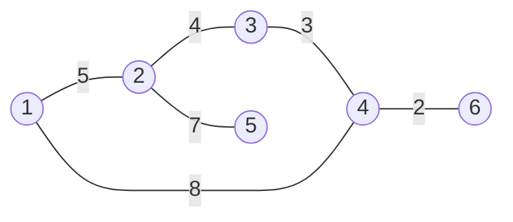
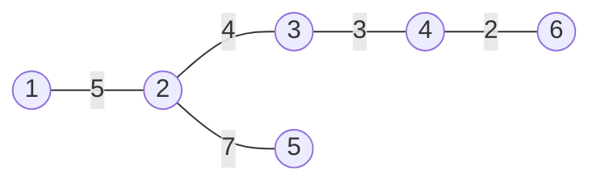
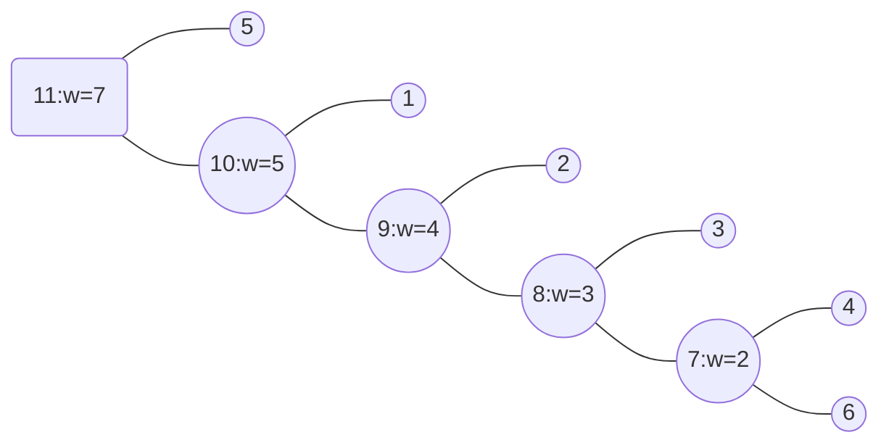

# 克鲁斯卡尔重构树
有的时候，我们需要对最小生成树进行进一步的研究，比方说我们考虑最小生成树上任意两点路径的最小值，这个可以使用主席树、树剖等做法，
但是我们这样考虑，加入新的点，让边权变为点权，路径权的最小值就成了点权的最小值，如下图所示，最小生成树的点全部成为了克鲁斯卡尔重构树上的叶子，非叶节点充当了边权。


<!-- more -->
求最小生成树

求克鲁斯卡尔重构树


# Kruskal重构树
```cpp
/**************************************************************
    Problem: 3732
    User: 1144560553
    Language: C++
    Result: Accepted
    Time:2140 ms
    Memory:7124 kb
****************************************************************/
 
#include<bits/stdc++.h>
using namespace std;
 
// 树剖
const int V=1e5+5;
int to[V<<1],nex[V<<1],head[V],w[V],cnt,n;
void ini(){cnt=-1;for(int i=0;i<=n;i++) head[i]=-1;}
void addEdge(int u,int v){to[++cnt]=v;nex[cnt]=head[u];head[u]=cnt;}
 
int dep[V],dad[V],siz[V],son[V],chain[V],dfn[V];//
void dfs1(int u,int father){//dfs1(1,0)
    dep[u]=dep[father]+1;//ini  because dep[0]=1
    dad[u]=father, siz[u]=1, son[u]=-1;
    for(int i=head[u];~i;i=nex[i]){
        int v=to[i];
        if(v==father)continue;
        dfs1(v,u);
        siz[u]+=siz[v];
        if(son[u]==-1||siz[son[u]]<siz[v]) son[u]=v;
    }
}
void dfs2(int u,int s,int&step){
    dfn[u]=++step;
    chain[u]=s;
    if(son[u]!=-1) dfs2(son[u],s,step);
    for(int i=head[u];~i;i=nex[i]){
        int v=to[i];
        if(v!=son[u]&&v!=dad[u]) dfs2(v,v,step);
    }
}
int lca(int x,int y){
    int res=0;
    while(chain[x]!=chain[y]){
        if(dep[chain[x]]<dep[chain[y]]) swap(x,y); //dep[chain[x]]>dep[chain[y]]
        // res+=segtree::query(dfn[chain[x]],dfn[x],k);// [左，右，值]
        x=dad[chain[x]];
    }
    if(dep[x]>dep[y]) swap(x,y);// dep[x]<dep[y]
    return x;
    // return res+segtree::query(dfn[x],dfn[y],k);// [左,右,值]
}
 
// int query(int x,int y,int k){
//     int res=0;
//     while(chain[x]!=chain[y]){
//         if(dep[chain[x]]<dep[chain[y]]) swap(x,y); //dep[chain[x]]>dep[chain[y]]
//         res+=segtree::query(dfn[chain[x]],dfn[x],k);// [左，右，值]
//         x=dad[chain[x]];
//     }
//     if(dep[x]>dep[y]) swap(x,y);// dep[x]<dep[y]
//     return res+segtree::query(dfn[x],dfn[y],k);// [左,右,值]
// }
 
// 克鲁斯卡尔重构树
int f[V];
int find(int x){return x==f[x]?x:f[x]=find(f[x]);}
bool cmpVec(const vector<int>&a,const vector<int>&b){return a[2]<b[2];}
void reBuildTree(vector<vector<int> >&edges){
  sort(edges.begin(),edges.end(),cmpVec);
  ini();
  for(int i=0;i<=n*2;i++) f[i]=i;
  for(int i=0;i<edges.size();i++){
    int u=edges[i][0];
    int v=edges[i][1];
    if(find(u)==find(v)) continue;
    head[++n]=-1;
    addEdge(n,f[u]);
    addEdge(n,f[v]);
    w[n]=edges[i][2];
    f[f[u]] = f[f[v]] = n;
  }
}
 
int main(){
  int m,k;
  cin>>n>>m>>k;
  vector<vector<int> > edges(m,vector<int>(3));
  for(int i=0;i<m;i++) cin>>edges[i][0]>>edges[i][1]>>edges[i][2];
 
  reBuildTree(edges);
 
  int step=0;
  dfs1(n,0);
  dfs2(n,n,step);
 
  while(k--){
    int x,y;
    cin>>x>>y;
    cout<<w[lca(x,y)]<<endl;
  }
}
```


