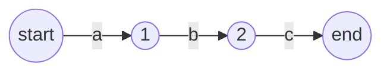
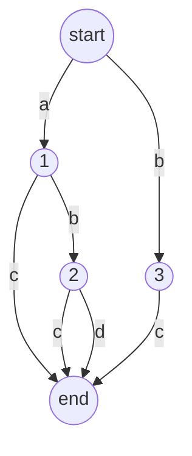

# 字典树
 字典树是我接触自动机的开端，我们先讲自动机，

# 自动机
 自动机有五个要素，开始状态，转移函数，字符集，状态集，结束状态。

# 自动机识别字符串
 假设我们有一个自动机，他长这个样子,他能识别字符串abc.
 **稍等片刻！下图正在转码中**

 最开始我们在位置start，也就是初始状态，当我们读入字符a的时候，经过转移函数我们到达了1号状态，如果我们在初始状态读到的是字符b，则因为初始状态没有字符b的转移函数。会导致自动机在非终结状态停机，这就意味着无法识别字符b，同理也无法识别c-z,于是在初始状态只能识别a， 
 然后分析状态1，只能识别b，到达状态2，只能识别c到达终态。最后就识别了字符串abc。 
 然后我们来考虑一个复杂一点的自动机，他能识别字符串abc、abd、bc、ac 

 **稍等片刻！下图正在转码中**

 如果我们不去分析其中的end节点，他的本质就是一颗树，他同时又叫做字典树，特别的，如果这个字典树的字符集为01，则他又叫做01字典树。

# 字典树的插入
 字典树的插入应该是一个字符串，这个过程我们可以用递归实现，
# 字典树的删除
 特别注意，为了能够支持多重集合，我们常常用一个数字来代表有多少个字符串在某个状态结束，这样删除的时候只要减少那个值就可以了
# 字典树的查找
 递归。
# 递归转非递归
 因为字典树的代码特别简单，我们常常直接用递归转非递归来实现。
# 代码
 先欠着，暂时拖一个不太友好的代码在这里,这里面有一部分代码就是字典树啦。
[代码链接](/ACM/stencil/string/AC自动机.html)