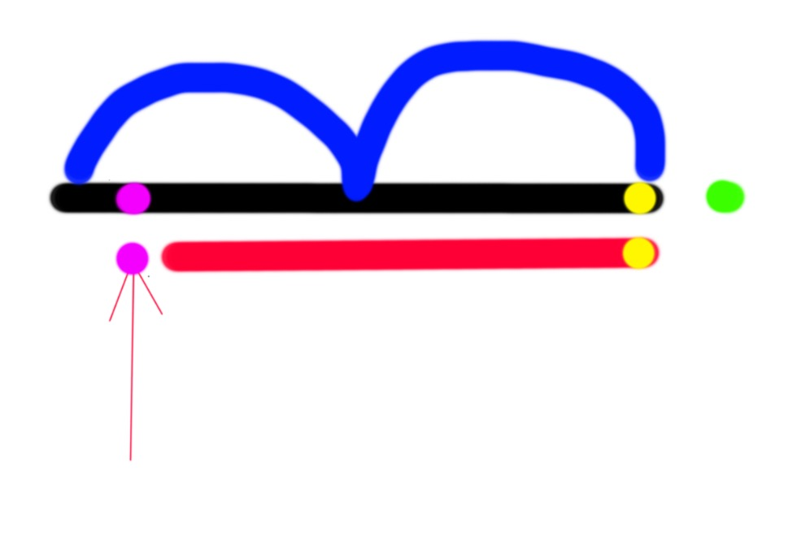

回文自动机，就像AC自动机一样，他采取字典树来储存状态集合，也像AC自动机是KMP 算法与字典树结合一样，回文自动机就是manacher算法和字典树结合的新算法。

在回文自动机里面，状态指的是，以字典树上所表示的字符串的逆序串的以末端字符镜像对称后得到的新串,简单说，baab在字典树上为root->a>b,cacaacac在字典树上为root->a->c->a->c,想像根就是对称中心，往儿子走就意味着，在对称中心两端加上同样的数字。当然这样子是无法表示奇数回文的，所以我们设立两个根就可以了。一个串的回文自动机，储存了这个串的所有回文子串。

回文自动机的状态转移的依据是回文，举个例子，如下图，如果黑色串代表以黄色字符为结尾 的最长的回文串，红色串代表黑色串的最长真后缀回文串，（定义：若回文串a为某串b的真后缀，则a为b的真后缀回文串，定义：若后缀a为某串b的后缀且 a！=b，则a为b的真后缀）当我们在黑串后面加上一个绿字符形成新串的时候，（姑且叫他黑绿串）回文自动机中的节点会发生什么样的变化呢？显然增加了 某些新的回文串，但是我们考虑这样一个事实，如果我们把黑绿串的最长后缀回文串加入到自动机中以后，我们就把黑绿串新增的所有回文串都可以被回文自动机所表示，证明类似于manacher算法，请自行证明。

下面来讨论如何把它加进去。我们假设粉色字符刚好是是红色串前的一个字符，如果粉色字符和绿色 字符为同一个字符的时候，我们可以肯定，黑绿串的最长真后缀回文串就是粉色字符+红串+绿色字符。此刻我们只需要新增一个节点了。如果他们不相等的话，重复 我们对黑串的算法与红串之上即可解决。

然后我们来考虑新增节点的所表示的回文后缀的最长真后缀回文串，我们重复使用上一段的算法，即可找到。




```cpp
struct palindrome_tree{
    static const int maxn=1.2e5+5;
    int trans[maxn][26],len[maxn],suf[maxn],num[maxn];
    //len代表回文长度,suf指向回文后缀,类似于fail指针，num是最长后缀的数量，经过calc之后是后缀数量
    int last,cnt;//last是上一个回文后缀，cnt是所有节点数
    
    int new_node(int _len,int _suf,int _num){//长度，后缀，数量
        for(int i=0;i<26;i++)trans[cnt][i]=0;
        len[cnt]=_len;
        suf[cnt]=_suf;
        num[cnt]=_num;
        return cnt++;
    }
    
    void ini(){
        cnt=0;
        int root_even=new_node(0,1,0);//=1
        int root_odd=new_node(-1,1,0);//=0
        last=root_odd;
    }
    
    int query_longest_palindrom(){
        int ret=1;
        for(int i=0;i<cnt;i++){
            ret=max(ret,len[i]);
        }
        return ret;
    }
    
    void build(char*s){//s是要建立回文自动机的字符串,下标从1开始
        int len=(int)strlen(s+1);
        for(int i=1;i<=len;i++)extend(s,i);
        calc();
    }
    
    void extend(char*s,int cur){
        int w=s[cur]-'a';//当前结点的值
        int p=last;//上一次匹配到的回文后缀
	while( cur-len[p]-1<1 || s[cur-len[p]-1] != s[cur]) p=suf[p]; // BUG 数组越界
        //现在p结点的cur儿子,要么是匹配成功的最长非自身回文后缀,要么是自身这一个字符
        
        if(!trans[p][w]){//如果此回文后缀未出现过，要创建节点
            int v=suf[p];//我们来找他的suffix link回边，
            while( s[cur-len[v]-1] != s[cur] )v=suf[v];
            //此时意味着找到了suffix link 是v的儿子
            trans[p][w]=new_node(len[p]+2,trans[v][w],0);
        }
      
        last=trans[p][w];//这一次匹配到的回文后缀
        num[last]++;
    }
    
    void calc(){
        for( int i=cnt-1;~i;i-- )num[suf[i]] += num[i];//结点创建顺序保证了suf[i]<i
    }
};
```