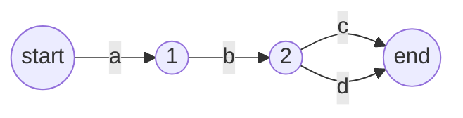
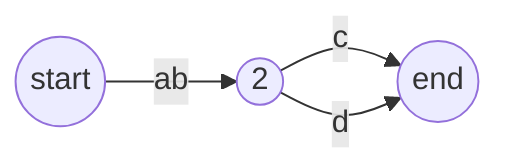
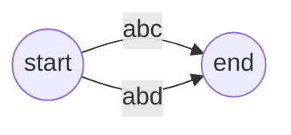

# 基数树
 基数树是一种更加节省空间的数据结构，他是字典树的升华，
# 字典树的缺陷
 常常字典树会很深，而不胖，这会导致空间的浪费，因为里面的指针很多，往往我们发现，如下列字典树
 **稍等片刻！正在将字符数据转化为图形**

# 用基数树改进字典树
 我们可以通过压缩字符路径为字符串路径，即将长链压缩为一条边。

 当然你甚至还能这样

 这些都是合法的基数树。注意，基数树仍然是字典树，只不过他压缩了路径

# 用基数树加速IP路由检索
 路由检索常常是检索一个01字符串，这时候我们可以通过压缩的方式，每两位压缩、或者三位、四位压缩，能够让查找次数更少，当然这样做可能会牺牲空间，但是他依然是基数树优化的字典树。