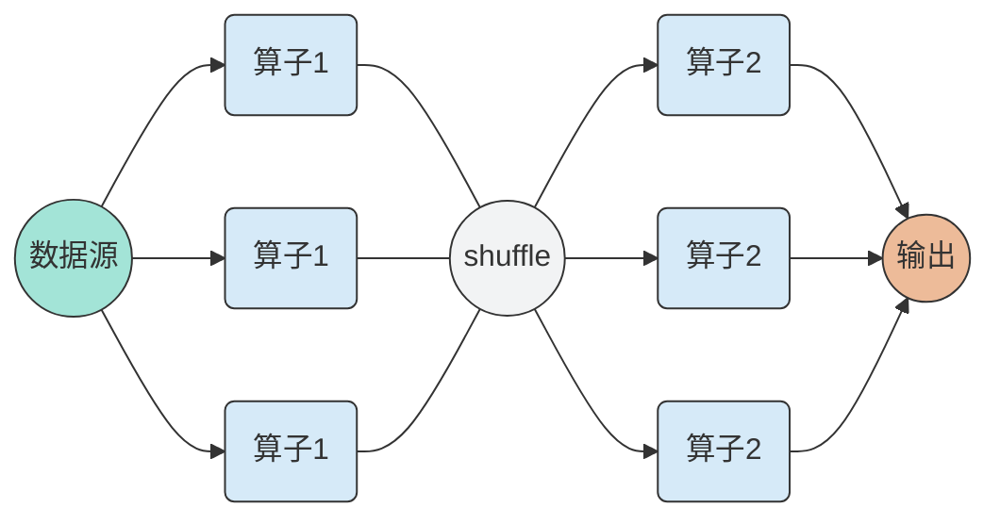
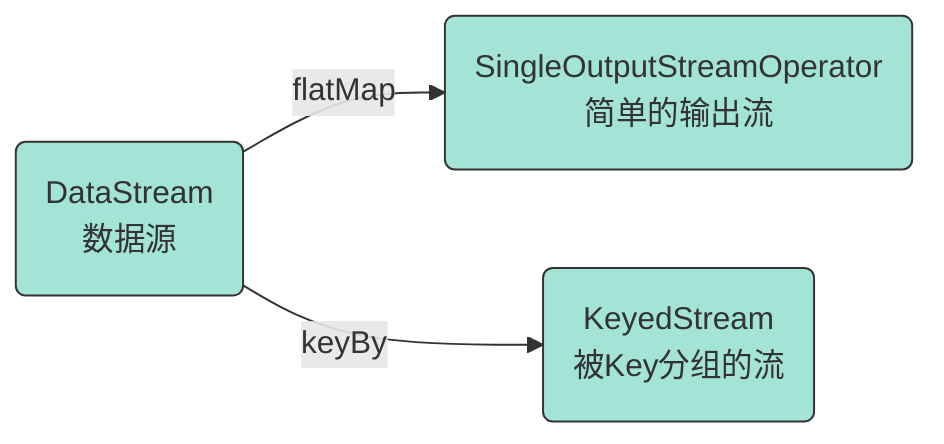
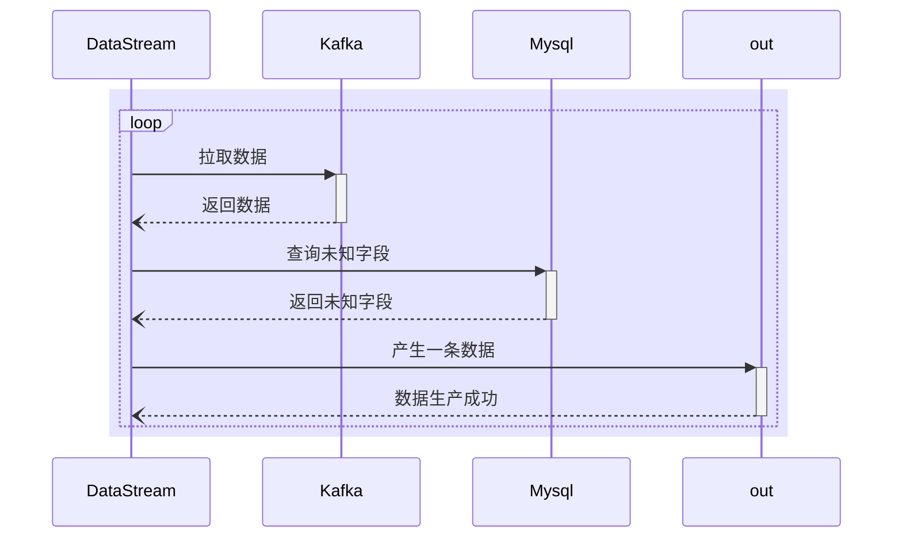
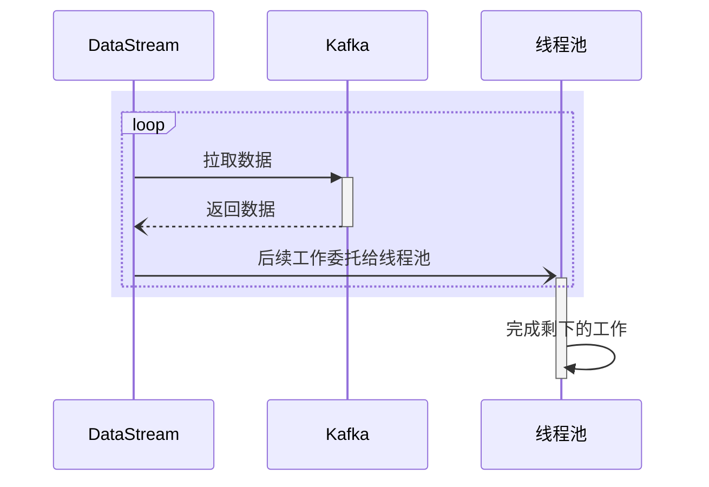

# 运行源码

我们将运行1.13.0版本的Flink，其scala环境为2.12

## Step1. 获取学习项目

```sh
git clone https://github.com/fightinggg/flink-src-study.git --recursive
```

在这个项目中，笔者把flink源码作为了一个git submodule放置于文件夹flink中，用来临时查看，当然我个人不建议看这些代码。

然后就可以直接运行了


<!-- more -->

## Step2. Enjoy It

现在你可以直接从这里进入flink的控制台[http://localhost:8081](http://localhost:8081)， 你也可以直接在ideal中调试flink。


## Step3. Debug

自己设断点就好了。


# 使用Flink

下面使用flink-examples-streaming_2.12-1.13.0来演示

## 执行环境

这个包下的所有的example在main函数的第一行全部首先选择获取环境，代码如下。

```java
env = StreamExecutionEnvironment.getExecutionEnvironment();
```

## 数据源

当我们获取运行环境以后，紧接着就需要拿到数据源，examples中的各个例子获取数据源的方案如下。


|        方案        |                           example                            |
| :----------------: | :----------------------------------------------------------: |
|     从数组获取     |        1. WordCount<br />2. WindowWordCount<br />...         |
|   从文件按行获取   |        1. WordCount<br />2. WindowWordCount<br />...         |
| 从自定义Source获取 | 1. TopSpeedWindowing<br />2. KafkaEventsGeneratorJob<br />... |
|    从Kafka获取     |               1. StateMachineExample<br />...                |
|    从Socket获取    |              1. SocketWindowWordCount<br />...               |
|     从集合获取     |                    1. WindowJoin<br />...                    |

## 算子

第一个问题就是：什么是算子？

算子描述了一系列的计算操作，他告诉计算机一个数据应该如何处理。



一旦我们有了数据源以后，数据源源源不断的产生数据，我们可以把它当作一个流，可以进行计算了，`DataStream`被flatMap以后是`SingleOutputStreamOperator`,实际上这个类和DataSream区别并不是特别大，`SingleOutputStreamOperator`继承自`DataStream`且没有重写任何函数。

`KeyedStream`则提供了一些聚合函数。



更具体一点，如wordCount，他经过flatMap分词，然后使用词进行Key，最后聚合，代码如下。

```java
DataStream<Tuple2<String, Integer>> counts =
    // split up the lines in pairs (2-tuples) containing: (word,1)
    text.flatMap(new Tokenizer())
    // group by the tuple field "0" and sum up tuple field "1"
    .keyBy(value -> value.f0)
    .sum(1);
```

## 窗口

当然复杂一点点的如WindowWordCount，中间穿插了一个计数窗口，代码如下。

```java
DataStream<Tuple2<String, Integer>> counts =
    // split up the lines in pairs (2-tuples) containing: (word,1)
    text.flatMap(new WordCount.Tokenizer())
    // create windows of windowSize records slided every slideSize records
    .keyBy(value -> value.f0)
    .countWindow(windowSize, slideSize)
    // group by the tuple field "0" and sum up tuple field "1"
    .sum(1);
```

## Socket数据源

最复杂的SocketWindowWordCount，首先执行`nc -l 12345`，然后启动此类的main函数，nc可以直接输入，我们能发每5秒输出了一次实时计算结果，代码如下。

```java
DataStream<WordWithCount> windowCounts =
    text.flatMap(
    new FlatMapFunction<String, WordWithCount>() {
        @Override
        public void flatMap(
            String value, Collector<WordWithCount> out) {
            for (String word : value.split("\\s")) {
                out.collect(new WordWithCount(word, 1L));
            }
        }
    })
    .keyBy(value -> value.word)
    .window(TumblingProcessingTimeWindows.of(Time.seconds(5)))
    .reduce(
    new ReduceFunction<WordWithCount>() {
        @Override
        public WordWithCount reduce(WordWithCount a, WordWithCount b) {
            return new WordWithCount(a.word, a.count + b.count);
        }
    });
```


## 异步数据源

首先提出一个背景，有一条来自Kafka的数据，由于某些原因，该数据中暂时不包含完整的字段，当我们使用Flink从Kafka读取数据以后，还需要查询Mysql补全其字段，此后才能使用Flink做接下来的操作。

如果自定义数据源，从Kafka消费数据，然后查询Mysql，最后输出，这其中其实涉及到很多问题，一个最简单的想法是从Kafka单线程消费数据，然后阻塞住，去查询Mysql。



这样做无可厚非，但是效率堪忧，Kafka拉取数据要快于Mysql，所以补全字段以及输出结果可以异步完成，基于第二个点，引入了`RichAsyncFunction`。



当然`RichAsyncFunction`做的工作不仅仅是这些，实际上处理流程也比这个复杂很多，这里从中挑几个出来聊一聊。

首先是顺序问题，由于后续工作委托给了线程池，线程池内部当然可以并发执行，那么我们就没办法保证有哪些数据先处理完毕，`Async I/O `给出的第一个解决方案是通过队列保证顺序，哪个任务先执行完我不管，最终按入队顺序取结果；第二个解决方案是完全不理会顺序，谁先执行完就取出谁的结果；第三个解决方案是关注watermark，对于当前watermark下的数据，执行完就直接取出结果，对于下一个watermark的数据，将其缓存，直到他的watermark抵达。读者可以在这里看到更加详细的过程http://wuchong.me/blog/2017/05/17/flink-internals-async-io/

## GPU计算

`MatrixVectorMul`是一个GPU计算例子，其中主要的内容在`Multiplier`中。这里 不做过多介绍。


## Iterator模型

试想，如果有一些元素需要进行迭代计算，比如说我们计算两个元素进行斐波拉契数列的第n项，是不是可以写一个递归？

```c++
int fib(int a,int b,int n){
    return n<=0 ? b : fib(b,a+b,n-1);
}
```

如果某些算子也需要进行这些操作，我们可以使用`ProcessFunction`, 下面这个代码和上面的代码的思想异曲同工。

```java
@Override
public void processElement(
    Tuple5<Integer, Integer, Integer, Integer, Integer> value,
    Context ctx,
    Collector<Tuple5<Integer, Integer, Integer, Integer, Integer>> out)
    throws Exception {
    Tuple5<Integer, Integer, Integer, Integer, Integer> element =
        new Tuple5<>(value.f0, value.f1, value.f3, value.f2 + value.f3, ++value.f4);

    if (value.f2 < BOUND && value.f3 < BOUND) {
        ctx.output(ITERATE_TAG, element);
    } else {
        out.collect(element);
    }
}
```


给你一个长度为$n$的序列，每个数都是正整数，范围在$0$到$2^t$之间(包含$0$，不包含$2^t$)

你需要输出一个$n*n$的矩阵，对于矩阵的第$x$行($1\le x\le n$)，第$y$列($1\le y\le n$)，他的值等于：

- 序列的前$x$个数中，选择$y$个数（每个数可以重复选）的异或和的最大值。


数据范围：

$1\le n\le 100$

$1\le t \le 20$


