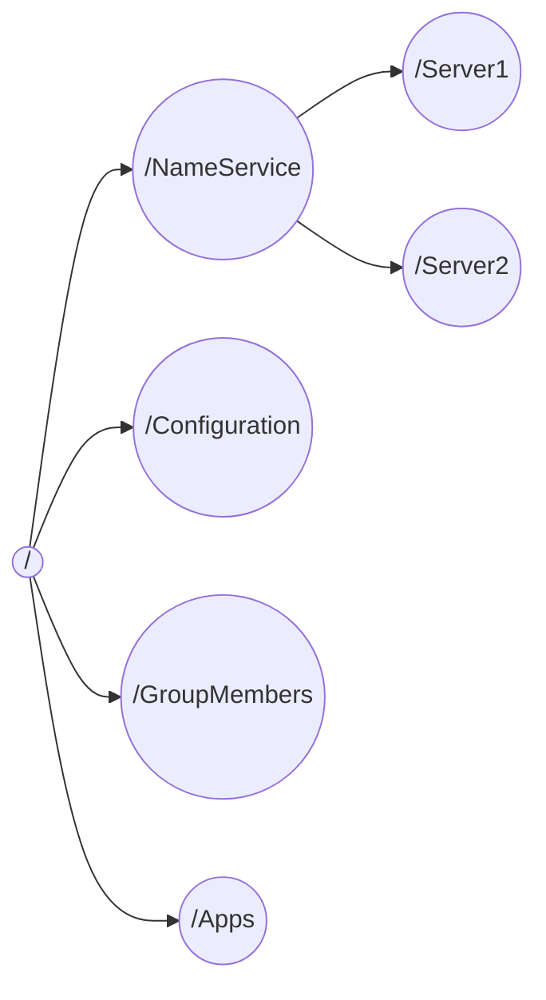

# Zookeeper介绍
Zookeeper是一个为分布式应用提供一致性服务的软件，是Hadoop项目的一个子项目，是分布式应用程序协调服务

# Zookeeper安装
这里有一个下载[地址](https://zookeeper.apache.org/releases.html#download),
也可以`brew install zookeeper`安装
还可以`docker pull zookeeper`安装
<!-- more -->
我们这里采取docker的方式

# Zookeeper单机启动
```sh
docker run -d -p 2181:2181 --name zookeeper --restart always zookeeper
docker exec -it zookeeper bash
./bin/zkCli.sh
```
然后我们能看到下面的输出, 我只截取前几行
```sh
Connecting to localhost:2181
2020-04-17 07:54:30,252 [myid:] - INFO  [main:Environment@98] - Client environment:zookeeper.version=3.6.0--b4c89dc7f6083829e18fae6e446907ae0b1f22d7, built on 02/25/2020 14:38 GMT
...
```
输入`quit`可以退出
# Zookeeper集群启动
嘿嘿嘿

# Zookeeper配置
在conf目录下有配置文件zoo_sample.cfg和log4j.properties,他们分别是zoo的配置文件模版和日志配置，我们可以将zoo_sample.cfg改为zoo.cfg，这个才是Zookeeper默认的配置文件，其中有几个地方比较重要

配置|作用
-|-
tickTime=2000|这个是心跳时间间隔，单位是毫秒
dataDir=|Zookeeper保存数据的目录，默认将日志也保存在其中
clientPort=2181|客户端连接Zookeeper服务器的端口
initLimit=5|当客户端超过5个心跳间隔仍然与服务器连接失败，则认为他宕机
synLimit=2|Leader和Follower之间发送消息的响应、请求时间长度不能超过的心跳间隔
server.1=192.168.211.1:2888:3888|server.A=B:C:D, A是数字表示服务器编号，B是这个服务器的ip，C是服务器于集群leader交流信息的端口，D是Leader宕机以后选举新Leader的端口

# Zookeeper数据模型
Zookeeper会维护一个层次数据结构，他就像一个文件系统一样, 凑合着看吧

## Zookeeper数据结构的特点
- 所有的目录项都被叫做znode，这个zndoe是被他所在的路径唯一标识，
- znode分4类，EPHEMERAL or PERSISTENT, SEQUENTIAL or N
- 大部分znode都可以有子节点，都可以储存数据， 只有EPHEMERAL不可以有子节点
- znode储存的数据可以拥有版本号
- EPHEMERAL 是临时节点，服务器客户端用心跳机制来保证长连接，如果客户端宕机，这个节点会被删除
- znode可以被监控，是一种观察者模式，客户端可以在目录上注册观察，当目录发生变化，客户端会得到通知


# Zookeeper持久化
Zookeeper的数据分为两个部分，一部分是内存数据，另一部分是磁盘数据，内存数据提供对外服务，磁盘数据用来恢复内存数据，用来在集群汇总不同节点间数据的同步，磁盘数据包括快照和事务日志，快照是粗粒度，事务日志是细粒度。

## Zookeeper数据加载
先加载快照然后加载日志

## 快照生成的时机
基于阈值，引入随机因素，我们要避免所有节点同时制造快照，这会导致消耗大量磁盘IO和CPU，降低对外服务能力，参见一个公式 
$$countLog>snapCount/2+randRoll$$
这里的countLog是累计执行的事务个数，snapCount是一个预先设定的阈值，randRoll是一个随机数

## 事务日志的储存
事务日志是不断写入的，会触发底层磁盘IO，为了减少分配磁盘块对写入的影响，Zookeeper使用预分配的策略，每次分配64MB,当这64MB的空间被使用到只剩下4KB的时候，就开始再次分配空间了

# Zookeeper架构
**过半:**当leader广播一个事务消息以后，收到了半数以上的ack，就认为集群中所有的节点都收到了消息，leader不会等待剩余节点的ack，直接广播commit消息，提交事务，选举投票中也是如此

Zookeeper集群中有3种角色

角色|任务
-|-
leader|一个集群只有一个leader，通过选举产生，负责所有事务的写操作，保证集群事务处理的顺序性
follower|处理非事务请求，转发事务给leader，参与leader选举投票，
observer|提供读取服务，不参与投票

# Zookeeper一致性协议
- 集群在半数以下节点宕机的情况下，能够正常对外提供服务
- 客户端的写请求全部转交给leader处理，以确保变更能实时同步到所有的follower和observer
- leader宕机或者整个集群重启的时候，要确保在leader上提交的事务最终被所有服务器提交，确保只在leader上提出单未被提交的事务被丢弃

## Zookeeper选主
当集群中的服务器初始化启动或者运行期无法与leader保持连接的时候，会触发选主，投票者们混线传递投票的信息，包含了被推举的leader的服务id、事务zxid、逻辑时钟、选举状态，显然要选举事务zxid最大的那个,如果事务id相同，就选择服务id最大的那个

广播的时候每当外边传入的(id,zxid)比自己内存中的要优的时候，就更新自己的数据，然后向外广播[^理解zookeeper选举机制]

这里有一个有意思的东西，我们什么时候选举结束呢？

当一个(id,zxid)被超过半数的节点所选举的时候，它就有力担当leader，为什么是半数？因为Zookeeper集群的每一条事务，都是在超过半数ack的情况下才能被leader提交，所以如果一个节点在半数中为最优，那么它一定是最优者之一

这就好比一个数列，数列中的最大值的数量超过了半数，那么该序列的任何一个元素个数超过一半的子序列的最值，一定等于整个序列的最值。比方有一个序列[1,2,3,5,5,5,5], 你在其中选择至少4个数，那么他们中的最大值一定是5，其实就是鸽巢原理

另一方面选主的时候，每个节点都是三个线程，一个负责接收投票并放入队列，另一个用于发送投票信息，还有一个用于外部投票同自己的信息比较，选出新的结果

## Zookeeper选主后的同步
这里的数据不一致可能有两种，要么比leader旧，要么比leader新，旧的话同步即可，新的话撤销这个未提交的事务即可, 两个不一致性的原因这里有谈到[^分析Zookeeper的一致性原理]

## 两阶段提交
事务由leader发起，follower执行，然后返回ack，最终由leader决定是否提交。


# Zookeeper的应用
## 统一命名服务
路径就是名字
## 配置管理
我们的集群，每台机器都有自己的配置文件，这会非常难以维护，实际上我们会把配置文件储存在Zookeeper的某个目录节点中，让集群的每台机器都注册该节点的观察，当配置文件发生改变的时候，这些机器都会的得到通知，然后从Zookeeper更新自己的配置文件。
## 集群管理
我们的集群需要有一个总管知道集群中每台机器的状态，当一些机器发生故障或者新添加机器的时候，总管必须知道，这就可以用Zookeeper管理

甚至当总管宕机以后，Zookeeper能够重新选出总管，总管会在Zookeeper中创建一个EPHEMERAL类型的目录节点，每个Server会注册这个节点的watch，总管死去的时候，这个目录会被删除，所有的子节点都会收到通知，这时大家都知道总管宕机了，集群默认会选择接待你编号最小的Server作为新的Master。
## 分布式锁
同样，我们让第一个创建某目录成功的机器获得锁，其他机器在其子目录下创建新的目录节点，当它需要释放锁的时候，只需要删除目录，然后让子节点中编号最小的节点作文新的目录获得锁，其他节点继续跟随即可。
## 队列管理
同步队列，即当所有成员达到某个条件是，才能以前向后执行，我们创建一个同步目录，每当一个成员满足条件，就去Zookeeper上注册节点，如果当前节点的个数达到n，就创建start节点，否则注册watch，等待start节点被创建，当其被创建就会收到通知，然后执行自己的事情

FIFO队列， 如生产者消费者模型，创建子目录/queue,当生产者生产出东西的时候，在/queue上创建新节点，当消费者需要消费的时候，从当前目录去除编号最小的节点即可


# 参考资料
[Docker下安装zookeeper（单机 & 集群）](https://www.cnblogs.com/LUA123/p/11428113.html)
[ZooKeeper学习 一:安装](https://blog.csdn.net/weixin_41863129/article/details/105028766)
[zookeeper使用和原理探究](http://jm.taobao.org/2010/12/21/665/)
[分布式服务框架 Zookeeper — 管理分布式环境中的数据](https://www.ibm.com/developerworks/cn/opensource/os-cn-zookeeper/)
[mac安装的docker替换镜像](https://www.cnblogs.com/jinzhidao/p/12534064.html)
[Zookeeper持久化原理](https://my.oschina.net/u/3847203/blog/3098735/print)
[ZooKeeper 技术内幕：数据的存储(持久化机制)](https://blog.csdn.net/varyall/article/details/795644180)
[Zookeeper-持久化](https://blog.csdn.net/jpf254/article/details/80769525)
[分析Zookeeper的一致性原理](https://blog.51cto.com/welcomeweb/2103292?utm_source=oschina-app)
[理解zookeeper选举机制](https://www.cnblogs.com/shuaiandjun/p/9383655.html)