# 容器化开发

https://segmentfault.com/a/1190000023095631


## 注意事项

对于所有的容器化开发，我们的时区都需要设置

```docker
-v /etc/localtime:/etc/localtime
```
<!-- more -->


## Nodejs开发

```sh
docker run -itd \
--restart=always \
--name node-dev \
-v $HOME/src:/root/src \
-v /etc/localtime:/etc/localtime \
-v $HOME/.ssh:/root/.ssh \
-p 3000:3000 \
node:14.4.0

# 这个时区设置添加到启动程序中
# process.env.TZ = 'Asia/Shanghai';
```

## Java开发

```sh
# docker 参数
-m 800m
--cpus 1
-v /root/.m2/:/root/.m2
-p 8080:8080 -p
--net docker-net
--ip 192.168.11.2
```

```Dockerfile
FROM maven:3.6.3-jdk-8
COPY . /src
WORKDIR /src
CMD ["sh", "dockerEntryPoint.sh"]
```

```sh
mvn -v
echo "package"
mvn clean package -Dmaven.test.skip=true
echo "start java application ... "
#java -jar -agentlib:jdwp=transport=dt_socket,server=n,address=10.40.28.63:5005,suspend=y main.jar
java -jar \
  -agentlib:jdwp=transport=dt_socket,server=y,suspend=n,address=5005 \
  *.jar
```


第一步，开发一个Spring程序

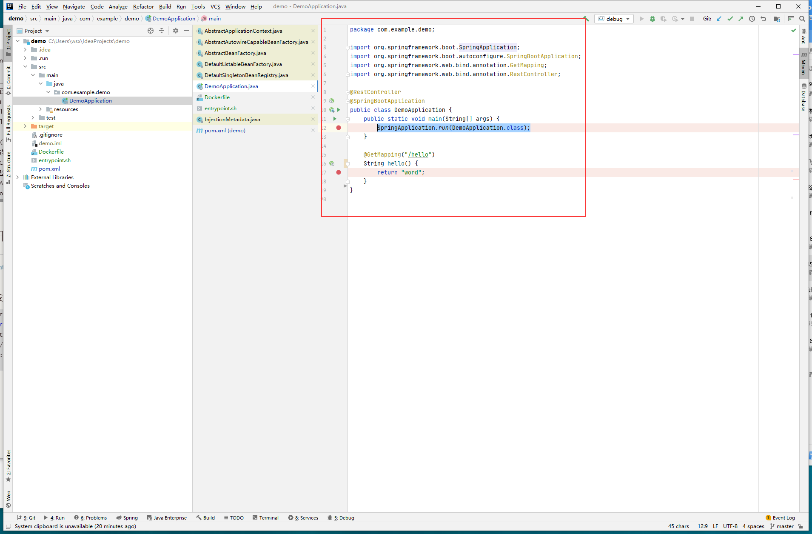

第二步，连接远端Centos

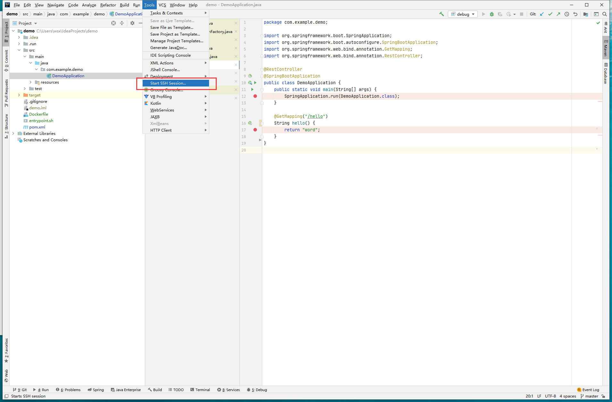

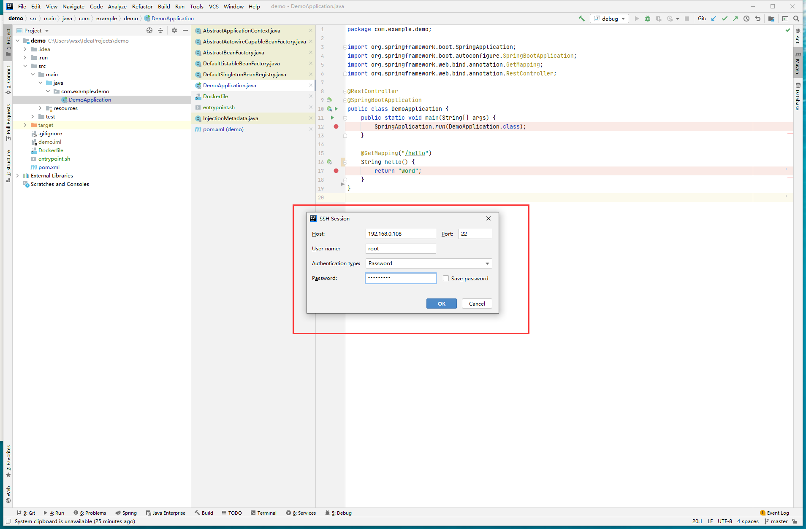

第三步修改docker启动参数并重启docker

```sh
vim /lib/systemd/system/docker.service 
```

增加 ` -H tcp://0.0.0.0:2375`

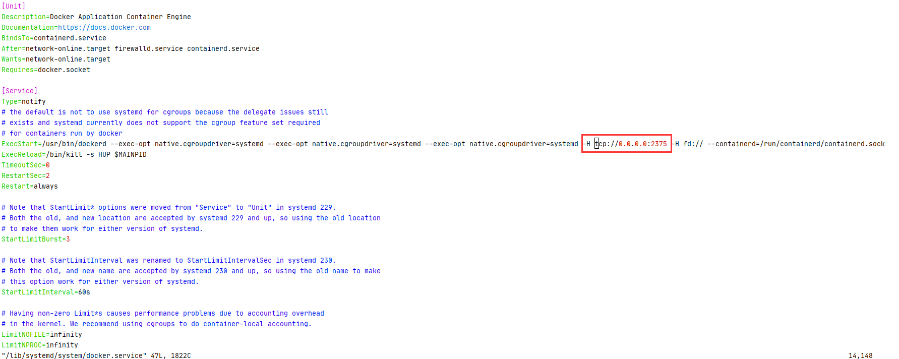

```sh
systemctl daemon-reload && systemctl restart docker && systemctl status docker
```

第四步创建Dockerfile以及entrypoint.sh

**注意Dockerfile中移动的jar包是编译产物**

**注意entrypoint.sh中的address后是自己本地机器的ip**

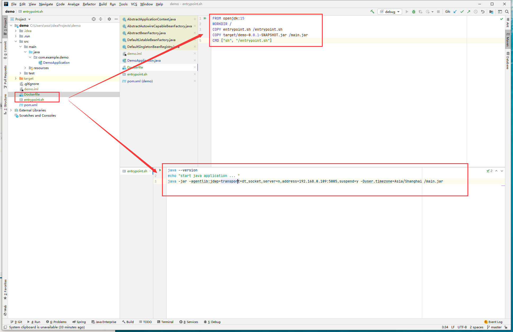

```dockerfile
FROM openjdk:15
WORKDIR /
COPY entrypoint.sh /entrypoint.sh
COPY target/demo-0.0.1-SNAPSHOT.jar /main.jar
CMD ["sh", "/entrypoint.sh"]
```

```sh
java --version
echo "start java application ... "
java -jar -agentlib:jdwp=transport=dt_socket,server=n,address=192.168.0.109:5005,suspend=y -Duser.timezone=Asia/Shanghai /main.jar
```

第五步创建Docker启动配置和Debug启动配置

**注意Dockerfile的Before lanch前加上 mvn package**

**注意Debug的Host为远程ip**

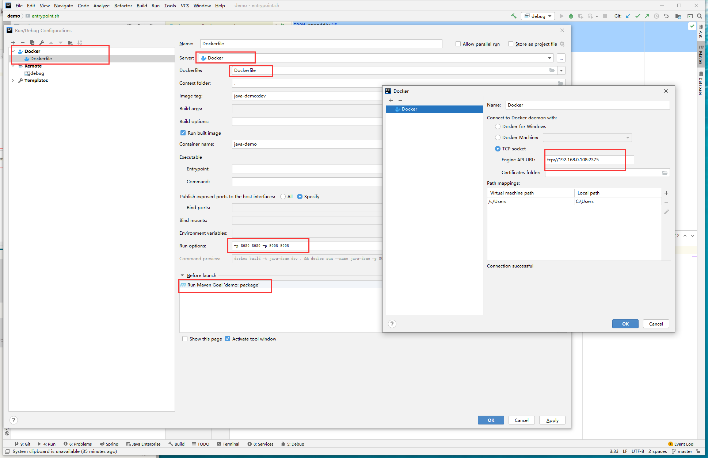

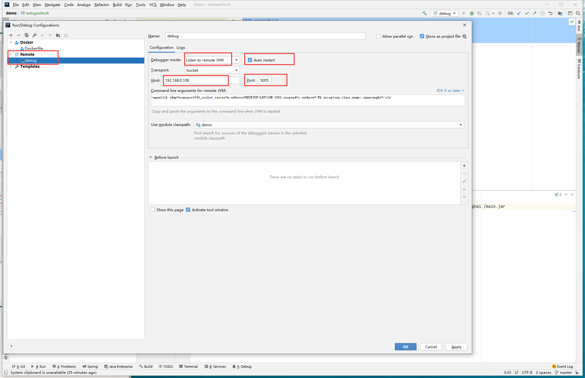

第六步先启动远程调试，后启动docker build

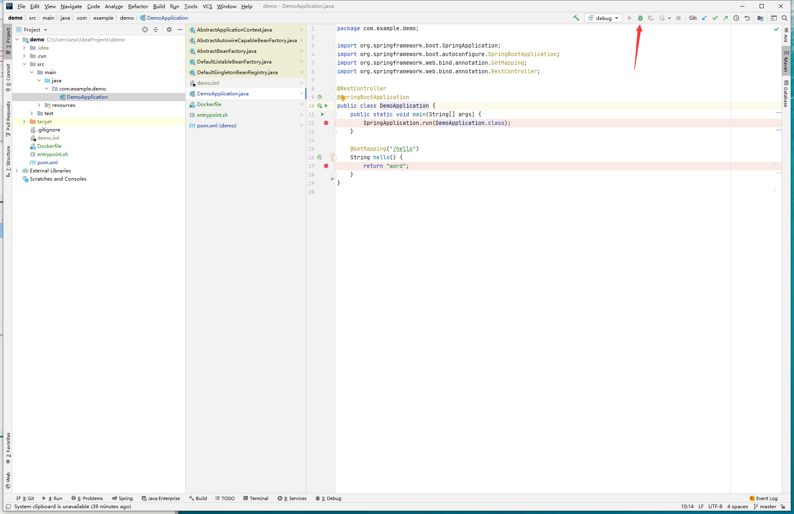

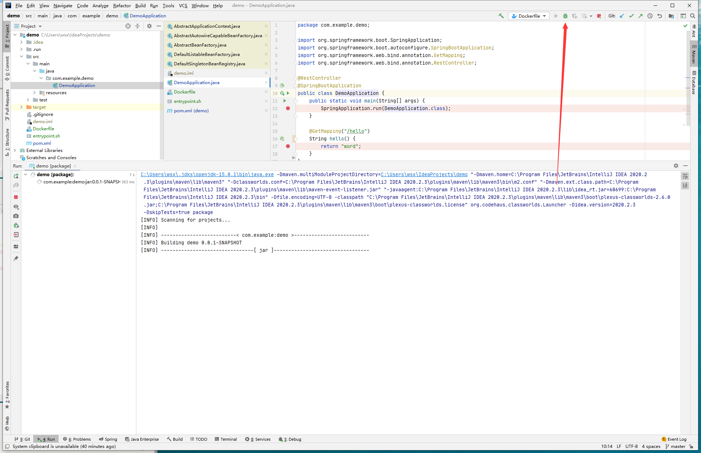

第七步： enjoy it

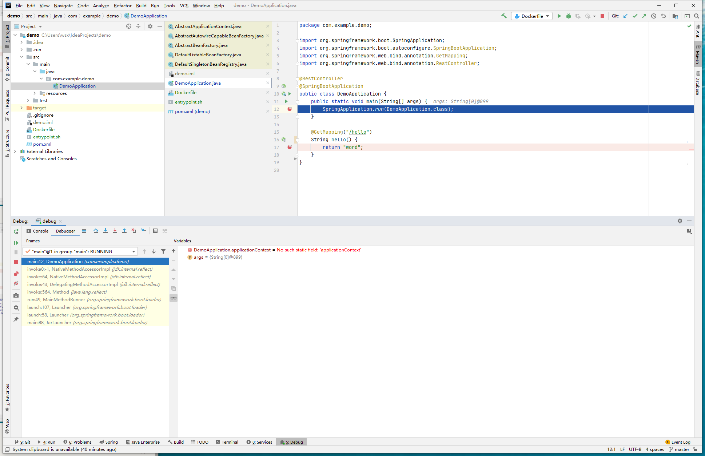

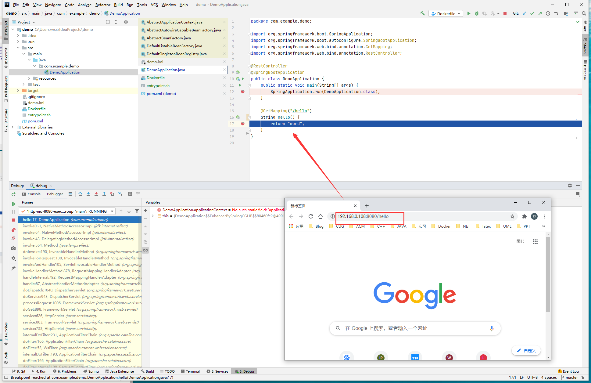