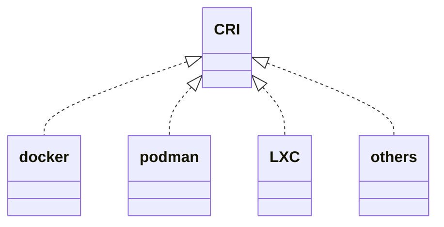

# 容器与开发语言

## 容器

随着云计算领域的兴起，容器这个词出现了，但是什么是容器？

容器英文名Container，是基于Linux Namespace以及Cgroups技术实现的具备隔离特性的一组进程。

OK，他是一组具备隔离特性的进程。


## 虚拟机

虚拟机是使用Hypervisor技术提供的虚拟化硬件的操作系统。

OK，虚拟机是一个操作系统。

<!-- more -->

## 操作系统和进程的区别

操作系统是管理软件、硬件的一组进程。

## GO

这里不做介绍（其实我只能看懂一点点Go代码，没时间学，后面有机会再出这方面的Blog吧）

# 基础技术


## Linux Namespace

Namespace即为名称空间，这是一个树状的结构，父名称空间可以看到子名称空间的所有内容，反之则不行。这类似于Spring框架的父子Beanfactory。

Linux 一个实现了6个不同的Namespace

|  Namespace 类型   | 系统调用参数  |      备注      |
| :---------------: | :-----------: | :------------: |
|  Mount Namespace  |  CLONE NEWNS  | 文件系统挂载点 |
|   UTS Namespace   | CLONE NEWUTS  |     主机名     |
|   IPC Namespace   | CLONE NEWIPC  |    进程通信    |
|   PID Namespace   | CLONE NEWPID  |     进程ID     |
| Network Namespace | CLONE NEWNET  |      网络      |
|  User Namespace   | CLONE NEWUSER |      用户      |

对于这些Namespace，Linux提供了3个系统调用。

|   API   |               备注                |
| :-----: | :-------------------------------: |
|  clone  | 创建新进程，并为其分配6个名称空间 |
| unshare |        把进程移出名称空间         |
|  setns  |        把进程加入名称空间         |


### UTS Namespace

下面是一个`main.go`文件，我们使用指令`go run main.go`

>```go
> package main
> import (
>   "os/exec"
>   "syscall"
>   "os"
>   "log"
> )
> func main () {
>   cmd := exec.Command("sh")
>   cmd.SysProcAttr = &syscall.SysProcAttr{
>     Cloneflags: syscall.CLONE_NEWUTS,
>   }
>   cmd.Stdin = os.Stdin
>   cmd.Stdout = os.Stdout
>   cmd.Stderr = os.Stderr
>   if err := cmd.Run(); err!= nil {
>     log.Fatal(err)
>   }
> }
>```
>
>
>
>取自原书第10页


然后我们发现我们进入到了一个shell命令中。

```sh
[root@VM-4-4-centos tmp]# go run main.go 
sh-4.4# 
```

接下来我们查看hostname并更改然后再次查看。

```sh
[root@VM-4-4-centos tmp]# go run main.go 
sh-4.4# hostname
VM-4-4-centos
sh-4.4# hostname
VM-4-4-centos
sh-4.4# hostname wsx
sh-4.4# hostname
wsx
sh-4.4# 
```

回到宿主机上使用指令hostname,发现宿主机的hostname并没有发生改变。

```sh
[root@VM-4-4-centos src]# hostname
VM-4-4-centos
[root@VM-4-4-centos src]# 
```

我们使用指令`ps -ef | grep $$`查看当前进程的pid为1539189， ppid为1539185。

```sh
sh-4.4# ps -ef | grep $$
root     1539189 1539185  0 15:01 pts/0    00:00:00 sh
root     1540099 1539189  0 15:05 pts/0    00:00:00 ps -ef
root     1540100 1539189  0 15:05 pts/0    00:00:00 grep 1539189
```

然后分别查看他们的ns空间, 不难发现只有uts空间不一样。

```sh
sh-4.4# ls -l /proc/$$/ns
total 0
lrwxrwxrwx 1 root root 0 Apr 16 15:08 cgroup -> 'cgroup:[4026531835]'
lrwxrwxrwx 1 root root 0 Apr 16 15:08 ipc -> 'ipc:[4026531839]'
lrwxrwxrwx 1 root root 0 Apr 16 15:08 mnt -> 'mnt:[4026531840]'
lrwxrwxrwx 1 root root 0 Apr 16 15:08 net -> 'net:[4026531992]'
lrwxrwxrwx 1 root root 0 Apr 16 15:08 pid -> 'pid:[4026531836]'
lrwxrwxrwx 1 root root 0 Apr 16 15:08 pid_for_children -> 'pid:[4026531836]'
lrwxrwxrwx 1 root root 0 Apr 16 15:08 user -> 'user:[4026531837]'
lrwxrwxrwx 1 root root 0 Apr 16 15:06 uts -> 'uts:[4026532643]'
lrwxrwxrwx 1 root root 0 Apr 16 15:07 uts -> 'uts:[4026531838]'
```

```sh
sh-4.4# ls -l /proc/1539185/ns
total 0
lrwxrwxrwx 1 root root 0 Apr 16 15:08 cgroup -> 'cgroup:[4026531835]'
lrwxrwxrwx 1 root root 0 Apr 16 15:08 ipc -> 'ipc:[4026531839]'
lrwxrwxrwx 1 root root 0 Apr 16 15:08 mnt -> 'mnt:[4026531840]'
lrwxrwxrwx 1 root root 0 Apr 16 15:08 net -> 'net:[4026531992]'
lrwxrwxrwx 1 root root 0 Apr 16 15:08 pid -> 'pid:[4026531836]'
lrwxrwxrwx 1 root root 0 Apr 16 15:08 pid_for_children -> 'pid:[4026531836]'
lrwxrwxrwx 1 root root 0 Apr 16 15:08 user -> 'user:[4026531837]'
lrwxrwxrwx 1 root root 0 Apr 16 15:07 uts -> 'uts:[4026531838]'
```

### 其他的Namespace

更多的例子可以查看原书11-19页，即可实现其他5个空间的隔离，其实只需要修改代码为下面这样即可。我们只需要使用符号 `|`就能同时开启多个资源的隔离。 

```go
  cmd.SysProcAttr = &syscall.SysProcAttr{
    Cloneflags: syscall.CLONE_NEWUTS | syscall.CLONE_NEWIPC,
  }
```


## Linux Cgroups

有了资源隔离，还差一点东西才能实现容器，那就是资源限制、控制、统计（包括CPU、Memory、IO等）。Linux Cgroups就是干这个事的。

>cgroups（Control Groups）最初叫 Process Container，由 Google 工程师（Paul Menage 和 Rohit Seth）于 2006 年提出，后来因为 Container 有多重含义容易引起误解，就在 2007 年更名为 Control Groups，并被整合进 Linux 内核。顾名思义就是把进程放到一个组里面统一加以控制。
>
>引用自： [原文链接](https://www.infoq.cn/article/docker-kernel-knowledge-cgroups-resource-isolation)

### Task

在Cgroups术语中，Task就是一个进程。

### Cgroup

即一个控制组，可以对一组进程进行配置。

### Subsystem

具体的配置子系统，例如cpu子系统可以配置Cgroup中进程被调度的策略，memory子系统可以控制Cgroup中进程的内存占用。

### Hierarchy

hierarchy把cgroup描述为一个树状结构，在这个树状结构中，Cgroups完成了继承，就和前面的Linux Namespace一样。


### 安装Cgroup库

```sh
yum install -y libcgroup-tools.x86_64
```

### 查看cgroup

我们可以看到这里有很多cgroup，冒号左边是子系统，右边是cgroup。

```sh
[root@VM-4-4-centos cpu]# lscgroup | head -n 15
cpu,cpuacct:/
cpu,cpuacct:/YunJing
cpu,cpuacct:/docker
cpu,cpuacct:/docker/de0ca6c8064d53b51a3076317c90c472b3b62e31d5110c08a9e158d4470bde2a
cpu,cpuacct:/docker/5e0cd00a0390669e38f844b1ecf56c63dc8d406d0c12d330d278ff137aafd2d2
cpu,cpuacct:/docker/29f1d2a9d2d3baaf7e108696dace633e84a75dca7182b3015d0a632d72b2f1f8
cpu,cpuacct:/docker/d97f48af25382fad8175a285dfe3c6ebc93fe28d022c534c20c35152a47e9a09
cpu,cpuacct:/docker/dfdc0ad0ca19f736e8bb70abcbdbbd75b483b9830920097566e01bb8dc83d1b6
cpu,cpuacct:/docker/28c73206d27e9bfcbca5fd9f801ff96a57cd07c5b6806f1bcf5932e4643296e1
cpu,cpuacct:/docker/9852a95cfef5ff071cb4554ea73b6699be0ab5aa08f873abe1575ef07c31c68f
cpu,cpuacct:/docker/a3845de540c9eaa8dc609b67d09fb40f262a0bc286eef8363607d4fba68dad36
cpu,cpuacct:/docker/d46d67f40ea34e5a9e0aaf9e32d0438d9fc9c0db614c2e60139971ab7917602f
cpu,cpuacct:/docker/a3fa62cd8e9ec321a708e81c0f5aa1048b636815db225e1f9b3252dd9f676913
cpu,cpuacct:/user.slice
cpu,cpuacct:/init.scope
```

### 查看子系统

下面的指令会列出所有的子系统，一般就几个子系统。

```sh
[root@VM-4-4-centos cpu]# lssubsys -a
cpuset
cpu,cpuacct
blkio
memory
devices
freezer
net_cls,net_prio
perf_event
hugetlb
pids
rdma
```

### 查看子系统挂载

```sh
[root@VM-4-4-centos src]# lssubsys -m
cpuset /sys/fs/cgroup/cpuset
cpu,cpuacct /sys/fs/cgroup/cpu,cpuacct
blkio /sys/fs/cgroup/blkio
memory /sys/fs/cgroup/memory
devices /sys/fs/cgroup/devices
freezer /sys/fs/cgroup/freezer
net_cls,net_prio /sys/fs/cgroup/net_cls,net_prio
perf_event /sys/fs/cgroup/perf_event
hugetlb /sys/fs/cgroup/hugetlb
pids /sys/fs/cgroup/pids
rdma /sys/fs/cgroup/rdma
```


### Cgroup例子

如下图所示，cgroup（粉色） 是一个树状结构，组成了一个Hierarchy（绿色），而每一个子系统（蓝色）可以分配到一个Hierarchy上。


### Cgroups三个组件的约束

>系统在创建了新的 hierarchy之后,系统中所有的进程都会加入这个 hierarchy的 cgroup根节点,这个 cgroup根节点是 hierarchy默认创建的。
>
>一个 subsystem只能附加到一个 hierarchy上面。
>
>一个 hierarchy可以附加多个 subsystem。
>
>一个进程可以作为多个 cgroup的成员,但是这些 cgroup必须在不同的 hierarchy中。
>
>一个进程fork出子进程时,子进程是和父进程在同一个 cgroup中的,也可以根据需要将其移动到其他 cgroup中。


### Cgroups 实战

我们安装下面的方式即可创建一个cgroup，这个cgroup在子系统cpu所附着的Hierarchy上。

只需要创建一个文件夹，cgroup就被创建了。

```sh
[root@VM-4-4-centos cpu]# cd /sys/fs/cgroup/cpu
[root@VM-4-4-centos cpu]# mkdir my-cpu
[root@VM-4-4-centos cpu]# cd my-cpu/
[root@VM-4-4-centos my-cpu]# ll
total 0
-rw-r--r-- 1 root root 0 Apr 17 14:32 cgroup.clone_children
-rw-r--r-- 1 root root 0 Apr 17 14:32 cgroup.procs
-r--r--r-- 1 root root 0 Apr 17 14:32 cpuacct.stat
-rw-r--r-- 1 root root 0 Apr 17 14:32 cpuacct.usage
-r--r--r-- 1 root root 0 Apr 17 14:32 cpuacct.usage_all
-r--r--r-- 1 root root 0 Apr 17 14:32 cpuacct.usage_percpu
-r--r--r-- 1 root root 0 Apr 17 14:32 cpuacct.usage_percpu_sys
...
```

接下来，我们来看两个文件

```sh
[root@VM-4-4-centos my-cpu]# cat cpu.cfs_period_us 
100000
[root@VM-4-4-centos my-cpu]# cat cpu.cfs_quota_us 
-1
```


>cfs_period_us用来配置时间周期长度，cfs_quota_us用来配置当前cgroup在设置的周期长度内所能使用的CPU时间数，两个文件配合起来设置CPU的使用上限。两个文件的单位都是微秒（us），cfs_period_us的取值范围为1毫秒（ms）到1秒（s），cfs_quota_us的取值大于1ms即可，如果cfs_quota_us的值为-1（默认值），表示不受cpu时间的限制。下面是几个例子：
>
>```txt
> 1.限制只能使用1个CPU（每250ms能使用250ms的CPU时间）
>    # echo 250000 > cpu.cfs_quota_us /* quota = 250ms */
>    # echo 250000 > cpu.cfs_period_us /* period = 250ms */
>
> 2.限制使用2个CPU（内核）（每500ms能使用1000ms的CPU时间，即使用两个内核）
>    # echo 1000000 > cpu.cfs_quota_us /* quota = 1000ms */
>    # echo 500000 > cpu.cfs_period_us /* period = 500ms */
>
> 3.限制使用1个CPU的20%（每50ms能使用10ms的CPU时间，即使用一个CPU核心的20%）
>    # echo 10000 > cpu.cfs_quota_us /* quota = 10ms */
>    # echo 50000 > cpu.cfs_period_us /* period = 50ms */
>```
>
>引用： [原文链接](https://segmentfault.com/a/1190000008323952)

紧接着我们编写一个CPU密集型的算法，计算斐波拉契数列第100000000项的最后4位数字。

```c++
#include<bits/stdc++.h>
using namespace std;

int main(){
    int n = 100000000;    
    int a[] = {0,1,1};
    for(int i=3;i<=n;i++){
        int*fib = a-i+2;
        fib[i-2] = fib[i-1];
        fib[i-1] = fib[i];
        fib[i] = (fib[i-1]+fib[i-2])%10000;
    }
    cout<<a[2]<<endl;    
}

```

我们运行他，发现大概执行了1秒钟

```sh
[root@VM-4-4-centos tmp]# g++ main.cpp -o main && time ./main
6875

real    0m1.020s
user    0m0.967s
sys     0m0.001s
```

现在我们构建一个只占用10%CPU的Cgroups，并让这个进程运行在这个Cgroups中。我们可以看到，这个进程在9.610秒内占用了0.963秒的CPU时间，这和我们希望看到的10%的CPU时间是相符合的。

```sh
[root@VM-4-4-centos tmp]# echo 10000 > /sys/fs/cgroup/cpu/my-cpu/cpu.cfs_quota_us
[root@VM-4-4-centos tmp]# echo 100000 > /sys/fs/cgroup/cpu/my-cpu/cpu.cfs_period_us 
[root@VM-4-4-centos tmp]# g++ main.cpp -o main && time cgexec -g cpu:my-cpu ./main
6875

real    0m9.610s
user    0m0.963s
sys     0m0.005s
```

类似如内存占用的实战，在[这里](https://www.cnblogs.com/sparkdev/p/8296063.html)可以看到更多


## Union File System

>联合文件系统（Union File System）：2004年由纽约州立大学石溪分校开发，它可以把多个目录(也叫分支)内容联合挂载到同一个目录下，而目录的物理位置是分开的。UnionFS允许只读和可读写目录并存，就是说可同时删除和增加内容。
>
>作者：_一叶_
>
>链接：https://www.jianshu.com/p/3ba255463047

>写时复制(copy-on-wrie,下文简称CoW),也叫隐式共享,是一种对可修改资源实现高效复制的资源管理技术。它的思想是,如果一个资源是重复的,但没有任何修改,这时并不需要立即创建一个新的资源,这个资源可以被新旧实例共享。创建新资源发生在第一次写操作,也就是对资源进行修改的时候。通过这种资源共享的方式,可以显著地减少未修改资源复制带来的消耗,但是也会在进行资源修改时增加小部分的开销。
>
>引用： 原书27页

### AUFS

 Advanced Multi-Layered Unification Filesystem 改写了UFS，提高其可靠性和性能。

#### AUFS实战

我们先创建如下目录

```sh
[root@VM-4-4-centos aufs]# tree 
.
├── container-layer
├── image-layer1
│   └── file1.txt
├── image-layer2
│   └── file2.txt
├── image-layer3
│   └── file3.txt
├── image-layer4
│   └── file4.txt
└── mnt
```

内容如下

```sh
[root@VM-4-4-centos aufs]# cat image-layer1/file1.txt 
I'm in layer1
[root@VM-4-4-centos aufs]# cat image-layer2/file2.txt 
I'm in layer2
[root@VM-4-4-centos aufs]# cat image-layer3/file3.txt 
I'm in layer3
[root@VM-4-4-centos aufs]# cat image-layer4/file4.txt 
I'm in layer4
```

开始挂载

```sh
[root@VM-4-4-centos aufs]#  sudo mount -t aufs -o dirs=container-layer:image-layer1:image-layer2:image-layer3:image-layer4 none mnt
mount: /data/src/tmp/aufs/mnt: unknown filesystem type 'aufs'.
```

[GG](https://blog.csdn.net/dmw412724/article/details/107159288) 现在的centos上的docker，使用的不是aufs，而是OverlayFS，不信你看

```sh
[root@VM-4-4-centos aufs]# df
Filesystem     1K-blocks     Used Available Use% Mounted on
devtmpfs          407188        0    407188   0% /dev
tmpfs             420616       48    420568   1% /dev/shm
tmpfs             420616     1052    419564   1% /run
tmpfs             420616        0    420616   0% /sys/fs/cgroup
/dev/vda1       25736400 21166108   3421600  87% /
overlay         25736400 21166108   3421600  87% /var/lib/docker/overlay2/665fa7b38b75b193df7995e1535782c88e9922d6097e16472ac94d254e18c850/merged
overlay         25736400 21166108   3421600  87% /var/lib/docker/overlay2/1f2ddfe4b78e83f2ba5b721d167b584187726a3fae80ce4ffcf400fa0b0ad1db/merged
overlay         25736400 21166108   3421600  87% /var/lib/docker/overlay2/d76eb09f0d9388bd10daeba94112025dd55c0b6c67cc37fd05ac6664fd4f9947/merged
overlay         25736400 21166108   3421600  87% /var/lib/docker/overlay2/9c8e0bf244fc65294eb2d4455994ca470cd48d3a7b65318d7382bf53ac611cfe/merged
overlay         25736400 21166108   3421600  87% /var/lib/docker/overlay2/0cbbbfc5ed25c5583abe765b06f367add27d0834cedea47e8e5bf12d633af1ee/merged
overlay         25736400 21166108   3421600  87% /var/lib/docker/overlay2/434275a20afd962e4dfea51329f1520fad94ea49b2b9c3d299a06cbf55423b40/merged
overlay         25736400 21166108   3421600  87% /var/lib/docker/overlay2/180399a29eeb51f456a165adf7ea52a79d1219882fc707b9988b93a8c60a2000/merged
overlay         25736400 21166108   3421600  87% /var/lib/docker/overlay2/f7afc7f62355db8f11449d0559fad921c929418b5b8fd80c6b20e7db93054546/merged
overlay         25736400 21166108   3421600  87% /var/lib/docker/overlay2/46d0b181bfd0218a5fa88f3ec0b3f55ef710fc5e8de9ebbac3dc8025c084a372/merged
overlay         25736400 21166108   3421600  87% /var/lib/docker/overlay2/4b64e9d775bdc157a476a2b7edc6a8141916e57107f2bca0bb795bd18ebe79ea/merged
tmpfs              84120        0     84120   0% /run/user/0
```

#### AUFS细节

##### 读文件

下图是一个AUFS挂载情况，当我们对/mnt处进行读取文件的时候，他会从顶层依次向下寻找，如果在layer4层找到了这个文件，则直接读取，如果找不到就递归向下寻找。


##### 写文件

写文件比较特殊，如果底层文件无法写入，则通过COW技术直接写mnt层即可。如果底层文件可读写，则直接写入底层文件。

##### 删除文件

- 文件在mnt层，下层只读，且下层无此文件，直接删除
- 文件在mnt层，下层只读，且下层有此文件，删除mnt层，然后创建一个隐藏文件.wh.{filename}表示该文件被删除
- 文件在下层读写层，直接删除。

#### 了解更多

[拓展阅读](https://arkingc.github.io/2017/04/13/2017-04-13-docker-filesystem-aufs/)

### OverlayFS

> 如下图所示，Overlay在主机上用到2个目录，这2个目录被看成是overlay的层。
> upperdir为容器层、lowerdir为镜像层使用联合挂载技术将它们挂载在同一目录(merged)下，提供统一视图
>
> 
>
> 原文:  [链接](https://docs.docker.com/storage/storagedriver/overlayfs-driver/)

#### 了解更多

[拓展阅读](https://docs.docker.com/storage/storagedriver/overlayfs-driver/)

# 构造容器

## Proc文件系统

>Linux下的proc文件系统是由内核提供的,它其实不是一个真正的文件系统只包含了系统运行时的信息(比如系统内存、 mount设备信息、一些硬件配置等),它只存在于内存中,而不占用外存空间。它以文件系统的形式,为访问内核数据的操作提供接口。实际上,很多系统工具都是简单地去读取这个文件系统的某个文件内容,比如 Ismo,其实就是cat
>proc/modules
>
>当遍历这个目录的时候,会发现很多数字,这些都是为每个进程创建的空间,数字就是它们的PID。

```sh
[root@VM-4-4-centos aufs]# ll /proc | head -n 15
total 0
dr-xr-xr-x  9 root             root         0 Apr  9 15:16 1
dr-xr-xr-x  9 root             root         0 Apr 17 16:26 10
dr-xr-xr-x  9 root             root         0 Apr 17 16:26 11
dr-xr-xr-x  9 root             root         0 Apr 17 15:57 1102
dr-xr-xr-x  9 root             root         0 Apr 17 15:57 1106
dr-xr-xr-x  9 root             root         0 Apr 17 15:57 1108
dr-xr-xr-x  9 root             root         0 Apr 17 15:57 1111
dr-xr-xr-x  9 root             root         0 Apr 17 15:57 1112
dr-xr-xr-x  9 root             root         0 Apr 17 15:57 1116
dr-xr-xr-x  9 root             root         0 Apr 17 15:57 1135
dr-xr-xr-x  9 root             root         0 Apr 17 15:57 1136
dr-xr-xr-x  9 root             root         0 Apr 17 16:26 12
dr-xr-xr-x  9 root             root         0 Apr 17 16:26 13
dr-xr-xr-x  9 root             root         0 Apr 17 16:17 1411993
```


目录结构

| 目录            | 备注                                 |
| --------------- | ------------------------------------ |
| /proc/N         | PID为N的进程信息                     |
| /proc/N/cmdline | 进程启动命令                         |
| /proc/N/cwd     | 链接到进程当前工作目录               |
| /proc/N/environ | 进程环境变量列表                     |
| /proc/N/exe     | 链接到进程的执行命令文件             |
| /proc/N/fd      | 包含进程相关的所有文件描述符         |
| /proc/N/maps    | 与进程相关的内存映射信息             |
| /proc/N/mem     | 指代进程持有的内存,不可读            |
| /proc/N/root    | 链接到进程的根目录                   |
| /proc/N/stat    | 进程的状态                           |
| /proc/N/statm   | 进程使用的内存状态                   |
| /proc/N/status  | 进程状态信息,比stat/ statm更具可读性 |
| /proc/self/     | 链接到当前正在运行的进程             |


## 有Go我不用

就用C++，哎，就是玩。

## 3.1版本

[项目地址](https://github1s.com/fightinggg/pocker/tree/3.1)

直接看`main.cpp`中的主函数, 首先是解析参数，然后使用clone 系统调用制造一个进程。

```c++

int main(int argc, char *argv[]) {
    Param *param = ParamParse::parse(argc, argv);

    void *stack = malloc(FIBER_STACK);//为子进程申请系统堆栈


    int containerFlag = SIGCHLD | CLONE_NEWUTS | CLONE_NEWPID
                        | CLONE_NEWNS | CLONE_NEWNET | CLONE_NEWIPC | CLONE_NEWUSER;
    int pid = clone(doContainer, (char *) stack + FIBER_STACK, containerFlag, param);//创建子线程
    waitpid(pid, NULL, 0);
    cout << "parent exit " << endl;
}

```


然后看`main.cpp`的子进程， 这里挂在proc目录是为了隔离，然后由于我们并没有编写镜像，所以我们mock了一个只支持centos的镜像。紧接着就是子进程调用exec替换掉自己的代码。

```c++
int doContainer(void *param) {
    auto *runParam = (RunParam *) param;

    if (mount("proc", "/proc", "proc", MS_NOEXEC | MS_NOSUID | MS_NODEV, NULL)) {
        cerr << "mount proc error" << endl;
        exit(-1);
    }
    if (runParam->getImage() == "centos") {
        vector<string> v = runParam->getExec();

        switch (v.size()) {
            case 1:
                execlp(v[0].data(), nullptr);
                break;
            case 2:
                execlp(v[0].data(), v[1].data(), NULL);
                break;
            case 3:
                execlp(v[0].data(), v[1].data(), v[2].data(), NULL);
                break;
            case 4:
                execlp(v[0].data(), v[1].data(), v[2].data(), v[3].data(), NULL);
                break;
            default:
                cerr << "too many params, only four params support" << endl;
                exit(0);
        }
        cerr << "exec error: " << endl;
        exit(-1);
    } else {
        cerr << "could not find image '" << runParam->getImage() << "'" << endl;
        exit(-1);
    }
}

```


### 编译运行3.1

```sh
mkdir build
cd build
cmake ..
make
```

```sh
[root@wsx pocker]# mkdir build
[root@wsx pocker]# cd build
[root@wsx build]# cmake ..
-- The C compiler identification is GNU 8.3.1
-- The CXX compiler identification is GNU 8.3.1
-- Check for working C compiler: /usr/bin/cc
-- Check for working C compiler: /usr/bin/cc -- works
-- Detecting C compiler ABI info
-- Detecting C compiler ABI info - done
-- Detecting C compile features
-- Detecting C compile features - done
-- Check for working CXX compiler: /usr/bin/c++
-- Check for working CXX compiler: /usr/bin/c++ -- works
-- Detecting CXX compiler ABI info
-- Detecting CXX compiler ABI info - done
-- Detecting CXX compile features
-- Detecting CXX compile features - done
-- Configuring done
-- Generating done
-- Build files have been written to: /data/src/pocker/build
[root@wsx build]# make
Scanning dependencies of target pocker
[ 25%] Building CXX object CMakeFiles/pocker.dir/src/param/parse/ParamParse.cpp.o
[ 50%] Building CXX object CMakeFiles/pocker.dir/src/param/parse/RunParamParse.cpp.o
[ 75%] Building CXX object CMakeFiles/pocker.dir/src/main.cpp.o
[100%] Linking CXX executable pocker
[100%] Built target pocker
```

默认的提示

```sh
[root@wsx build]# ./pocker 
please run:
      ./pocker run --help
```

`pocker run`的提示

```sh
[root@wsx build]# ./pocker run --help
usage: ./pocker [options] ... image...
options:
  -i, --interactive    interactive
  -t, --tty            tty
  -d, --detach         detach
  -?, --help           print this message
```

调用ls指令

```sh
[root@wsx build]# ./pocker run -it centos ls .
CMakeCache.txt  CMakeFiles  cmake_install.cmake  Makefile  pocker
parent exit 
```

调用ps指令

```sh
[root@wsx build]# ./pocker run -it centos ps aux
    PID TTY          TIME CMD
      1 pts/0    00:00:00 ps
parent exit 
```

调用bash指令

```sh
[root@wsx build]# ./pocker run -it centos bash
[nobody@wsx build]$ ps -ef
UID          PID    PPID  C STIME TTY          TIME CMD
nobody         1       0  0 02:38 pts/0    00:00:00 [bash]
nobody        22       1  0 02:38 pts/0    00:00:00 ps -ef
[nobody@wsx build]$ exit
exit
parent exit 
```


### pocker3.1 in docker

笔者还为大家准备了一份开箱即用的3.1版本。大家可以一起来学习。

```sh
s@s ~ % docker run  --privileged  -it --rm 1144560553/pocker:3.1 bash 
Unable to find image '1144560553/pocker:3.1' locally
3.1: Pulling from 1144560553/pocker
7a0437f04f83: Already exists 
4bbae049836d: Pull complete 
Digest: sha256:8340325bed1f0c26a1a24f0052e03fd06cb873d47a1b5d750f827d2ad4691b9e
Status: Downloaded newer image for 1144560553/pocker:3.1
[root@ed07427b0ebd /]# pocker 
please run:
      pocker run --help
[root@ed07427b0ebd /]# pocker run --help
usage: pocker [options] ... image...
options:
  -i, --interactive    interactive
  -t, --tty            tty
  -d, --detach         detach
  -?, --help           print this message
[root@ed07427b0ebd /]# pocker run -it centos ps ef
  PID TTY          TIME CMD
    1 pts/0    00:00:00 ps
parent exit 
[root@ed07427b0ebd /]# pocker run -it centos ls . 
bin  dev  etc  home  lib  lib64  lost+found  media  mnt  opt  proc
root  run  sbin  srv  sys  tmp  usr  var
parent exit 
[root@ed07427b0ebd /]# pocker run -it centos bash
[nobody@ed07427b0ebd /]$ ps -ef
UID        PID  PPID  C STIME TTY          TIME CMD
nobody       1     0  0 07:24 pts/0    00:00:00 [bash]
nobody      14     1  0 07:24 pts/0    00:00:00 ps -ef
[nobody@ed07427b0ebd /]$ exit
exit
parent exit 
[root@ed07427b0ebd /]# exit
exit
```


## 3.2-cpu版本

这个版本笔者主要增加了一些cpu的限制，先看main.cpp中多了一个函数，这个函数是在容器启动前就已经调用了的，目的就是创建CPU子系统，我们可以看到这里主要使用了system系统调用，在目录`/sys/fs/cgroup/cpu`下用容器的id为文件夹名字创建了一个cpu子系统，在其中修改cfs_quota_us和cfs_period_us来解决cpu资源的问题。具体可见[Cgroups 实战](#Cgroups 实战)。

```c++
void prepareContainer(RunParam *runParam) {
    // create cpu subsystem
    char cmd[128];
    string cmdList[] = {
            "cd /sys/fs/cgroup/cpu ",
            "&& mkdir %s ",
            "&& cd %s ",
            "&& echo %d > cpu.cfs_quota_us ",
            "&& echo 50000 > cpu.cfs_period_us "
    };
    string cmdOrigin;
    for (string &s:cmdList) {
        cmdOrigin += s;
    }
    sprintf(cmd, cmdOrigin.data(),
            runParam->getContainerId().data(),
            runParam->getContainerId().data(),
            int(runParam->getCpus() * 50000)
    );
    system(cmd);
}
```

然后就是在容器启动后增加了下面这一段代码, 依然使用系统调用system，把容器所在的进程ID加入到tasks文件中，其目的就是让当前进程加入cpu子系统，来限制cpu的使用率。然后为了测试cpu子系统的有效性，笔者还在其中加了一个0到1e9的for循环来完成一个计算密集型任务。pocker会输出这个任务所占用的时间（单位为秒）。

```c++
    // add cpu subsystem
    char cmd[128];
    sprintf(cmd, "echo %d >> /sys/fs/cgroup/cpu/%s/tasks",
            getpid(), runParam->getContainerId().data());
    system(cmd);

    int cur = time(0);
    int a = 1;
    for (int i = 0; i < 1e9; i++) {
        a += i;
    }
    cout << a << endl;
    cout << "cost: " << time(0) - cur << endl;
```

当然笔者依然准备了一份开箱即用的docker版本，大家可以自行尝试。下面是笔者测试的结果。 我们可以看到当cpus取值为0.5的时候，花费了7秒，当取值为0.25的时候，花费了18秒。

```bash
s@s ~ % docker run  --privileged  -it --rm 1144560553/pocker:3.2-cpu bash
Unable to find image '1144560553/pocker:3.2-cpu' locally
3.2-cpu: Pulling from 1144560553/pocker
7a0437f04f83: Pull complete 
cc5cd42589c1: Pull complete 
Digest: sha256:01ac27156f599acfa588a51301455b92eca7c4963b0e6c6ab943d66f4c5cb06f
Status: Downloaded newer image for 1144560553/pocker:3.2-cpu
[root@37ab95d1bfdb /]# pocker
please run:
      pocker run --help
[root@37ab95d1bfdb /]# pocker run -idt --memory 50m --cpus 0.5 --memory-swap 1024m centos ps ef
RunParam:: tty: 1, interactive: 1, detach: 1, memory: 50, memorySwap: 1024, cpus: 0.500000, image: centos,containerId: 205b8eaf-76a3-474f-9a3f-4d5a9e5b64ad,containerName: 
-1243309311
cost: 7
  PID TTY          TIME CMD
    1 pts/0    00:00:03 ps
parent exit 
[root@37ab95d1bfdb /]# pocker run -idt --memory 50m --cpus 0.25 --memory-swap 1024m centos ps ef
RunParam:: tty: 1, interactive: 1, detach: 1, memory: 50, memorySwap: 1024, cpus: 0.250000, image: centos,containerId: 322904df-a8b0-46c4-b7c2-ec3e6ea66f17,containerName: 
-1243309311
cost: 18
  PID TTY          TIME CMD
    1 pts/0    00:00:04 ps
parent exit 
```


## 3.2-mem版本

新增的主要部分还是在main.cpp中，这个部分完成了内存子系统，这里直接看到，我们在位置`/sys/fs/cgroup/memory`新建了一个文件夹，并限制了内存和交换内存的大小，注意到一旦进程发生了内存溢出，默认将会被kill

```c++
  // create memory subsystem
  cmdList = {"cd /sys/fs/cgroup/memory ", "&& mkdir %s ",
                            "&& cd %s ", "&& echo %d > memory.limit_in_bytes ",
                            "&& echo %d > memory.memsw.limit_in_bytes "};
  sprintf(cmd, StringUtils::join(cmdList).data(),
          runParam->getContainerId().data(), runParam->getContainerId().data(),
          int(runParam->getMemory()), int(runParam->getMemorySwap()));
  system(cmd);
```

笔者还是准备了一份开箱即用的docker版本(以后的docker版本都将直接转移到账号fightinggg下，而不是1144560553)，大家可以直接尝试。

这里首先使用docker创建了一个pocker，然后使用pocker创建了一个内存空间10mb的容器，最后在容器中使用大量的内存，之后发现这个容器被Killed。

```sh
s@s ~ % docker run  --privileged  -it --rm fightinggg/pocker:3.2-mem bash
[root@6b67dbf3b43e /]# pocker run -itd -m 10m --memory-swap 10m centos bash
RunParam:: tty: 1, interactive: 1, detach: 1, memory: 10485760, memorySwap: 10485760, cpus: 1.000000, image: centos,containerId: 2b90e451-8d10-4efc-b105-42000930b51d,containerName: 
[nobody@6b67dbf3b43e /]$ bash -c "arr=(1 2 3); for((i=1;i<=1000000;i++));  do arr[i]=i; done; echo ${arr[@]}"
Killed
[nobody@6b67dbf3b43e /]$ exit
exit
container exit, thanks for using pocker 
[root@6b67dbf3b43e /]# 
```


# 构造镜像

## 4.1-busybox版本

这个版本中，我们实现了容器根目录的隔离，首先从docker容器中导出busybox的文件系统，然后将其挂载到pocker所构造的容器中，主要代码在[main.cpp](https://github.com/fightinggg/pocker/commit/1d55e7326b1cb902ee8d9160f8e6c3ec354cde54#diff-34d21af3c614ea3cee120df276c9c4ae95053830d7f1d3deaf009a4625409ad2)中，这里增加了系统调用`SYS_pivot_root`，把busybox的文件系统挂在到当前根目录，然后卸载旧的根目录。

```c++
// mount busyBox 1. change workdir
  if (chdir(busyBoxDir.data())) {
    cerr << "chdir to busyBoxDir error" << endl;
    exit(-1);
  }
  // mount busyBox 2. mount busyBox
  if (mount(busyBoxDir.data(), busyBoxDir.data(), "bind", MS_BIND | MS_REC,
            NULL)) {
    cerr << "mount busyBox error" << endl;
    exit(-1);
  }
  String privotRootName = ".pivot_root" + runParam->getContainerId();
  String privotRoot = busyBoxDir + "/" + privotRootName;
  // mount busyBox 3. mkdir put_old
  if (mkdir(privotRoot.data(), S_IRWXU | S_IRWXG | S_IRWXO)) {
    cerr << "mkdir privotRoot error" << endl;
    exit(-1);
  }
  // mount busyBox 4. privot_root()
  if (syscall(SYS_pivot_root, busyBoxDir.data(), privotRoot.data())) {
    cerr << "privot_root error" << endl;
    exit(-1);
  }
  // mount busyBox 5. to dir /
  if (chdir("/")) {
    cerr << "chdir to / error" << endl;
    exit(-1);
  }
  // mount busyBox 6. unmount .privot_root
  if (umount2(("/" + privotRootName).data(), MNT_DETACH)) {
    cerr << "unmount .pivot_root  error " << getErr() << endl;
    exit(-1);
  }
  // mount busyBox 7. delete dir
  if (rmdir(("/" + privotRootName).data())) {
    cerr << "rm .pivot_root  error " << getErr() << endl;
    exit(-1);
  }
```


笔者还是准备了一个docker版本，可以看到这时候使用ls，已经能发现根目录下的文件系统发生了变化。

```sh
s@s hexo-blog % docker run -it --rm --privileged fightinggg/pocker:4.1-busybox  
[root@2d2a5c1bcd01 /]# pocker run -it busybox sh
RunParam:: tty: 1, interactive: 1, detach: 0, memory: 10485760, memorySwap: 10485760, cpus: 1.000000, image: busybox,containerId: 0ee090e5-9829-4140-bfd1-48982952f4e0,containerName: 
container begin: sh
/ # ps ef
PID   USER     TIME  COMMAND
    1 root      0:00 sh
    4 root      0:00 ps ef
/ # ls -a
.           ..          .dockerenv  bin         dev         etc         home        proc        root        sys         tmp         usr         var
/ # df
Filesystem           1K-blocks      Used Available Use% Mounted on
overlay               16447356   7816736   7775428  50% /
/ # exit
container exited, status=0,  thanks for using pocker
[root@2d2a5c1bcd01 /]# exit
exit
s@s hexo-blog % 
```


## 4.2-overlay版本

这部分笔者并没有选择和原书中一样的aufs文件系统，而是使用了overlay文件系统，哎就是玩。主要的修改还是在`main.cpp`中。

大概是先创建一个disk.img文件，然后将其挂载到目录disk下，在disk目录下创建三个文件夹，upper、tmp和overlay，最后使用overlay文件系统以busybox为lower构造出一个两层文件系统。

这里有一个很重要的点，为什么要挂载disk.img，首先注意到一个事实，docker默认使用overlay文件系统来构造容器，所以我们下面这个程序是有可能运行在overlay文件系统下的。

overlay文件系统挂载时对upper有一定的要求，这导致了overlay文件系统没办法做为upper层挂载在另一个overlay文件系统下。

所以我们必须虚拟一个文件系统。

挂载流程和代码都在下面


```c++

  String containerDataDir = containerDir + "/" + runParam->getContainerId();
  if (mkdir(containerDataDir.data(), 0777)) {
    cerr << " mkdir " << containerDataDir << " error" << endl;
    exit(-1);
  }

  String diskFile = containerDataDir + "/disk.img";
  String containerDisk = containerDataDir + "/disk";

  // create container disk 1. create disk
  sprintf(cmd, "dd if=/dev/zero bs=1M count=20 of=%s", diskFile.data());
  system(cmd);

  // 2. init file system
  if (system(("mkfs.ext4 " + diskFile).data())) {
    cerr << "mkfs error " << diskFile << endl;
    exit(-1);
  }

  mkdir(containerDisk.data(), 0777);

  // 3. mount container disk system
  sprintf(cmd, "mount %s %s", diskFile.data(), containerDisk.data());
  printf("mount upper: %s\n", cmd);
  if (system(cmd)) {
    cerr << "mount " << diskFile << " error" << endl;
    exit(-1);
  }

  String containerUpper = containerDisk + "/upper";
  String containerTmp = containerDisk + "/tmp";
  String containerMerge = containerDisk + "/overlay";

  mkdir(containerUpper.data(), 0777);
  mkdir(containerTmp.data(), 0777);
  mkdir(containerMerge.data(), 0777);

  // system(("ls -al " + containerDisk).data());

  // 4. build overlay
  sprintf(cmd,
          "mount -t overlay overlay "
          "-olowerdir=%s,upperdir=%s,workdir=%s %s",
          busyBoxDir.data(), containerUpper.data(), containerTmp.data(),
          containerMerge.data());
  printf("do: %s\n", cmd);
  if (system(cmd)) {
    cerr << "build overlay error " << getErr() << endl;
    exit(-1);
  }
```

笔者依旧准备了一份开箱即用的docker版本。如下。首先演示了在第一个容器中创建文件abc，然后退出容器，接着在第二个进入第二个容器，查看目录，是看不到文件abc的。

```c++
s@s pocker % docker run -it --rm --privileged fightinggg/pocker:4.2-overlay bash
Unable to find image 'fightinggg/pocker:4.2-overlay' locally
4.2-overlay: Pulling from fightinggg/pocker
7a0437f04f83: Already exists 
00386041dce7: Pull complete 
7b2a7c3db2a0: Pull complete 
eeb1e29037fb: Pull complete 
74f885815b4e: Pull complete 
Digest: sha256:300f607e39217465a547593fda5c93c2a4d20e133dab82a519127bec66976b1e
Status: Downloaded newer image for fightinggg/pocker:4.2-overlay
[root@e070166a0ba7 /]# pocker run -it busybox sh
RunParam:: tty: 1, interactive: 1, detach: 0, memory: 10485760, memorySwap: 10485760, cpus: 1.000000, image: busybox,containerId: f5212791-e818-4fe2-b040-e7f779473e23,containerName: 
20+0 records in
20+0 records out
20971520 bytes (21 MB, 20 MiB) copied, 0.0562303 s, 373 MB/s
mke2fs 1.45.6 (20-Mar-2020)
Discarding device blocks: done                            
Creating filesystem with 20480 1k blocks and 5136 inodes
Filesystem UUID: 61b1d479-fca0-41b0-86be-5d9c3c501714
Superblock backups stored on blocks: 
	8193

Allocating group tables: done                            
Writing inode tables: done                            
Creating journal (1024 blocks): done
Writing superblocks and filesystem accounting information: done

mount upper: mount /usr/local/pocker/data/containers/f5212791-e818-4fe2-b040-e7f779473e23/disk.img /usr/local/pocker/data/containers/f5212791-e818-4fe2-b040-e7f779473e23/disk
do: mount -t overlay overlay -olowerdir=/usr/local/pocker/data/images/busybox,upperdir=/usr/local/pocker/data/containers/f5212791-e818-4fe2-b040-e7f779473e23/disk/upper,workdir=/usr/local/pocker/data/containers/f5212791-e818-4fe2-b040-e7f779473e23/disk/tmp /usr/local/pocker/data/containers/f5212791-e818-4fe2-b040-e7f779473e23/disk/overlay
container begin: sh
/ # ls
bin   dev   etc   home  proc  root  sys   tmp   usr   var
/ # mkdir abc
/ # ls
abc   bin   dev   etc   home  proc  root  sys   tmp   usr   var
/ # exit
container exited, status=0,  thanks for using pocker
[root@e070166a0ba7 /]# pocker run -it busybox sh
RunParam:: tty: 1, interactive: 1, detach: 0, memory: 10485760, memorySwap: 10485760, cpus: 1.000000, image: busybox,containerId: 276d1b7b-72de-4538-8b39-fbfb469ae930,containerName: 
20+0 records in
20+0 records out
20971520 bytes (21 MB, 20 MiB) copied, 0.0629004 s, 333 MB/s
mke2fs 1.45.6 (20-Mar-2020)
Discarding device blocks: done                            
Creating filesystem with 20480 1k blocks and 5136 inodes
Filesystem UUID: 4231f410-3e32-4486-9d09-2de705563eb8
Superblock backups stored on blocks: 
	8193

Allocating group tables: done                            
Writing inode tables: done                            
Creating journal (1024 blocks): done
Writing superblocks and filesystem accounting information: done

mount upper: mount /usr/local/pocker/data/containers/276d1b7b-72de-4538-8b39-fbfb469ae930/disk.img /usr/local/pocker/data/containers/276d1b7b-72de-4538-8b39-fbfb469ae930/disk
do: mount -t overlay overlay -olowerdir=/usr/local/pocker/data/images/busybox,upperdir=/usr/local/pocker/data/containers/276d1b7b-72de-4538-8b39-fbfb469ae930/disk/upper,workdir=/usr/local/pocker/data/containers/276d1b7b-72de-4538-8b39-fbfb469ae930/disk/tmp /usr/local/pocker/data/containers/276d1b7b-72de-4538-8b39-fbfb469ae930/disk/overlay
container begin: sh
/ # ls
bin   dev   etc   home  proc  root  sys   tmp   usr   var
/ # exit
container exited, status=0,  thanks for using pocker
[root@e070166a0ba7 /]# exit
exit
s@s pocker % 

```


## 4.3-volumes版本

今天去拍毕业照了，累了一整天，哎，真累，无聊中得到了两个点：

- 仔细想了想，4.2中让pocker去适配操作系统的文件系统，有点不太合理，我觉得应该pocker还是不应该管操作系统的文件系统是哪个具体的类型，让用户自己去挂载ext4就可以了，没必要在程序中搞。
- Java代码写C++真是shit到家了，我全给他改成了下划线命名。

然后步入正题，在4.2版本中我们注意到换根以后，卸载privot以前，可以做一些文件映射，于是笔者直接使用mount指令将其挂载，实现了容器数据的持久化，但是由于笔者使用的命令行框架似乎不支持数组格式的flag，所以目前只能映射一个目录。这个以后应该会修复，新增代码如下，非常简单。

```c++
void pre_umount_privot(run_param *arg_run_param, string privot_root_name) {
  if (!arg_run_param->volumes.empty()) {
    auto v = arg_run_param->volumes[0];
    string src = "/" + privot_root_name + "/" + v.from;
    system(("mkdir -p " + v.to).data());
    if (mount(src.data(), v.to.data(), NULL, MS_BIND, NULL)) {
      cerr << "mount " << v.from << " to " << v.to << " failed" << getErr()
           << endl;
      exit(-1);
    }
  }
}
```


当然笔者还是准备了一个非常nice的docker版本，专门给懒人用的，下面是例子。

```sh
s@s ~ % docker run -it --rm --privileged fightinggg/pocker:4.3-volumes 
Unable to find image 'fightinggg/pocker:4.3-volumes' locally
4.3-volumes: Pulling from fightinggg/pocker
7a0437f04f83: Already exists 
00386041dce7: Already exists 
06435815e90c: Pull complete 
7e9a89da8fed: Pull complete 
16d9b87459ec: Pull complete 
Digest: sha256:f6314e114d6bd6bed21c6749c38b4636d1db51b22f8ab575bbdf72ccd8307dd2
Status: Downloaded newer image for fightinggg/pocker:4.3-volumes
[root@1e558fec41d2 /]# pocker run -it -v /:/hostdir/root busybox sh
run_param:: tty: 1, interactive: 1, detach: 0, memory: 10485760, memory_swap: 10485760, cpus: 1.000000, image: busybox,volumes: [ (from: /, to: /hostdir/root)]id: 744a37f3-a390-4faf-8fbb-3baa43b62988,name: 
20+0 records in
20+0 records out
20971520 bytes (21 MB, 20 MiB) copied, 0.0395407 s, 530 MB/s
mke2fs 1.45.6 (20-Mar-2020)
Discarding device blocks: done                            
Creating filesystem with 20480 1k blocks and 5136 inodes
Filesystem UUID: d46262a1-0cc4-46a0-ac1b-1fd908c8fa28
Superblock backups stored on blocks: 
	8193

Allocating group tables: done                            
Writing inode tables: done                            
Creating journal (1024 blocks): done
Writing superblocks and filesystem accounting information: done

mount upper: mount /usr/local/pocker/data/containers/744a37f3-a390-4faf-8fbb-3baa43b62988/disk.img /usr/local/pocker/data/containers/744a37f3-a390-4faf-8fbb-3baa43b62988/disk
do: mount -t overlay overlay -olowerdir=/usr/local/pocker/data/images/busybox,upperdir=/usr/local/pocker/data/containers/744a37f3-a390-4faf-8fbb-3baa43b62988/disk/upper,workdir=/usr/local/pocker/data/containers/744a37f3-a390-4faf-8fbb-3baa43b62988/disk/tmp /usr/local/pocker/data/containers/744a37f3-a390-4faf-8fbb-3baa43b62988/disk/overlay
container begin: sh
/ # ls
bin      dev      etc      home     hostdir  proc     root     sys      tmp      usr      var
/ # cd hostdir
/hostdir # ls
root
/hostdir # cd root
/hostdir/root # ls
bin         etc         lib         lost+found  mnt         proc        run         srv         tmp         var
dev         home        lib64       media       opt         root        sbin        sys         usr
/hostdir/root # mkdir containerCreateDir
/hostdir/root # exit
container exited, status=0,  thanks for using pocker
[root@1e558fec41d2 /]# ls
bin  containerCreateDir  dev  etc  home  lib  lib64  lost+found  media	mnt  opt  proc	root  run  sbin  srv  sys  tmp	usr  var
[root@1e558fec41d2 /]# 
```


# 容器进阶

笔者不准备实现这部分代码了。

5.1实现后台运行只需要将容器变为守护进程，让init收管即可

5.2实现查看运行中的容器是crud，把本地json文件当做了数据库

5.3实现查看容器日志只需要重定向容器的输出到文件中即可

5.4实现进入容器还是有点意思的，需要使用系统调用setns进入和容器相同的名称空间即可

5.5停止容器实际上只是发了一个kill信号

5.6删除容器清理一下就好了

5.7通过容器制作镜像只需要提前保留容器的upper文件系统，之后自己合并即可

5.8配置环境变量也只需要简简单单的在宿主进程进入容器时配置即可

# 容器网络

这部分过于偏向于计算机网络，对于这部分，笔者后面会专门出一篇Blog进行介绍。

这部分代码笔者也不准备实现。关于容器网络部分，笔者第一次接触到是在《Kubernetes权威指南：从Docker到Kubernetes实践全接触》（第2版）-2016.10-电工-P519-龚正，吴治辉，王伟 等 的第三章第七节网络原理中，这两本书的这两个地方中有很多重复的地方。

至此，笔者的Pocker项目也将会告一段落了。

# 高级实践

这部分介绍一些名词，希望可以体会到其中的设计理念。

## OCI

Open Container Initiative 是一个组织，是Linux基金会在2015年成立的，是一个定义容器标准的组织。

## runC

runC是一个容器引擎，他主要用于构造、运行容器。

> runC是个轻量级的容器运行引擎， 包括所有 Docker 使用的和容器相关的系统调用的代码。
>
> runC的目标就是去构造到处都可以运行的标准容器。
>
> 引用： 原书177页

runC的流程和pocker的流程是比较类似的，pocker只是个小demo，毕竟全部加起来也就几百行代码，他没有使用任何设计模式。

>代码读到这里,应该可以大概理解runC创建容器的整个过程了,如下
>
>1.读取配置文件。
>
>2.设置 rootfilesystem
>
>3.使用 factory创建容器,各个系统平台均有不同实现。
>
>4.创建容器的初始化进程 process
>
>5.设置容器的输出管道,主要是Go的 pipes
>
>6.执行 Container. Start)启动物理的容器
>
>7.回调init方法重新初始化容器进程。
>
>runC父进程等待子进程初始化成功后退出。
>
>可以看到,具体的执行流程涉及3个概念: process、 container、 factory。 factory用来创建容器, process 负责进程之间的通信和启动容器
>
>引用： 原书185页

## Containerd

containerd是一个守护进程，专注于容器的生命周期管理，方便容器编排。当然containerd只是docker的一部分，他不负责镜像的构造。

>每个 contained只负责一台机器,Pul镜像、对容器的操作(启动、停止等)、网络、存储都
>是由 container完成的。具体运行容器由runC负责。


## CRI容器引擎

CRI是 Container Runtime Interface ，即容器运行时，众所周知，容器不只docker这一个软件支持，还有很多其他的支持容器的软件，k8s是负责容器编排的，k8s定义了一套CRI标准，只要你的容器支持CRI，那么k8s就可以帮助你管理他。




