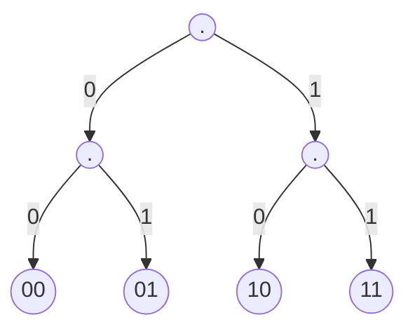
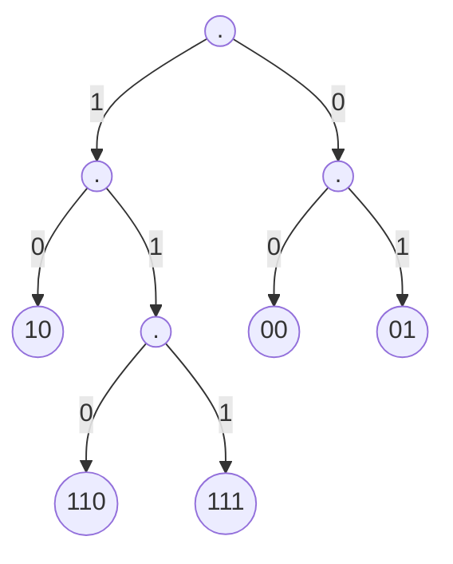

# 帧
 就是一串数字

## 字节计数
 每一帧的第一个数字记录了这一帧的长度,很辣鸡，错位就凉凉

## 字节填充
 前后加上特殊flag，就像字符串的写法一样，如abc"abc就写成了"abc\"abc",这样做导致flag要转码。
<!---more-->
## 位填充
 flag为6个连续的1，发送数据的时候五个连续的1后插入一个0，原理是什么?
 编码？下图是一个正常的编码。他只能识别00，01，10，11

 这样改进一下呢?（我太菜了mermaid用不好，第一层的1居然在左边)

 然后就能识别00，01，10，110，111,我们让111作文分割符，110表示11即可。
 为了能让这个更加棒，我们可以把树的高度弄大一点。这里我就不画了。

# 如何侦错
 搞两个拷贝，不同即错。太low了
 搞hash check sum，这个很棒
 internet校验和 定义函数f(x) = x>=n?f(x%n+x/n):x，n为一个二的幂， check = n-f(sum)-1, 验证： f(check+sum)=n-1，这个是显然的
 循环冗余校验 这个就是使用多项式在系数膜2的剩余体系下的除法运算，将得到的模数添加到最后面用于侦错。

# 如何纠错
 汉明码 通常使用二的幂-1对齐，如果我们放入k个检验位，则在最多出现一个错误的情况下可以保护2^k-1个位，为什么？二分！我们讲检验位放在1，2，4，8...等地方，然后使用二进制分类的方式对整个序列进行异或即可。解码的时候重新计算检验位，本质上就是在二分。得到的值位0，表示无错误，否则翻转后的位就是错误位。
 卷积码。

# 侦错还是纠错？
 需要根据错误率来选择

# 多路复用
 时分和频分

