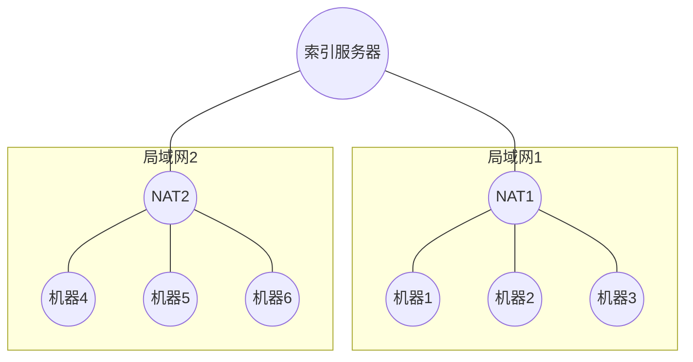

# 问题提出
最近在我的世界群里面看到他们谈论游戏的时候，谈到了服务器上面，他们一谈服务器就是192.168.xxx.xxx, 这就让我很困惑，这不是局域网IP吗，你们是怎么玩到一起去的？
# 内网穿透
就是一种技术，他可以让不同的局域网中的机器通过互联网互联
<!-- more -->
# 前置知识
- IP:网络中的逻辑地址
- 域名: IP的别名
- DNS服务器: 将域名转化为IP的服务器
- DDNS服务器: 将域名转化为动态IP的服务器
- NAT: 通过端口映射，让局域网中的多台机器共享一个IP的技术
- 正向Proxy: 你翻墙的时候，有一个服务器拦截你的请求，替你发给其他人 
- 反向Proxy: 服务器集群被访问的时候，请求被拦截，然后被分发

# 内网穿透要解决的问题
NAT就实现了局域网中的机器与外网中的机器通信的问题，但是通信只能由局域网内部发起
# 解决他
我们在两个NAT之间构造一个索引服务器，用心跳机制让局域网内部IP在索引服务器上注册端口映射，例如让机器1向索引服务器发送心跳，注册自己在局域网1的公网IP的私有Port，机器4也是如此，此后，他们就可以通过索引服务器正常通信了 。

# 参考
[内网穿透的实现和原理解析](https://blog.csdn.net/xinpz/article/details/82732217)
[内网穿透原理解析小知识](http://service.oray.com/question/5571.html)
