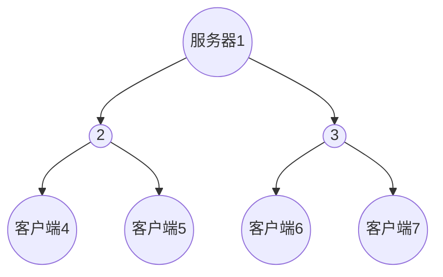

# 七层网络
- 应用层: 针对应用程序的通信服务，大多数文件传输需要第七层
- 表示层: 加密数据和定义数据格式(ASCII或者二进制)
- 会话层: 将断开的数据合并，完成回话，则表示层看到的数据是连续的
- 传输层: TCP、UDP
- 网络层: IP
- 链路层: 在单个链路上传输数据
- 物理层: 传输介质等东西

# 五层网络

- 应用层： HTTP，FTP，SMTP，DNS
- 传输层： TCP，UDP
- 网络层： IP，ICMP，ARP，RARP，DHCP
- 链路层：
- 物理层：

<!-- more -->

# UDP
- 无连接
- 包送达的顺序是任意的，因为包可能选择不同的路径
- UDP发包就行了，能不能到看脸，因此不会重传数据
- UDP的包会重复, 要是有些不敬业的程序员瞎操作，为了保证数据完整性，每个包都给你发5次，就重复了
- 无流控制
- 无拥塞控制

# TCP
- 面向连接，要连接和挂断
- 可靠的发送，按顺序送达，包丢失重传，包不会重复
- 接受用缓冲区控制速度
- 拥塞控制

# HTTP下载文件的过程
- 获得名字所对应的地址(DNS)
- 和地址对应的服务器建立连接(TCP)
- 发送获取页面的请求
- 等待响应
- 渲染HTML等文件
- 断开TCP连接

## PLT
 page load time ,从按下到看见页面的时间，与页面内容有关，与HTTP协议有关、与网络的RTT(Round Trip Time)和带宽有关。

## 早期的HTTP
早期HTTP/1.0使用单个TCP连接获取一个WEB资源，然后就断开TCP，很容易实现，但性能堪忧。
 尽管是访问同一个服务器的不同资源，也要串行，建立了多个TCP，断开了多个TCP，这是很耗时间的。并没有高效使用网络。
 每次TCP的连接都将导致三次握手和慢启动，在高RTT的时候，三次握手很慢，在传输大文件的时候慢启动很耗时。

## HTTP基本优化
- 利用缓存和代理来避免传输相同的内容(DNS缓存和网页缓存)
- 利用CDN让服务器里客户更近
- 文件压缩后传输

## HTTP1.1
- 改进HTTP协议
- 并行连接
- 持久连接： 在一个TCP连接上可以传送多个HTTP请求和响应，减少了建立和关闭连接的消耗和延迟，在HTTP1.1中默认开启长连接keep-alive，一定程度上弥补了HTTP1.0每次请求都要创建连接的缺点。
- 支持range头传输，即只传输文件的某一部分
-  支持Host域，在HTTP1.0中认为每台服务器都绑定一个唯一的IP地址，因此，请求消息中的URL并没有传递主机名（hostname），HTTP1.0没有host域。
- 缓存处理： 在HTTP1.0中主要使用header里的If-Modified-Since,Expires来做为缓存判断的标准，HTTP1.1则引入了更多的缓存控制策略例如Entity tag，If-Unmodified-Since, If-Match, If-None-Match等更多可供选择的缓存头来控制缓存策略。
-  错误码： 在HTTP1.1中新增了24个错误状态响应码，如409（Conflict）表示请求的资源与资源的当前状态发生冲突；410（Gone）表示服务器上的某个资源被永久性的删除。

## HTTPS
- HTTPS使用CA申请证书，证书一般需要交费
- HTTPS建立在SSL/TLS上，加密
- HTTPS使用443端口

## SPDY协议
- 多路复用降低延迟,多个流共享一个tcp,解决了HOL blocking(流水线会因为一个response阻塞导致全部阻塞).

- 请求优先级,优先响应html，而后是js等

- header压缩(DEFLATE，即LZ77+哈夫曼编码)

- 基于HTTPS

- 服务器推送，若客户端请求了sytle.css,服务器会吧style.js推送给客户端

  > 参考 https://juejin.cn/post/6844903608635359239

## HTTP2.0
- 基于SPDY
- 支持明文传输
- 使用HPACK压缩（和SPDY有一点区别）

## 并行连接
 让浏览器并行HTTP实例，但这导致了网络对突发带宽及丢包率

## 持久连接
 用一个连接处理多个HTTP请求,这时候的多个HTTP请求又可以使用流水线。这个技术被用于HTTP/1.1

## 持久连接的问题
 保持TCP连接多长时间？可能导致更慢。????????????

## 网页缓存
 询问服务器时间戳是否过时。

## 网页代理
- 大缓存+安全检查
- 禁止访问某些网站
缺点：
- 安全问题,银行不能缓存
- 动态内容不缓存
- 大量不常用信息在缓存中

## CDN
 内容分发网络，服务器就像树根，客户端就像树的叶子，CDN就是中间的东西，从服务器向客户端传输文件的时候，没有必要每次都从根向叶子传输，可能叶子的父亲就拥有正确的文件，直接让他给你传就好了。如下图，客户端4和客户端5先后要一个文件，我们从服务器1传个文件给CDN2，CDN2传给客户端4，当客户端5请求同一个文件的时候，服务器1没有必要再传文件给CDN2了，直接让CDN2给客户端5文件就行了。

# 参考

[HTTP1.0和HTTP1.1和HTTP2.0的区别](https://blog.csdn.net/ailunlee/article/details/97831912)