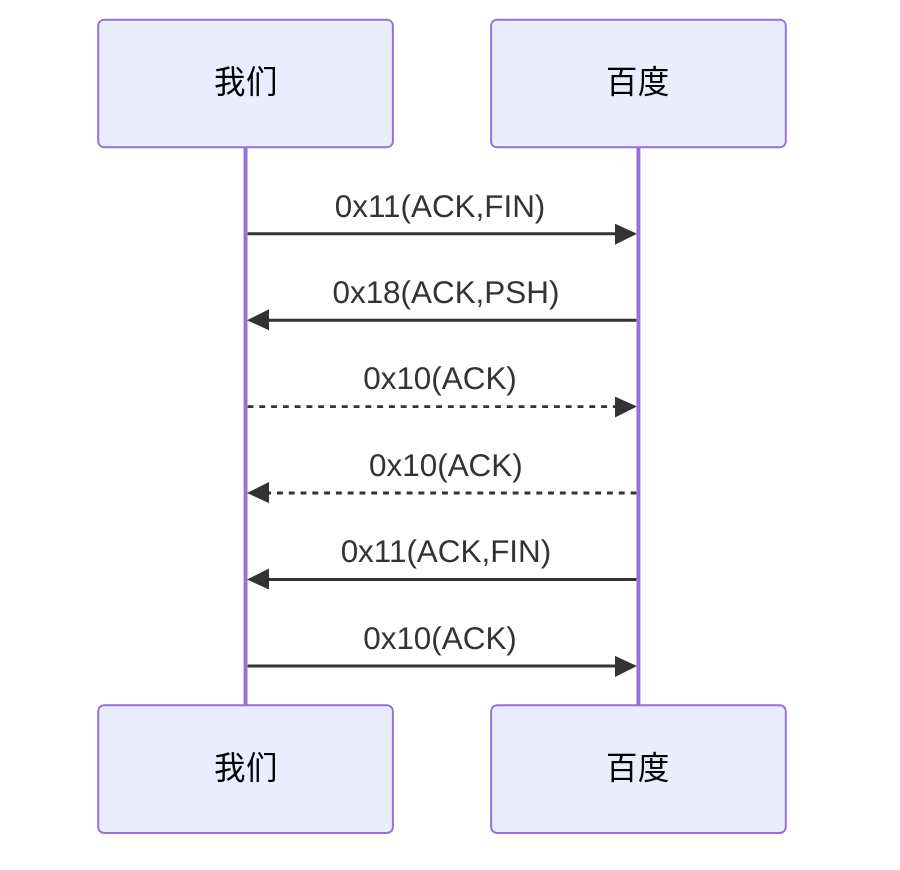

以下我们演示一条HTTP请求指令

```shell
[root@11c749e93da4 /]# curl www.baidu.com
<!DOCTYPE html>
<!--STATUS OK--><html> <head><meta http-equiv=content-type content=text/html;charset=utf-8><meta http-equiv=X-UA-Compatible content=IE=Edge><meta content=always name=referrer><link rel=stylesheet type=text/css href=http://s1.bdstatic.com/r/www/cache/bdorz/baidu.min.css><title>百度一下，你就知道</title></head> <body link=#0000cc> <div id=wrapper> <div id=head> <div class=head_wrapper> <div class=s_form> <div class=s_form_wrapper> <div id=lg>  </div> <form id=form name=f action=//www.baidu.com/s class=fm> <input type=hidden name=bdorz_come value=1> <input type=hidden name=ie value=utf-8> <input type=hidden name=f value=8> <input type=hidden name=rsv_bp value=1> <input type=hidden name=rsv_idx value=1> <input type=hidden name=tn value=baidu><span class="bg s_ipt_wr"><input id=kw name=wd class=s_ipt value maxlength=255 autocomplete=off autofocus></span><span class="bg s_btn_wr"><input type=submit id=su value=百度一下 class="bg s_btn"></span> </form> </div> </div> <div id=u1> <a href=http://news.baidu.com name=tj_trnews class=mnav>新闻</a> <a href=http://www.hao123.com name=tj_trhao123 class=mnav>hao123</a> <a href=http://map.baidu.com name=tj_trmap class=mnav>地图</a> <a href=http://v.baidu.com name=tj_trvideo class=mnav>视频</a> <a href=http://tieba.baidu.com name=tj_trtieba class=mnav>贴吧</a> <noscript> <a href=http://www.baidu.com/bdorz/login.gif?login&amp;tpl=mn&amp;u=http%3A%2F%2Fwww.baidu.com%2f%3fbdorz_come%3d1 name=tj_login class=lb>登录</a> </noscript> <script>document.write('<a href="http://www.baidu.com/bdorz/login.gif?login&tpl=mn&u='+ encodeURIComponent(window.location.href+ (window.location.search === "" ? "?" : "&")+ "bdorz_come=1")+ '" name="tj_login" class="lb">登录</a>');</script> <a href=//www.baidu.com/more/ name=tj_briicon class=bri style="display: block;">更多产品</a> </div> </div> </div> <div id=ftCon> <div id=ftConw> <p id=lh> <a href=http://home.baidu.com>关于百度</a> <a href=http://ir.baidu.com>About Baidu</a> </p> <p id=cp>&copy;2017&nbsp;Baidu&nbsp;<a href=http://www.baidu.com/duty/>使用百度前必读</a>&nbsp; <a href=http://jianyi.baidu.com/ class=cp-feedback>意见反馈</a>&nbsp;京ICP证030173号&nbsp;  </p> </div> </div> </div> </body> </html>
```

接下来是这条指令涉及到的所有TCP以及UDP报文（这篇很难！胆小者勿看）

<!-- more -->

```txt
[root@11c749e93da4 /]# tcpdump -Xvv 
dropped privs to tcpdump
tcpdump: listening on eth0, link-type EN10MB (Ethernet), capture size 262144 bytes
07:05:47.059101 IP (tos 0x0, ttl 64, id 10179, offset 0, flags [DF], proto UDP (17), length 59)
    11c749e93da4.39962 > 183.60.83.19.domain: [bad udp cksum 0xb69d -> 0x7fa1!] 29001+ A? www.baidu.com. (31)
	0x0000:  4500 003b 27c3 4000 4011 5c8a ac11 0004  E..;'.@.@.\.....
	0x0010:  b73c 5313 9c1a 0035 0027 b69d 7149 0100  .<S....5.'..qI..
	0x0020:  0001 0000 0000 0000 0377 7777 0562 6169  .........www.bai
	0x0030:  6475 0363 6f6d 0000 0100 01              du.com.....
07:05:47.059181 IP (tos 0x0, ttl 64, id 10180, offset 0, flags [DF], proto UDP (17), length 59)
    11c749e93da4.39962 > 183.60.83.19.domain: [bad udp cksum 0xb69d -> 0x8397!] 21075+ AAAA? www.baidu.com. (31)
	0x0000:  4500 003b 27c4 4000 4011 5c89 ac11 0004  E..;'.@.@.\.....
	0x0010:  b73c 5313 9c1a 0035 0027 b69d 5253 0100  .<S....5.'..RS..
	0x0020:  0001 0000 0000 0000 0377 7777 0562 6169  .........www.bai
	0x0030:  6475 0363 6f6d 0000 1c00 01              du.com.....
07:05:47.059442 IP (tos 0x0, ttl 60, id 50890, offset 0, flags [DF], proto UDP (17), length 144)
    183.60.83.19.domain > 11c749e93da4.39962: [udp sum ok] 29001 q: A? www.baidu.com. 4/0/0 www.baidu.com. CNAME www.a.shifen.com., www.a.shifen.com. CNAME www.wshifen.com., www.wshifen.com. A 119.63.197.139, www.wshifen.com. A 119.63.197.151 (116)
	0x0000:  4500 0090 c6ca 4000 3c11 c12d b73c 5313  E.....@.<..-.<S.
	0x0010:  ac11 0004 0035 9c1a 007c 7f99 7149 8180  .....5...|..qI..
	0x0020:  0001 0004 0000 0000 0377 7777 0562 6169  .........www.bai
	0x0030:  6475 0363 6f6d 0000 0100 01c0 0c00 0500  du.com..........
	0x0040:  0100 0002 c900 0f03 7777 7701 6106 7368  ........www.a.sh
	0x0050:  6966 656e c016 c02b 0005 0001 0000 0103  ifen...+........
	0x0060:  000e 0377 7777 0777 7368 6966 656e c016  ...www.wshifen..
	0x0070:  c046 0001 0001 0000 0104 0004 773f c58b  .F..........w?..
	0x0080:  c046 0001 0001 0000 0104 0004 773f c597  .F..........w?..
07:05:47.059514 IP (tos 0x0, ttl 60, id 50891, offset 0, flags [DF], proto UDP (17), length 112)
    183.60.83.19.domain > 11c749e93da4.39962: [udp sum ok] 21075 q: AAAA? www.baidu.com. 2/0/0 www.baidu.com. CNAME www.a.shifen.com., www.a.shifen.com. CNAME www.wshifen.com. (84)
	0x0000:  4500 0070 c6cb 4000 3c11 c14c b73c 5313  E..p..@.<..L.<S.
	0x0010:  ac11 0004 0035 9c1a 005c c213 5253 8180  .....5...\..RS..
	0x0020:  0001 0002 0000 0000 0377 7777 0562 6169  .........www.bai
	0x0030:  6475 0363 6f6d 0000 1c00 01c0 0c00 0500  du.com..........
	0x0040:  0100 0004 8700 0f03 7777 7701 6106 7368  ........www.a.sh
	0x0050:  6966 656e c016 c02b 0005 0001 0000 0103  ifen...+........
	0x0060:  000e 0377 7777 0777 7368 6966 656e c016  ...www.wshifen..
07:05:47.061686 IP (tos 0x0, ttl 64, id 38458, offset 0, flags [DF], proto TCP (6), length 60)
    11c749e93da4.60824 > 119.63.197.139.http: Flags [S], cksum 0xe90e (incorrect -> 0xaa0e), seq 4174926008, win 29200, options [mss 1460,sackOK,TS val 1805688806 ecr 0,nop,wscale 7], length 0
	0x0000:  4500 003c 963a 4000 4006 bba1 ac11 0004  E..<.:@.@.......
	0x0010:  773f c58b ed98 0050 f8d8 50b8 0000 0000  w?.....P..P.....
	0x0020:  a002 7210 e90e 0000 0204 05b4 0402 080a  ..r.............
	0x0030:  6ba0 9fe6 0000 0000 0103 0307            k...........
07:05:47.063170 IP (tos 0x0, ttl 64, id 10183, offset 0, flags [DF], proto UDP (17), length 71)
    11c749e93da4.49216 > 183.60.83.19.domain: [bad udp cksum 0xb6a9 -> 0xef02!] 17086+ PTR? 19.83.60.183.in-addr.arpa. (43)
	0x0000:  4500 0047 27c7 4000 4011 5c7a ac11 0004  E..G'.@.@.\z....
	0x0010:  b73c 5313 c040 0035 0033 b6a9 42be 0100  .<S..@.5.3..B...
	0x0020:  0001 0000 0000 0000 0231 3902 3833 0236  .........19.83.6
	0x0030:  3003 3138 3307 696e 2d61 6464 7204 6172  0.183.in-addr.ar
	0x0040:  7061 0000 0c00 01                        pa.....
07:05:47.064077 IP (tos 0x0, ttl 57, id 29314, offset 0, flags [DF], proto UDP (17), length 135)
    183.60.83.19.domain > 11c749e93da4.49216: [udp sum ok] 17086 NXDomain q: PTR? 19.83.60.183.in-addr.arpa. 0/1/0 ns: 60.183.in-addr.arpa. SOA ns.guangzhou.gd.cn. dns-admin.guangzhou.gd.cn. 2020122301 10800 3600 604800 86400 (107)
	0x0000:  4500 0087 7282 4000 3911 187f b73c 5313  E...r.@.9....<S.
	0x0010:  ac11 0004 0035 c040 0073 bbd3 42be 8183  .....5.@.s..B...
	0x0020:  0001 0000 0001 0000 0231 3902 3833 0236  .........19.83.6
	0x0030:  3003 3138 3307 696e 2d61 6464 7204 6172  0.183.in-addr.ar
	0x0040:  7061 0000 0c00 01c0 1200 0600 0100 0000  pa..............
	0x0050:  9500 3402 6e73 0967 7561 6e67 7a68 6f75  ..4.ns.guangzhou
	0x0060:  0267 6402 636e 0009 646e 732d 6164 6d69  .gd.cn..dns-admi
	0x0070:  6ec0 3a78 689e bd00 002a 3000 000e 1000  n.:xh....*0.....
	0x0080:  093a 8000 0151 80                        .:...Q.
07:05:47.070294 IP (tos 0x0, ttl 64, id 10187, offset 0, flags [DF], proto UDP (17), length 73)
    11c749e93da4.51992 > 183.60.83.19.domain: [bad udp cksum 0xb6ab -> 0x2278!] 64519+ PTR? 139.197.63.119.in-addr.arpa. (45)
	0x0000:  4500 0049 27cb 4000 4011 5c74 ac11 0004  E..I'.@.@.\t....
	0x0010:  b73c 5313 cb18 0035 0035 b6ab fc07 0100  .<S....5.5......
	0x0020:  0001 0000 0000 0000 0331 3339 0331 3937  .........139.197
	0x0030:  0236 3303 3131 3907 696e 2d61 6464 7204  .63.119.in-addr.
	0x0040:  6172 7061 0000 0c00 01                   arpa.....
07:05:47.071163 IP (tos 0x0, ttl 251, id 16397, offset 0, flags [DF], proto UDP (17), length 161)
    183.60.83.19.domain > 11c749e93da4.51992: [udp sum ok] 64519 NXDomain q: PTR? 139.197.63.119.in-addr.arpa. 0/1/0 ns: 119.in-addr.arpa. SOA ns.apnic.net. read-txt-record-of-zone-first-dns-admin.apnic.net. 3006092649 7200 1800 604800 3600 (133)
	0x0000:  4500 00a1 400d 4000 fb11 88d9 b73c 5313  E...@.@......<S.
	0x0010:  ac11 0004 0035 cb18 008d 397d fc07 8183  .....5....9}....
	0x0020:  0001 0000 0001 0000 0331 3339 0331 3937  .........139.197
	0x0030:  0236 3303 3131 3907 696e 2d61 6464 7204  .63.119.in-addr.
	0x0040:  6172 7061 0000 0c00 01c0 1700 0600 0100  arpa............
	0x0050:  0006 fe00 4c02 6e73 0561 706e 6963 036e  ....L.ns.apnic.n
	0x0060:  6574 0027 7265 6164 2d74 7874 2d72 6563  et.'read-txt-rec
	0x0070:  6f72 642d 6f66 2d7a 6f6e 652d 6669 7273  ord-of-zone-firs
	0x0080:  742d 646e 732d 6164 6d69 6ec0 3cb3 2d55  t-dns-admin.<.-U
	0x0090:  6900 001c 2000 0007 0800 093a 8000 000e  i..........:....
	0x00a0:  10                                       .
07:05:47.115732 IP (tos 0x0, ttl 50, id 38458, offset 0, flags [DF], proto TCP (6), length 60)
    119.63.197.139.http > 11c749e93da4.60824: Flags [S.], cksum 0x268b (correct), seq 1024829215, ack 4174926009, win 8192, options [mss 1424,sackOK,nop,nop,nop,nop,nop,nop,nop,nop,nop,nop,nop,wscale 5], length 0
	0x0000:  4500 003c 963a 4000 3206 c9a1 773f c58b  E..<.:@.2...w?..
	0x0010:  ac11 0004 0050 ed98 3d15 a71f f8d8 50b9  .....P..=.....P.
	0x0020:  a012 2000 268b 0000 0204 0590 0402 0101  ....&...........
	0x0030:  0101 0101 0101 0101 0103 0305            ............
07:05:47.115797 IP (tos 0x0, ttl 64, id 38459, offset 0, flags [DF], proto TCP (6), length 40)
    11c749e93da4.60824 > 119.63.197.139.http: Flags [.], cksum 0xe8fa (incorrect -> 0xaa5e), seq 1, ack 1, win 229, length 0
	0x0000:  4500 0028 963b 4000 4006 bbb4 ac11 0004  E..(.;@.@.......
	0x0010:  773f c58b ed98 0050 f8d8 50b9 3d15 a720  w?.....P..P.=...
	0x0020:  5010 00e5 e8fa 0000                      P.......
07:05:47.115913 IP (tos 0x0, ttl 64, id 38460, offset 0, flags [DF], proto TCP (6), length 117)
    11c749e93da4.60824 > 119.63.197.139.http: Flags [P.], cksum 0xe947 (incorrect -> 0x7519), seq 1:78, ack 1, win 229, length 77: HTTP, length: 77
	GET / HTTP/1.1
	Host: www.baidu.com
	User-Agent: curl/7.61.1
	Accept: */*
	
	0x0000:  4500 0075 963c 4000 4006 bb66 ac11 0004  E..u.<@.@..f....
	0x0010:  773f c58b ed98 0050 f8d8 50b9 3d15 a720  w?.....P..P.=...
	0x0020:  5018 00e5 e947 0000 4745 5420 2f20 4854  P....G..GET./.HT
	0x0030:  5450 2f31 2e31 0d0a 486f 7374 3a20 7777  TP/1.1..Host:.ww
	0x0040:  772e 6261 6964 752e 636f 6d0d 0a55 7365  w.baidu.com..Use
	0x0050:  722d 4167 656e 743a 2063 7572 6c2f 372e  r-Agent:.curl/7.
	0x0060:  3631 2e31 0d0a 4163 6365 7074 3a20 2a2f  61.1..Accept:.*/
	0x0070:  2a0d 0a0d 0a                             *....
07:05:47.170254 IP (tos 0x0, ttl 48, id 24974, offset 0, flags [DF], proto TCP (6), length 40)
    119.63.197.139.http > 11c749e93da4.60824: Flags [.], cksum 0xa762 (correct), seq 1, ack 78, win 916, length 0
	0x0000:  4500 0028 618e 4000 3006 0062 773f c58b  E..(a.@.0..bw?..
	0x0010:  ac11 0004 0050 ed98 3d15 a720 f8d8 5106  .....P..=.....Q.
	0x0020:  5010 0394 a762 0000                      P....b..
07:05:47.236240 IP (tos 0x0, ttl 48, id 24975, offset 0, flags [DF], proto TCP (6), length 1488)
    119.63.197.139.http > 11c749e93da4.60824: Flags [P.], cksum 0xeea2 (incorrect -> 0x8779), seq 1:1449, ack 78, win 916, length 1448: HTTP, length: 1448
	HTTP/1.1 200 OK
	Accept-Ranges: bytes
	Cache-Control: private, no-cache, no-store, proxy-revalidate, no-transform
	Connection: keep-alive
	Content-Length: 2381
	Content-Type: text/html
	Date: Sun, 04 Apr 2021 07:05:47 GMT
	Etag: "588604eb-94d"
	Last-Modified: Mon, 23 Jan 2017 13:28:11 GMT
	Pragma: no-cache
	Server: bfe/1.0.8.18
	Set-Cookie: BDORZ=27315; max-age=86400; domain=.baidu.com; path=/
	
	<!DOCTYPE html>
	0x0000:  4500 05d0 618f 4000 3006 fab8 773f c58b  E...a.@.0...w?..
	0x0010:  ac11 0004 0050 ed98 3d15 a720 f8d8 5106  .....P..=.....Q.
	0x0020:  5018 0394 eea2 0000 4854 5450 2f31 2e31  P.......HTTP/1.1
	0x0030:  2032 3030 204f 4b0d 0a41 6363 6570 742d  .200.OK..Accept-
	0x0040:  5261 6e67 6573 3a20 6279 7465 730d 0a43  Ranges:.bytes..C
	0x0050:  6163 6865 2d43 6f6e 7472 6f6c 3a20 7072  ache-Control:.pr
	0x0060:  6976 6174 652c 206e 6f2d 6361 6368 652c  ivate,.no-cache,
	0x0070:  206e 6f2d 7374 6f72 652c 2070 726f 7879  .no-store,.proxy
	0x0080:  2d72 6576 616c 6964 6174 652c 206e 6f2d  -revalidate,.no-
	0x0090:  7472 616e 7366 6f72 6d0d 0a43 6f6e 6e65  transform..Conne
	0x00a0:  6374 696f 6e3a 206b 6565 702d 616c 6976  ction:.keep-aliv
	0x00b0:  650d 0a43 6f6e 7465 6e74 2d4c 656e 6774  e..Content-Lengt
	0x00c0:  683a 2032 3338 310d 0a43 6f6e 7465 6e74  h:.2381..Content
	0x00d0:  2d54 7970 653a 2074 6578 742f 6874 6d6c  -Type:.text/html
	0x00e0:  0d0a 4461 7465 3a20 5375 6e2c 2030 3420  ..Date:.Sun,.04.
	0x00f0:  4170 7220 3230 3231 2030 373a 3035 3a34  Apr.2021.07:05:4
	0x0100:  3720 474d 540d 0a45 7461 673a 2022 3538  7.GMT..Etag:."58
	0x0110:  3836 3034 6562 2d39 3464 220d 0a4c 6173  8604eb-94d"..Las
	0x0120:  742d 4d6f 6469 6669 6564 3a20 4d6f 6e2c  t-Modified:.Mon,
	0x0130:  2032 3320 4a61 6e20 3230 3137 2031 333a  .23.Jan.2017.13:
	0x0140:  3238 3a31 3120 474d 540d 0a50 7261 676d  28:11.GMT..Pragm
	0x0150:  613a 206e 6f2d 6361 6368 650d 0a53 6572  a:.no-cache..Ser
	0x0160:  7665 723a 2062 6665 2f31 2e30 2e38 2e31  ver:.bfe/1.0.8.1
	0x0170:  380d 0a53 6574 2d43 6f6f 6b69 653a 2042  8..Set-Cookie:.B
	0x0180:  444f 525a 3d32 3733 3135 3b20 6d61 782d  DORZ=27315;.max-
	0x0190:  6167 653d 3836 3430 303b 2064 6f6d 6169  age=86400;.domai
	0x01a0:  6e3d 2e62 6169 6475 2e63 6f6d 3b20 7061  n=.baidu.com;.pa
	0x01b0:  7468 3d2f 0d0a 0d0a 3c21 444f 4354 5950  th=/....<!DOCTYP
	0x01c0:  4520 6874 6d6c 3e0d 0a3c 212d 2d53 5441  E.html>..<!--STA
	0x01d0:  5455 5320 4f4b 2d2d 3e3c 6874 6d6c 3e20  TUS.OK--><html>.
	0x01e0:  3c68 6561 643e 3c6d 6574 6120 6874 7470  <head><meta.http
	0x01f0:  2d65 7175 6976 3d63 6f6e 7465 6e74 2d74  -equiv=content-t
	0x0200:  7970 6520 636f 6e74 656e 743d 7465 7874  ype.content=text
	0x0210:  2f68 746d 6c3b 6368 6172 7365 743d 7574  /html;charset=ut
	0x0220:  662d 383e 3c6d 6574 6120 6874 7470 2d65  f-8><meta.http-e
	0x0230:  7175 6976 3d58 2d55 412d 436f 6d70 6174  quiv=X-UA-Compat
	0x0240:  6962 6c65 2063 6f6e 7465 6e74 3d49 453d  ible.content=IE=
	0x0250:  4564 6765 3e3c 6d65 7461 2063 6f6e 7465  Edge><meta.conte
	0x0260:  6e74 3d61 6c77 6179 7320 6e61 6d65 3d72  nt=always.name=r
	0x0270:  6566 6572 7265 723e 3c6c 696e 6b20 7265  eferrer><link.re
	0x0280:  6c3d 7374 796c 6573 6865 6574 2074 7970  l=stylesheet.typ
	0x0290:  653d 7465 7874 2f63 7373 2068 7265 663d  e=text/css.href=
	0x02a0:  6874 7470 3a2f 2f73 312e 6264 7374 6174  http://s1.bdstat
	0x02b0:  6963 2e63 6f6d 2f72 2f77 7777 2f63 6163  ic.com/r/www/cac
	0x02c0:  6865 2f62 646f 727a 2f62 6169 6475 2e6d  he/bdorz/baidu.m
	0x02d0:  696e 2e63 7373 3e3c 7469 746c 653e e799  in.css><title>..
	0x02e0:  bee5 baa6 e4b8 80e4 b88b efbc 8ce4 bda0  ................
	0x02f0:  e5b0 b1e7 9fa5 e981 933c 2f74 6974 6c65  .........</title
	0x0300:  3e3c 2f68 6561 643e 203c 626f 6479 206c  ></head>.<body.l
	0x0310:  696e 6b3d 2330 3030 3063 633e 203c 6469  ink=#0000cc>.<di
	0x0320:  7620 6964 3d77 7261 7070 6572 3e20 3c64  v.id=wrapper>.<d
	0x0330:  6976 2069 643d 6865 6164 3e20 3c64 6976  iv.id=head>.<div
	0x0340:  2063 6c61 7373 3d68 6561 645f 7772 6170  .class=head_wrap
	0x0350:  7065 723e 203c 6469 7620 636c 6173 733d  per>.<div.class=
	0x0360:  735f 666f 726d 3e20 3c64 6976 2063 6c61  s_form>.<div.cla
	0x0370:  7373 3d73 5f66 6f72 6d5f 7772 6170 7065  ss=s_form_wrappe
	0x0380:  723e 203c 6469 7620 6964 3d6c 673e 203c  r>.<div.id=lg>.<
	0x0390:  696d 6720 6869 6465 666f 6375 733d 7472  img.hidefocus=tr
	0x03a0:  7565 2073 7263 3d2f 2f77 7777 2e62 6169  ue.src=//www.bai
	0x03b0:  6475 2e63 6f6d 2f69 6d67 2f62 645f 6c6f  du.com/img/bd_lo
	0x03c0:  676f 312e 706e 6720 7769 6474 683d 3237  go1.png.width=27
	0x03d0:  3020 6865 6967 6874 3d31 3239 3e20 3c2f  0.height=129>.</
	0x03e0:  6469 763e 203c 666f 726d 2069 643d 666f  div>.<form.id=fo
	0x03f0:  726d 206e 616d 653d 6620 6163 7469 6f6e  rm.name=f.action
	0x0400:  3d2f 2f77 7777 2e62 6169 6475 2e63 6f6d  =//www.baidu.com
	0x0410:  2f73 2063 6c61 7373 3d66 6d3e 203c 696e  /s.class=fm>.<in
	0x0420:  7075 7420 7479 7065 3d68 6964 6465 6e20  put.type=hidden.
	0x0430:  6e61 6d65 3d62 646f 727a 5f63 6f6d 6520  name=bdorz_come.
	0x0440:  7661 6c75 653d 313e 203c 696e 7075 7420  value=1>.<input.
	0x0450:  7479 7065 3d68 6964 6465 6e20 6e61 6d65  type=hidden.name
	0x0460:  3d69 6520 7661 6c75 653d 7574 662d 383e  =ie.value=utf-8>
	0x0470:  203c 696e 7075 7420 7479 7065 3d68 6964  .<input.type=hid
	0x0480:  6465 6e20 6e61 6d65 3d66 2076 616c 7565  den.name=f.value
	0x0490:  3d38 3e20 3c69 6e70 7574 2074 7970 653d  =8>.<input.type=
	0x04a0:  6869 6464 656e 206e 616d 653d 7273 765f  hidden.name=rsv_
	0x04b0:  6270 2076 616c 7565 3d31 3e20 3c69 6e70  bp.value=1>.<inp
	0x04c0:  7574 2074 7970 653d 6869 6464 656e 206e  ut.type=hidden.n
	0x04d0:  616d 653d 7273 765f 6964 7820 7661 6c75  ame=rsv_idx.valu
	0x04e0:  653d 313e 203c 696e 7075 7420 7479 7065  e=1>.<input.type
	0x04f0:  3d68 6964 6465 6e20 6e61 6d65 3d74 6e20  =hidden.name=tn.
	0x0500:  7661 6c75 653d 6261 6964 753e 3c73 7061  value=baidu><spa
	0x0510:  6e20 636c 6173 733d 2262 6720 735f 6970  n.class="bg.s_ip
	0x0520:  745f 7772 223e 3c69 6e70 7574 2069 643d  t_wr"><input.id=
	0x0530:  6b77 206e 616d 653d 7764 2063 6c61 7373  kw.name=wd.class
	0x0540:  3d73 5f69 7074 2076 616c 7565 206d 6178  =s_ipt.value.max
	0x0550:  6c65 6e67 7468 3d32 3535 2061 7574 6f63  length=255.autoc
	0x0560:  6f6d 706c 6574 653d 6f66 6620 6175 746f  omplete=off.auto
	0x0570:  666f 6375 733e 3c2f 7370 616e 3e3c 7370  focus></span><sp
	0x0580:  616e 2063 6c61 7373 3d22 6267 2073 5f62  an.class="bg.s_b
	0x0590:  746e 5f77 7222 3e3c 696e 7075 7420 7479  tn_wr"><input.ty
	0x05a0:  7065 3d73 7562 6d69 7420 6964 3d73 7520  pe=submit.id=su.
	0x05b0:  7661 6c75 653d e799 bee5 baa6 e4b8 80e4  value=..........
	0x05c0:  b88b 2063 6c61 7373 3d22 6267 2073 5f62  ...class="bg.s_b
07:05:47.236264 IP (tos 0x0, ttl 64, id 38461, offset 0, flags [DF], proto TCP (6), length 40)
    11c749e93da4.60824 > 119.63.197.139.http: Flags [.], cksum 0xe8fa (incorrect -> 0xa453), seq 78, ack 1449, win 251, length 0
	0x0000:  4500 0028 963d 4000 4006 bbb2 ac11 0004  E..(.=@.@.......
	0x0010:  773f c58b ed98 0050 f8d8 5106 3d15 acc8  w?.....P..Q.=...
	0x0020:  5010 00fb e8fa 0000                      P.......
07:05:47.236270 IP (tos 0x0, ttl 48, id 24977, offset 0, flags [DF], proto TCP (6), length 1373)
    119.63.197.139.http > 11c749e93da4.60824: Flags [P.], cksum 0x5cf2 (correct), seq 1449:2782, ack 78, win 916, length 1333: HTTP
	0x0000:  4500 055d 6191 4000 3006 fb29 773f c58b  E..]a.@.0..)w?..
	0x0010:  ac11 0004 0050 ed98 3d15 acc8 f8d8 5106  .....P..=.....Q.
	0x0020:  5018 0394 5cf2 0000 746e 223e 3c2f 7370  P...\...tn"></sp
	0x0030:  616e 3e20 3c2f 666f 726d 3e20 3c2f 6469  an>.</form>.</di
	0x0040:  763e 203c 2f64 6976 3e20 3c64 6976 2069  v>.</div>.<div.i
	0x0050:  643d 7531 3e20 3c61 2068 7265 663d 6874  d=u1>.<a.href=ht
	0x0060:  7470 3a2f 2f6e 6577 732e 6261 6964 752e  tp://news.baidu.
	0x0070:  636f 6d20 6e61 6d65 3d74 6a5f 7472 6e65  com.name=tj_trne
	0x0080:  7773 2063 6c61 7373 3d6d 6e61 763e e696  ws.class=mnav>..
	0x0090:  b0e9 97bb 3c2f 613e 203c 6120 6872 6566  ....</a>.<a.href
	0x00a0:  3d68 7474 703a 2f2f 7777 772e 6861 6f31  =http://www.hao1
	0x00b0:  3233 2e63 6f6d 206e 616d 653d 746a 5f74  23.com.name=tj_t
	0x00c0:  7268 616f 3132 3320 636c 6173 733d 6d6e  rhao123.class=mn
	0x00d0:  6176 3e68 616f 3132 333c 2f61 3e20 3c61  av>hao123</a>.<a
	0x00e0:  2068 7265 663d 6874 7470 3a2f 2f6d 6170  .href=http://map
	0x00f0:  2e62 6169 6475 2e63 6f6d 206e 616d 653d  .baidu.com.name=
	0x0100:  746a 5f74 726d 6170 2063 6c61 7373 3d6d  tj_trmap.class=m
	0x0110:  6e61 763e e59c b0e5 9bbe 3c2f 613e 203c  nav>......</a>.<
	0x0120:  6120 6872 6566 3d68 7474 703a 2f2f 762e  a.href=http://v.
	0x0130:  6261 6964 752e 636f 6d20 6e61 6d65 3d74  baidu.com.name=t
	0x0140:  6a5f 7472 7669 6465 6f20 636c 6173 733d  j_trvideo.class=
	0x0150:  6d6e 6176 3ee8 a786 e9a2 913c 2f61 3e20  mnav>......</a>.
	0x0160:  3c61 2068 7265 663d 6874 7470 3a2f 2f74  <a.href=http://t
	0x0170:  6965 6261 2e62 6169 6475 2e63 6f6d 206e  ieba.baidu.com.n
	0x0180:  616d 653d 746a 5f74 7274 6965 6261 2063  ame=tj_trtieba.c
	0x0190:  6c61 7373 3d6d 6e61 763e e8b4 b4e5 90a7  lass=mnav>......
	0x01a0:  3c2f 613e 203c 6e6f 7363 7269 7074 3e20  </a>.<noscript>.
	0x01b0:  3c61 2068 7265 663d 6874 7470 3a2f 2f77  <a.href=http://w
	0x01c0:  7777 2e62 6169 6475 2e63 6f6d 2f62 646f  ww.baidu.com/bdo
	0x01d0:  727a 2f6c 6f67 696e 2e67 6966 3f6c 6f67  rz/login.gif?log
	0x01e0:  696e 2661 6d70 3b74 706c 3d6d 6e26 616d  in&amp;tpl=mn&am
	0x01f0:  703b 753d 6874 7470 2533 4125 3246 2532  p;u=http%3A%2F%2
	0x0200:  4677 7777 2e62 6169 6475 2e63 6f6d 2532  Fwww.baidu.com%2
	0x0210:  6625 3366 6264 6f72 7a5f 636f 6d65 2533  f%3fbdorz_come%3
	0x0220:  6431 206e 616d 653d 746a 5f6c 6f67 696e  d1.name=tj_login
	0x0230:  2063 6c61 7373 3d6c 623e e799 bbe5 bd95  .class=lb>......
	0x0240:  3c2f 613e 203c 2f6e 6f73 6372 6970 743e  </a>.</noscript>
	0x0250:  203c 7363 7269 7074 3e64 6f63 756d 656e  .<script>documen
	0x0260:  742e 7772 6974 6528 273c 6120 6872 6566  t.write('<a.href
	0x0270:  3d22 6874 7470 3a2f 2f77 7777 2e62 6169  ="http://www.bai
	0x0280:  6475 2e63 6f6d 2f62 646f 727a 2f6c 6f67  du.com/bdorz/log
	0x0290:  696e 2e67 6966 3f6c 6f67 696e 2674 706c  in.gif?login&tpl
	0x02a0:  3d6d 6e26 753d 272b 2065 6e63 6f64 6555  =mn&u='+.encodeU
	0x02b0:  5249 436f 6d70 6f6e 656e 7428 7769 6e64  RIComponent(wind
	0x02c0:  6f77 2e6c 6f63 6174 696f 6e2e 6872 6566  ow.location.href
	0x02d0:  2b20 2877 696e 646f 772e 6c6f 6361 7469  +.(window.locati
	0x02e0:  6f6e 2e73 6561 7263 6820 3d3d 3d20 2222  on.search.===.""
	0x02f0:  203f 2022 3f22 203a 2022 2622 292b 2022  .?."?".:."&")+."
	0x0300:  6264 6f72 7a5f 636f 6d65 3d31 2229 2b20  bdorz_come=1")+.
	0x0310:  2722 206e 616d 653d 2274 6a5f 6c6f 6769  '".name="tj_logi
	0x0320:  6e22 2063 6c61 7373 3d22 6c62 223e e799  n".class="lb">..
	0x0330:  bbe5 bd95 3c2f 613e 2729 3b3c 2f73 6372  ....</a>');</scr
	0x0340:  6970 743e 203c 6120 6872 6566 3d2f 2f77  ipt>.<a.href=//w
	0x0350:  7777 2e62 6169 6475 2e63 6f6d 2f6d 6f72  ww.baidu.com/mor
	0x0360:  652f 206e 616d 653d 746a 5f62 7269 6963  e/.name=tj_briic
	0x0370:  6f6e 2063 6c61 7373 3d62 7269 2073 7479  on.class=bri.sty
	0x0380:  6c65 3d22 6469 7370 6c61 793a 2062 6c6f  le="display:.blo
	0x0390:  636b 3b22 3ee6 9bb4 e5a4 9ae4 baa7 e593  ck;">...........
	0x03a0:  813c 2f61 3e20 3c2f 6469 763e 203c 2f64  .</a>.</div>.</d
	0x03b0:  6976 3e20 3c2f 6469 763e 203c 6469 7620  iv>.</div>.<div.
	0x03c0:  6964 3d66 7443 6f6e 3e20 3c64 6976 2069  id=ftCon>.<div.i
	0x03d0:  643d 6674 436f 6e77 3e20 3c70 2069 643d  d=ftConw>.<p.id=
	0x03e0:  6c68 3e20 3c61 2068 7265 663d 6874 7470  lh>.<a.href=http
	0x03f0:  3a2f 2f68 6f6d 652e 6261 6964 752e 636f  ://home.baidu.co
	0x0400:  6d3e e585 b3e4 ba8e e799 bee5 baa6 3c2f  m>............</
	0x0410:  613e 203c 6120 6872 6566 3d68 7474 703a  a>.<a.href=http:
	0x0420:  2f2f 6972 2e62 6169 6475 2e63 6f6d 3e41  //ir.baidu.com>A
	0x0430:  626f 7574 2042 6169 6475 3c2f 613e 203c  bout.Baidu</a>.<
	0x0440:  2f70 3e20 3c70 2069 643d 6370 3e26 636f  /p>.<p.id=cp>&co
	0x0450:  7079 3b32 3031 3726 6e62 7370 3b42 6169  py;2017&nbsp;Bai
	0x0460:  6475 266e 6273 703b 3c61 2068 7265 663d  du&nbsp;<a.href=
	0x0470:  6874 7470 3a2f 2f77 7777 2e62 6169 6475  http://www.baidu
	0x0480:  2e63 6f6d 2f64 7574 792f 3ee4 bdbf e794  .com/duty/>.....
	0x0490:  a8e7 99be e5ba a6e5 898d e5bf 85e8 afbb  ................
	0x04a0:  3c2f 613e 266e 6273 703b 203c 6120 6872  </a>&nbsp;.<a.hr
	0x04b0:  6566 3d68 7474 703a 2f2f 6a69 616e 7969  ef=http://jianyi
	0x04c0:  2e62 6169 6475 2e63 6f6d 2f20 636c 6173  .baidu.com/.clas
	0x04d0:  733d 6370 2d66 6565 6462 6163 6b3e e684  s=cp-feedback>..
	0x04e0:  8fe8 a781 e58f 8de9 a688 3c2f 613e 266e  ..........</a>&n
	0x04f0:  6273 703b e4ba ac49 4350 e8af 8130 3330  bsp;...ICP...030
	0x0500:  3137 33e5 8fb7 266e 6273 703b 203c 696d  173...&nbsp;.<im
	0x0510:  6720 7372 633d 2f2f 7777 772e 6261 6964  g.src=//www.baid
	0x0520:  752e 636f 6d2f 696d 672f 6773 2e67 6966  u.com/img/gs.gif
	0x0530:  3e20 3c2f 703e 203c 2f64 6976 3e20 3c2f  >.</p>.</div>.</
	0x0540:  6469 763e 203c 2f64 6976 3e20 3c2f 626f  div>.</div>.</bo
	0x0550:  6479 3e20 3c2f 6874 6d6c 3e0d 0a         dy>.</html>..
07:05:47.236276 IP (tos 0x0, ttl 64, id 38462, offset 0, flags [DF], proto TCP (6), length 40)
    11c749e93da4.60824 > 119.63.197.139.http: Flags [.], cksum 0xe8fa (incorrect -> 0x9f07), seq 78, ack 2782, win 274, length 0
	0x0000:  4500 0028 963e 4000 4006 bbb1 ac11 0004  E..(.>@.@.......
	0x0010:  773f c58b ed98 0050 f8d8 5106 3d15 b1fd  w?.....P..Q.=...
	0x0020:  5010 0112 e8fa 0000                      P.......
07:05:47.236425 IP (tos 0x0, ttl 64, id 38463, offset 0, flags [DF], proto TCP (6), length 40)
    11c749e93da4.60824 > 119.63.197.139.http: Flags [F.], cksum 0xe8fa (incorrect -> 0x9f06), seq 78, ack 2782, win 274, length 0
	0x0000:  4500 0028 963f 4000 4006 bbb0 ac11 0004  E..(.?@.@.......
	0x0010:  773f c58b ed98 0050 f8d8 5106 3d15 b1fd  w?.....P..Q.=...
	0x0020:  5011 0112 e8fa 0000                      P.......
07:05:47.245278 IP (tos 0x0, ttl 48, id 24978, offset 0, flags [DF], proto TCP (6), length 1373)
    119.63.197.139.http > 11c749e93da4.60824: Flags [P.], cksum 0x5cf2 (correct), seq 1449:2782, ack 78, win 916, length 1333: HTTP
	0x0000:  4500 055d 6192 4000 3006 fb28 773f c58b  E..]a.@.0..(w?..
	0x0010:  ac11 0004 0050 ed98 3d15 acc8 f8d8 5106  .....P..=.....Q.
	0x0020:  5018 0394 5cf2 0000 746e 223e 3c2f 7370  P...\...tn"></sp
	0x0030:  616e 3e20 3c2f 666f 726d 3e20 3c2f 6469  an>.</form>.</di
	0x0040:  763e 203c 2f64 6976 3e20 3c64 6976 2069  v>.</div>.<div.i
	0x0050:  643d 7531 3e20 3c61 2068 7265 663d 6874  d=u1>.<a.href=ht
	0x0060:  7470 3a2f 2f6e 6577 732e 6261 6964 752e  tp://news.baidu.
	0x0070:  636f 6d20 6e61 6d65 3d74 6a5f 7472 6e65  com.name=tj_trne
	0x0080:  7773 2063 6c61 7373 3d6d 6e61 763e e696  ws.class=mnav>..
	0x0090:  b0e9 97bb 3c2f 613e 203c 6120 6872 6566  ....</a>.<a.href
	0x00a0:  3d68 7474 703a 2f2f 7777 772e 6861 6f31  =http://www.hao1
	0x00b0:  3233 2e63 6f6d 206e 616d 653d 746a 5f74  23.com.name=tj_t
	0x00c0:  7268 616f 3132 3320 636c 6173 733d 6d6e  rhao123.class=mn
	0x00d0:  6176 3e68 616f 3132 333c 2f61 3e20 3c61  av>hao123</a>.<a
	0x00e0:  2068 7265 663d 6874 7470 3a2f 2f6d 6170  .href=http://map
	0x00f0:  2e62 6169 6475 2e63 6f6d 206e 616d 653d  .baidu.com.name=
	0x0100:  746a 5f74 726d 6170 2063 6c61 7373 3d6d  tj_trmap.class=m
	0x0110:  6e61 763e e59c b0e5 9bbe 3c2f 613e 203c  nav>......</a>.<
	0x0120:  6120 6872 6566 3d68 7474 703a 2f2f 762e  a.href=http://v.
	0x0130:  6261 6964 752e 636f 6d20 6e61 6d65 3d74  baidu.com.name=t
	0x0140:  6a5f 7472 7669 6465 6f20 636c 6173 733d  j_trvideo.class=
	0x0150:  6d6e 6176 3ee8 a786 e9a2 913c 2f61 3e20  mnav>......</a>.
	0x0160:  3c61 2068 7265 663d 6874 7470 3a2f 2f74  <a.href=http://t
	0x0170:  6965 6261 2e62 6169 6475 2e63 6f6d 206e  ieba.baidu.com.n
	0x0180:  616d 653d 746a 5f74 7274 6965 6261 2063  ame=tj_trtieba.c
	0x0190:  6c61 7373 3d6d 6e61 763e e8b4 b4e5 90a7  lass=mnav>......
	0x01a0:  3c2f 613e 203c 6e6f 7363 7269 7074 3e20  </a>.<noscript>.
	0x01b0:  3c61 2068 7265 663d 6874 7470 3a2f 2f77  <a.href=http://w
	0x01c0:  7777 2e62 6169 6475 2e63 6f6d 2f62 646f  ww.baidu.com/bdo
	0x01d0:  727a 2f6c 6f67 696e 2e67 6966 3f6c 6f67  rz/login.gif?log
	0x01e0:  696e 2661 6d70 3b74 706c 3d6d 6e26 616d  in&amp;tpl=mn&am
	0x01f0:  703b 753d 6874 7470 2533 4125 3246 2532  p;u=http%3A%2F%2
	0x0200:  4677 7777 2e62 6169 6475 2e63 6f6d 2532  Fwww.baidu.com%2
	0x0210:  6625 3366 6264 6f72 7a5f 636f 6d65 2533  f%3fbdorz_come%3
	0x0220:  6431 206e 616d 653d 746a 5f6c 6f67 696e  d1.name=tj_login
	0x0230:  2063 6c61 7373 3d6c 623e e799 bbe5 bd95  .class=lb>......
	0x0240:  3c2f 613e 203c 2f6e 6f73 6372 6970 743e  </a>.</noscript>
	0x0250:  203c 7363 7269 7074 3e64 6f63 756d 656e  .<script>documen
	0x0260:  742e 7772 6974 6528 273c 6120 6872 6566  t.write('<a.href
	0x0270:  3d22 6874 7470 3a2f 2f77 7777 2e62 6169  ="http://www.bai
	0x0280:  6475 2e63 6f6d 2f62 646f 727a 2f6c 6f67  du.com/bdorz/log
	0x0290:  696e 2e67 6966 3f6c 6f67 696e 2674 706c  in.gif?login&tpl
	0x02a0:  3d6d 6e26 753d 272b 2065 6e63 6f64 6555  =mn&u='+.encodeU
	0x02b0:  5249 436f 6d70 6f6e 656e 7428 7769 6e64  RIComponent(wind
	0x02c0:  6f77 2e6c 6f63 6174 696f 6e2e 6872 6566  ow.location.href
	0x02d0:  2b20 2877 696e 646f 772e 6c6f 6361 7469  +.(window.locati
	0x02e0:  6f6e 2e73 6561 7263 6820 3d3d 3d20 2222  on.search.===.""
	0x02f0:  203f 2022 3f22 203a 2022 2622 292b 2022  .?."?".:."&")+."
	0x0300:  6264 6f72 7a5f 636f 6d65 3d31 2229 2b20  bdorz_come=1")+.
	0x0310:  2722 206e 616d 653d 2274 6a5f 6c6f 6769  '".name="tj_logi
	0x0320:  6e22 2063 6c61 7373 3d22 6c62 223e e799  n".class="lb">..
	0x0330:  bbe5 bd95 3c2f 613e 2729 3b3c 2f73 6372  ....</a>');</scr
	0x0340:  6970 743e 203c 6120 6872 6566 3d2f 2f77  ipt>.<a.href=//w
	0x0350:  7777 2e62 6169 6475 2e63 6f6d 2f6d 6f72  ww.baidu.com/mor
	0x0360:  652f 206e 616d 653d 746a 5f62 7269 6963  e/.name=tj_briic
	0x0370:  6f6e 2063 6c61 7373 3d62 7269 2073 7479  on.class=bri.sty
	0x0380:  6c65 3d22 6469 7370 6c61 793a 2062 6c6f  le="display:.blo
	0x0390:  636b 3b22 3ee6 9bb4 e5a4 9ae4 baa7 e593  ck;">...........
	0x03a0:  813c 2f61 3e20 3c2f 6469 763e 203c 2f64  .</a>.</div>.</d
	0x03b0:  6976 3e20 3c2f 6469 763e 203c 6469 7620  iv>.</div>.<div.
	0x03c0:  6964 3d66 7443 6f6e 3e20 3c64 6976 2069  id=ftCon>.<div.i
	0x03d0:  643d 6674 436f 6e77 3e20 3c70 2069 643d  d=ftConw>.<p.id=
	0x03e0:  6c68 3e20 3c61 2068 7265 663d 6874 7470  lh>.<a.href=http
	0x03f0:  3a2f 2f68 6f6d 652e 6261 6964 752e 636f  ://home.baidu.co
	0x0400:  6d3e e585 b3e4 ba8e e799 bee5 baa6 3c2f  m>............</
	0x0410:  613e 203c 6120 6872 6566 3d68 7474 703a  a>.<a.href=http:
	0x0420:  2f2f 6972 2e62 6169 6475 2e63 6f6d 3e41  //ir.baidu.com>A
	0x0430:  626f 7574 2042 6169 6475 3c2f 613e 203c  bout.Baidu</a>.<
	0x0440:  2f70 3e20 3c70 2069 643d 6370 3e26 636f  /p>.<p.id=cp>&co
	0x0450:  7079 3b32 3031 3726 6e62 7370 3b42 6169  py;2017&nbsp;Bai
	0x0460:  6475 266e 6273 703b 3c61 2068 7265 663d  du&nbsp;<a.href=
	0x0470:  6874 7470 3a2f 2f77 7777 2e62 6169 6475  http://www.baidu
	0x0480:  2e63 6f6d 2f64 7574 792f 3ee4 bdbf e794  .com/duty/>.....
	0x0490:  a8e7 99be e5ba a6e5 898d e5bf 85e8 afbb  ................
	0x04a0:  3c2f 613e 266e 6273 703b 203c 6120 6872  </a>&nbsp;.<a.hr
	0x04b0:  6566 3d68 7474 703a 2f2f 6a69 616e 7969  ef=http://jianyi
	0x04c0:  2e62 6169 6475 2e63 6f6d 2f20 636c 6173  .baidu.com/.clas
	0x04d0:  733d 6370 2d66 6565 6462 6163 6b3e e684  s=cp-feedback>..
	0x04e0:  8fe8 a781 e58f 8de9 a688 3c2f 613e 266e  ..........</a>&n
	0x04f0:  6273 703b e4ba ac49 4350 e8af 8130 3330  bsp;...ICP...030
	0x0500:  3137 33e5 8fb7 266e 6273 703b 203c 696d  173...&nbsp;.<im
	0x0510:  6720 7372 633d 2f2f 7777 772e 6261 6964  g.src=//www.baid
	0x0520:  752e 636f 6d2f 696d 672f 6773 2e67 6966  u.com/img/gs.gif
	0x0530:  3e20 3c2f 703e 203c 2f64 6976 3e20 3c2f  >.</p>.</div>.</
	0x0540:  6469 763e 203c 2f64 6976 3e20 3c2f 626f  div>.</div>.</bo
	0x0550:  6479 3e20 3c2f 6874 6d6c 3e0d 0a         dy>.</html>..
07:05:47.245289 IP (tos 0x0, ttl 64, id 38464, offset 0, flags [DF], proto TCP (6), length 52)
    11c749e93da4.60824 > 119.63.197.139.http: Flags [.], cksum 0xe906 (incorrect -> 0x8ffe), seq 79, ack 2782, win 274, options [nop,nop,sack 1 {1449:2782}], length 0
	0x0000:  4500 0034 9640 4000 4006 bba3 ac11 0004  E..4.@@.@.......
	0x0010:  773f c58b ed98 0050 f8d8 5107 3d15 b1fd  w?.....P..Q.=...
	0x0020:  8010 0112 e906 0000 0101 050a 3d15 acc8  ............=...
	0x0030:  3d15 b1fd                                =...
07:05:47.290600 IP (tos 0x0, ttl 48, id 24979, offset 0, flags [DF], proto TCP (6), length 40)
    119.63.197.139.http > 11c749e93da4.60824: Flags [.], cksum 0x9c84 (correct), seq 2782, ack 79, win 916, length 0
	0x0000:  4500 0028 6193 4000 3006 005d 773f c58b  E..(a.@.0..]w?..
	0x0010:  ac11 0004 0050 ed98 3d15 b1fd f8d8 5107  .....P..=.....Q.
	0x0020:  5010 0394 9c84 0000                      P.......
07:05:47.290677 IP (tos 0x0, ttl 48, id 24980, offset 0, flags [DF], proto TCP (6), length 40)
    119.63.197.139.http > 11c749e93da4.60824: Flags [F.], cksum 0x9c83 (correct), seq 2782, ack 79, win 916, length 0
	0x0000:  4500 0028 6194 4000 3006 005c 773f c58b  E..(a.@.0..\w?..
	0x0010:  ac11 0004 0050 ed98 3d15 b1fd f8d8 5107  .....P..=.....Q.
	0x0020:  5011 0394 9c83 0000                      P.......
07:05:47.290688 IP (tos 0x0, ttl 64, id 0, offset 0, flags [DF], proto TCP (6), length 40)
    11c749e93da4.60824 > 119.63.197.139.http: Flags [.], cksum 0x9f05 (correct), seq 79, ack 2783, win 274, length 0
	0x0000:  4500 0028 0000 4000 4006 51f0 ac11 0004  E..(..@.@.Q.....
	0x0010:  773f c58b ed98 0050 f8d8 5107 3d15 b1fe  w?.....P..Q.=...
	0x0020:  5010 0112 9f05 0000                      P.......
07:05:52.563152 ARP, Ethernet (len 6), IPv4 (len 4), Request who-has _gateway tell 11c749e93da4, length 28
	0x0000:  0001 0800 0604 0001 0242 ac11 0004 ac11  .........B......
	0x0010:  0004 0000 0000 0000 ac11 0001            ............
07:05:52.563261 IP (tos 0x0, ttl 64, id 11424, offset 0, flags [DF], proto UDP (17), length 69)
    11c749e93da4.55957 > 183.60.83.19.domain: [bad udp cksum 0xb6a7 -> 0x168f!] 27628+ PTR? 1.0.17.172.in-addr.arpa. (41)
	0x0000:  4500 0045 2ca0 4000 4011 57a3 ac11 0004  E..E,.@.@.W.....
	0x0010:  b73c 5313 da95 0035 0031 b6a7 6bec 0100  .<S....5.1..k...
	0x0020:  0001 0000 0000 0000 0131 0130 0231 3703  .........1.0.17.
	0x0030:  3137 3207 696e 2d61 6464 7204 6172 7061  172.in-addr.arpa
	0x0040:  0000 0c00 01                             .....
07:05:52.563277 ARP, Ethernet (len 6), IPv4 (len 4), Request who-has 11c749e93da4 tell _gateway, length 28
	0x0000:  0001 0800 0604 0001 0242 d8b4 5ac6 ac11  .........B..Z...
	0x0010:  0001 0000 0000 0000 ac11 0004            ............
07:05:52.563282 ARP, Ethernet (len 6), IPv4 (len 4), Reply 11c749e93da4 is-at 02:42:ac:11:00:04 (oui Unknown), length 28
	0x0000:  0001 0800 0604 0002 0242 ac11 0004 ac11  .........B......
	0x0010:  0004 0242 d8b4 5ac6 ac11 0001            ...B..Z.....
07:05:52.563338 ARP, Ethernet (len 6), IPv4 (len 4), Reply _gateway is-at 02:42:d8:b4:5a:c6 (oui Unknown), length 28
	0x0000:  0001 0800 0604 0002 0242 d8b4 5ac6 ac11  .........B..Z...
	0x0010:  0001 0242 ac11 0004 ac11 0004            ...B........
07:05:52.564181 IP (tos 0x0, ttl 251, id 25768, offset 0, flags [DF], proto UDP (17), length 128)
    183.60.83.19.domain > 11c749e93da4.55957: [udp sum ok] 27628 NXDomain q: PTR? 1.0.17.172.in-addr.arpa. 0/1/0 ns: 17.172.in-addr.arpa. SOA localhost. nobody.invalid. 1 3600 1200 604800 10800 (100)
	0x0000:  4500 0080 64a8 4000 fb11 645f b73c 5313  E...d.@...d_.<S.
	0x0010:  ac11 0004 0035 da95 006c 3205 6bec 8183  .....5...l2.k...
	0x0020:  0001 0000 0001 0000 0131 0130 0231 3703  .........1.0.17.
	0x0030:  3137 3207 696e 2d61 6464 7204 6172 7061  172.in-addr.arpa
	0x0040:  0000 0c00 01c0 1000 0600 0100 0028 7700  .............(w.
	0x0050:  2f09 6c6f 6361 6c68 6f73 7400 066e 6f62  /.localhost..nob
	0x0060:  6f64 7907 696e 7661 6c69 6400 0000 0001  ody.invalid.....
	0x0070:  0000 0e10 0000 04b0 0009 3a80 0000 2a30  ..........:...*0
07:06:22.259171 IP6 (hlim 255, next-header ICMPv6 (58) payload length: 16) fe80::783e:2cff:fe82:366e > ip6-allrouters: [icmp6 sum ok] ICMP6, router solicitation, length 16
	  source link-address option (1), length 8 (1): 7a:3e:2c:82:36:6e
	    0x0000:  7a3e 2c82 366e
	0x0000:  6000 0000 0010 3aff fe80 0000 0000 0000  `.....:.........
	0x0010:  783e 2cff fe82 366e ff02 0000 0000 0000  x>,...6n........
	0x0020:  0000 0000 0000 0002 8500 c4d0 0000 0000  ................
	0x0030:  0101 7a3e 2c82 366e                      ..z>,.6n
07:06:22.259342 IP (tos 0x0, ttl 64, id 31879, offset 0, flags [DF], proto UDP (17), length 118)
    11c749e93da4.41853 > 183.60.83.19.domain: [bad udp cksum 0xb6d8 -> 0x897b!] 42755+ PTR? e.6.6.3.2.8.e.f.f.f.c.2.e.3.8.7.0.0.0.0.0.0.0.0.0.0.0.0.0.8.e.f.ip6.arpa. (90)
	0x0000:  4500 0076 7c87 4000 4011 078b ac11 0004  E..v|.@.@.......
	0x0010:  b73c 5313 a37d 0035 0062 b6d8 a703 0100  .<S..}.5.b......
	0x0020:  0001 0000 0000 0000 0165 0136 0136 0133  .........e.6.6.3
	0x0030:  0132 0138 0165 0166 0166 0166 0163 0132  .2.8.e.f.f.f.c.2
	0x0040:  0165 0133 0138 0137 0130 0130 0130 0130  .e.3.8.7.0.0.0.0
	0x0050:  0130 0130 0130 0130 0130 0130 0130 0130  .0.0.0.0.0.0.0.0
	0x0060:  0130 0138 0165 0166 0369 7036 0461 7270  .0.8.e.f.ip6.arp
	0x0070:  6100 000c 0001                           a.....
07:06:22.260457 IP (tos 0x0, ttl 251, id 8652, offset 0, flags [DF], proto UDP (17), length 177)
    183.60.83.19.domain > 11c749e93da4.41853: [udp sum ok] 42755 NXDomain* q: PTR? e.6.6.3.2.8.e.f.f.f.c.2.e.3.8.7.0.0.0.0.0.0.0.0.0.0.0.0.0.8.e.f.ip6.arpa. 0/1/0 ns: 8.e.f.ip6.arpa. SOA localhost. nobody.invalid. 1 3600 1200 604800 10800 (149)
	0x0000:  4500 00b1 21cc 4000 fb11 a70a b73c 5313  E...!.@......<S.
	0x0010:  ac11 0004 0035 a37d 009d 732e a703 8583  .....5.}..s.....
	0x0020:  0001 0000 0001 0000 0165 0136 0136 0133  .........e.6.6.3
	0x0030:  0132 0138 0165 0166 0166 0166 0163 0132  .2.8.e.f.f.f.c.2
	0x0040:  0165 0133 0138 0137 0130 0130 0130 0130  .e.3.8.7.0.0.0.0
	0x0050:  0130 0130 0130 0130 0130 0130 0130 0130  .0.0.0.0.0.0.0.0
	0x0060:  0130 0138 0165 0166 0369 7036 0461 7270  .0.8.e.f.ip6.arp
	0x0070:  6100 000c 0001 c046 0006 0001 0000 2a30  a......F......*0
	0x0080:  002f 096c 6f63 616c 686f 7374 0006 6e6f  ./.localhost..no
	0x0090:  626f 6479 0769 6e76 616c 6964 0000 0000  body.invalid....
	0x00a0:  0100 000e 1000 0004 b000 093a 8000 002a  ...........:...*
	0x00b0:  30                                       0
07:10:28.019149 IP6 (hlim 255, next-header ICMPv6 (58) payload length: 16) fe80::783e:2cff:fe82:366e > ip6-allrouters: [icmp6 sum ok] ICMP6, router solicitation, length 16
	  source link-address option (1), length 8 (1): 7a:3e:2c:82:36:6e
	    0x0000:  7a3e 2c82 366e
	0x0000:  6000 0000 0010 3aff fe80 0000 0000 0000  `.....:.........
	0x0010:  783e 2cff fe82 366e ff02 0000 0000 0000  x>,...6n........
	0x0020:  0000 0000 0000 0002 8500 c4d0 0000 0000  ................
	0x0030:  0101 7a3e 2c82 366e                      ..z>,.6n
```

# 从IP报文开始说起

先回顾[IPv4报文](/QQTKJ0.html#IPv4), 然后回顾[报文细节](/QQWYM0.html#IP报文)


一般情况下，IPv4头为20字节，

更一般地，版本为4，首部长度为5（5*4=20字节），服务类型为00（代表常规），数据报长度未知，取决于数据，所以前4个字节一般为 `4500 xxxx`

16位比特标识对于每一个主机发送的IP报文，其数值是递增的，对于IP报文都最后一个分片标志为1，其他分片标志为0，如果路由器不涉及分片，则13位的偏移也为0，故而这四个字节一般为 `xxxx,xxxx,xxxx,xxxx 0010 0000,0000,0000`, 也即`xxxx 4000`

对于8位的寿命，这个是未知的，对于上层协议，UDP为17，TCP为6，故而为`11`或者`06`,对于首部校验和，这个未知，故而这4个字节一般为 `xx11 xxxx` 或者 `xx06 xxxx`

总体上来看:

UDP报文的IP头为 `4500 xxxx xxxx 4000 xx11 xxxx xxxx xxxx xxxx xxxx`

TCP报文的IP头为 `4500 xxxx xxxx 4000 xx06 xxxx xxxx xxxx xxxx xxxx`

# 失败的UDP请求

我们发现前两条中出现了两个UDP报文,这里前10个字节很明显能看到是属于UDP报文被IP封包了。

```txt
07:05:47.059101 IP (tos 0x0, ttl 64, id 10179, offset 0, flags [DF], proto UDP (17), length 59)
    11c749e93da4.39962 > 183.60.83.19.domain: [bad udp cksum 0xb69d -> 0x7fa1!] 29001+ A? www.baidu.com. (31)
	0x0000:  4500 003b 27c3 4000 4011 5c8a ac11 0004  E..;'.@.@.\.....
	0x0010:  b73c 5313 9c1a 0035 0027 b69d 7149 0100  .<S....5.'..qI..
	0x0020:  0001 0000 0000 0000 0377 7777 0562 6169  .........www.bai
	0x0030:  6475 0363 6f6d 0000 0100 01              du.com.....
07:05:47.059181 IP (tos 0x0, ttl 64, id 10180, offset 0, flags [DF], proto UDP (17), length 59)
    11c749e93da4.39962 > 183.60.83.19.domain: [bad udp cksum 0xb69d -> 0x8397!] 21075+ AAAA? www.baidu.com. (31)
	0x0000:  4500 003b 27c4 4000 4011 5c89 ac11 0004  E..;'.@.@.\.....
	0x0010:  b73c 5313 9c1a 0035 0027 b69d 5253 0100  .<S....5.'..RS..
	0x0020:  0001 0000 0000 0000 0377 7777 0562 6169  .........www.bai
	0x0030:  6475 0363 6f6d 0000 1c00 01              du.com.....
```

咱们先不管这两个报文是干什么的,不难出现了一个`[bad udp cksum 0xb69d -> 0x7fa1!]`,这个意思很明显了,原来这是两个坏的UDP包。我们回顾[UDP报文](/QQTKJ0.html#UDP报文)，然后对着两个包进行分析

### UDP报文复习


对于第一个报文，我们对他进行如下分解， 其中的` [bad udp cksum 0xb69d -> 0x7fa1!]`指的就是数据部分的校验和不等于b69d所以这个包是一个发生了错误的包，

另一方面我们还能得到一些信息，`11c749e93da4.39962 > 183.60.83.19.domain: `代表这个包由11c749e93da4发往183.60.83.19:53， 53是DNS服务器的端口，所以我们猜测这是一个DNS请求

```txt
IP 头
4500 003b 27c3 4000 4011 5c8a ac11 0004 b73c 5313
UDP 头
9c1a 0035 0027 b69d 
数据
7149 0100 0001 0000 0000 0000 0377 7777 0562 6169
6475 0363 6f6d 0000 0100 01  
```


> 虽然域名能解析但出现了一些bad udp之类的数据包，很奇怪，后来深入了解了一下网卡的checksum offloading 机制，它是负责计算需要发送或者接收到的TCP/UDP消息的校验和，从而节省CPU的计算开销的一种机制，CheckSum Offload实际上是将传输层的一部分工作交给了硬件完成，以节约系统的CPU资源。微软的测试表明它可以最多节约30%的CPU资源。
> ————————————————
> 版权声明：本文为CSDN博主「u010278923」的原创文章，遵循CC 4.0 BY-SA版权协议，转载请附上原文出处链接及本声明。
> 原文链接：https://blog.csdn.net/u010278923/article/details/81697553


然后后面并没有看到正确的DNS请求报文，笔者还暂未弄清原因


# DNS回应

先复习一下[DNS协议](/QQWYM0.html#DNS消息格式)

```txt
07:05:47.059442 IP (tos 0x0, ttl 60, id 50890, offset 0, flags [DF], proto UDP (17), length 144)
    183.60.83.19.domain > 11c749e93da4.39962: [udp sum ok] 29001 q: A? www.baidu.com. 4/0/0 www.baidu.com. CNAME www.a.shifen.com., www.a.shifen.com. CNAME www.wshifen.com., www.wshifen.com. A 119.63.197.139, www.wshifen.com. A 119.63.197.151 (116)
	0x0000:  4500 0090 c6ca 4000 3c11 c12d b73c 5313  E.....@.<..-.<S.
	0x0010:  ac11 0004 0035 9c1a 007c 7f99 7149 8180  .....5...|..qI..
	0x0020:  0001 0004 0000 0000 0377 7777 0562 6169  .........www.bai
	0x0030:  6475 0363 6f6d 0000 0100 01c0 0c00 0500  du.com..........
	0x0040:  0100 0002 c900 0f03 7777 7701 6106 7368  ........www.a.sh
	0x0050:  6966 656e c016 c02b 0005 0001 0000 0103  ifen...+........
	0x0060:  000e 0377 7777 0777 7368 6966 656e c016  ...www.wshifen..
	0x0070:  c046 0001 0001 0000 0104 0004 773f c58b  .F..........w?..
	0x0080:  c046 0001 0001 0000 0104 0004 773f c597  .F..........w?..
07:05:47.059514 IP (tos 0x0, ttl 60, id 50891, offset 0, flags [DF], proto UDP (17), length 112)
    183.60.83.19.domain > 11c749e93da4.39962: [udp sum ok] 21075 q: AAAA? www.baidu.com. 2/0/0 www.baidu.com. CNAME www.a.shifen.com., www.a.shifen.com. CNAME www.wshifen.com. (84)
	0x0000:  4500 0070 c6cb 4000 3c11 c14c b73c 5313  E..p..@.<..L.<S.
	0x0010:  ac11 0004 0035 9c1a 005c c213 5253 8180  .....5...\..RS..
	0x0020:  0001 0002 0000 0000 0377 7777 0562 6169  .........www.bai
	0x0030:  6475 0363 6f6d 0000 1c00 01c0 0c00 0500  du.com..........
	0x0040:  0100 0004 8700 0f03 7777 7701 6106 7368  ........www.a.sh
	0x0050:  6966 656e c016 c02b 0005 0001 0000 0103  ifen...+........
	0x0060:  000e 0377 7777 0777 7368 6966 656e c016  ...www.wshifen..
```


我们提取DNS回应中第一个UDP报文的数据段

```txt
                              7149 8180              qI..
0001 0004 0000 0000 0377 7777 0562 6169  .........www.bai
6475 0363 6f6d 0000 0100 01c0 0c00 0500  du.com..........
0100 0002 c900 0f03 7777 7701 6106 7368  ........www.a.sh
6966 656e c016 c02b 0005 0001 0000 0103  ifen...+........
000e 0377 7777 0777 7368 6966 656e c016  ...www.wshifen..
c046 0001 0001 0000 0104 0004 773f c58b  .F..........w?..
c046 0001 0001 0000 0104 0004 773f c597  .F..........w?..
```

```txt
事务id: 7149
分解: 8180 -> 1000, 0001, 1000, 0000 -> 1, 0000, 0, 0, 1, 1, 0, 0, 0, 0000
QR: 1 -> 查询
OpCode: 0000 -> 查询
AA: 0 -> 未授权
TC: 0 -> 未截断
RD: 1 -> 期望递归
RA: 1 -> 支持递归
Z: 0 -> 保留位
AD: 0 -> 授权
CD: 0 -> 不禁止安全检查
RCODE: 0000 -> 无错误
查询数/区域数: 0001 -> 一个查询
回答数/先决条件数: 0004 -> 4个回答
授权记录数/更新数: 0000
额外信息数: 0000

查询: 0377 7777 0562 6169 6475 0363 6f6d -> .www.baidu.com
回答: 
00 00 01 00 01 

c0 0c
00 05 00 01 00 00 02 c9 00 0f 03 77 77 77 01 61 06 73 68 69 66 65 6e c0 16 

c0 2b 
00 05 00 01 00 00 01 03 00 0e 03 77 77 77 07 77 73 68 69 66 65 6e c0 16 

c0 46 
00 01 00 01 00 00 01 04 00 04 77 3f c5 8b 

c0 46 
00 01 00 01 00 00 01 04 00 04 77 3f c5 97


回答1
  -> c0 0c
  -> 00 05 00 01 00 00 02 c9 00 0f 03 77 77 77 01 61 06 73 68 69 66 65 6e c0 16 
  名称: c00c
  类型: 0005 -> CNAME
  类： 0001 -> 互联网
  TTL: 0000 02c9 -> 缓存
  RDLENGTH: 000f -> 15 -> RDATA有15字节
  RDATA: 03 77 77 77 01 61 06 73 68 69 66 65 6e c0 16  .www.a.shifen..

回答2
  -> c0 2b 
  -> 00 05 00 01 00 00 01 03 00 0e 03 77 77 77 07 77 73 68 69 66 65 6e c0 16 
  名称: c02b
  类型: 0005 -> CNAME
  类： 0001 -> 互联网
  TTL: 0000 0103 -> 缓存
  RDLENGTH: 000e -> 14 -> RDATA有14字节
  RDATA: 03 77 77 77 07 77 73 68 69 66 65 6e c0 16 .www.wshifen..
  
 回答3
  -> c0 46 
  -> 00 01 00 01 00 00 01 04 00 04 77 3f c5 8b 
  名称: c046
  类型: 0001 -> A
  类： 0001 -> 互联网
  TTL: 0000 0104 -> 缓存
  RDLENGTH: 0004 -> 4 -> RDATA有4字节
  RDATA: 77 3f c5 8b -> 119.63.197.139
  
   回答4
  -> c0 46 
  -> 00 01 00 01 00 00 01 04 00 04 77 3f c5 97
  名称: c046
  类型: 0001 -> A
  类： 0001 -> 互联网
  TTL: 0000 0104 -> 缓存
  RDLENGTH: 0004 -> 4 -> RDATA有4字节
  RDATA: 77 3f c5 97 -> 119.63.197.151


                              7149 8180              qI..
0001 0004 0000 0000 0377 7777 0562 6169  .........www.bai
6475 0363 6f6d 0000 0100 01c0 0c00 0500  du.com..........
0100 0002 c900 0f03 7777 7701 6106 7368  ........www.a.sh
6966 656e c016 c02b 0005 0001 0000 0103  ifen...+........
000e 0377 7777 0777 7368 6966 656e c016  ...www.wshifen..
c046 0001 0001 0000 0104 0004 773f c58b  .F..........w?..
c046 0001 0001 0000 0104 0004 773f c597  .F..........w?..
```


最后，我们发现这就是`q: A? www.baidu.com. 4/0/0 www.baidu.com. CNAME www.a.shifen.com., www.a.shifen.com. CNAME www.wshifen.com., www.wshifen.com. A 119.63.197.139, www.wshifen.com. A 119.63.197.151 (116)`


# PRT

紧接着是一个PRT， IP到域名的逆向查询，这个不知道是干什么的


# TCP开始

TCP报文[复习](/QQTKJ0.html#TCP)


## 第一次握手

我们的主机发送了第一个TCP链接，(三次握手第一步)

```txt
07:05:47.061686 IP (tos 0x0, ttl 64, id 38458, offset 0, flags [DF], proto TCP (6), length 60)
    11c749e93da4.60824 > 119.63.197.139.http: Flags [S], cksum 0xe90e (incorrect -> 0xaa0e), seq 4174926008, win 29200, options [mss 1460,sackOK,TS val 1805688806 ecr 0,nop,wscale 7], length 0
	0x0000:  4500 003c 963a 4000 4006 bba1 ac11 0004  E..<.:@.@.......
	0x0010:  773f c58b ed98 0050 f8d8 50b8 0000 0000  w?.....P..P.....
	0x0020:  a002 7210 e90e 0000 0204 05b4 0402 080a  ..r.............
	0x0030:  6ba0 9fe6 0000 0000 0103 0307            k...........
```

我们提取TCP报文

```txt
          ed98 0050 f8d8 50b8 0000 0000
a002 7210 e90e 0000 0204 05b4 0402 080a
6ba0 9fe6 0000 0000 0103 0307
```


提取TCP报文头部

```txt
TCP头
ed98 0050 f8d8 50b8 0000 0000 a002 7210 e90e 0000 0204 05b4 0402 080a 6ba0 9fe6 0000 0000 0103 0307
```


解析TCP头

```txt
源端口: ed98 -> 60824
目标端口: 0050 -> 80
序列号: f8d8 50b8 -> 4174926008
确认号: 0000 0000 -> 0
a002 -> 1010 0000 0000 0010
首部长度: 0xa -> 10
保留: 0x0 -> 0
CWR: 0
ECE: 0
URG: 0
ACK: 0
PSH: 0
RST: 0
SYN: 1
FIN: 0
接收窗口: 7210 -> 29200
校验和: e90e
紧急数据指针: 0000
选项1: 0204 05b4  -> mss = 0x05b4 = 1460
选项2: 0402 -> sackOk
选项3: 080a 6ba0 9fe6 0000 0000  -> TS val 1805688806 ecr 0
选项4: 01 -> 填充
选项5: 03 0307 -> 窗口缩放因子 = 7
```

## 第二次握手

百度给我们回应了一个TCP报文(三次握手第二步)

```txt
07:05:47.115732 IP (tos 0x0, ttl 50, id 38458, offset 0, flags [DF], proto TCP (6), length 60)
    119.63.197.139.http > 11c749e93da4.60824: Flags [S.], cksum 0x268b (correct), seq 1024829215, ack 4174926009, win 8192, options [mss 1424,sackOK,nop,nop,nop,nop,nop,nop,nop,nop,nop,nop,nop,wscale 5], length 0
	0x0000:  4500 003c 963a 4000 3206 c9a1 773f c58b  E..<.:@.2...w?..
	0x0010:  ac11 0004 0050 ed98 3d15 a71f f8d8 50b9  .....P..=.....P.
	0x0020:  a012 2000 268b 0000 0204 0590 0402 0101  ....&...........
	0x0030:  0101 0101 0101 0101 0103 0305            ............
```

提取TCP报文

```txt
          0050 ed98 3d15 a71f f8d8 50b9  .....P..=.....P.
a012 2000 268b 0000 0204 0590 0402 0101  ....&...........
0101 0101 0101 0101 0103 0305
```


TCP头部

```txt
0050 ed98 3d15 a71f f8d8 50b9 a012 2000 268b 0000 0204 0590 0402 0101 0101 0101 0101 0101 0103 0305
```


解析TCP头部

```txt
源端口: 0050 -> 80
目标端口: ed98 -> 60824
序列号: 3d15 a71f -> 1024829215
确认号: f8d8 50b9 -> 4174926009(还真是收到的包号+1)
a012 -> 1010 0000 0001 0010
首部长度: 0xa -> 10
保留: 0x0 -> 0
CWR: 0
ECE: 0
URG: 0
ACK: 1
PSH: 0
RST: 0
SYN: 1
FIN: 0
接收窗口: 2000 -> 8192
校验和: 268b
紧急数据指针: 0000
选项1: 0204 0590  -> mss = 0x0590 = 1424
选项2: 0402 -> sackOk
选项3-13: 01 01 01 ... -> 填充
选项14: 03 0305 -> 窗口缩放因子 = 5
```

## 第三次握手

我们给百度回复一个TCP报文(三次握手完成)

```txt
07:05:47.115797 IP (tos 0x0, ttl 64, id 38459, offset 0, flags [DF], proto TCP (6), length 40)
    11c749e93da4.60824 > 119.63.197.139.http: Flags [.], cksum 0xe8fa (incorrect -> 0xaa5e), seq 1, ack 1, win 229, length 0
	0x0000:  4500 0028 963b 4000 4006 bbb4 ac11 0004  E..(.;@.@.......
	0x0010:  773f c58b ed98 0050 f8d8 50b9 3d15 a720  w?.....P..P.=...
	0x0020:  5010 00e5 e8fa 0000                      P.......
```

提取TCP报文

```txt
          ed98 0050 f8d8 50b9 3d15 a720  w?.....P..P.=...
5010 00e5 e8fa 0000                      P.......
```


TCP 头

```txt
ed98 0050 f8d8 50b9 3d15 a720 5010 00e5 e8fa 0000
```

解析TCP头

```txt
源端口: ed98 -> 60824
目标端口: 0050 -> 80
序列号: f8d8 50b9 -> 4174926009(相对值为1)
确认号: 3d15 a720 -> 1024829216(相对值为1)
5010 -> 1010 0000 0001 0000
首部长度: 0x5 -> 5
保留: 0x0 -> 0
CWR: 0
ECE: 0
URG: 0
ACK: 1
PSH: 0
RST: 0
SYN: 0
FIN: 0
接收窗口: 00e5 -> 229
校验和: e8fa
紧急数据指针: 0000
```

## 发起HTTP请求

紧接着我们发起了一个HTTP请求,这是一个TCP包，包含了我们的整个请求

```txt
07:05:47.115913 IP (tos 0x0, ttl 64, id 38460, offset 0, flags [DF], proto TCP (6), length 117)
    11c749e93da4.60824 > 119.63.197.139.http: Flags [P.], cksum 0xe947 (incorrect -> 0x7519), seq 1:78, ack 1, win 229, length 77: HTTP, length: 77
	GET / HTTP/1.1
	Host: www.baidu.com
	User-Agent: curl/7.61.1
	Accept: */*
	
	0x0000:  4500 0075 963c 4000 4006 bb66 ac11 0004  E..u.<@.@..f....
	0x0010:  773f c58b ed98 0050 f8d8 50b9 3d15 a720  w?.....P..P.=...
	0x0020:  5018 00e5 e947 0000 4745 5420 2f20 4854  P....G..GET./.HT
	0x0030:  5450 2f31 2e31 0d0a 486f 7374 3a20 7777  TP/1.1..Host:.ww
	0x0040:  772e 6261 6964 752e 636f 6d0d 0a55 7365  w.baidu.com..Use
	0x0050:  722d 4167 656e 743a 2063 7572 6c2f 372e  r-Agent:.curl/7.
	0x0060:  3631 2e31 0d0a 4163 6365 7074 3a20 2a2f  61.1..Accept:.*/
	0x0070:  2a0d 0a0d 0a                             *....
```

## TCP回复

百度对我们的HTTP请求包进行了TCP回复，表示他收到了我们的请求

```txt
07:05:47.170254 IP (tos 0x0, ttl 48, id 24974, offset 0, flags [DF], proto TCP (6), length 40)
    119.63.197.139.http > 11c749e93da4.60824: Flags [.], cksum 0xa762 (correct), seq 1, ack 78, win 916, length 0
	0x0000:  4500 0028 618e 4000 3006 0062 773f c58b  E..(a.@.0..bw?..
	0x0010:  ac11 0004 0050 ed98 3d15 a720 f8d8 5106  .....P..=.....Q.
	0x0020:  5010 0394 a762 0000                      P....b..
```


## HTTP回复

紧接着就是百度对我们的HTTP回复，以及我们对HTTP回复的TCP回复,并不断重复，直到接受完所有HTTP报文

```txt
07:05:47.236240 IP (tos 0x0, ttl 48, id 24975, offset 0, flags [DF], proto TCP (6), length 1488)
    119.63.197.139.http > 11c749e93da4.60824: Flags [P.], cksum 0xeea2 (incorrect -> 0x8779), seq 1:1449, ack 78, win 916, length 1448: HTTP, length: 1448
	HTTP/1.1 200 OK
	Accept-Ranges: bytes
	Cache-Control: private, no-cache, no-store, proxy-revalidate, no-transform
	Connection: keep-alive
	Content-Length: 2381
	Content-Type: text/html
	Date: Sun, 04 Apr 2021 07:05:47 GMT
	Etag: "588604eb-94d"
	Last-Modified: Mon, 23 Jan 2017 13:28:11 GMT
	Pragma: no-cache
	Server: bfe/1.0.8.18
	Set-Cookie: BDORZ=27315; max-age=86400; domain=.baidu.com; path=/
	
	<!DOCTYPE html>
	0x0000:  4500 05d0 618f 4000 3006 fab8 773f c58b  E...a.@.0...w?..
	0x0010:  ac11 0004 0050 ed98 3d15 a720 f8d8 5106  .....P..=.....Q.
	0x0020:  5018 0394 eea2 0000 4854 5450 2f31 2e31  P.......HTTP/1.1
	0x0030:  2032 3030 204f 4b0d 0a41 6363 6570 742d  .200.OK..Accept-
	0x0040:  5261 6e67 6573 3a20 6279 7465 730d 0a43  Ranges:.bytes..C
	0x0050:  6163 6865 2d43 6f6e 7472 6f6c 3a20 7072  ache-Control:.pr
	...
07:05:47.236264 IP (tos 0x0, ttl 64, id 38461, offset 0, flags [DF], proto TCP (6), length 40)
    11c749e93da4.60824 > 119.63.197.139.http: Flags [.], cksum 0xe8fa (incorrect -> 0xa453), seq 78, ack 1449, win 251, length 0
	0x0000:  4500 0028 963d 4000 4006 bbb2 ac11 0004  E..(.=@.@.......
	0x0010:  773f c58b ed98 0050 f8d8 5106 3d15 acc8  w?.....P..Q.=...
	0x0020:  5010 00fb e8fa 0000                      P.......
```


## 最后的四次挥手

我们观察最后的六个TCP报文

```txt
07:05:47.236425 IP (tos 0x0, ttl 64, id 38463, offset 0, flags [DF], proto TCP (6), length 40)
    11c749e93da4.60824 > 119.63.197.139.http: Flags [F.], cksum 0xe8fa (incorrect -> 0x9f06), seq 78, ack 2782, win 274, length 0
	0x0000:  4500 0028 963f 4000 4006 bbb0 ac11 0004  E..(.?@.@.......
	0x0010:  773f c58b ed98 0050 f8d8 5106 3d15 b1fd  w?.....P..Q.=...
	0x0020:  5011 0112 e8fa 0000                      P.......
07:05:47.245278 IP (tos 0x0, ttl 48, id 24978, offset 0, flags [DF], proto TCP (6), length 1373)
    119.63.197.139.http > 11c749e93da4.60824: Flags [P.], cksum 0x5cf2 (correct), seq 1449:2782, ack 78, win 916, length 1333: HTTP
	0x0000:  4500 055d 6192 4000 3006 fb28 773f c58b  E..]a.@.0..(w?..
	0x0010:  ac11 0004 0050 ed98 3d15 acc8 f8d8 5106  .....P..=.....Q.
	0x0020:  5018 0394 5cf2 0000 746e 223e 3c2f 7370  P...\...tn"></sp
	0x0030:  616e 3e20 3c2f 666f 726d 3e20 3c2f 6469  an>.</form>.</di
	......
07:05:47.245289 IP (tos 0x0, ttl 64, id 38464, offset 0, flags [DF], proto TCP (6), length 52)
    11c749e93da4.60824 > 119.63.197.139.http: Flags [.], cksum 0xe906 (incorrect -> 0x8ffe), seq 79, ack 2782, win 274, options [nop,nop,sack 1 {1449:2782}], length 0
	0x0000:  4500 0034 9640 4000 4006 bba3 ac11 0004  E..4.@@.@.......
	0x0010:  773f c58b ed98 0050 f8d8 5107 3d15 b1fd  w?.....P..Q.=...
	0x0020:  8010 0112 e906 0000 0101 050a 3d15 acc8  ............=...
	0x0030:  3d15 b1fd                                =...
07:05:47.290600 IP (tos 0x0, ttl 48, id 24979, offset 0, flags [DF], proto TCP (6), length 40)
    119.63.197.139.http > 11c749e93da4.60824: Flags [.], cksum 0x9c84 (correct), seq 2782, ack 79, win 916, length 0
	0x0000:  4500 0028 6193 4000 3006 005d 773f c58b  E..(a.@.0..]w?..
	0x0010:  ac11 0004 0050 ed98 3d15 b1fd f8d8 5107  .....P..=.....Q.
	0x0020:  5010 0394 9c84 0000                      P.......
07:05:47.290677 IP (tos 0x0, ttl 48, id 24980, offset 0, flags [DF], proto TCP (6), length 40)
    119.63.197.139.http > 11c749e93da4.60824: Flags [F.], cksum 0x9c83 (correct), seq 2782, ack 79, win 916, length 0
	0x0000:  4500 0028 6194 4000 3006 005c 773f c58b  E..(a.@.0..\w?..
	0x0010:  ac11 0004 0050 ed98 3d15 b1fd f8d8 5107  .....P..=.....Q.
	0x0020:  5011 0394 9c83 0000                      P.......
07:05:47.290688 IP (tos 0x0, ttl 64, id 0, offset 0, flags [DF], proto TCP (6), length 40)
    11c749e93da4.60824 > 119.63.197.139.http: Flags [.], cksum 0x9f05 (correct), seq 79, ack 2783, win 274, length 0
	0x0000:  4500 0028 0000 4000 4006 51f0 ac11 0004  E..(..@.@.Q.....
	0x0010:  773f c58b ed98 0050 f8d8 5107 3d15 b1fe  w?.....P..Q.=...
	0x0020:  5010 0112 9f05 0000                      P.......
```

稍作人性化处理




