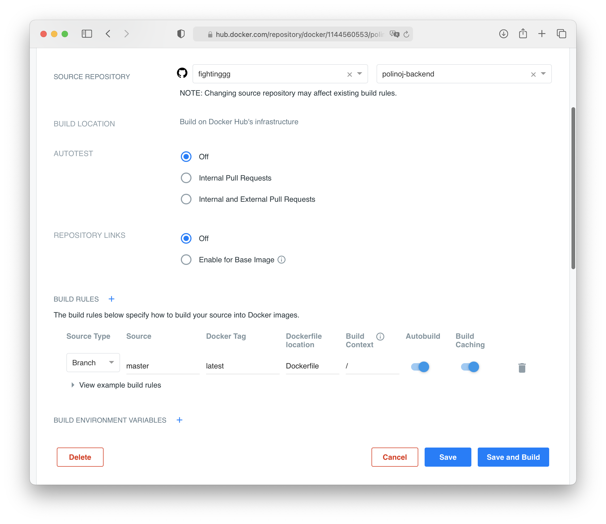
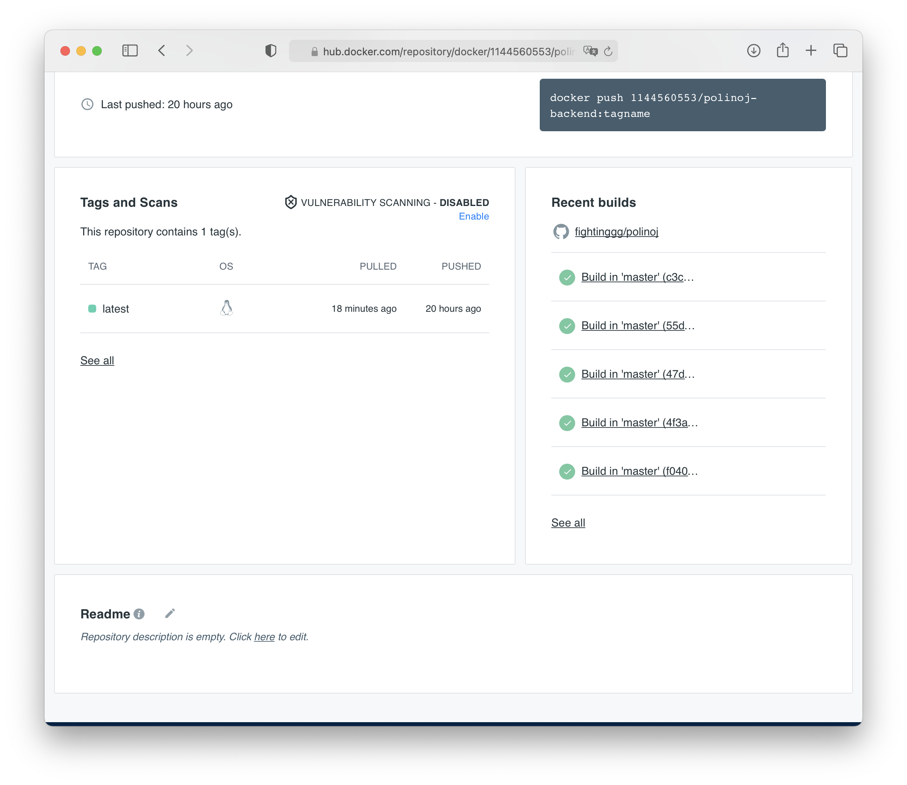

# CI/CD

持续集成、持续交付、持续部署

# Continuous Integration

持续集成，即每当开发者对代码进行push，会自动化构建流水线，在流水线中进行自动化冒烟测试，进行集成测试，当测试通过，可以通过邮件的方式告知开发者。

# Continuous Delivery

 持续交付，当CI通过以后，流水线会自动化地将代码进行构建，并部署到类真实环境中（即测试环境、预发步环境）如果代码没有问题，可以继续手动部署到生产环境中。

# Continuous Deployment

持续部署，当持续交付之后，代码即可自动化部署到生产环境。

<!-- more -->


# How To Do it

## 创建项目

首先在Github创建项目。

我们拿一个[spring boot项目](https://github.com/fightinggg/polinoj-backend)来说, 直接进入到[Dockerfile](https://github.com/fightinggg/polinoj-backend/blob/master/Dockerfile)下, 接下来简单介绍一下这个Dockerfile，第一个FROM表示用maven作为基础镜像，`COPY . /app`把整个项目源代码移动到/app下，然后`WORKDIR /app`进入到目录/app下，最后执行package，我这里使用`-Dmaven.test.skip=true`跳过了测试,所以这不是一个很棒的CI。至此编译产物构建完成。

然后启动第二个镜像构建任务，从openjdk-8-jre开始构建，使用`java -jar /app/main.jar`作为容器启动指令。于是运行镜像构建完成。

```dockerfile
FROM maven:3.8.1-openjdk-8
COPY . /app
WORKDIR /app
RUN mvn package -Dmaven.test.skip=true -q

FROM openjdk:8-jre
COPY --from=0 /app/start-polinoj/target/*.jar /app/main.jar
ENV JAVA_PARAM ''
CMD "java" "-jar" "/app/main.jar" $JAVA_PARAM
```

## Docker Hub Hook

然后我们去Dockerhub创建项目，并将其中的SOURCE REPOISITORY指向我们的GITHUB项目。



## Enjoy It

每当我们对这个项目的master分支执行push，则dockerhub上自动启动构建任务。



## 如何CD

dockerhub上有了镜像，我么要手动去部署吗？NO！ NO！ NO！

先安装docker，然后执行下面的指令

```sh
 docker run \
 -d \
 --name watchtower \
 -v /var/run/docker.sock:/var/run/docker.sock \
 -m 50M --memory-swap=1024M \
 v2tec/watchtower
```

> Watchtower is an application that will monitor your running Docker containers and watch for changes to the images that those containers were originally started from. If watchtower detects that an image has changed, it will automatically restart the container using the new image.


至此CD完成。


