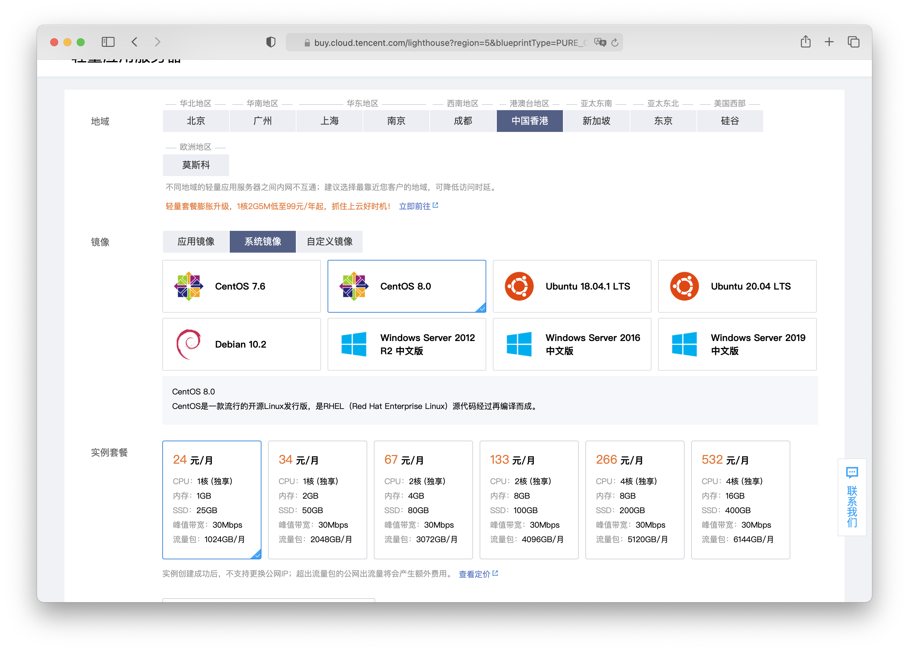
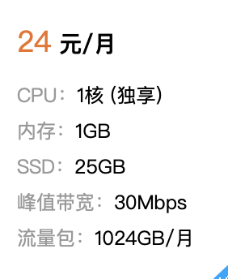
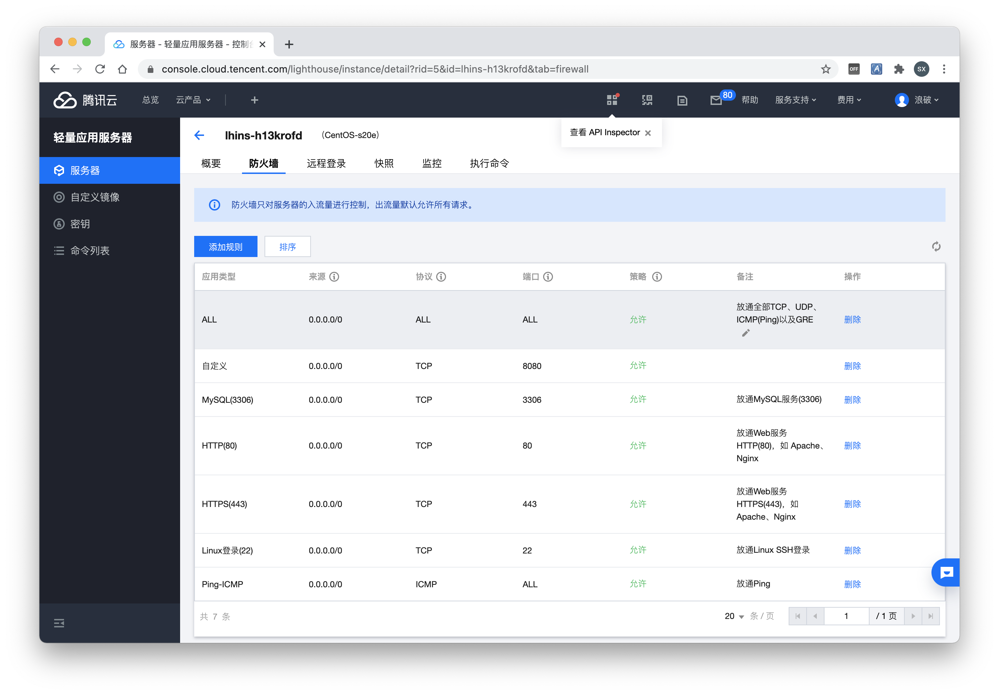
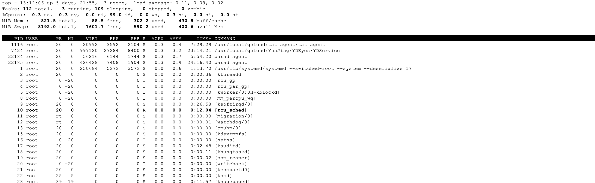
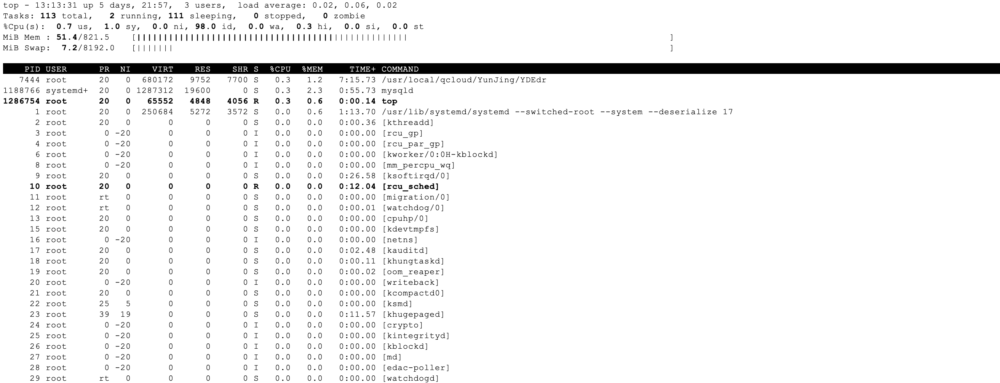
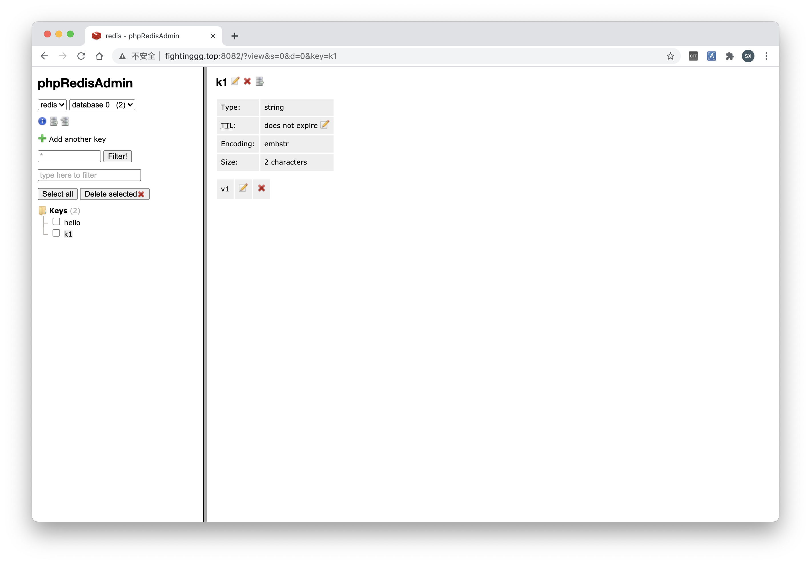

# 选购服务器

点击[链接](https://buy.cloud.tencent.com/lighthouse?buy_from=lh-console)并登陆即可来到轻量级服务器的选购地址，然后我们选择香港，选择centos8。选香港是因为那边的服务器可以访问外网并搭建VPN，而且域名也不用备案，比较简单，选centos8是因为现在流行的服务器都是centos



<!-- more -->

我们可以看到这个服务器是非常非常便宜的，但是1核1G也有他自己的缺点，即只能开两三个应用。




# 死机了

大家可以自己尝试，如果我们使用docker开启了msyql服务，整个服务器就死机了，原因是内存占用过高导致系统不稳定。

# 加大内存

轻量级服务器的内存很小，我们需要使用交换分区来伪造出更大的内存，按照以下方案来构造一个8G的交换空间。

```shell
cd /data
mkdir swap
cd swap
# 我们使用10G的交换空间 , 既然都已经使用了最低配的机器，就不在乎速度了。
dd if=/dev/zero of=swapfile bs=1M count=8192
mkswap swapfile
swapon swapfile
```

然后就内存就很大了，有8G的内存呢，是不是很开心（有内存用总比死机好）

# 启动一个服务

接下来介绍如和使用50MB的内存，启动一个mysql服务，这个办法可以拓展到所有其他服务诸如redis、kafka上。借此方法，你也能在一台1核1G的机器上启动十几个容器。

## 启动mysql服务

紧接着我们按照[这里](/QPZUWC.html)的方案创建一个mysql容器（内存只有50MB，交换空间有1G，你知道他有多慢吗？）

我们使用查看内存的指令，不难发现我们的mysql主要依赖于swap空间

```shell
[root@VM-4-4-centos swap]# free -h
              total        used        free      shared  buff/cache   available
Mem:          821Mi       321Mi       100Mi       0.0Ki       399Mi       377Mi
Swap:         8.0Gi       349Mi       7.7Gi
```

# 开启防火墙

我们在控制台点击左侧的服务器，点击防火墙，点击添加规则，选择ALL（允许所有的端口所有的协议）



# 连接数据库

然后使用idea的idea插件连接，我们可以看到ping的延时大概为1秒，当然我们也实现了mysql服务的运行。

# 运行了5个容器的docker服务

大家可以看到现在笔者这里已经运行了5个容器，分别是[polinoj](http://fightinggg.top:8081/welcome)(这个是我的毕设，还没做完，献个丑)的前后端，mysql服务，您现在查看的blog主站点的page服务，以及一个不可描述的vpn

```sh
[root@VM-4-4-centos ~]# docker stats
CONTAINER ID   NAME               CPU %     MEM USAGE / LIMIT     MEM %     NET I/O           BLOCK I/O         PIDS
5bc03f67b908   polinoj-frontend   0.00%     4.648MiB / 50MiB      9.30%     182kB / 1.94MB    24.3MB / 4.1kB    2
e33f7923267c   polinoj-backend    0.08%     44.93MiB / 50MiB      89.86%    382kB / 386kB     28.9GB / 0B       29
6a3819bdf87b   mysql              0.12%     34.62MiB / 50MiB      69.25%    513kB / 749kB     27.3GB / 24.8MB   48
b6714f9102f8   hexo-blog          0.00%     4.207MiB / 821.5MiB   0.51%     55.9MB / 1.07GB   3.14GB / 4.1kB    2
a3845de540c9   vpn                0.00%     7.441MiB / 821.5MiB   0.91%     11.5GB / 11.3GB   3.42GB / 0B       2
```

# 运行了这么多容器服务器稳定吗？

使用top指令，按下c让进程按照cpu使用率排序，我们发现cpu占用率很低，这对于我们1核心的服务器来说小菜一碟



然后按下m，按照内存排序，不难发现我们还有大量的内存空间没用使用。



所以5个容器对于我们的服务器来说简直是小菜一碟。

# 后续性能评测

这里我们讲创建更多的常用容器

## 启动一个redis

一个使用交换空间作为内存的redis，那性能一定很差了（能跑就行，总比没有好）

```sh
docker run -itd \
--name redis \
-p 6379:6379 \
-m 50M --memory-swap=1024M \
redis
```

## 启动一个redis web客户端

```sh
docker run -d \
--name redis-cli \
-m 50M --memory-swap=1024M \
--link redis:redis \
-e REDIS_1_HOST=redis \
-e REDIS_1_NAME=redis \
-p 8082:80 \
erikdubbelboer/phpredisadmin
```

然后就可以使用以下的[端口](http://fightinggg.top:8082)来访问redis服务了，笔者创建了两个kv



## 启动一个zookeeper服务

```sh
docker run -d \
-p 2181:2181 \
--name zookeeper \
-m 50M --memory-swap=1024M \
zookeeper
```

## 启动zookeeper web服务

```sh
docker run -d \
-p 8083:8080 \
--link zookeeper:zookeeper.zk \
-e ZK_DEFAULT_NODE=zookeeper.zk:2181/ \
--name zk-web \
-m 50M --memory-swap=1024M \
tobilg/zookeeper-webui
```

之后你可以在[这里](http://fightinggg.top:8083)看到你的zookeeper服务


## 启动一个kafka服务

```sh
docker run -d \
-e ZK_HOSTS=zookeeper.zk \
--link zookeeper:zookeeper.zk \
--name=kafka \
-p 9092:9092 \
-m 50M --memory-swap=1024M \
kafkamanager/kafka-manager
```

至此我们一共启动了10个容器，本次测试非常成功

```sh
[root@VM-4-4-centos ~]# docker ps -a
CONTAINER ID   IMAGE                                COMMAND                    CREATED              STATUS              PORTS                                                  NAMES
bff1f01703bd   tobilg/zookeeper-webui               "./bootstrap.sh"           About a minute ago   Up About a minute   0.0.0.0:8083->8080/tcp                                 zk-web
9e5331553179   kafkamanager/kafka-manager           "cmak-3.0.0.4/bin/cm…"     57 minutes ago       Up 57 minutes       9000/tcp, 0.0.0.0:9092->9092/tcp                       kafka
06cfdef9497c   zookeeper                            "/docker-entrypoint.…"     About an hour ago    Up About an hour    2888/tcp, 3888/tcp, 0.0.0.0:2181->2181/tcp, 8080/tcp   zookeeper
29f1d2a9d2d3   erikdubbelboer/phpredisadmin         "tini -- php -S 0.0.…"     About an hour ago    Up About an hour    0.0.0.0:8082->80/tcp                                   redis-cli
d97f48af2538   redis                                "docker-entrypoint.s…"     2 hours ago          Up 2 hours          0.0.0.0:6379->6379/tcp                                 redis
5bc03f67b908   1144560553/polinoj-frontend:latest   "/docker-entrypoint.…"     7 hours ago          Up 7 hours          0.0.0.0:8081->80/tcp                                   polinoj-frontend
e33f7923267c   1144560553/polinoj-backend:latest    "/bin/sh -c '\"java\" …"   7 hours ago          Up 7 hours          0.0.0.0:8080->80/tcp                                   polinoj-backend
6a3819bdf87b   mysql                                "docker-entrypoint.s…"     13 hours ago         Up 13 hours         0.0.0.0:3306->3306/tcp, 33060/tcp                      mysql
b6714f9102f8   nginx                                "/docker-entrypoint.…"     4 weeks ago          Up 6 days           0.0.0.0:80->80/tcp                                     hexo-blog
a3845de540c9   imhang/shadowsocks-docker            "/bin/sh -c 'ss-serv…"     4 weeks ago          Up 6 days           0.0.0.0:443->443/tcp, 0.0.0.0:443->443/udp             vpn
[root@VM-4-4-centos ~]# 
```

docker内存CPU使用情况如下

```sh
CONTAINER ID   NAME               CPU %     MEM USAGE / LIMIT     MEM %     NET I/O           BLOCK I/O         PIDS
d46b84eb9863   zk-web             0.14%     43.94MiB / 50MiB      87.88%    27.8kB / 286kB    4.55GB / 16.4kB   33
06cfdef9497c   zookeeper          0.81%     35.6MiB / 50MiB       71.20%    60.7kB / 49.6kB   9.02GB / 131kB    32
29f1d2a9d2d3   redis-cli          0.00%     5.695MiB / 50MiB      11.39%    676kB / 5.19MB    88.1MB / 0B       2
d97f48af2538   redis              0.88%     7.426MiB / 50MiB      14.85%    111kB / 471kB     132MB / 24.6kB    5
5bc03f67b908   polinoj-frontend   0.00%     1.613MiB / 50MiB      3.23%     225kB / 1.99MB    31.8MB / 4.1kB    2
e33f7923267c   polinoj-backend    0.09%     44.56MiB / 50MiB      89.12%    500kB / 514kB     33.9GB / 0B       29
6a3819bdf87b   mysql              0.10%     17.9MiB / 50MiB       35.80%    627kB / 857kB     28.3GB / 24.8MB   48
b6714f9102f8   hexo-blog          0.00%     3.031MiB / 821.5MiB   0.37%     56.6MB / 1.09GB   3.2GB / 4.1kB     2
a3845de540c9   vpn                0.01%     5.102MiB / 821.5MiB   0.62%     12.1GB / 11.8GB   3.43GB / 0B       2
```

系统内存使用情况

```sh
[root@VM-4-4-centos ~]# free -h
              total        used        free      shared  buff/cache   available
Mem:          821Mi       358Mi        88Mi       0.0Ki       374Mi       348Mi
Swap:         8.0Gi       782Mi       7.2Gi
```


## 启动一个kafka-web-ui服务

```sh
docker run -d \
-p 9000:9000 \
--link kafka:kafka \
-e KAFKA_BROKERCONNECT=kafka:9092 \
-e JVM_OPTS="-Xms32M -Xmx64M" \
-e SERVER_SERVLET_CONTEXTPATH="/" \
--name kafka-web-ui \
-m 30M --memory-swap=1024M \
obsidiandynamics/kafdrop
```


