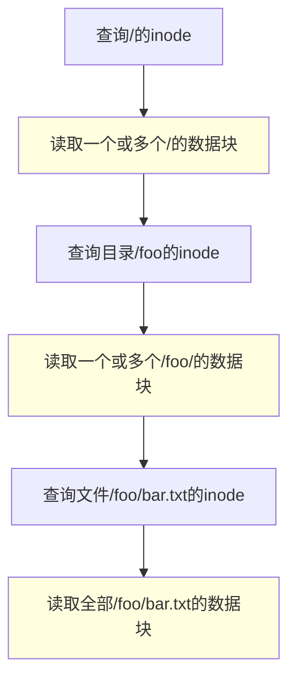
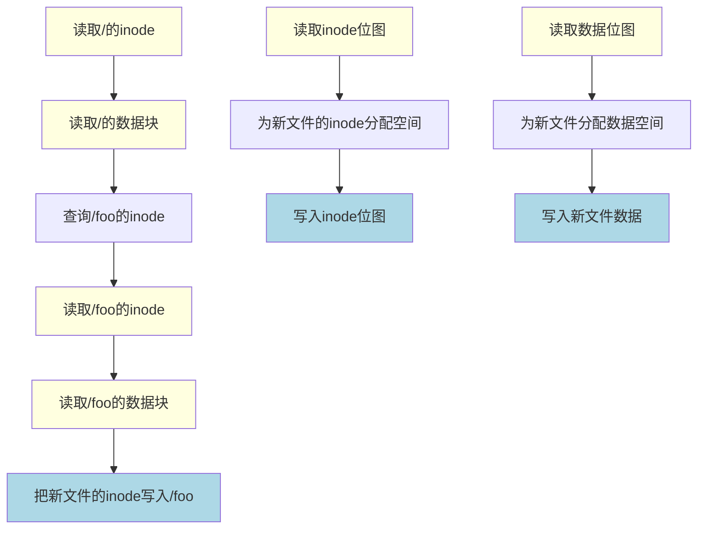

# 操作系统导论


<!-- more -->

# 推荐阅读

https://weread.qq.com/web/reader/db8329d071cc7f70db8a479kc81322c012c81e728d9d180

# 阅读感想

操作系统最伟大的地方就是他的抽象，将CPU虚拟化，把一个物理CPU变成了多个虚拟CPU，从而支持多个程序并发运行；通过内存虚拟化，将物理内存抽象为多个巨大的、高速的虚拟内存，让每一个进程都以为自己拥有无限大内存空间。

# 第4章 进程

运行的程序就是进程，操作系统有很多关于进程的API，

> ·创建（create）：操作系统必须包含一些创建新进程的方法。在shell中键入命令或双击应用程序图标时，会调用操作系统来创建新进程，运行指定的程序。
>
> ·销毁（destroy）：由于存在创建进程的接口，因此系统还提供了一个强制销毁进程的接口。当然，很多进程会在运行完成后自行退出。但是，如果它们不退出，用户可能希望终止它们，因此停止失控进程的接口非常有用。
>
> ·等待（wait）：有时等待进程停止运行是有用的，因此经常提供某种等待接口。
>
> ·其他控制（miscellaneous control）：除了杀死或等待进程外，有时还可能有其他控制。例如，大多数操作系统提供某种方法来暂停进程（停止运行一段时间），然后恢复（继续运行）。
>
> ·状态（status）：通常也有一些接口可以获得有关进程的状态信息，例如运行了多长时间，或者处于什么状态。

把程序和静态数据加载到内存，然后执行他就成了进程，现代操作系统将加载的过程lazily懒惰化了，需要用的时候才加载

进程有三个状态，运行、就绪、阻塞

# 第5章 进程API

fork , 复制当前的进程，父进程返回子进程pid，子进程返回0

wait，父进程等待子进程执行完毕

exec，加载某个程序到内存中运行，覆盖当前进程

> shell也是一个用户程序[插图]，它首先显示一个提示符（prompt），然后等待用户输入。你可以向它输入一个命令（一个可执行程序的名称及需要的参数），大多数情况下，shell可以在文件系统中找到这个可执行程序，调用fork()创建新进程，并调用exec()的某个变体来执行这个可执行程序，调用wait()等待该命令完成。子进程执行结束后，shell从wait()返回并再次输出一个提示符，等待用户输入下一条命令。

# 第6章 机制：受限直接执行

OS不可能说，创建了一个进程，把所有权限完全交给进程，然后把自己挂起，那坏蛋写一个死循环，我们就只能重启计算机了，OS会把CPU交给进程，但是他如何拿回来呢？

> 答案很简单，许多年前构建计算机系统的许多人都发现了：时钟中断（timer interrupt）[M+63]。时钟设备可以编程为每隔几毫秒产生一次中断。产生中断时，当前正在运行的进程停止，操作系统中预先配置的中断处理程序（interrupt handler）会运行。此时，操作系统重新获得CPU的控制权，因此可以做它想做的事：停止当前进程，并启动另一个进程。

# <span style="color:red">第8章 调度：多级反馈队列</span>

> ·规则1：如果A的优先级 > B的优先级，运行A（不运行B）。
>
> ·规则2：如果A的优先级 = B的优先级，轮转运行A和B。
>
> ·规则3：工作进入系统时，放在最高优先级（最上层队列）。
>
> ·规则4：一旦工作用完了其在某一层中的时间配额（无论中间主动放弃了多少次CPU），就降低其优先级（移入低一级队列）。
>
> ·规则5：经过一段时间S，就将系统中所有工作重新加入最高优先级队列。

规则4是反馈

规则5可避免饥饿

# 第9章 调度： 比例份额

## 彩票调度

很多人都买过彩票，但是很少有人中奖，我们假设有100张彩票，有AB两个人分别买了75张和25张，然后我们进行随机开奖，开到一张票，这张票在谁手上谁就中奖。

同理，我们假设AB是两个进程，则中奖的那位就能获得CPU控制权。

### 彩票货币

如果进程可以将自己的彩票分配给自己的线程，则实现了彩票货币化。

### 彩票转让

一个进程可以吧自己的彩票分给其他进程，例如客户端把彩票分给服务端以加快服务端处理速度。

### 彩票通胀

> 最后，彩票通胀（ticket inflation）有时也很有用。利用通胀，一个进程可以临时提升或降低自己拥有的彩票数量。当然在竞争环境中，进程之间互相不信任，这种机制就没什么意义。

### 算法实现

我们只需要记录每个进程拥有多少彩票，并把他们排好，然后OS生产随机数，从第一个进程开始，对彩票数进行累加，当累和第一次超过随机数时，这个进程中奖。

我们还可以对进程按照彩票数从大到小排好序，这样可以加快遍历速度。

## 步长调度

> A、B、C这3个工作的票数分别是100、50和250，我们通过用一个大数分别除以他们的票数来获得每个进程的步长。比如用10000除以这些票数值，得到了3个进程的步长分别为100、200和40。我们称这个值为每个进程的步长（stride）。每次进程运行后，我们会让它的计数器 [称为行程（pass）值] 增加它的步长，记录它的总体进展。

当进行调度的时候，取出行程最小的进程进行调度，如果有多个，则从中随机选择任意一个。

# 第10章 多处理器调度（高级）

## 问题

- 缓存一致性： CPU1修改了自己的缓存，但是CPU2没有同步修改怎么办？

> 硬件提供了这个问题的基本解决方案：通过监控内存访问，硬件可以保证获得正确的数据，并保证共享内存的唯一性。在基于总线的系统中，一种方式是使用总线窥探（bus snooping）[G83]。每个缓存都通过监听链接所有缓存和内存的总线，来发现内存访问。如果CPU发现对它放在缓存中的数据的更新，会作废（invalidate）本地副本（从缓存中移除），或更新（update）它（修改为新值）。回写缓存，如上面提到的，让事情更复杂（由于对内存的写入稍后才会看到），你可以想想基本方案如何工作

- 并行(发)问题：

> 如果线程1执行第一行，会将head的当前值存入它的tmp变量。如果线程2接着也执行第一行，它也会将同样的head值存入它自己的私有tmp变量（tmp在栈上分配，因此每个线程都有自己的私有存储）。因此，两个线程会尝试删除同一个链表头，而不是每个线程移除一个元素，

```c
void rease(){
  Node *tmp = head;
  // ...
  free(tmp);
}
```

- 缓存亲和度： 一个线程在某个CPU上运行，他会有一些缓存，如果他切换到其他CPU上，则缓存需要重新加载。

## 单队列多处理器调度

（Single QueueMultiprocessor Scheduling，SQMS) 一个队列，处理器需要执行时，锁住队列，然后从队列取出任务，最后释放锁，但是他不好解决亲和度问题和锁的问题。

## 多队列多处理器调度

（Multi-QueueMultiprocessor Scheduling，MQMS）多个队列，一般而言，一个处理器一个队列，如果任务数量能整除CPU数量，这很好分配，无法整除的时候，就涉及到了负载不均的问题。

> 最明显的答案是让工作移动，这种技术我们称为迁移（migration）。通过工作的跨CPU迁移，可以真正实现负载均衡。

注意我们要让任务轮流迁移，否则就不太公平

另一个方法是**窃取**工作量少的队列不定期偷看其他队列，如果发现他比自己多，则偷取一个任务。

> 如果太频繁地检查其他队列，就会带来较高的开销，可扩展性不好，而这是多队列调度最初的全部目标！相反，如果检查间隔太长，又可能会带来严重的负载不均。

# 第15章 机制：地址转换

### 动态（基于硬件）重定位

即基址加界限机制，所有的程序都认为自己的地址空间从0开始，但是当他执行的时候，操作系统会决定其在物理内存中的实际加载地址，并将起始地址记录在基址寄存器中。

# 第16章 分段

问题：栈和堆之间，有一大块“空闲”空间，造成了浪费

在硬件中使用三对寄存器来分别记录代码段，堆和栈

问题： 如何判断一个地址是代码段，堆还是栈？

虚拟地址前两位表示

问题： 如何共享？

操作系统为段记录额外信息，


# 第17章 空闲空间管理

> 要满足变长的分配请求，应该如何管理空闲空间？什么策略可以让碎片最小化？不同方法的时间和空间开销如何？

## OS如何知道free的内存有多大？

在C中，每当我们使用malloc的时候，OS会给我们分配一块内存，当我们使用free的时候，这块内存会被释放，然而这个时候OS如何知道这块内存有多大，他该如何来释放呢？


其实malloc返回给我们的内存是小于OS给我们的内存的，可以看到OS在这块内存的前面加了一些信息，包括内存的大小和一个校验部分。

## OS如何组织空闲内存？

每块内存的开头都有一个部分，包括这块内存的大小以及下一块内存的地址


## 内存分配和释放

OS分配内存的时候，会在他的内存链表中找到一块合适的，将其切割并移除链表分配给应用程序，当OS回收的时候，会将其放回链表，但是这个办法经历了长时间的内存管理以后，OS的内存将会一团糟，这个时候操作系统又会合并相邻块，之后内存又成为了一个整体。

## 如何选择链表中的内存块？


| 匹配算法 | 备注 |   |
| - | - | - |
| 最优匹配 | 在所有可以分割的节点中，选择内存最小的那个节点 |   |
| 最差匹配 | 在所有可以分割的节点中，选择内存最大的那个节点 |   |
| 首次匹配 | 寻找过程中，发现的第一个能匹配的节点 |   |
| 下次匹配 | 在首次匹配的基础上，每次查询的链表起点就是上一次匹配的节点 |   |

## 有趣的匹配算法

分离空闲列表：

> 如果某个应用程序经常申请一种（或几种）大小的内存空间，那就用一个独立的列表，只管理这样大小的对象。其他大小的请求都交给更通用的内存分配程序。

伙伴系统:


# 第18章 分页：介绍

## 页表是什么，在哪里？

用一张表，储存虚拟地址到物理地址的映射，往往虚拟地址和物理地址的前几位是不同的，这些不同的位被称为页，而剩下的成为偏移量。从虚拟地址映射到物理地址只需要将前几位进行转换即可，这张表就叫做页表。

页表储存在内存中，每个进程都拥有一份自己的页表。

## 页表中有什么

页表往往是一个数组映射，所以没有物理叶帧（数组下标）


| 代号 | 意义 | 备注 |
| :-: | :-: | :-: |
| P | 存在位 | 表示该页表是否被进程申请使用 |
| R/W | 读写权限位 | 表示该页面权限是可读还是可写 |
| U/S | 访问是否需要特权级 |   |
| PWT |   |   |
| PCD |   |   |
| A | 访问位 | 近期是否访问过该页 |
| D | 脏位 | 该页是否被写 |
| PAT |   |   |
| G |   |   |
| ？ | 操作系统自定义使用 |   |
| PFN | 叶帧 |   |


## 分页很慢

分页机制导致与内存发生的交互次数翻倍了，程序更慢了。

# 第19章 分页：快速地址转换（TLB）

高速页表缓冲区：地址转换旁路缓冲存储器（translation-lookasidebuffer）

这是一个硬件，他能缓存页表地址转化，速度远高于内存读取

## TLB未命中

> TLB和其他缓存相似，前提是在一般情况下，转换映射会在缓存中（即命中）。如果是这样，只增加了很少的开销，因为TLB处理器核心附近，设计的访问速度很快。如果TLB未命中，就会带来很大的分页开销。必须访问页表来查找转换映射，导致一次额外的内存引用（或者更多，如果页表更复杂）。如果这经常发生，程序的运行就会显著变慢。相对于大多数CPU指令，内存访问开销很大，TLB未命中导致更多内存访问。因此，我们希望尽可能避免TLB未命中。

一般是操作系统来处理未命中，发生未命中，硬件抛异常，进入内核，陷入操作系统，操作系统更新TLB，返回之前的未命中代码进行**重试**

重点细节：

- 返回进入陷阱的那条代码重试。
- OS千万不能在处理TLB时又触发未命中，这将导致无限递归。

## 进程上下文切换

页表是进程私有的，如果发生了进程上下文切换，则TLB全部变为无效。

> 上下文切换的时候清空TLB，这是一个可行的解决方案，进程不会再读到错误的地址映射。但是，有一定开销：每次进程运行，当它访问数据和代码页时，都会触发TLB未命中。如果操作系统频繁地切换进程，这种开销会很高。
>
> 为了减少这种开销，一些系统增加了硬件支持，实现跨上下文切换的TLB共享。比如有的系统在TLB中添加了一个地址空间标识符（Address Space Identifier，ASID）。可以把ASID看作是进程标识符（Process Identifier，PID），但通常比PID位数少（PID一般32位，ASID一般是8位）。

## TLB项中有什么

TLB是并行硬件，他可以并行查找


| 代号 | 意义 | 备注 |
| :-: | :-: | :-: |
| VPN |   |   |
| R/W | 全局位 | 是否全局共享 |
|   |   |   |
| PWT | 进程空间 | 属于哪个进程 |
|   |   |   |
| PFN |   |   |
| C | 一致位 | 决定硬件如何缓存 |
| D | 脏位 | 是否被写入新数据 |
| V | 有效位 | 该映射是否有效（注意区别页表的存在位） |
|   |   |   |


# 第20章 分页：较小的表

> 页表太大，因此消耗的内存太多。

> 假设一个32位地址空间（232字节），4KB（212字节）的页和一个4字节的页表项。一个地址空间中大约有一百万个虚拟页面（232/212）。乘以页表项的大小，你会发现页表大小为4MB。

## 使用更大的页

> 这种方法的主要问题在于，大内存页会导致每页内的浪费，这被称为内部碎片（internalfragmentation）问题

## 结合分段

> 我们可能有3个页表，地址空间的代码、堆和栈部分各有一个

> 杂合方案的关键区别在于，每个分段都有界限寄存器，每个界限寄存器保存了段中最大有效页的值。

> 分段并不像我们需要的那样灵活，因为它假定地址空间有一定的使用模式。例如，如果有一个大而稀疏的堆，仍然可能导致大量的页表浪费。

## 多级页表

分配更多级的页表，这是使用时间换空间

## 反向页表

记录物理页映射到虚拟页，而不是虚拟页映射到物理页

# 第21章 超越物理内存：机制

我们的内存始终是有限的，如何超越这个限制，为应用程序提供无限空间的假象呢？

> 操作系统如何利用大而慢的设备，透明地提供巨大虚拟地址空间的假象？

操作系统利用大而慢的磁盘和内存中的数据进行交换，借此实现了超越物理内存的目的。

## 页错误

> 如果一个页不存在，它已被交换到硬盘，在处理页错误的时候，操作系统需要将该页交换到内存中。那么，问题来了：操作系统如何知道所需的页在哪儿？在许多系统中，页表是存储这些信息最自然的地方。因此，操作系统可以用PTE中的某些位来存储硬盘地址，这些位通常用来存储像页的PFN这样的数据。当操作系统接收到页错误时，它会在PTE中查找地址，并将请求发送到硬盘，将页读取到内存中。

## 交换何时发生？

OS不会等到内存完全满了才进行交换，OS往往会预留BUF。

> 为了保证有少量的空闲内存，大多数操作系统会设置高水位线（High Watermark，HW）和低水位线（Low Watermark，LW），来帮助决定何时从内存中清除页。原理是这样：当操作系统发现有少于LW个页可用时，后台负责释放内存的线程会开始运行，直到有HW个可用的物理页。这个后台线程有时称为交换守护进程（swap daemon）或页守护进程（page daemon）[插图]，它然后会很开心地进入休眠状态，因为它毕竟为操作系统释放了一些内存

# 第22章 超越物理内存：策略

## 最优替换策略

只存在于理论上的策略，他的作用是评估其他算法

## FIFO

先进先出

> 补充：Belady的异常Belady（最优策略发明者）及其同事发现了一个有意思的引用序列[BNS69]。内存引用顺序是：1，2，3，4，1，2，5，1，2，3，4，5。他们正在研究的替换策略是FIFO。有趣的问题：当缓存大小从3变成4时，缓存命中率如何变化？
>
> 一般来说，当缓存变大时，缓存命中率是会提高的（变好）。但在这个例子，采用FIFO，命中率反而下降了！你可以自己计算一下缓存命中和未命中次数。这种奇怪的现象被称为Belady的异常（Belady’s Anomaly）。
>
> 其他一些策略，比如LRU，不会遇到这个问题。可以猜猜为什么？事实证明，LRU具有所谓的栈特性（stack property）[M+70]。对于具有这个性质的算法，大小为N + 1的缓存自然包括大小为N的缓存的内容。因此，当增加缓存大小时，缓存命中率至少保证不变，有可能提高。先进先出（FIFO）和随机（Random）等显然没有栈特性，因此容易出现异常行为。

## 随机

随机选择一个换出去

## LRU

最近最少使用的页面，在最近的一段时间访问的页面中，过了很久都没有访问的那个页面，踢出去，这个算法速度较慢

## 近似LRU（时钟算法）

> 每当页被引用（即读或写）时，硬件将使用位设置为1。但是，硬件不会清除该位（即将其设置为0），这由操作系统负责 
>
> 时钟指针（clock hand）开始时指向某个特定的页（哪个页不重要）。当必须进行页替换时，操作系统检查当前指向的页P的使用位是1还是0。如果是1，则意味着页面P最近被使用，因此不适合被替换。然后，P的使用位设置为0，时钟指针递增到下一页（P + 1）。该算法一直持续到找到一个使用位为0的页，使用位为0意味着这个页最近没有被使用过

## 脏页问题

如果一个页被修改，他会变成脏页，踢出去必须写回磁盘，这非常昂贵

> 为了支持这种行为，硬件应该包括一个修改位（modified bit，又名脏位，dirty bit）。每次写入页时都会设置此位，因此可以将其合并到页面替换算法中。例如，时钟算法可以被改变，以扫描既未使用又干净的页先踢出。

## 抖动

当内存超额的时候，系统疯狂的进行换页，这被称为抖动。现代操作系统一旦检测到抖动，就会将某些内存密集型进程杀死。

# 第28章 锁

笔者： 从这一章开始，到并发结束，都很难

> 我们希望原子式执行一系列指令，但由于单处理器上的中断（或者多个线程在多处理器上并发执行），我们做不到

## 如何评价一个锁？

首先是锁能否完成它的基本任务，即互斥；第二是公平性；最后是性能

## 控制中断

早期的解决方案是在临界区关闭中断。他有很多缺点

- 这种方法要求我们允许所有调用线程执行特权操作，这会导致很多麻烦，贪婪的线程独占CPU，恶意的程序死循环，系统就崩溃了

- 无法支持多CPU

- 丢失中断

- 效率低下


## Peterson算法

> 一段时间以来，出于某种原因，大家都热衷于研究不依赖硬件支持的锁机制。后来这些工作都没有太多意义，因为只需要很少的硬件支持，实现锁就会容易很多（实际在多处理器的早期，就有这些硬件支持）。而且上面提到的方法无法运行在现代硬件（应为松散内存一致性模型），导致它们更加没有用处。更多的相关研究也湮没在历史中……

## Test And Set

这是一个操作系统原子指令，把一个内存变量赋予新的值，并返回旧的值。

然后我们就可以实现锁了

```c
// 操作系统原语伪代码
int testAndSet(int*ptr, int value) {
    int old = *ptr;
    *ptr = value;
    return old;
}

// 锁
struct TasLock {
    int flag;

    TasLock() {
        flag = 0;
    }

    void lock() {
        while (testAndSet(&flag, 1) == 1){
            // do nothing;
        }
    }

    void unlock() {
        flag = 0;
    }
};
```

这个锁是正确的，但是他没办法保证公平，会出现饿死，在单CPU上他的性能很差，如果一个线程获取锁失败，他会一直自旋，直到时间片用完，在多CPU（线程数=CPU数）上表现不错

## Compare And Swap

比较并交换，如果和旧值相等，就赋值，否则什么也不做

这个算法和上面的test and set区别其实不大

```c
// 操作系统原语伪代码
int cas(int*ptr, int expected, int value) {
    int old = *ptr;
    if(old == expected) {
        *ptr = value;
    }
    return old;
}

// 锁
struct CasLock {
    int flag;

    CasLock() {
        flag = 0;
    }

    void lock() {
        while (cas(&flag, 0, 1) == 1){
            // do nothing;
        }
    }

    void unlock() {
        flag = 0;
    }
};
```

## 链接的加载和条件式存储指令

这个算法和test and set也是一样

```c
// 操作系统原语伪代码
int loadLinked(int *ptr) {
    return *ptr;
}
int storeConditional(int *ptr, int value) {
    if(自从ptr被loadLinked以来，他没有更新过) {
        *ptr = value;
        return 1; // success
    } else {
        return 0; // failed
    }
}

// 锁
struct LoadLinkeLock {
    int flag;

    LoadLinkeLock() {
        flag = 0;
    }

    void lock() {
        while (true){
            while (loadLinked(&flag) == 1) {
                // do noting
            }
            if(storeConditional(&flag, 1) == 1) {
                break;
            }
        }
    }

    void unlock() {
        flag = 0;
    }
};
```

## Fetch And Add

返回旧值并让这个值加一

```c
// 操作系统原语伪代码
int fetchAndAdd(int *ptr) {
    int old = *ptr;
    *ptr = old + 1;
    return old;
}

// 锁
struct FAALock {
    int turn;
    int ticket;

    FAALock() {
        turn = 1;
        ticket = 0;
    }

    void lock() {
        int myTurn = fetchAndAdd(ticket);
        while(turn != myTurn) {
            // do noting
        }
    }

    void unlock() {
        fetchAndAdd(turn);
    }
};
```

这个方法其实比较厉害，他能保证公平


## 自旋太费CPU了

让我稍微改进一下testAndSet的lock函数，新的方法避免了自旋，但是他依然会出现饥饿，例如一个线程每次都yield，另一个线程一直进出临界区

```c
// 继承TasLock  
struct YieldTasLock : TasLock {
    YieldTasLock() {
        supper();
    }
    // Override
    void lock() {
        while (testAndSet(&flag, 1) == 1){
            yield(); // 主动放弃CPU，切换到其他线程
        }
    }
}
```

## 休眠队列

我们可以改进TasLock锁， 改进之后的锁产生饥饿的概率变小了，唯一的自旋出现在内置tasLock中，但是这个锁等待的时间是有限的

```c
struct SleepQueueLock {
    int flag;
    TasLock *tasLock;
    Queue *queue;

    SleepQueueLock() {
        flag = 0;
        tasLock = new TasLock();
        queue = new Queue();
    }

    void lock() {
        tasLock.lock(); // 自旋获取锁
        // 进入临界区
        if(flag == 0) {
            flag = 1;
            tasLock.unlock(); // 离开临界区解锁
        } else {
            queue.add(getThreadId()); // 把线程加入队列
            tasLock.unlock(); // 离开临界区解锁， 先解锁后park，否则死锁
            // 如果注释所在的这一行发生了上下文切换，那么这个线程就可能会永远沉睡了
            park(); // 线程休眠 ， 
        }
    }

    void unlock() {
        tasLock.lock(); // 自旋获取锁
        // 进入临界区
        if(queue.isEmpty()) {
            flag = 0
        } else {
            // 这里不用设置flag=0
            unpark(queue.remove()); //唤醒一个在队列中的x
        }
        tasLock.unlock();  // 离开临界区解锁
    }
}
```

> 最后，你可能注意到解决方案中的竞争条件，就在park()调用之前。如果不凑巧，一个线程将要park，假定它应该睡到锁可用时。这时切换到另一个线程（比如持有锁的线程），这可能会导致麻烦。比如，如果该线程随后释放了锁。接下来第一个线程的park会永远睡下去（可能）。这种问题有时称为唤醒/等待竞争（wakeup/waiting race）。为了避免这种情况，我们需要额外的工作。Solaris通过增加了第三个系统调用separk()来解决这一问题。通过setpark()，一个线程表明自己马上要park。如果刚好另一个线程被调度，并且调用了unpark，那么后续的park调用就会直接返回，而不是一直睡眠。

## 两阶段锁

先自旋一段时间，如果还是没有获得锁，就直接睡眠。


# 第29章 基于锁的并发数据结构

##  并发计数器

```c
struct Counter {
    int value;
    Lock lock;
    
    Counter() {
        value = 0;
        lock = new Lock();
    }
    
    void increment() {
        lock.lock();
    	value ++;
        lock.unlock();
    }
    
    void get() {
        lock.lock();
        int res = value;
        lock.unlock();
        return res;
    }
}
```

这个并发计数器遵循了最简单的结构，即直接加锁。他唯一不好的地方就是他的性能太差，并发度很低。

## 惰性并发计数器

```c
struct LazyCounter {
    int* threadValue;
    int lazyBounder;
    
    int value;
    Lock lock;
    
    LazyCounter(int threadNumber,int lazyBounder) {
        threadValue = new int[threadNumber];
        for (int i = 0; i < threadNumber; i++) {
            threadValue[i] = 0;
        }
        this->lazyBounder = lazyBounder;
        
        value =  0;
        lock = new Lock();
    }
    
    void increment(int threadId) {
    	threadValue[threadId] ++;
        if(threadValue[threadId] = lazyBounder) {
            lock.lock();
            value += lazyBounder;
            lock.unlock();
            threadValue[threadId] = 0;
        }
    }
    
    void get() {
        lock.lock();
        int res = value;
        lock.unlock();
        return res;
    }
}
```

惰性并发计数器为每一个线程分配了一个自己的惰性累和，只有当这个累和打到了阈值以后，才会加入到全局的累和中。这个数据结构提高了并发度。

## 并发链表

```c
struct List {
    struct ListNode {
        int value;
        Listnode* next;
        // ... 全参构造函数
    };

    ListNode* head;
    Lock* lock;
    // ... 全参构造函数

    void insert(int value) {
        lock.lock();
        ListNode* listNode = new ListNode(value, null);
        if (listNode == null) {
            perror("没有足够的空间");
            lock.unlock();
            return -1; // failed
        }
        listNode->next = head;
        head = listNode;
        lock.unlock();
    }
}
```

> 从代码中可以看出，代码插入函数入口处获取锁，结束时释放锁。如果new失败（在极少的时候），会有一点小问题，在这种情况下，代码在插入失败之前，必须释放锁。
>
> 事实表明，这种异常控制流容易产生错误。最近一个Linux内核补丁的研究表明，有40%都是这种很少发生的代码路径（实际上，这个发现启发了我们自己的一些研究，我们从Linux文件系统中移除了所有内存失败的路径，得到了更健壮的系统[S+11]）。

另一方面，锁的粒度还可以更小

```c
void insert(int value) {
    ListNode* listNode = new ListNode(value, null);
    if (listNode == null) {
        perror("没有足够的空间");
        lock.unlock();
        return -1; // failed
    }

    lock.lock();
    listNode->next = head;
    head = listNode;
    lock.unlock();
}
```

### 过手锁

> 原理也很简单。每个节点都有一个锁，替代之前整个链表一个锁。遍历链表的时候，首先抢占下一个节点的锁，然后释放当前节点的锁。
>
> 从概念上说，过手锁链表有点道理，它增加了链表操作的并发程度。但是实际上，在遍历的时候，每个节点获取锁、释放锁的开销巨大，很难比单锁的方法快。即使有大量的线程和很大的链表，这种并发的方案也不一定会比单锁的方案快。也许某种杂合的方案（一定数量的节点用一个锁）值得去研究。
>
> 如果方案带来了大量的开销（例如，频繁地获取锁、释放锁），那么高并发就没有什么意义。如果简单的方案很少用到高开销的调用，通常会很有效。增加更多的锁和复杂性可能会适得其反。

## 并发队列

第一个方法依然是加一个大锁，这很简单。现在我们考虑其他做法。


另一个方法是对队首和队尾分别加锁。

```c
struct Queue {
    struct QueueNode {
        int value;
        QueueNode* next;
        // ... 构造函数
    };

    QueueNode head;
    QueueNode tail;
    Lock headLock;
    Lock tailLock;
    // ... 构造函数

    void enQueue(int value) {
        QueueNode* tmp = new QueueNode(value, null);
        assert(tmp != NULL);

        tailLock.lock();
        tail->next = tmp;
        tail = tmp;
        tailLock.unlock();
    }

    bool deQueue(int* target) {
        headLock.lock();
        QueueNode* tmp = head;
        QueueNode* newHead = head->next;
        if(newHead == NULL) {
            headLock.unlock();
            return false;
        }

        *target = newHead->value; // 取出队首
        head = newHead; // 更新指向队首的节点
        headLock.unlock();

        delete tmp;
        return true;
    }

}
```


## 并发散列表

我们可以直接利用前面的并发链表来实现并发散列表，不需要增加额外的锁。


# 第30章 条件变量

## wait与signal

前面我们了解了锁，但是锁并非并发程序设计所需的唯一原语。

> 具体来说，在很多情况下，线程需要检查某一条件（condition）满足之后，才会继续运行。例如，父线程需要检查子线程是否执行完毕 [这常被称为join()]。

下面展示一个使用wait()和signal()实现的父线程等待子线程的情况, 

当线程睡眠可以调用wait，线程被唤醒时会自动获取锁

当另一个线程想要唤醒在这个条件变量上等待的线程时，可以调用signal，当然唤醒后不一定马上切换过去运行

```c
struct Condition {
	void wait(Lock lock); //释放锁并睡眠,醒来时获取锁
    void signal(); // 唤醒在此条件上等待的线程
}

bool done = false;
Mutex *mutex = new Mutex();
Condition *condition = new Condition();

void threadExit() {
    mutex.lock();
    done = true;
    condition->signal();
    mutex.unlock();
}
void child(void *arg) {
    printf("child\n");
    threadExit();
}

void threadJoin() {
    mutex.lock();
    while(!done) {
        condition->wait(mutex);
    }
    mutex.unlock();
}

int main() {
    print("parent: begin\n");
    pthread_t p;
    Pthread_create(&p, NULL, child, NULL);
    threadJoin();
    printf("parent: end\n");
}

```

## 生产者消费者

我们假设只有一个生产者，一个消费者，

```c
Condition *condition;
Mutex *mutex;
Queue *queue; //无并发控制的Queue

void producer(int loops) {
    for(int i = 0; i < loops; i++) {
        mutex->lock();
        if(queue->fill()) {
            condition->wait(mutex); // 队列满了，无法生产，进入睡眠
        }
        queue->insert(i); // 放入了一个东西
        condition->signal(); // 唤醒等待条件的线程
        mutex->unlock();
    }
}

void consumer(int loops) {
    for(int i = 0; i < loops; i++) {
        mutex->lock();
        if(queue->empty()) {
            condition->wait(mutex); // 队列空了， 无法消费，进入睡眠
        }
        queue->remove(); // 从队列中取出元素，消费
        condition->signal(); // 唤醒等待条件的线程
        mutex->unlock();
    }
}
```

如果只有一个消费者和一个生产者，这个代码正常工作，但是如果违反了这两个条件，这段代码会出现两个问题。

暂停思考

暂停思考

暂停思考

暂停思考

1. 8行和20行不能使用if，应该是while，例如一个消费者首先wait，然后一个生产者生产并signal，接着又一个消费者抢先获取锁，并进行了消费，最后CPU调度到第一个消费者时，他已经执行过if，直接强行消费，主要原因因为被唤醒后不一定直接执行，CPU可能调度其他线程，
2. 生产者应该唤醒消费者，消费者应该唤醒生产者

```c
Condition *empty;
Condition *fill;
Mutex *mutex;
Queue *queue; //无并发控制的Queue

void producer(int loops) {
    for(int i = 0; i < loops; i++) {
        mutex->lock();
        while (queue->fill()) {
            fill->wait(mutex); // 队列满了，无法生产，进入睡眠,
        }
        queue->insert(i); // 放入了一个东西
        empty->signal(); // 唤醒等待条件的线程
        mutex->unlock();
    }
}

void consumer(int loops) {
    for(int i = 0; i < loops; i++) {
        mutex->lock();
        while (queue->empty()) {
            empty->wait(mutex); // 队列空了， 无法消费，进入睡眠
        }
        queue->remove(); // 从队列中取出元素，消费
        fill->signal(); // 唤醒等待条件的线程
        mutex->unlock();
    }
}
```

## 覆盖条件

即唤醒所有的线程，而不是signal中的唤醒一个。


# 第31章 信号量

> Dijkstra及其同事发明了信号量，作为与同步有关的所有工作的唯一原语。你会看到，可以使用信号量作为锁和条件变量

接下来是信号量的定义

 ```c
struct Semaphore {
    int value;
    // ... 全参构造函数

    int wait() {
        // Dijkstra 称之为 P()， 荷兰语： to probe
        // 人们有时候会用 down()
        // 要么直接返回，要么挂起并等待post
        // value --, 如果value为负数，则挂起等待
    }

    int post() {
        // Dijkstra 称之为 V()， 荷兰语： to test
        // 人们有时候会用 up()
        // 增加信号量，如果有等待的线程，则唤醒
        // value ++， 如果有一个或多个线程等待，则唤醒一个
    }
}
 ```


## 二值信号量（锁）

如果初始信号量为1， 则信号量就是锁


## 信号量作为条件变量

如果初始信号量为0，则信号量就是条件变量


## 生产者与消费者

先来一个很简单的有bug的代码，来找找bug（一个）

```c
Semaphore *fill = new Semaphore(0); //
Semaphore *empty = new Semaphore(MAX); // 初始队列没有任何东西，视为全部是空

void producer(int loops) {
    for(int i = 0; i < loops; i++) {
        empty->wait(); // 等待空的条件
        queue->insert(i); // 放入了一个东西
        fill->post(); // 通知消费者，满
    }
}

void consumer(int loops) {
    for(int i = 0; i < loops; i++) {
        fill->wait(); // 等待满的条件
        queue->remove(); // 从队列中取出元素，消费
        empty->post(); // 通知生产者，空
    }
}
```

bug很明显，没有锁。如果有多个生产者，他们会同时执行第7行，这将导致很明显的并发问题，我们通过下面的代码直接加锁,但是这和条件变量相比，还是有一点问题，他会死锁，由于条件变量的wait会释放锁，但是信号量却不会。

```diff
Semaphore *fill = new Semaphore(0); //
Semaphore *empty = new Semaphore(MAX); // 初始队列没有任何东西，视为全部是空
+ Semaphore *mutex = new Semaphore(1); // 锁

void producer(int loops) {
    for(int i = 0; i < loops; i++) {
+        mutex->wait();
        empty->wait(); // 等待空的条件
        queue->insert(i); // 放入了一个东西
        fill->post(); // 通知消费者，满
+        mutex->post();
    }
}

void consumer(int loops) {
    for(int i = 0; i < loops; i++) {
+        mutex->wait();
        fill->wait(); // 等待满的条件
        queue->remove(); // 从队列中取出元素，消费
        empty->post(); // 通知生产者，空
+        mutex->post();
    }
}
```

最后我们交换锁的位置，这个程序就并发安全了。<span style="color:red">但是为什么？又该如何证明一个程序时并发安全的？</span>

```c
Semaphore *fill = new Semaphore(0); //
Semaphore *empty = new Semaphore(MAX); // 初始队列没有任何东西，视为全部是空
Semaphore *mutex = new Semaphore(1); // 锁

void producer(int loops) {
    for(int i = 0; i < loops; i++) {
        empty->wait(); // 等待空的条件
        mutex->wait();
        queue->insert(i); // 放入了一个东西
        mutex->post();
        fill->post(); // 通知消费者，满
    }
}

void consumer(int loops) {
    for(int i = 0; i < loops; i++) {
        fill->wait(); // 等待满的条件
        mutex->wait();
        queue->remove(); // 从队列中取出元素，消费
        mutex->post();
        empty->post(); // 通知生产者，空
    }
}
```

## 读写锁，哲学家进餐，吸烟者问题，理发师问题？

再见。代码谁都可以看懂，但是你知道如何<span style="color:red">证明</span>他是对的吗？

## 实现信号量

让我们用锁和条件变量来实现信号量

```c
struct Semaphore {
    int value;
    Condition *condition;
    Lock *lock;
    
    Semaphore(int value) {
        this->value = value;
        this->condition = new Condition();
        this->lock = new Lock();
    }
    
    void wait() {
        lock->lock();
        value --;
        while(value < 0) {
            condition->wait(lock);
        }
        lock->unlock();
    }
    
    void post() {
        lock->lock();
        value ++;
        condition->signal();
        lock->unlock();
    }
}
```

# 第32章 常见并发问题

## 非死锁问题

> Lu的研究表明，非死锁问题占了并发问题的大多数。它们是怎么发生的？我们如何修复？我们现在主要讨论其中两种：违反原子性（atomicity violation）缺陷和错误顺序（order violation）缺陷

## 死锁问题

### 循环等待

让锁具有偏序关系，Linux中的内存映射代码就是偏序锁。尽管如此依然容易犯错，比如当一个程序要获取多个锁，可能会`lock(Mutex *mu1,Mutex *mu2*)`，如果两个线程像下面这样，依然会死锁。

```c
// thread1:
lock(lock1, lock2);

// thread2:
lock(lock2, lock1);
```

我们可以通过按照锁的地址顺序，来对锁进行依次加锁。

### 持有并等待

他需要一次性获取所有的锁，但这不利于封装

### 非抢占

这不现实，但是一般我们使用``tryLock()``来获取锁，如果失败就释放这段时间获取的所有的锁，然后重试。

```c
top:
    l1.lock();
    if(!l2.trylock()) {
        l1.unlock();
        goto top;
    }
```

但这会引发活锁，如果两个线程不断重复获取对方的锁，并在失败时释放自己的锁，无限循环，谁也无法获取全部锁。

### 互斥

避免互斥往往很难，我们一般是使用无等待数据结构，比如利用CAS等操作

### 通过调度

这需要了解线程需要的锁有哪些，让那些可能会共同持有一把锁的线程不重叠运行即可，但这会限制并发

### 检查与恢复

定期检查死锁，发现死锁则重启系统

# 第33章 基于事件的并发（进阶）

> 我们使用的基本方法就是基于事件的并发（event-based concurrency）。该方法很简单：我们等待某事（即“事件”）发生；当它发生时，检查事件类型，然后做少量的相应工作（可能是I/O请求，或者调度其他事件准备后续处理）。这就好了！

```c
while(true) {
    events = getEvents();
    for (e in events) {
        processEvents(e);
    }
}
```

但是这个getEvents要怎么写呢？


## select

```sh
man select
```


```c
int select(int nfds, fd_set *readfds, fd_set *writefds,
                  fd_set *exceptfds, struct timeval *timeout);
```

要如何使用它呢？我们先调用select，然后使用for遍历readfds来检查是否有事件发生，一旦发生了事件我们就可以传给服务器解决了。

> FD_ZERO() clears a set.  FD_SET() and FD_CLR() respectively add and remove a given file descriptor from a set.  FD_ISSET() tests  to
>        see if a file descriptor is part of the set; this is useful after select() returns.

```c
#include <stdio.h>
#include <stdlib.h>
#include <sys/time.h>
#include <sys/types.h>
#include <unistd.h>

int main(void)
{
    fd_set rfds;
    struct timeval tv;
    int retval;

    /* Watch stdin (fd 0) to see when it has input. */

    FD_ZERO(&rfds);
    FD_SET(0, &rfds);

    /* Wait up to five seconds. */

    tv.tv_sec = 5;
    tv.tv_usec = 0;

    retval = select(1, &rfds, NULL, NULL, &tv);
    /* Don't rely on the value of tv now! */

    if (retval == -1)
        perror("select()");
    else if (retval)
        printf("Data is available now.\n");
        /* FD_ISSET(0, &rfds) will be true. */
    else
        printf("No data within five seconds.\n");

    exit(EXIT_SUCCESS);
}
```

## 阻塞

如果在事件服务器中出现了阻塞调用，那么整个系统都将被阻塞，这是极其严重的错误！


## 异步IO

```sh
man aio
```

```c
#include <aiocb.h>

struct aiocb {
    /* The order of these fields is implementation-dependent */

    int             aio_fildes;     /* File descriptor */
    off_t           aio_offset;     /* File offset */
    volatile void  *aio_buf;        /* Location of buffer */
    size_t          aio_nbytes;     /* Length of transfer */
    int             aio_reqprio;    /* Request priority */
    struct sigevent aio_sigevent;   /* Notification method */
    int             aio_lio_opcode; /* Operation to be performed;
                                                  lio_listio() only */

    /* Various implementation-internal fields not shown */
};

/* Operation codes for 'aio_lio_opcode': */

enum { LIO_READ, LIO_WRITE, LIO_NOP };
```

填充这个结构体以后，我们使用异步IO，如果成功，它会立即返回。

```c
int aio_read(struct aiocb *aiocbp);
```

最后我们用aid_eror来检查io是否完成

```c
int aio_error(const struct aiocb *aiocbp);
```


## 状态管理

在多线程程序中，如果一个线程阻塞，当他苏醒时，他的状态依然保存在上下文中，但是对于基于事件的系统，就没有那个容易了，他只有一个线程，他的状态放在哪儿呢？

对于IO，解决方案是上下文信息记录在由文件描述符（fd）索引的某种数据结构（例如，散列表）中。当磁盘I/O完成时，通过数据结构恢复上下文。


## 更多问题


- 多核CPU的事件服务器必须加入锁的控制

- 如果发生页错误，整个服务器都将被阻塞，这个阻塞是隐式阻塞


# 第36章 I/O设备


## 操作系统架构


由于高性能总线造价高，所以内存总线很短，CPU与内存很接近。

## 设备协议

> 一个（简化的）设备接口包含3个寄存器：一个状态（status）寄存器，可以读取并查看设备的当前状态；一个命令（command）寄存器，用于通知设备执行某个具体任务；一个数据（data）寄存器，将数据传给设备或从设备接收数据。通过读写这些寄存器，操作系统可以控制设备的行为。
>
> 该协议包含4步。第1步，操作系统通过反复读取状态寄存器，等待设备进入可以接收命令的就绪状态。我们称之为轮询（polling）设备（基本上，就是问它正在做什么）。第2步，操作系统下发数据到数据寄存器。例如，你可以想象如果这是一个磁盘，需要多次写入操作，将一个磁盘块（比如4KB）传递给设备。如果主CPU参与数据移动（就像这个示例协议一样），我们就称之为编程的I/O（programmed I/O，PIO）。第3步，操作系统将命令写入命令寄存器；这样设备就知道数据已经准备好了，它应该开始执行命令。最后一步，操作系统再次通过不断轮询设备，等待并判断设备是否执行完成命令（有可能得到一个指示成功或失败的错误码）。


## 利用中断

> 有了中断后，CPU 不再需要不断轮询设备，而是向设备发出一个请求，然后就可以让对应进程睡眠，切换执行其他任务。当设备完成了自身操作，会抛出一个硬件中断，引发CPU跳转执行操作系统预先定义好的中断服务例程（Interrupt Service Routine，ISR），或更为简单的中断处理程序（interrupthandler）。

为什么要这样设计，因为IO要远比CPU慢，如果我们有一个和CPU速度一样的IO设备，我们就不需要中断，中断产生的上下文切换反而会影响系统的速度。


## 活锁

由于大量中断的出现，导致CPU不停的进行上下文切换，引发过载，从而无法处理任何请求，在网络传输中，如果每个包都引发一次中断，就会导致活锁，往往通过合并中断来处理这种情况。

> 设备在抛出中断之前往往会等待一小段时间，在此期间，其他请求可能很快完成，因此多次中断可以合并为一次中断抛出，从而降低处理中断的代价。


## DMA(Direct Memory Access)

在PIO(programmed I/O)中，CPU会花费大量时间将数据传给设备，这浪费了CPU资源，如下图中的c部分


DMA的引入，CPU只需要通知DMA设备，DMA设备会帮助CPU执行c部分，当DMA处理完成以后，他会触发中断，让CPU完成接下来的任务


## CPU如何与设备交互

IO指令，x86直接使用IO指令来与硬件交互。

内存映射IO，操作系统只需要将数据写入或者读取到某内存地址，即完成了硬件的交互，比如显卡在内存中就有一块映射。


# 第37章 磁盘驱动器

## 读写

磁盘驱动器由大量扇区组成，每个扇区512B，驱动器制造商保证每个扇区的写入是原子的，读取可以支持多个扇区一次性读入。

## 磁盘结构

圆的，每一圈都是一个磁道，每个磁道有多个扇区


## 匪夷所思的平均寻道时间


## 磁盘调度

操作系统应该如何设计磁盘的IO顺序呢？磁盘读写全部依赖磁头。磁头先定位磁道，然后定位扇区，最后读取数据。但是先读哪里，后读哪里？先写哪里后写哪里？

| 简称 |              全称               |    中文名    |               备注               |          问题          |
| :--: | :-----------------------------: | :----------: | :------------------------------: | :--------------------: |
| SSTF |    shortest seek time first     | 最短寻道时间 | 只考虑磁道，哪个IO磁道近就去哪儿 | 饥饿，无法利用几何结构 |
| NBF  |       nearest block first       |  最近块优先  |        考虑磁盘的物理距离        |          饥饿          |
| SCAN |                                 |   电梯算法   |        按电梯顺序扫描磁道        |      没有考虑旋转      |
| SPTF | shortest positioning time first | 最短接入时间 |     同时考虑寻道和定位的时间     |                        |


# 第38章 廉价冗余磁盘阵列（RAID）

## 提出问题

磁盘很小，磁盘很慢，磁盘不可靠

## RAID的简介

### 优点

- RAID外部接口和普通磁盘一致，可以无缝接入
- 可以通过并行读取加快IO速度
- 由于冗余的存在，RAID非常可靠

RAID内部十分复杂，包括处理器，内存和磁盘，他甚至是一个非常专业的计算机系统

RAID有三个重要的设计，RAID 0级别， RAID 1级， RAID 4/5级

### RAID 0级： 条带化

无冗余，性能很高，容量最大

通过交错的方式，将块分布在各个磁盘上， 如果我们读取0-3，便可以并行读取4个磁盘


还支持更大的块


### RAID 1级： 镜像

为每一个块设计一些副本


### RAID 4级： 奇偶校验


### RAID 5级： 旋转奇偶校验


# 第40章 文件系统实现

S 是超级块，储存文件系统的信息，包括文件系统中有多少inode和数据块

i 是inode的位图

d是data的位图

I 是inode的实际储存

D是data的实际储存


## inode

inode是文件的低级名称，储存了文件的元数据结构，长度、权限、存放位置等。


## 多级索引

ext2文件系统中，inode上存放位置信息的是15个磁盘指针，为了支持更大的文件，可以引入间接指针，inode可以拥有固定数量的直接指针和间接指针，间接并不指向用户的数据块，而是指向包含更多指针的块。为什么要用这样一种设计，为什么要用这样的不平衡的树？

原因是研究表明，大多数文件非常小。

## 基于链表的储存

为什么不用链表来连接数据块，让一块数据块的末尾指向下一块数据块？总所周知链表的查询是O（n）的，所以如果我们想要读取文件的最后几个字节，这将直接导致我们读取几乎整个文件。


## 空闲空间管理

我们用位图来表示空间是否被占用。早期的文件系统使用空闲列表指针（参考操作系统内存分配算法中的空闲列表指针）


## 打开文件/foo/bar.txt

假设超级快已经在内存中了




## 写入、创建文件/foo/bar

写入文件比读取复杂很多，如果要分配额外的块，写入将导致至少5次IO： 读取数据位图、写入位图、两次读取然后写入inode、最后写入真正的数据块

创建文件就更加复杂了，读取inode位图、写入inode位图、写入新的inode（为新建的文件分配inode）、写入目录数据、更新目录的inode，如果目录会增长，还要额外的IO来处理数据位图和新目录块。

接下来我们演示创建文件/foo/bar并写入3个块的数据, 可以看到里面有大量的IO




## 如何降低IO成本


- 读取文件可以引入缓存，早期的文件系统引入固定大小的缓存来保存常用的块，现代系统使用动态大小来进行缓存。

- 写入文件可以引入缓冲，现代文件系统会将写入在内存中缓存5~30秒，然后分批写入

  

# 第41章 局部性和快速文件系统

早期的文件系统把磁盘当作内存来管理，完全忽略了磁盘昂贵的定位成本，导致性能不佳。

磁盘碎片问题，由于文件系统的不断使用，导致剩余的数据空间都是一些零星的碎片，当我们分配一个较大的文件的时候，他的数据块将散布到这些零星的位置，这将直接导致当我们读取他的时候会有很多磁盘的寻道定位现象，这严重影响了速度。

## FFS

FFS将磁盘分成很多个块

利用局部性， FFS利用文件的局部性，很多应用程序在访问文件的时候，大多情况都具有局部性，当你访问了一个目录的文件以后，有很大的可能访问同目录下的其他文件，所以FFS将他们尽量组织在一同一个块

对于大型文件，FFS会将大文件散布到所有的块中


# 第42章 崩溃一致性：FSCK和日志

我们对文件的写入通常有很多次IO，如果在这期间操作系统崩溃了，我们该怎么办

1. 定期检查整个文件系统, 但是这无法处理垃圾数据（inode指向了无效的被分配了的数据块）

> 早期的文件系统采用了一种简单的方法来处理崩溃一致性。基本上，它们决定让不一致的事情发生，然后再修复它们（重启时）。这种偷懒方法的典型例子可以在一个工具中找到：fsck[插图]。fsck是一个UNIX工具，用于查找这些不一致并修复它们[M86]。

2. 预写日志

参考数据库系统的预写日志，先写TxBegin代表事务开始，然后写入事务的元数据，接着指向日志，最后写入TxEnd代表事务结束，如果在写入TxEnd后或者写入TxBegin前崩溃，能确保没有丢失数据，如果只有TxBegin没有TxEnd，我们可能需要启动文件系统扫描程序来检查了，Linux将这些发现的文件放入lost+found文件 夹中


3. 主席树（Copy On Write）


# 第43章 日志结构文件系统

## LFS

> 文件系统如何将所有写入转换为顺序写入？对于读取，此任务是不可能的，因为要读取的所需块可能是磁盘上的任何位置。但是，对于写入，文件系统总是有一个选择，而这正是我们希望利用的选择。

> 引入的新型文件系统Rosenblum和Ousterhout称为LFS，是日志结构文件系统（Log-structuredFile System）的缩写。写入磁盘时，LFS首先将所有更新（包括元数据！）缓冲在内存段中。当段已满时，它会在一次长时间的顺序传输中写入磁盘，并传输到磁盘的未使用部分。LFS永远不会覆写现有数据，而是始终将段写入空闲位置。由于段很大，因此可以有效地使用磁盘，并且文件系统的性能接近其峰值。

## 全新的Inode设计

LFS不把inode用数组的方式组织在inode块中，而是让他和他指向的文件放在一起，这将极大的加速访问。如果我们更新了文件，就一定要更新他的inode


由于indode散播到了各处，我们定位inode就有了麻烦,而且inode还一直在转移位置,LFS引入了间接层，imap，输入旧的inode，输出inode最新的位置

但是imap也需要持久化，imap放在哪？

实际上imap也和缓冲一起持久化到了磁盘。

但这又引发了问题，去哪儿寻找最新的imap？实际上在LFS中有一个固定的CR检查点区域储存着这些信息。他也会定期更新。


## 垃圾收集

> 你可能已经注意到LFS的另一个问题；它会反复将最新版本的文件（包括其inode和数据）写入磁盘上的新位置。此过程在保持写入效率的同时，意味着LFS会在整个磁盘中分散旧版本的文件结构。我们（毫不客气地）将这些旧版本称为垃圾（garbage）。

实际上有一个后台程序在负责垃圾清理

###  什么是垃圾？

LFS把整个磁盘分为一些块，他将一块一块的使用，并一块一块的清理，LFS在每个块中记录该块有哪些inode，垃圾收集程序只需要检查这些块的inode在imap中是否存在映射关系即可判断块是否为垃圾。

## 崩溃恢复和日志

CR会崩溃，块也会崩溃

CR： 维护两个CR，交替写入他们，并记录CR时间戳

块： 使用预写日志恢复


# 第44章 数据完整性和保护

## 磁盘故障

> 磁盘并不完美，并且可能会发生故障（有时）

## 潜在扇区错误 LSES

磁头碰撞导致扇区表面被破坏，或者宇宙射线导致某些位翻转。

## 块讹误

> 例如，有缺陷的磁盘固件可能会将块写入错误的位置。
>
> 类似地，当一个块通过有故障的总线从主机传输到磁盘时，它可能会讹误。


## 校验

奇偶校验、fletcher二阶前缀和校验、CRC校验

磁盘厂商保证每个块520字节，多的8字节存放校验和


如果没有保证就使用这个办法


## 错误位置写入

磁盘驱动器把数据写到错误的位置了，旧块能匹配校验和

我们增加更多的冗余，磁盘号，块号，这样就不会出现错误位置写入的问题了


## 写入丢失

磁盘驱动器把数据写如丢失了，旧块能匹配冗余

- 写入验证： 写入后立即读取
- 在inode中也储存校验和


# 第47章 分布式系统

这部分内容比较老，不如参考hadoop


