# 深入浅出HTTPS从原理到实战

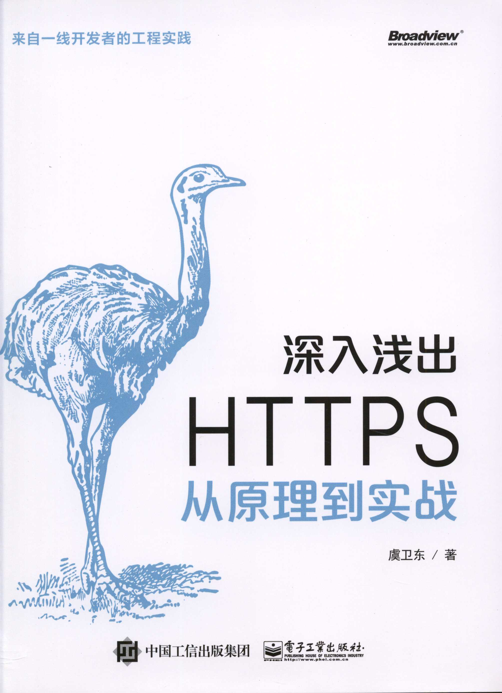

<!-- more -->

## HTTP介绍

> 读者不要认为HTTP负责数据传输，它实际上负责数据请求和响应，真正的数据传输由其他网络层处理

>Web 确切地说是一种信息索取方式，是互联网的某个子应用 。Web 最核 心的 组成部分是 HTTP,HTTP 由服务器和客户端组成，有了 HTTP ，互联网上的不同终端才能够交换信息。

### HTTP 请求和响应结构

> 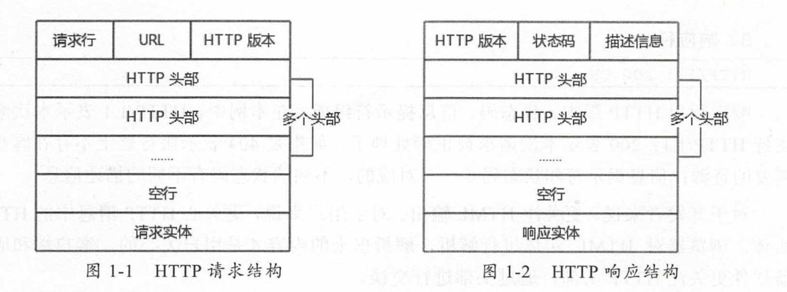

### HTTP协议不安全的根本原因

- 数据没有加密
- 无法互相验证身份
- 数据容易被篡改

### XSS攻击

恶意用户写入了一段恶意代码到论坛，其他人只要看到了他的论坛，就会执行恶意脚本。

### W3C

>Tim Berners -Lee 教授提出 Web 技术后成立了 W3C 组织，W3C 主要制定 Web 技术的标准，比如 HTML 标准、DOM 标准、css 标准、ECMA Script 标准

>W3C 主要以HTTP 头部的方式提供安全保护，比如Access - Control - Allow-Origin 、X-XSS -Protection 、Strict-Transport-Security 、Content-Security-PolicyHTTP 头部，一 旦开发者和浏览器正确地遵守安全标准，就能缓解安全问题。

## 密码学

- 密码学是科学
- 密码学理论是公开的
- 密码学算法是相对安全的
- 密码学攻击方法是多样化的
- 密码学应用标准很重要

>在使用密码学算法的时候也不要画蛇添足 ， 一个简单的软件为了保障安全性可能使用一 种密码学算法即可，没有必要组合多种密码学算法 。

### OpenSSL

https://www.openssl.org/

### 密码学中的随机数

块密码算法CTR模式

摘要算法

[流密码算法](#流密码算法)

### HASH算法

Hash算法的一个用途是解决数据的完整性问题

#### Hash算法的拓展

密码学中的Hash算法是一个非常重要的加密基元，密码学中的摘要、散列、指纹都是Hash算法

> 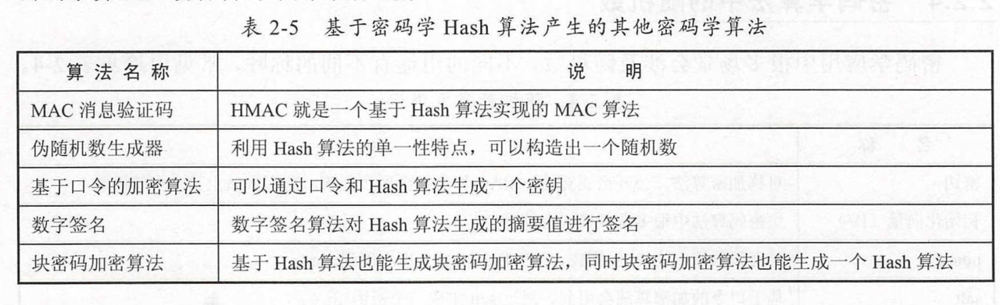

#### Hash算法的用途

文本比较： 例如两个文件的MD5值比较

身份验证： 在数据库中储存密码Hash而不是明文, 这个做法不安全

#### Hash算法的类型

MD5： MD5是不安全的算法，违反了抗碰撞性

SHA： SHA-1是不安全的，SHA-2推荐使用，SHA-3不是为了取代SHA-2而是在设计上和SHA-2完全不同

### 对称加密

对称加密算法可以用来解决数据的窃听问题

用同一个密钥可以对明文进行加密，可以对密文进行解密，有两种类型： 块密码算法和流密码算法

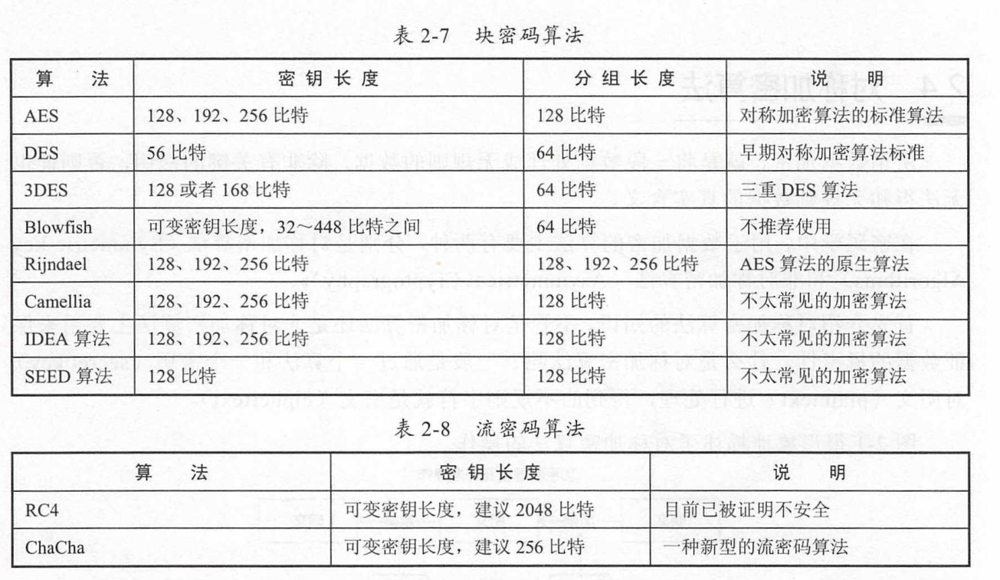

#### 流密码算法

##### 一次性密码本

密码本长度和明文一样长，他们异或起来就是密文，把密文和密码本异或可以得到明文

##### RC4算法

RC4的密码流来着随机数流，随机数种子就是密钥， so easy，  RC4算法被证明不安全！

#### 块密码算法

即将明文分块，对于无法分出的整数块进行填充，下面介绍模式，任何一种对称加密算法都可以与下面的模式相组合。

##### ECB模式(Eletronic Codebook)

对每一个块分别做加密，然后进行传输，这个过程可以并行处理，由于固定的明文块会得到固定的密文块，所以ECB模式是不安全的

##### CBC模式(Cipher Block Chaining)

引入初始化向量，在加密前对第一个块进行混淆，用加密结果对下一个块进行混淆,初始化向量是一个随机数

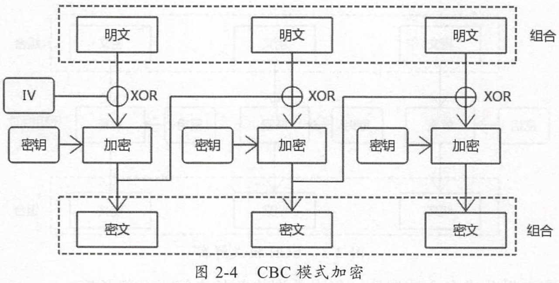

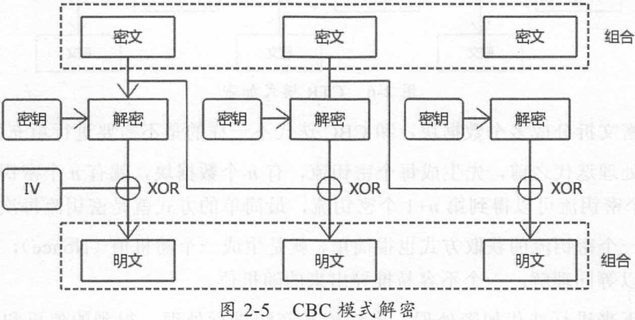

##### CTR模式(Counter)

CTR模式不需要填充，因为他对每一个块进行了流密码算法，有多少个块就有多少个密钥流，密钥流的密钥可以来源于前一个密钥流的密钥，第一个密钥流的密钥称之为Nonce，与CBC模式的IV类似

#### 填充算法

> 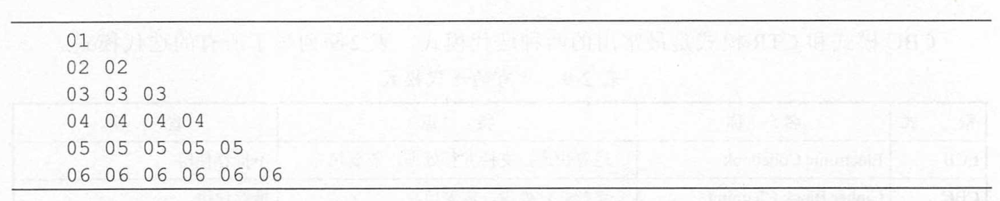

> 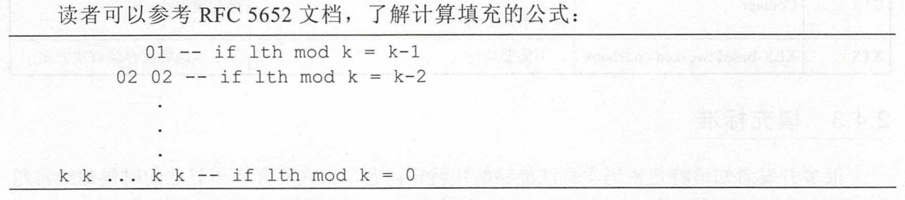

### 消息验证码

消息验证码： Message Authentication Code (MAC)

HASH算法解决了数据的完整性问题，对称加密算法解决了数据的窃听问题，但是他们都不能解决数据的篡改问题

#### 攻击者如何篡改消息？

由于攻击者的目标是篡改消息，而不是窃听和破坏消息，针对于ECB模式，它可以收集统计信息，将密文分块并篡改为以前的密文块等，然后重新HASH(HASH算法是公开的)，并篡改HASH值后转发。 

#### MAC算法

MAC算法致力于两点： 

- 证明消息没有被篡改
- 证明消息来源于正确的发送者

MAC算法： 核心原理就是在消息中携带密钥，然后使用HASH算法和加密算法，由于篡改者没有密钥，所以他无法篡改数据

MAC算法的类型： HMAC，CBC-MAC，OMAC

HMac算法流程： 注意不是hash(message//key) ， why not?

> 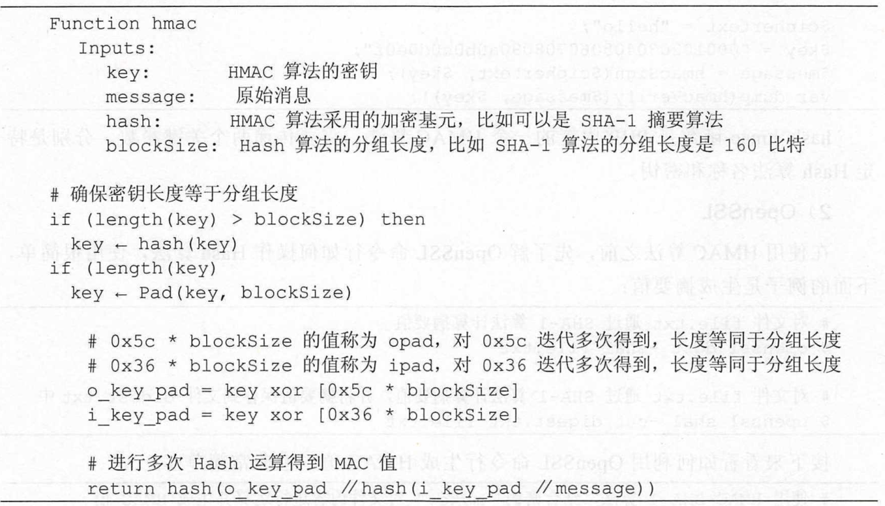

#### AE加密模式

结合对称加密算法和MAC算法又叫AE加密模式，Authenticated Encryption， 如何结合就有了多种选择

| 加密模式         | 代码                        | 备注                 |
| ---------------- | --------------------------- | -------------------- |
| MAC-and-Encrypt  | encry(message)+mac(message) | 使用不当会导致不安全 |
| MAC-then-Encrypt | encry(mac(message))         | 使用不当会导致不安全 |
| Encrypt-then-MAC | mac(encry(message))         | 建议使用             |

#### AEAD加密模式

结合对称加密算法和MAC算法如果处理不当会导致安全问题，AEAD模式(Authenticated Encryption with Associated Data)就是在底层组合了加密算法和MAC算法

##### CCM模式

CCM （Counter with CBC-MAC ）模式是一种 AEAD 模式 ， 不过在 HTTPS 中使用 得比较少 。 是AES算法的CRT模式组合了CBC-MAC算法，底层采用了MAC-then-Encrypt

##### GCM模式

>GCM ( Galois/Counter Mode ） 是目 前比较流行的 AEAD 模式 。在 GCM 内部，采用GHASH 算法（一种 MAC 算法）进行 MAC 运算，使用块密码 AES 算法 CTR 模式的 一种变种进行加密运算，在效率和性能上，GCM 都是非常不错的。

### 非对称加密

非对称加密又叫公开密钥算法，公钥加密，私钥解密

#### RSA

单步加密

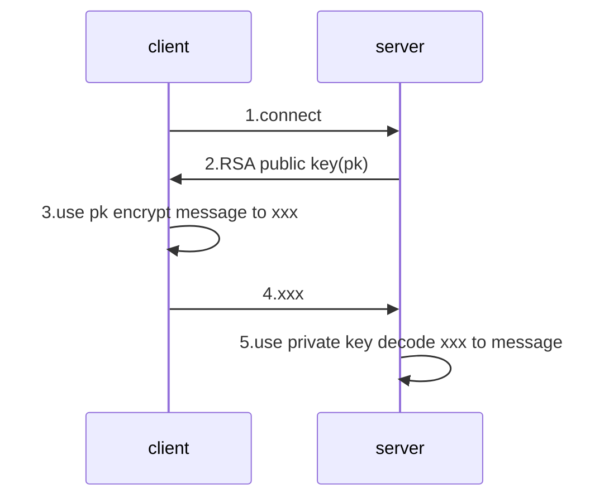

双向加密

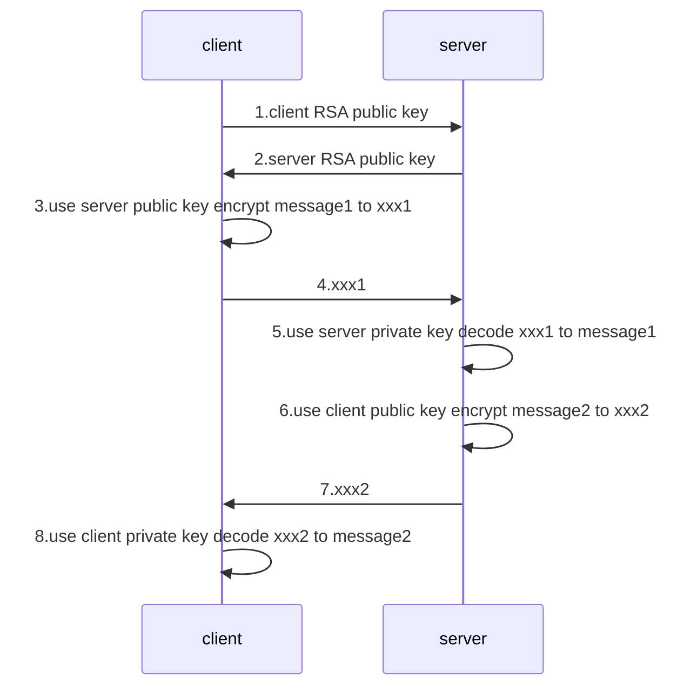

#### ECC

pass

### 密钥协商算法

#### RSA

缺点：

1. 会话密钥完全由client决定
2. 无法提供前向安全性

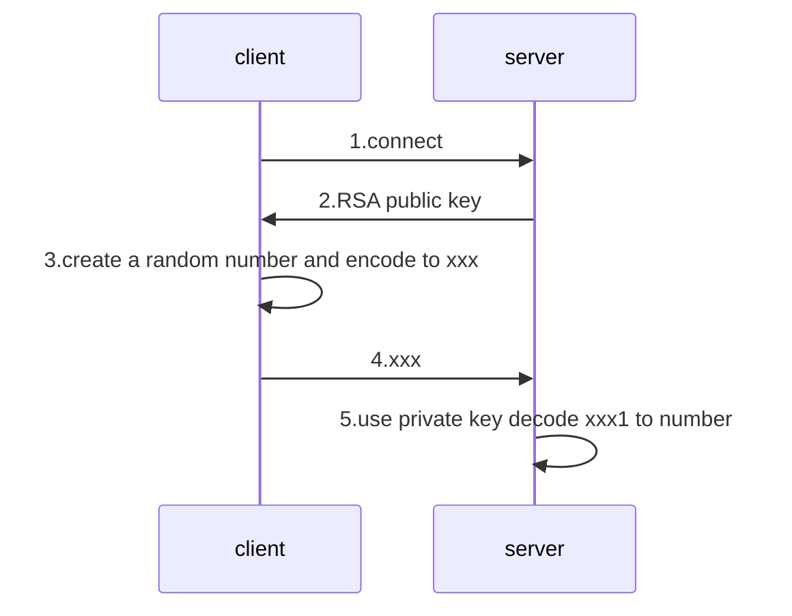

#### DH

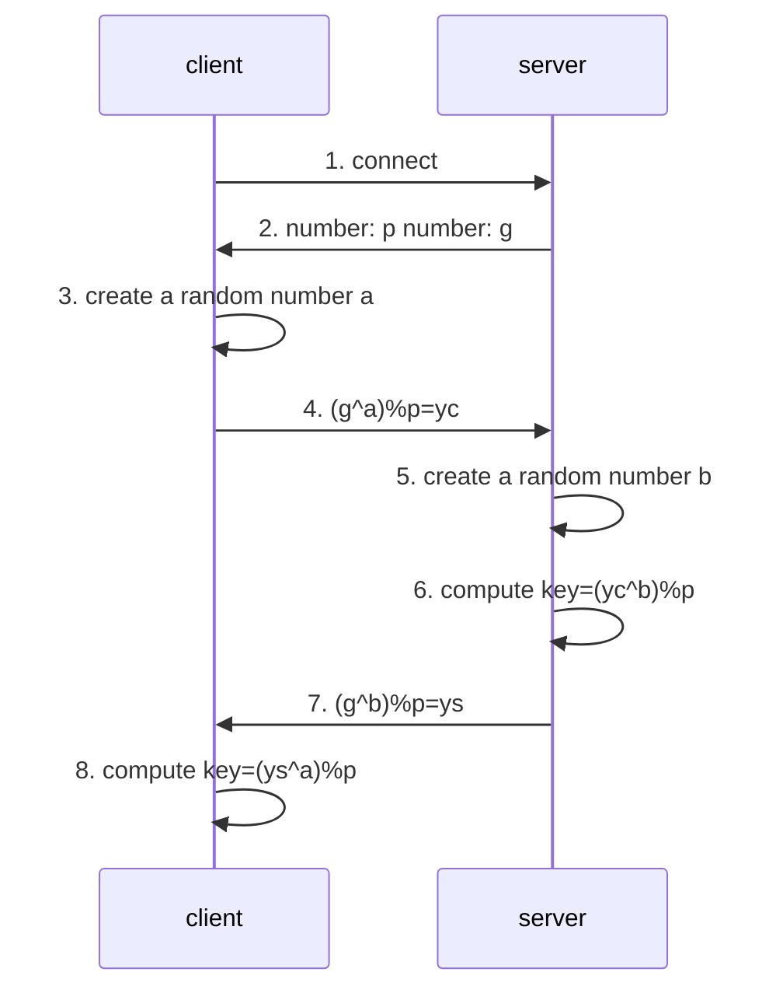

#### ECDH

ECC+DH协商密钥， pass

### 数字签名

#### RSA签名

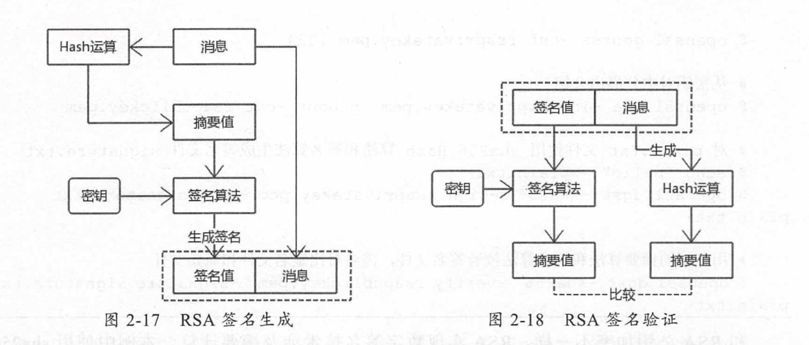

#### DSA签名

pass

#### ESDSA签名

pass

## 宏观理解TLS

### TLS/SSL背后的算法

加密算法： 对称加密后者非对称加密，保证机密性

MAC算法： 保证完整性

密钥协商算法： 传输对称加密的密钥

密钥衍生算法： 通过一个不定长度的预备主密钥转换为固定长度的主密钥，然后用主密钥转化出任意数量，任意长度的密钥块

### HTTPS总结

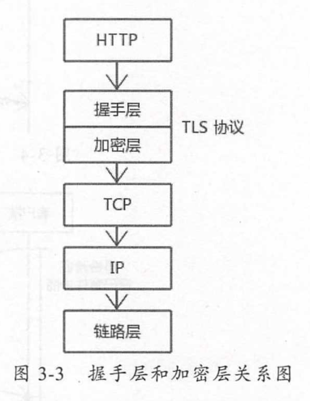

#### 握手层

客户端在进行密钥交换前，必须验证服务器身份，用CA证书来解决

在握手阶段，客户端服务器需要协商出双方都认可的密码套件，这包括了身份验证算法，密码协商算法，加密算法加密模式，HMAC算法的加密基元，PRF算法的加密基元

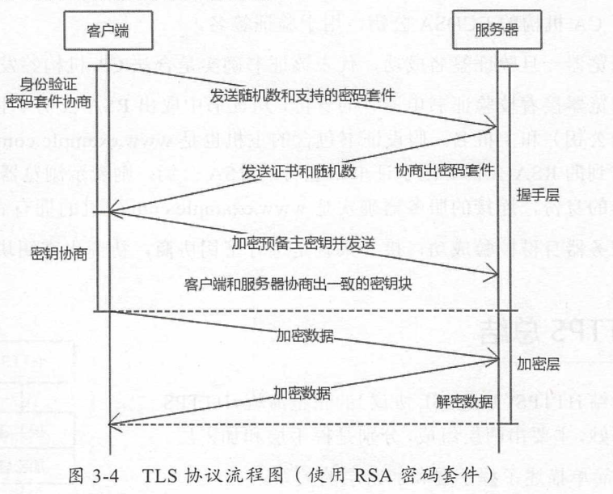

#### 加密层

流密码加密： RC4（MAC-then-Encrypt）

分组加密模式： AES-128-CBC（AES算法，密钥128比特，CBC分组）

AEAD：