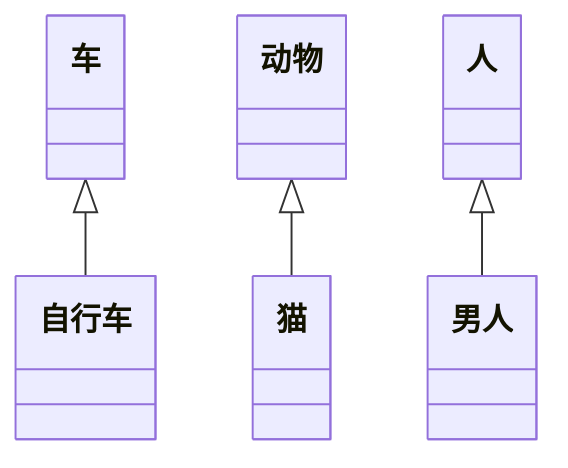
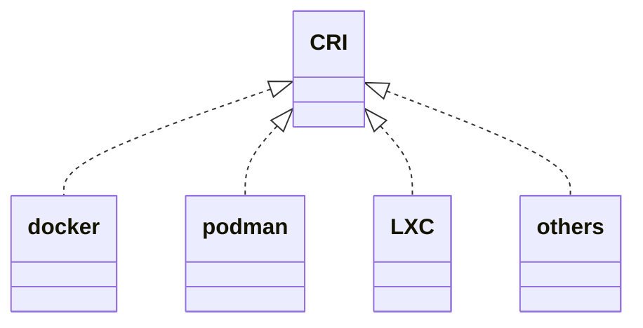
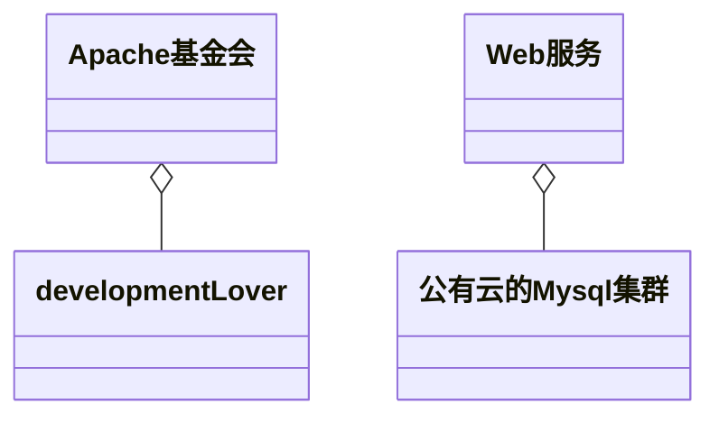
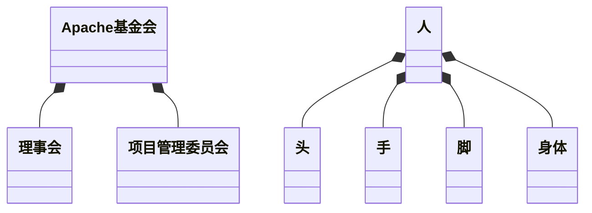
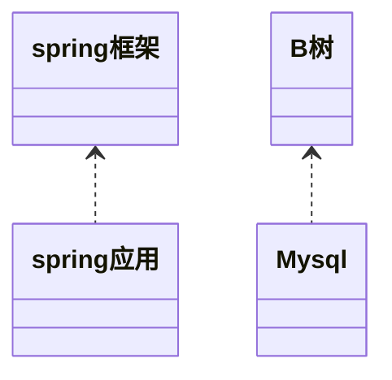
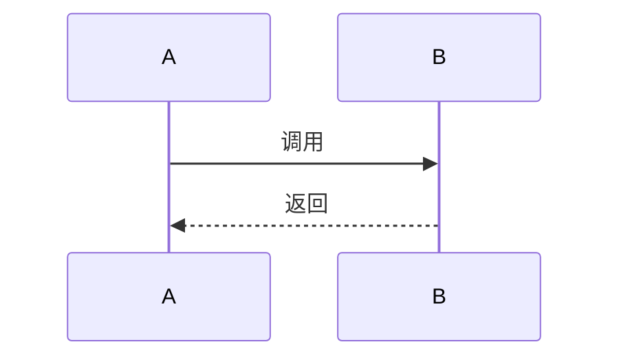
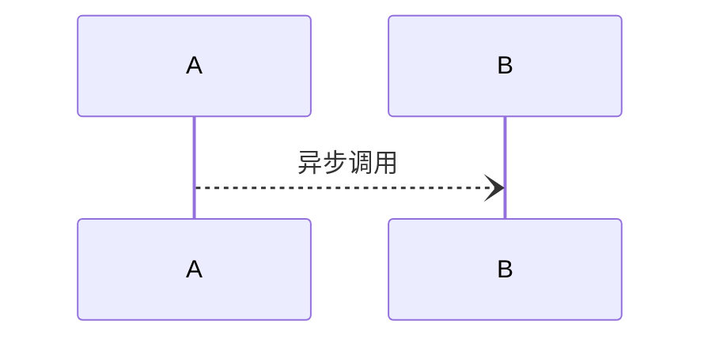

# UML

>**统一建模语言**（英语：Unified Modeling Language，缩写 UML）是非专利的第三代[建模](https://zh.wikipedia.org/w/index.php?title=对象建模语言&action=edit&redlink=1)和[规约语言](https://zh.wikipedia.org/wiki/规约语言)。UML是一种开放的方法，用于说明、可视化、构建和编写一个正在开发的、面向对象的、软件密集系统的制品的开放方法。UML展现了一系列最佳工程实践，这些最佳实践在对大规模，复杂系统进行建模方面，特别是在[软件架构](https://zh.wikipedia.org/wiki/软件架构)层次已经被验证有效。
>
>摘自： [维基百科，自由的百科全书](https://zh.wikipedia.org/wiki/统一建模语言)


# 类图

类图主要描述的是类与类之间的关系，这些关系分为泛化关系(generalization)、实现关系(realize)、聚合关系(aggregation)、组合关系(composition)、关联关系(association)、依赖关系(dependency)

## 泛化关系

泛化即类的继承，自行车继承车，猫继承动物，

所以自行车是车的泛化，猫是动物的泛化，男人是人的泛化 (箭头应该是空心)

```txt
classDiagram
  车 <|-- 自行车
  动物 <|-- 猫
  人 <|-- 男人
```




<!-- more -->

## 实现关系

实现关系即实现，docker实现了[CRI](http://fightinggg.top/QRN6OO.html#cri容器引擎)，podman也实现了CRI，LXC也实现了CRI (这里也应该是空心箭头)

```txt
classDiagram
  CRI <|.. docker
  CRI <|.. podman
  CRI <|.. LXC
  CRI <|.. others
```





## 聚合关系

聚合关系指的是一些类聚合在一起成为了一个新的类，很多开发爱好者聚合在一起成了[apache基金会](https://zh.m.wikipedia.org/wiki/Apache软件基金会)、公有云上的Mysql服务和我们的Java服务聚合在一起成为了一个Web服务

注意： 聚合关系的整体，整体没有了，部分还可以存在

```txt
classDiagram
  Apache基金会 o-- developmentLover
  Web服务 o-- 公有云的Mysql集群
```





## 组合关系

组合关系指的是一些类组合在一起成为了一个新的类，理事会和项目管理委员会组成了apache基金会、手脚头身体组成了人

注意： 组合关系的整体，整体没有了，部分也就不存在

```txt
classDiagram
  Apache基金会 *-- 理事会
  Apache基金会 *-- 项目管理委员会
  人 *-- 头
  人 *-- 手
  人 *-- 脚
  人 *-- 身体
```





## 关联关系

> 乘车人和车票之间就是一种关联关系；学生和学校就是一种关联关系；
>
> 关联关系默认不强调方向，表示对象间相互知道；如果特别强调方向，如下图，表示A知道B，但 B不知道A；
>
> 摘自： [看懂UML类图和时序图](https://design-patterns.readthedocs.io/zh_CN/latest/read_uml.html)

```txt
classDiagram
  B <-- A
```


## 依赖关系

我们的spring应用依赖spring框架

Mysql数据库依赖B树

```txt
classDiagram
  spring框架 <.. spring应用
  B树 <.. Mysql
```





# 时序图

## 调用




## 异步调用




