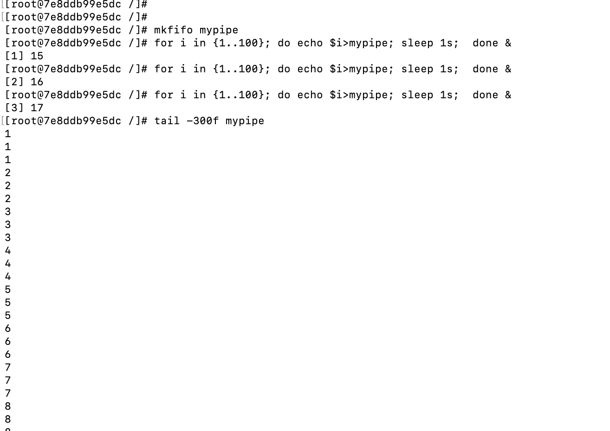

# 进程如何互相通信

## 共享内存

 操作系统通过页表让不同的进程共享一个物理地址空间，他们对应的逻辑地址空间可能不同，但是物理地址空间是相同的。共享内存不提供同步机制，我们需要额外的手段来保证同步。

<!-- more --->

## 管道

管道的参数如下

```c
 int pipe(int pipefd[2]);
```

成功则返回0，否则返回-1，pipefd中会得到两个文件描述符，一个可读，一个可写，就实现了管道，一般用于父子进程通信，父进程可fork，然后写pipefd[1], 子进程即可读pipefd[0], 或者父进程fork两次

## 命名管道

```shell
# docker run --rm -it centos:centos8 bash
mkfifo mypipe
for i in {1..100}; do echo $i>mypipe; sleep 1s;  done &
for i in {1..100}; do echo $i>mypipe; sleep 1s;  done &
for i in {1..100}; do echo $i>mypipe; sleep 1s;  done &
tail -300f mypipe
```


## 信号量

详见[link](/QPI740.html#第31章-信号量)

## 消息队列

消息队列是由消息的链表存放在内核并有消息队列标识符标识。消息队列克服了信号传递信息量少，管道只能承载无格式字节流以及缓冲区太小受限。

## 信号

信号又被称为软件中断，一个有权限的进程可以向另一个进程发送信号，但发往进程的信号诸多都源于内核。

> 有时需要确保一段代码不被传递来的信号中断，为了做到这点，可将信号添加到进程的信号掩码中——目前会阻塞该组信号的到达。如果所产生的信号属于阻塞之列，那么信号将保持等待状态，直至稍后对其解除阻塞

## 套接字

 socket，不赘述了。

# 参考

[在操作系统中进程是如何通信的](https://blog.csdn.net/weixin_30600197/article/details/99061584)

[计算机操作系统基础(十六)---进程同步之共享内存](http://www.zyiz.net/tech/detail-142992.html)

[【操作系统原理】使用管道完成进程间通信（匿名管道pipe、命名管道fifo）](https://blog.csdn.net/qq_36829091/article/details/80138836)

[操作系统基本概念——信号（一）](https://blog.csdn.net/u011389977/article/details/53189763)