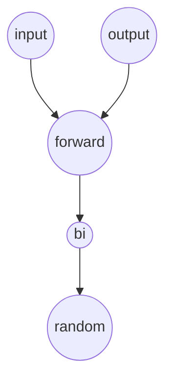

# 从这开始我们进入《STL源码分析》的学习

 STL分为6大组件: 空间配置器、容器、迭代器、算法、仿函数、配接器

# 空间配置器

 STL的空间适配器事STL的基础，我们不能靠操作系统来为我们管理内存，那样的代价太大了，这不划算，作为一个c/c++开发人员，我们要完全控制我们程序的一切。

## allocator

 这是他的英文名字，我们的allocator定义了四个操作

- alloc::allocate() 内存配置
- alloc::dellocate() 内存释放
- alloc::construct() 构造对象
- alloc::destroy() 析构对象

<!---more-->

## type_traits\<T\>

 一个模版元技术，他是一个类,能够萃取类型的相关信息，模版元详见C++笔记中的Boost源码分析

## destroy

 对于基本数据类型，我们啥都不用干，对于用户定义的数据类型，我们显示调用析构函数即可，这个使用模版特化即可。

## construct

 就是new，但是不用申请空间了，因为allocate已经干了

## 一级配置器、二级配置器

 一级配置大空间(&gt;128bytes)就是malloc和free，二级配置小空间，利用内存池。

### 一级配置器

 直接new的，new失败以后调用out of memery的处理方式调用处理例程，让其释放内存，不断尝试,释放的时候直接free

### 二级配置器

维护16个链表，每个链表维护一种类型的内存，分别为8bytes、16bytes、24bytes、一直到128bytes。更加巧妙的地方是将维护的内存和链表的指针使用联合体组装。这就不浪费空间了。当需要配置内存的时候，向8字节对齐，然后再分配，当释放内存的时候，丢到链表里面就行了
 当链表空了的时候，从内存池中取出20个新的内存块填充链表。
 内存池是一个大块大内存，当内存池空了以后，申请更多的内存，保证每次都比上一次申请的多就行了，要是让我实现，我才不这样做，我要用计算机网络中的自适应rtt原理来做。


# 迭代器

 说白了就是个指针，但是他比指针更强大，更灵活。

## 迭代器类型

- input iterator 只读
- output iterator 只写
- forward iterator 单向迭代器
- bidirectional iterator 双向移动一个单位
- random access iterator 双向移动多个单位




## 类型

 首先为了实现的容易，得设计iterator_category为迭代器自己的类型，value_type为迭代器维护的具体数据的类型，diference_type为两个迭代器之间的距离的类型，pointer为原生指针，reference为原生引用。


## vector

 不讲了，太简单了

## vector 的迭代器

 服了，居然就是指针，我一直以为他封装了一下，这也太懒了。

## list

算了这都跳过算了，没啥意思，

## deque

 用分段连续来制造整体连续的假象。
 两个迭代器维护首尾，一个二维指针维护一个二维数组，感觉很low，每一行被称为一个缓冲区,但是列的话，他前后都预留了一些指针位置。
 当我们随机访问的时候，就可以根据每一行的长度来选择正确的缓冲区了。

## deque的迭代器

 这个就厉害一些了，他包含了4个地方，当前指针、当前缓冲区首尾指针，中控器上面当前缓冲区的指针。

代码我感觉也一般般，我写也这样

## queue和stack

 居然是deque实现的，明明有更好的实现方法，再见，看都不想看

## heap

 算法都是这样写的

## priority heap

 vector实现的，

## slist

我还是不适合这个东西


# 关联式容器

 这玩意就是红黑树啦，上一章的序列容器看的我难受死了，希望这个能爽一些

## 红黑树

 翻了好几页，都是红黑树，并没有让我感到很吃惊的代码

## set和map

 set就是直接红黑树，map就把用pair分别存kv，然后自己定一个仿函数，难怪map找到的都是pair

## multi

 算了自己写过平衡树的都知道，和非multi没几行代码不一样。

## hashtable

 下一章下一章。。。


# 算法

 分为质变算法和非质变算法，一个会改变操作对象，另一个不会。

## accumulate

 这个强，accmulate(first,last,init),将[first,last)的值累加到init上

accmulate(first,last,init,binary op),将[first,last)从左到右二元操作(init,*)到init上

## adjacent_difference

 666666666，adjacent_difference(first,last,result)差分都来了[first,last)差分到[result,*)

6666666,自己定义的差分adjacent_difference(first,last,result,binary_op); 这个能自定定义减法，

 注意可以result设为first

## inner_product

 内积，inner_product(first1,last1,first2,init),加到init上然后返回。

参数在加上一个binary_op1和binary_op2,init=binary_op1(init,binary_op2(eme1,eme2))

太强了，佩服的五体投地，明天继续学,看java去


## partial_sum

 和前面的差分一样,partial_sum 为前缀和，partial_sum(first,last,result)为前缀和输出到result中

 当然你也可以定义binary_op操作，加在最后面

## power

 快速幂算法了解一下，power(x,n)x的n次方，n为整数，要求满足乘法结合律。

power(x,n,op),这个同理

## itoa

 `itoa(first,last,value);`

`while(first!=last) *first++=value++;`

<!---more-->

## equal

` equal(first1,last1,first2)`

 判断[first1,last1) 和[first2,...)是否相同

 同样支持二元仿函数。

## fill

 `fill(first,last,value)`

 把区间的值设为value

## fill_n

 `fill(first,n,value)`

 把first开始的n个元素设为value

## iter_swap

 `iter_swap(a,b) `

 交换迭代器的内容，这里就有意思了，如何获取迭代器内容的类型呢？还记得之前讲迭代器的时候，在迭代器内部定义的

value_type吗？对！就是那个。


## lexicographical_compare

 `lexicographical_compare(first1,last1,first2,last2)`

字典序比大小，需要支持小于号

## max min

 这俩也支持仿函数

## mismatch

 `mismatch(first1,last1,first2)`

用第一个去匹配第二个，你需要保证第二个不必第一个短，返回匹配尾部

 支持仿函数==

## swap

 就是很普通的交换，

## copy(first,last,result)

 特化了char\*和wchar_t\*为memmove，特化了T\*和const T\*，通过萃取，若指向的数据为基本数据类型则调用memmove，

否则再分为随机迭代器和非随机迭代器，随机迭代器使用last-first这个值来控制，非随机迭代器用if(last==frist)来控制。

## copy_backward

 和上面一样，但是为逆序拷贝

## set_union

set_union(first1,last1,first2,last2,result)

就是遍历两个有序容器，然后赋值到result中，注意到它在碰到相同元素的时候两个迭代器都自增了，导致若第一个中有3个1，第二个中有5个1，则输出的时候只有5个1

## set_intersection

 同上

 交集，得到3个1

## set_difference

 代码越来越平庸了，这个是S1-S2，出现在S1中不出现在S2中

## set_symmetric_difference

 对称差，平庸的代码

## adjacent_find(first,last)

 找到第一个相等的相邻元素，允许自定义仿函数

## count(first,last,value)

 对value出现对次数计数

 count_if(first,last,op) 对op(*it)为真计数

越看越无聊了

## find(first,last,value)

 找value出现的位置，这个函数应该挺有用的

 find_if(first,last,op) 同上啦

## find_end 和find_first_of

 这个函数没用，我为啥不用kmp算法

## for_each(first,last,op)

 op(\*i)

## geterate(first,last,op)

 \*i=op()

 generate_n 同上

## transform(first,last,result,op)

 \*result=op(\*first)

## transform(first1,last1,first2,last2,result,op)

 \*result=op(\*first1,\*first2)

## includes(first1,last1,first2,last2)

 保证有序，然后判断2是不是1的子序列，显然On

## max_element(first,last) 

 区间最大值

## min_element(first,last)

 同上

## merge(first1,last1,first2,last2,result)

 归并排序的时候应该用得到吧

## partition(first,last,pred)

 pred(*)为真在前，为假在后On

## remove(first,last,value)

 把value移到尾部
 remove_copu(first,last,result,value),非质变算法

## remove_if remove_copy_if 

同上

## replace(first,last,old_value,new_value)

 看名字就知道怎么实现的

 replace_copy,replace_if,replace_copy_if

## revese

 秀得我头皮发麻，这个。。。。。。。

```cpp
while(true)
  if(first==last||first==--last) return;
  else iter_swap(first++,last);
```

随机迭代器的版本还好

```cpp
while(first<last) iter_swap(first++,--last);
```

 reverse_copy ，常见的代码

##  rotate

 这个代码有点数学，大概率用不到，一般情况下我们写splay都用3次reverse来实现的，复杂度也不过On,他这个代码就一步到位了，使用了gcd，没啥意思，STL果然效率第一

## search

 子序列首次出现的位置，

## search_n

 好偏，算了，没啥用的代码

## swap_ranges(first1,last1,first2)

 区间交换，swap的增强版

## unique 

 移除重复元素

 unique_copy


## lower_bound upper_bound binary_search

 不多说了，就是二分，

## next_permutation

 一直想不明白这个函数怎么实现的，今天来看看，既然是下一个排列，显然是需要找到一个刚好比现在这个大大排列，简单分析......6532,如果一个后缀都是递减的，显然这个后缀不能更大了，如果一个后缀都不能变得更大，就必须调整更前的，所以我们要找到这样的非降序....16532,把最后一个放到1的位置，其他的从小到大排列好就行了。也即swap(1,2),reverse(6531)
<!---more-->

## prev_permutation

 同理

## random_shuffle

 洗牌算法，从first往last遍历，每次从最后面随机选一个放到当前位置即可。

## partial_sort 

 partial_sort(first,middle,last)
 保证[first,middle)有序且均小于[middle,last)直接对后面元素使用堆上浮，这样保证了小的元素均在[first,middle)中，然后使用sort_heap?????
&ems; 为啥第一步不用线性时间选择，第二步不用快排？

## sort

 大一就听说了这个的大名，现在来学习学习

## Median_of_three

__median(a,b,c) 返回中间那个值

## Partitionining

 这个大家都会写，就是按照枢轴，把小的放左边，大的放到右边

## threshold

 当只有很少很少的几个元素的时候，插入排序更快。

## final insertion sort

 我们不必在快速排序中进行插入排序，但是可以提前推出，保证序列基本有序，然后再对整体使用插入排序

## SGI sort 

 先快速排序到基本有序，然后插入排序

### 快速排序

 先排序右边，后左边，且将左边当作下一层，当迭代深度恶化的时候，即超过了lg(n)*2的时候，采取堆排序
 枢轴的选择，首、尾、中间的中位数

## RW sort

 这个就少了堆排序了，其他的和SGI一样


##  equal_range

 lower_bound和upper_bound的合体
 比直接lower_bound+upper_bound应该快一些，大概这样，二分中值偏小，做缩左断点，偏大则缩右端点，若二分中值等于value，则对左边lower_bound,对右边upper_bound,然后就能直接返回了

## inplace_merge

 将两个相邻的有序序列合并为有序序列，他在分析卡空间的做法，再见。。。不缺空间，

##  nth_element

 线性时间选择，三点中值，递归变迭代，长度很小以后直接插入排序，666666

## mergesort

 借助inplace_merge直接完成了，

## 总结

 STL的算法还是很厉害的。


# 仿函数

 c++的一大特色，通过重载()来实现像函数一样的功能

## 一元仿函数

```cpp
template<class Arg,class Result>
struct unary_function{
  typedef Arg argument_type;
  typedef Result result_type;
};
```

 看到上面那玩意没，你得继承它。
<!---more-->

- negeta 取反，返回-x
- logical_not  !x
- identity x
- select1st a.first
- select2nd a.second

## 二元仿函数

```cpp
template<class Arg1,class Arg2,class Result>
struct unary_function{
  typedef Arg1 first_argument_type;
  typedef Arg2 second_argument_type;
  typedef Result result_type;
};
```

- plus a+b
- minus a-b
- multiplies a*b
- divides a/b
- modulus a%b
- equal_to a==b
- not_equal_to a!=b
- greater a>b
- greater_equal a>=b
- less a&lt;b
- less_equal a&lt;=b
- logical_and a&&b
- logical_or a||b
- project1st a
- project2nd b

## 仿函数单位元

 你要为你的仿函数设置一个identity_element单位元，用于快速幂


# 配接器

 本质上，配接器是一种设计模式，改变仿函数的接口，成为仿函数配接器，改变容器接口，称为容器配接器，改变迭代器接口，称为迭代器配接器

## 容器配接器

 queue和stack就是修饰了deque的配接器

## 迭代器配接器

 迭代器的配接器有3个，insert itertors,reverse iterators,iostream iterators.

哇塞这东西有点深，明天再看。
<!---more-->

