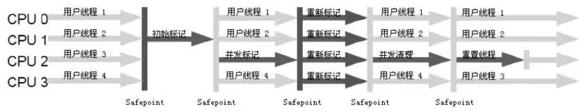
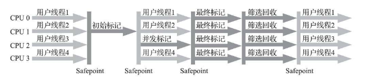
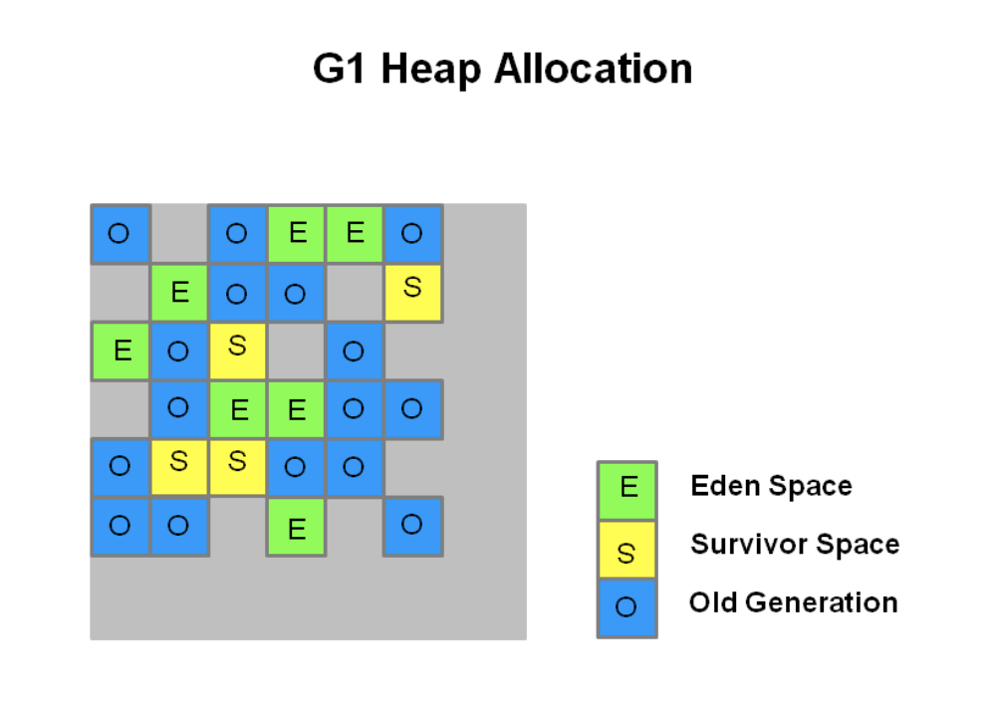
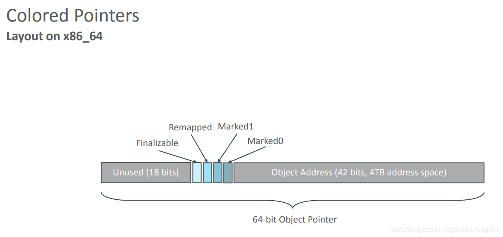

# 如何判断对象已死
## 引用计数算法
为对象添加引用计数器，每当有一个地方引用他的时候计数器的值+1，当引用失效的时候计数器的值-1,当任何时刻计数器为0的对象就是不可能再被使用了。此算法效率高，但是无法解决相互引用的问题。
## 可达性分析算法
利用有向图可达性表示对象生死，作为GC Roots的对象有虚拟机栈（本地变量表）中引用的对象，方法区中类静态属性引用的对象，方法区中常量引用的对象，本地方法栈中JNI引用的对象。若不能从根达到的对象，则对象死亡。
<!---more-->
## 引用分类
强引用: 类似“Object obj = new Object()”的引用

软引用: 有用但并非必需的对象，在系统将要发生内存溢出异常前，会对这些对象进行第二次回收。

弱引用: 弱引用只能活到下一次垃圾回收之前。

虚引用: 完全不会影响该对象是否被回收，用于在该对象被回收时收到一个系统消息。

## 生存还是死亡
当可达性分析算法中某个对象不可达时，他会进入缓刑阶段，如果他覆盖finalize()方法且finalize()方法没有被调用过，他就会进入F-Queue队列中，虚拟机会在一个很慢的线程Finalizer中执行他。在finalize()中对象可以通过把自己赋给某个活着的类变量或对象的成员变量来拯救自己，拯救了自己的对象不会被回收，其他的对象都会被回收掉。
## 回收方法区
Java虚拟机规范中可以不要求实现该部分。
回收内容包括两部分，一是废弃常量，即当前没有被引用的常量，二是无用的类，这需要满足3个条件： 1.该类的实例都被回收，2.加载该类的ClassLoader被回收，3.该类对应的java.lang.Class对象没有被引用，无法在任何地方通过反射访问该类的方法。

# 垃圾收集算法
## 标记-清除算法
从根结点出发遍历对象，对访问过的对象打上标记，表示该对象可达,统一标记然后统一回收，这样效率不高并产生了很多内存碎片。
## 复制算法
把内存分为相同的两块，使用其中一块，当使用完后，将有用的内存移到另外一块上，然后回收整块内存，这样效率很高，但是内存利用率低，他的一种改进是把内存分三块，一块大，两块小，每次使用一块大+一块小，整理时把有用的部分移动到另一块小的，然后清理之前的两块。这个算法在新生代中表现非常出色。但是我们总会碰到整理的时候放不下的情况，这时我们通过内存担保机制，为多余的对象分配内存，并直接进入老年代。
## 标记-整理算法
在老生代中一般不能使用复制算法，因为他们存活率太高了。我们可以改进标记-清除算法，回收的时候顺便将有用的对象向内存的一端移动，这样就避免了内存碎片的产生。
## 分代收集算法
把Java堆分为新生代和老生代，根据个个年代的特点选择适当的方法。

# HotSpot的GC
## 枚举根节点
根节点很多，有的应用仅方法区就有数百兆，逐个寻找引用会很花费时间，这里使用OopMap来直接记录下一些引用的位置。就省去了寻找的过程，变成了直接定位。
## 安全点
GC的时候，Java的其他线程必须处于安全的位置，以保证引用链不发生变化。虚拟机会适当标记某些安全点，GC的时候其他线程就在这些安全点上。为了保证这一点，有两种中断方式，抢先式中断和主动式中断，抢先式中断指的是首先中断全部线程，如果发现某些线程不在安全点，则让其恢复，运行到安全点在停下来。主动式中断是当GC需要中断时，设置一个标志，让其他线程主动轮流访问，发现标志为真的时候，就主动中断，这里只需要保证进程在安全点访问标志即可。
## 安全区域
有些Sleep或者Blocked状态的进程无法主动响应JVM的中断请求，运行到安全的地方。我们引入安全区域，在这个区域内，每个地方都是安全点，当线程执行到安全区域时，标记自己进入了安全区域，这段时间JVM可以GC，不用管这些线程，当这些线程离开安全区域的时候，线程检查JVM是否完成GC即可。

# 垃圾收集器
## serial收集器
单线程收集，GC时暂停所有用户进程,新生代采取复制算法，老生代采取标记-整理算法
## ParNew收集器
GC时暂停所有用户进程,新生代采取多线程复制算法，老生代采取单线程标记-整理算法
## Parallel Scavenge收集器
这个收集器和ParNew收集器很像，但是Parallel Scavenge收集器更加关注两个信息，停顿时间和吞吐量，停顿时间指的是GC造成的停顿时间，吞吐量指的是单位时间内不停顿的比率。Parallel Scavenge还支持自动调参。
## CMS收集器

这个收集器强调服务的响应速度，希望停顿时间最短。
他的过程分四个步骤: 初始标记、并发标记、重新标记、并发清除。初始标记的时候要暂停所有用户进程，然后标记GC ROOT直接关联的对象，这个步骤很快就能结束，然后就可以启动用户进程和GC ROOT Tracing一起并发执行。在并发期间会导致可达性链发生变化，这需要第三个步骤：重新标记，这也会暂停用户进程。最后并发清除即可。

CMS收集器清理的时候采用的是标记-清理算法

### 卡表（card table）

YGC的时候，老年代会引用新生代，所以我们还需要扫描老年代确保他们没有指向新生代的对象，老年代往往很大，扫描整个老年代不现实，为了加速，我们把老年代分成128个字节的card，每个card会有一个bit来记录改card是否引用了新生代。card储存为一个table，所占老生代空间为$\frac{1}{128\ast 8}$

### CMS缺点：

1. cpu资源的占用，因为并发，CMS至少占用一个处理器的份额。如果是重计算的应用，吞吐量可能会有不少的下降。
2. 浮动垃圾，并发收集的过程中为了保证GC的正确性(保证存活的对象不被回收)，一些本应该可以回收的对象会被标记成活动对象，逃过GC。
3. 吞吐量的下降。影响因素主要有两点：1、cpu的占用 2、write barrier的额外操作。s

## G1收集器

> G1收集器是一款在server端运行的垃圾收集器，专门针对于拥有多核处理器和大内存的机器，在JDK 7u4版本发行时被正式推出，在JDK9中更被指定为官方GC收集器。它满足高吞吐量的同时满足GC停顿的时间尽可能短。

G1收集器要先把Java堆分成多个大小相等的独立区域，新生代和老生代都是一部分独立区域，

G1保留了YGC，并引入了MIXGC收集老年代，G1没有FULL GC，而是引入了一种新的serial old Full GC

### YGC

Eden被充满就会触发YGC，YGC会触发STW(stop the world),YGC的时候不会收集老年代，所以不会去扫描整个老年代，为了避免全盘扫描，对每一个region都引入Remembered Set来记录引用关系（谁引用了我），我们回收这个region的时候，只需要扫描RSet中的记录代表的region即可。G1步骤和CMS一样，但是Remembered Set的存在，让重新标记可以并行完成。

### MIXGC

MIXGC选择所有的新生代+全局并发标记统计到的老生代。

### 全局并发标记

1. 初始标记，STW(stop the world),标记GC ROOTS直接可达的对象，并将其压入扫描栈，等待后续扫描。
2. 根区域扫描，根区域扫描是从Survior区的对象出发，标记被引用到老年代中的对象，并把它们的字段在压入扫描栈（marking stack）中等到后续扫描。与Initial Mark不一样的是，Root Region Scanning不需要STW与应用程序是并发运行。Root Region Scanning必须在YGC开始前完成。
3. 并发标记，并发标记也不需要STW，从扫描栈中取出对象，对其标记，并将其字段压入栈，只到栈为空，扫描过程中还扫描SATB记录的引用，YGC可以中断他。
4. 重新标记，在并发标记以后，还剩下一些SATB写屏障记录的引用，这个时候需要STW，这部分很快
5. 清除，STW，清点有存活对象的region和没有存活对象的region，更新reset， 之后就是并发操作了，直接把没有存活对象的region加入到可分配队列中进行分配。

YGC选择年轻代的region，通过region的个数来控制GC开销

MIXGC选择所有年轻代region和全局并发标记中评分高的若干老年代region

YGC和MIXGC都会STW，但是他的时间是可控的。

### STAB

snapshot at the begin 原始快照

> STAB的做法在GC开始时对内存进行一个对象图的逻辑快照(snapshot)，通过GC Roots tracing 参照并发标记的过程，只要被快照到对象是活的，那在整个GC的过程中对象就被认定的是活的，即使该对象的引用稍后被修改或者删除。同时新分配的对象也会被认为是活的，除此之外其它不可达的对象就被认为是死掉了。这样STAB就保证了真正存活的对象不会被GC误回收，但同时也造成了某些可以被回收的对象逃过了GC，导致了内存里面存在浮动的垃圾(float garbage)。
>
> 参考 https://zhuanlan.zhihu.com/p/52841787

## Shenandoah垃圾收集器

[Shenandoah [ˌʃɛnənˈdoʊə] ](https://fanyi.baidu.com/translate?aldtype=16047&query=Shenandoah%0D%0A&keyfrom=baidu&smartresult=dict&lang=auto2zh#en/zh/Shenandoah)

>Shenandoah 与 G1 对比：
>
>相同：
>
>Shenandoah也是使用基于Region的堆内存布局，同样有着用于存放大对象的Humongous Region，默认的回收策略也同样是优先处理回收价值最大的Region
>
>不同：
>
>管理堆内存方面，与G1至少有三个明显的不同之处：
>
>1、Shenandoah 支持并发的整理算法;G1支持并行整理算法。
>
>2、Shenandoah（目前）是默认不使用分代收集的；G1 有专门的新生代Region或者老年代Region的存在;
>
>3、Shenandoah摒弃了在G1中耗费大量内存和计算资源去维护的记忆集，改用名为“连接矩阵”（Connection Matrix）的全局数据结构来记录跨Region的引用关系，降低了处理跨代指针时的记忆集维护消耗，也降低了伪共享问题的发生概率。
>
>可参考：G1回收器每一份Region都必须有一份卡表，这导致G1的记忆集（和其他内存消耗）可能会占整个堆容量的20%乃至更多的内存空间 
> 参考《 [虚拟机垃圾收集器原理](https://blog.csdn.net/gaohaicheng123/article/details/106415428#标记-整理算法)》

### 连接矩阵

>
>
>连接矩阵可以简单理解为一张二维表格，如果Region N有对象指向RegionM，就在表格的N行M列中打上一个标记，如图3-15所示，如果Region 5中的对象Baz引用了Region 3的Foo，Foo又引用了Region 1的Bar，那连接矩阵中的5行3列、3行1列就应该被打上标记。在回收时通过这张表格就可以得出哪些Region之间产生了跨代引用。
>
>参考：https://blog.csdn.net/gaohaicheng123/article/details/106437504

### Brooks Pointer

Brooks提出转发指针以前，在对象的内存上放置保护陷阱，一旦用户程序读取该内存，则会中断，并陷入操作系统的陷阱，此时由这部分陷阱代码来引导真正的访问。但是频繁的中断会导致频繁的用户态切换，影响效率。

Brooks提出，不需要中断，我们只用在对象的内存布局前加上一个指针，如果对象不处于并发移动状态，则指针指向自己，否则指向移动到的地方。如果只是读取还好，如果用户需要写入对象的字段就涉及到了并发问题。

> 实际上Shenandoah收集器是通过比较并交换（Compare And Swap，CAS）操作来保证并发时对象的访问正确性的。
>
> 参考：https://blog.csdn.net/gaohaicheng123/article/details/106437504

但是，这个代价是复杂的读写屏障问题，读写屏障中如果加入了过多的逻辑，则会导致整个代码的执行效率降低

## ZGC

ZGC支持各种大小的Region

>小型Region（Small Region）：容量固定为2MB，用于放置小于256KB的小对象。
>
>中型Region（Medium Region）：容量固定为32MB，用于放置大于等于256KB但小于4MB的对象。
>
>大型Region（Large Region）：容量不固定，可以动态变化，但必须为2MB的整数倍，用于放置4MB或以上的大对象。每个大型Region中只会存放一个大对象，这也预示着虽然名字叫作“大型Region”，但它的实际容量完全有可能小于中型Region，最小容量可低至4MB。大型Region在ZGC的实现中是不会被重分配（重分配是ZGC的一种处理动作，用于复制对象的收集器阶段，稍后会介绍到）的，因为复制一个大对象的代价非常高昂。
>
>参考：https://blog.csdn.net/gaohaicheng123/article/details/106437504

### 染色指针

在64位linux中，操作系统只提供了46位的地址空间，ZGC染色指针技术使用这46位的指针中的高四位来储存额外信息，这也导致了ZGC智能管理42位的内存空间，即4TB

- Finalizable：表示是否只能通过finalize()方法才能被访问到，其他途径不行；
- Remapped：表示是否进入了重分配集（即被移动过）；
- Marked1、Marked0：表示对象的三色标记状态；

### 三色标记

| 颜色 |                             意义                             |
| :--- | :----------------------------------------------------------: |
| 白色 |                表示对象尚未被垃圾收集器访问过                |
| 黑色 | 表示对象已经被垃圾收集器访问过， 且这个对象的所有引用都已经扫描过 |
| 灰色 | 表示对象已经被垃圾收集器访问过， 但这个对象上至少存在一个引用还没有被扫描过。 |

>
>
>可达性分析的扫描过程，其实就是一股以灰色为波峰的波纹从黑向白推进的过程，但是在并发的推进过程中会产生“对象消失”的问题，如图：
>
>
>
>对象消失理论，只有同时满足才会发生对象消失：
>
>- 赋值器插入了一条或多条从黑色对象到白色对象的新引用；
>
>- 赋值器删除了全部从灰色对象到该白色对象的直接或间接引用；
>
> 要解决对象消失问题只需要破坏其中一条就行了，目前常用有两种方案：
>
>- 增量更新（Incremental Update）:增量更新要破坏的是第一个条件，当黑色对象插入新的指向白色对象的引用关系时，就将这个新插入的引用记录下来，等并发扫描结束之后，再将这些记录过的引用关系中的黑色对象为根，重新扫描一次。这可以简化理解为，黑色对象一旦新插入了指向白色对象的引用之后，它就变回灰色对象了。
>
>- 原始快照（Snapshot At TheBeginning，SATB）:原始快照要破坏的是第二个条件，当灰色对象要删除指向白色对象的引用关系时，就将这个要删除的引用记录下来，在并发扫描结束之后，再将这些记录过的引用关系中的灰色对象为根，重新扫描一次。这也可以简化理解为，无论引用关系删除与否，都会按照刚刚开始扫描那一刻的对象图快照来进行搜索。
>
> 参考：https://blog.csdn.net/xiaolyuh123/article/details/103937164

>
>
>并发标记（Concurrent Mark）：与G1、Shenandoah一样，并发标记是遍历对象图做可达性分析的阶段，它的初始标记和最终标记也会出现短暂的停顿，整个标记阶段只会更新染色指针中的Marked 0、Marked 1标志位。
>
>并发预备重分配（Concurrent Prepare for Relocate）：这个阶段需要根据特定的查询条件统计得出本次收集过程要清理哪些Region，将这些Region组成重分配集（Relocation Set）。ZGC每次回收都会扫描所有的Region，用范围更大的扫描成本换取省去G1中记忆集的维护成本。
>
>并发重分配（Concurrent Relocate）：重分配是ZGC执行过程中的核心阶段，这个过程要把重分配集中的存活对象复制到新的Region上，并为重分配集中的每个Region维护一个转发表（Forward Table），记录从旧对象到新对象的转向关系。ZGC收集器能仅从引用上就明确得知一个对象是否处于重分配集之中，如果用户线程此时并发访问了位于重分配集中的对象，这次访问将会被预置的内存屏障所截获，然后立即根据Region上的转发表记录将访问转发到新复制的对象上，并同时修正更新该引用的值，使其直接指向新对象，ZGC将这种行为称为指针的“自愈”（Self-Healing）能力。
>
>> ZGC的染色指针因为“自愈”（Self-Healing）能力，所以只有第一次访问旧对象会变慢，而Shenandoah的Brooks转发指针是每次都会变慢。
>>
>> 一旦重分配集中某个Region的存活对象都复制完毕后，这个Region就可以立即释放用于新对象的分配，但是转发表还得留着不能释放掉，因为可能还有访问在使用这个转发表。
>
>并发重映射（Concurrent Remap）：重映射所做的就是修正整个堆中指向重分配集中旧对象的所有引用，但是ZGC中对象引用存在“自愈”功能，所以这个重映射操作并不是很迫切。ZGC很巧妙地把并发重映射阶段要做的工作，合并到了下一次垃圾收集循环中的并发标记阶段里去完成，反正它们都是要遍历所有对象的，这样合并就节省了一次遍历对象图的开销。
>参考：https://blog.csdn.net/xiaolyuh123/article/details/103937164

# 内存分配与回收策略

对象优先分配在Eden中，Eden就是堆中的大块，若不能分，则进行新生代都GC

大对象直接进入老年代

对象每存活于一次新生代GC，则年龄增长一岁，达到15岁的时候便进入了老年代。

如果所有年龄相同的对象所占空间超过了一半，则此年龄以上的对象全部进入老年代。

在新生代GC的时候会碰到空间不够的情况，这时需要空间分配担保机制，根据概率论设置阈值，在新生代GC的时候根据以往晋升到老年代的对象内存大小的均值和方差计算阈值，若老年代剩余空间小于阈值，则会先进行老年代GC腾出空间，若老年代剩余空间大于阈值，则直接进行新生代GC，这时会有非常小的概率，GC失败，然后出发老年代GC。这里和TCP协议中动态滑动窗口大小协议有点类似。

# 参考

《深入理解Java虚拟机JVM高级特性与最佳实践第2版》

[G1 收集器原理理解与分析](https://zhuanlan.zhihu.com/p/52841787?from_voters_page=true)

[深入理解JVM - Shenandoah垃圾收集器](https://xiaolyuh.blog.csdn.net/article/details/103935465)

[深入理解java虚拟机—— 虚拟机 新型垃圾收集器 Shenandoah GC, ZGC](https://blog.csdn.net/gaohaicheng123/article/details/106437504)