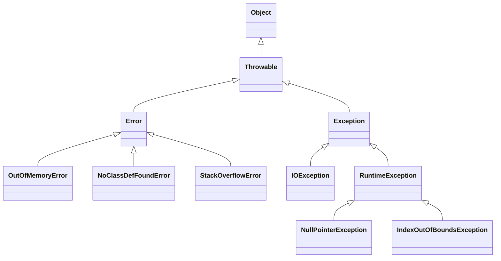

# Java常见异常

```mermaid
classDiagram
  Object <|-- Throwable
  Throwable <|-- Error
  Throwable <|-- Exception
  Error <|-- OutOfMemoryError
  Error <|-- NoClassDefFoundError
  Error <|-- StackOverflowError
  Exception <|-- IOException
  Exception <|-- RuntimeException
  RuntimeException <|-- NullPointerException
  RuntimeException <|-- IndexOutOfBoundsException
```

# NoClassDefFoundError 异常原因处理

<!-- more -->