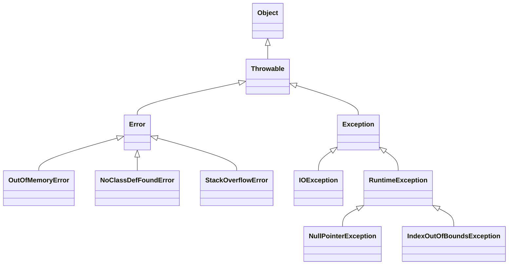

# Java常见异常




# NoClassDefFoundError 异常原因处理

<!-- more -->

## 类初始化失败

如果一个类初始化失败，在第一次失败的时候会报错`java.lang.ExceptionInInitializerError`，第二次就会`java.lang.NoClassDefFoundError`

```java
package com.example.demo;

public class Main {
    public static void main(String[] args) {
        try {
            new ClassNotDefErrorFromClassLoad();
        } catch (Throwable e) {
            e.printStackTrace();
        }
        new ClassNotDefErrorFromClassLoad();
    }
}

class ClassNotDefErrorFromClassLoad {
    private static final String ERROR = String.valueOf(1 / 0);
}
```

```txt
java.lang.ExceptionInInitializerError
	at com.example.demo.Main.main(Main.java:6)
Caused by: java.lang.ArithmeticException: / by zero
	at com.example.demo.ClassNotDefErrorFromClassLoad.<clinit>(Main.java:15)
	... 1 more
Exception in thread "main" java.lang.NoClassDefFoundError: Could not initialize class com.example.demo.ClassNotDefErrorFromClassLoad
	at com.example.demo.Main.main(Main.java:10)
```


## class文件丢失

对下面这个类，启动后程序运行正常

```java
package com.example.demo;

public class Main {
    public static void main(String[] args) {
        new ClassNotDefErrorFromClassNotFound();
    }
}

class ClassNotDefErrorFromClassNotFound {
}

```

```txt
Process finished with exit code 0
```

我们观察编译的结果，发现两个class文件

```shell
$ tree target/
target/
|-- classes
|   |-- application.properties
|   `-- com
|       `-- example
|           `-- demo
|               |-- ClassNotDefErrorFromClassNotFound.class
|               `-- Main.class
|-- generated-sources
|   `-- annotations
|-- generated-test-sources
|   `-- test-annotations
`-- test-classes
```


这时候我们删除`ClassNotDefErrorFromClassNotFound.class`，然后运行代码，发现报错`NoClassDefFoundError`

```txt
Exception in thread "main" java.lang.NoClassDefFoundError: com/example/demo/ClassNotDefErrorFromClassNotFound
	at com.example.demo.Main.main(Main.java:5)
Caused by: java.lang.ClassNotFoundException: com.example.demo.ClassNotDefErrorFromClassNotFound
	at java.net.URLClassLoader.findClass(URLClassLoader.java:382)
	at java.lang.ClassLoader.loadClass(ClassLoader.java:424)
	at sun.misc.Launcher$AppClassLoader.loadClass(Launcher.java:349)
	at java.lang.ClassLoader.loadClass(ClassLoader.java:357)
	... 1 more

Process finished with exit code 1
```


