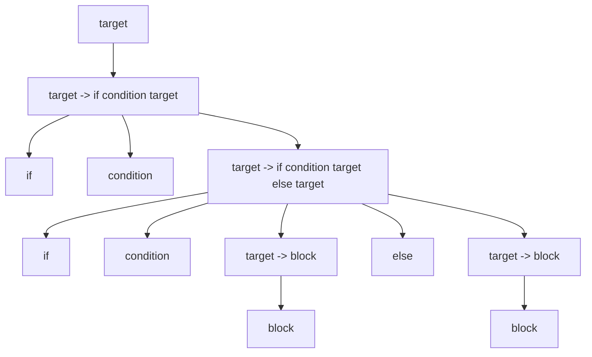
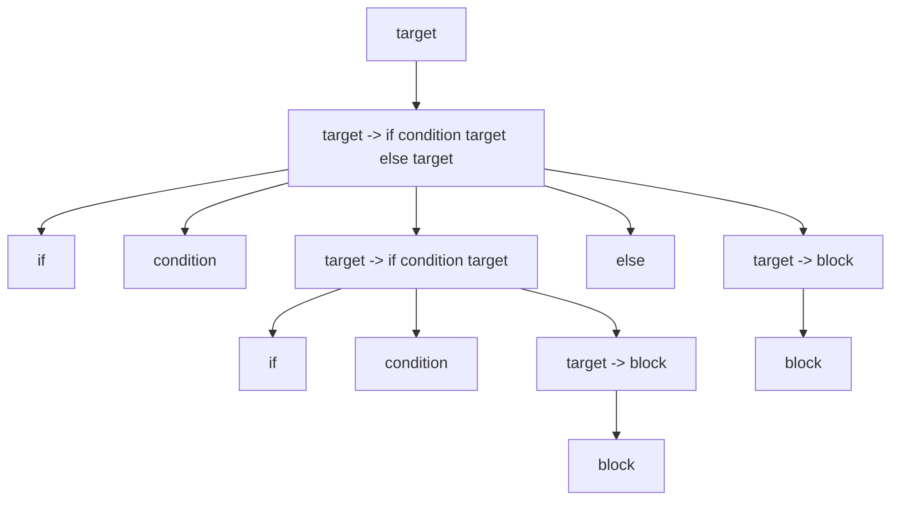
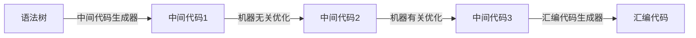

# 1. 引言

想做编译器很久了，大学期间留下了不少遗憾，没有实现自己的编译器，没有实现自己的`JVM`，没有实现自己的数据库，当然这其中有很多原因，比如学院的要求太松，比如自己也不够主动，这篇`Blog`将引导读者一步一步构建一个自己的[编译器](https://github.com/fightinggg/compiler)。

# 2. 学习重点

开发编译器我能学到什么？编译器本身吗？其实不对，我们设计编译器的时候，会遇到很多问题，解决这些问题的方法才是最终重要的东西。


# 3. 编译器的流程

从头开发一个编译器是非常困难的，这涉及到很多知识点，这一部分主要介绍现代编译器的架构。

龙书上把编译器分为前端和后端两个部分，源代码首先经过前端转化为中间代码，中间代码经过后端转化为汇编文件。此后的工作就不是编译器的管理范围了，接下来由汇编器和链接器将汇编文件转化为可执行文件。


为什么编译器要分为两个部分？为什么要分出前端和后端？实际上这样的架构做好以后，只要我们为$m$种源代码编写一个前端，为$n$种架构的机器编写后端，则我们可以组成$n*m$种编译器。当一个新类型的源代码或者新架构的机器出现时，我们可以以更快的速度对编译器进行更新，从而支持这些源代码或机器。另一方面，如果想要对源程序进行优化，编译器前端负责优化吗？还是编译器后端负责优化？这其实是优化器的工作，优化器的输入是中间代码，输出也是中间代码。

<!-- more -->

接下来读者最关心的问题，应该是中间代码是什么样的？中间代码并不只是一种形式，如果我们忽略优化器，就可以认为中间代码就是一个固定的形式。这个形式就是三地址形式或四元组形式，至于三地址形式和四元式形式究竟是什么，我们后面再做介绍。


# 4. 编译器前端流程

从源代码到中间代码，编译器已经有了很成熟的架构，一般分为下面这几步。


# 5. 词法分析

词法分析，如其名，只分析词语，即token，词是一个文法的最小单元。至于什么是文法，后面会介绍，这里不需要过多忧虑。

## 5.1. 举个例子

比如我们有一个代码,这个代码和c/c++很相似（但是这个是pava代码，读者目前可以理解为c代码），这是一个计算斐波那契数列的代码，他的词法分析结果是什么呢？

```c++
int fib(int x){
    if(x<2) return 1;
    return fib(x-1) + fib(x-2);
}
int main(){
    int a = fib(5);
    return a;
}
```

下文的代码就是词法分析结果, 词法分析器从源文件依次读取，然后分割出最小的词法单元，

最开始词法分析器读到了字符`i`，然后读到了字符`n`，然后读到了字符`t`,紧接着读到了空格字符` `，这时候词法分析器发力，进行分割，将前三个字符`int`划为最小词法单元`符号`。

紧接着继续读取`f`,当他读入`f`这个字符的时候，词法分析器发力，将第四个字符` `(空格字符)划为词法单元`empty`,当然在下文中无法找到`emtpy`这个token，因为`empty`代表空字符，可有可无。

然后词法分析器继续分析，不断地解析，一直解析出`fib(符号)`， `((左括号)`， `int(符号)`,`x(符号)`,`)(右括号)`

```txt
"int"(symbol)
"fib"(symbol)
"("(leftBracket)
"int"(symbol)
"x"(symbol)
")"(rightBracket)
"{"(leftCurlyBracket)
"if"(if)
"("(leftBracket)
"x"(symbol)
"<"(lt)
"2"(number)
")"(rightBracket)
"return"(return)
"1"(number)
";"(semicolon)
"return"(return)
"fib"(symbol)
"("(leftBracket)
"x"(symbol)
"-"(sub)
"1"(number)
")"(rightBracket)
"+"(add)
"fib"(symbol)
"("(leftBracket)
"x"(symbol)
"-"(sub)
"2"(number)
")"(rightBracket)
";"(semicolon)
"}"(rightCurlyBracket)
"int"(symbol)
"main"(symbol)
"("(leftBracket)
")"(rightBracket)
"{"(leftCurlyBracket)
"int"(symbol)
"a"(symbol)
"="(eq)
"fib"(symbol)
"("(leftBracket)
"5"(number)
")"(rightBracket)
";"(semicolon)
"return"(return)
"a"(symbol)
";"(semicolon)
"}"(rightCurlyBracket)
"$END"($END)
```


## 5.2. 识别词法单元

编译器的第一步就是词法分析，他需要从待分析的文本中，逐字符读取，并分割词法单元。一种高效而有简单的方式就是使用正则表达式构建NFA模型，然后优化为DFA，此后对文本进行分割。

这里可能有一些抽象，突然来了这么多概念，下面一个一个来解释。

## 5.3. 确定有限状态自动机

[确定有限状态自动机](https://zh.wikipedia.org/wiki/%E7%A1%AE%E5%AE%9A%E6%9C%89%E9%99%90%E7%8A%B6%E6%80%81%E8%87%AA%E5%8A%A8%E6%9C%BA) 被称为DFA

> 确定有限状态自动机${\displaystyle {\mathcal {A}}}$是由
>
> - 一个非空有限的[状态](https://zh.wikipedia.org/wiki/状态)集合${\displaystyle Q}$
> - 一个输入[字母表](https://zh.wikipedia.org/wiki/字母表_(计算机科学))${\displaystyle \Sigma }$（非空有限的字符集合)
> - 一个转移[函数](https://zh.wikipedia.org/wiki/函数)${\displaystyle \delta :Q\times \Sigma \rightarrow Q}$（例如：${\displaystyle \delta \left(q,\sigma \right)=p,\left(p,q\in Q,\sigma \in \Sigma \right)}$)
> - 一个开始状态${\displaystyle s\in Q}$
> - 一个接受状态的集合${\displaystyle F\subseteq Q}$
>
> 所组成的5-[元组](https://zh.wikipedia.org/wiki/多元组)。因此一个DFA可以写成这样的形式：${\displaystyle {\mathcal {A}}=\left(Q,\Sigma ,\delta ,s,F\right)}$。

## 5.4. 非确定有限状态自动机

非确定有限状态自动机又被称为NFA，与DFA不同的是他的转移是不确定的，他的转移不唯一。


## 5.5. 正则表达式识别原理

### 5.5.1. 正则例1

首先给出一个正则表达式`a`， 这个正则表达式能识别，且仅能识别字符串`a`，那么如何来表示呢?下图是这个正则表达式所对应的nfa，最开始我们在状态`start`， 当我们读取字符a以后，会转移到`end`，当我们到达end的时候如果输入结束，自动机就输出匹配成功。所以该自动机能使被字符串`a`，如果输入为`b`， 自动机在start时，会因为没有`b`这个转移而直接输出匹配失败，如果输入为`ab`自动机会因为在end处无法找到转移`b`而输出匹配失败.


### 5.5.2. 正则例2

考虑串联，来正则表达式`ab`， 这里如何构建呢，首先我们分别构建两个自动机。


然后将他们组装在一起， 注意到这里出现了一个`空`，这就意味着，当我们处于状态`end1`的时候可以不输入任何字符，直接转移到状态`start2` ，于是这个自动机最开始在`start1` 处，当他输入字符`a`，他会转移到`end1` 以及`start2`，当继续输入字符`b`，会转移到`end2`（end1无法转移,start2可转移）


### 5.5.3. 正则例3

考虑并联,来正则表达式`a|b`， 这里如何构建? 依然构建两个自动机


然后串联， 这里不用再解释了


### 5.5.4. 正则例4

考虑自循环， 来正则表达式`a+`, 加号表示出现最少一次,可以为多次, 只需要引一条从end到start的边即可


至此我们已经分析完了所有的正则单元，复杂的正则表达式均可由此合并而成。


## 5.6. NFA转DFA

nfa转dfa算法涉及到一个闭包，我们直接对这个nfa来计算闭包


最开始位于状态`start`， 当输入a以后，进入状态`end`， 计算end的空闭包`[start,end]`，当从状态`[start,end]`输入a以后，进入状态`end`，也就是`[start,end]`, 于是最终我们得到了这个dfa


## 5.7. DFA识别

如何为一门语言设计他的dfa呢？实际上一门语言涉及到多个token，每个token都会由一个正则，那么就会出现正则冲突，即一个字符串可以被识别为多种token，这时候就定义优先级即可。

另一种情况，即是否贪婪，如果一个字符串的前缀可以被识别为一个token，即字符串`ifhaha`的前缀`if`可以被识别为token`if` ,而他自身可以被识别为token`symbol`，这时候，我们需要选择最长的那个，即最长匹配即可。


## 5.8. 效果展示

笔者的项目中又涉及到一款c类语言(pava语言)的token配置

```json
{
    "tokens": [
        {"number": "0|[123456789]\\d*"},
        {"doubleQuotes": "\""},
        {"blank": "\\s+"},
        {"leftCurlyBracket": "\\{"},
        {"rightCurlyBracket": "\\}"},
        {"string": "\"[\\s\\w\\d]*\""},
        {"include": "#include"},
        {"while": "while"},
        {"if": "if"},
        {"for": "for"},
        {"return": "return"},
        {"break": "break"},
        {"continue": "continue"},
        {"do": "do"},
        {"goto": "goto"},
        {"else": "else"},
        {"comma": ","},
        {"leftBracket": "\\("},
        {"rightBracket": "\\)"},
        {"add": "\\+"},
        {"sub": "\\-"},
        {"mul": "\\*"},
        {"div": "/"},
        {"mod": "%"},
        {"doubleEq": "=="},
        {"eq": "="},
        {"ne": "!="},
        {"leftShift": "<<"},
        {"rightShift": ">>"},
        {"be": ">="},
        {"le": "<="},
        {"bt": ">"},
        {"lt": "<"},
        {"semicolon": ";"},
        {"symbol": "[_\\w][_\\w\\d]*"}
      ]
}
```

该配置在经过自动构建工具[compiler/Reg.java at master · fightinggg/compiler · GitHub](https://github.com/fightinggg/compiler/blob/master/main/src/main/java/com/example/lang/reg/Reg.java)构建以后得到了下图的nfa, 如果此图太小，读者可以右键点击到新页面查看，此处不对此工具进行解释，因为它涉及到更深层次的内容，笔者将在后面的章节中予适当的时候对此工具进行描述，另一方面由于此dfa也不是很大，人工绘制也不是不可能，综上此处不做解析了。


# 6. 语法分析

## 6.1. 文法

文法的种类有很多，正则文法，上下文无关文法，上下文有关文法。

### 6.1.1. 正则文法

这一块内容就是我们平时所用到的正则表达式的文法，他的词是各个字符。

### 6.1.2. 上下文无关文法

上下文无关文法涉及到4个定义

- 终结符： 文法的基本单元，词
- 非终结符： 文法的中间变量，一些词按顺序排列构成的符号
- 产生式： 连接非终结符和终结符的等式，产生式表明了一些终结符和非终结符如何排列可以得到新的非终结符
- 开始： 文法开始的非终结符，他表明了什么样的非终结符满足当前文法

例子

```
加法：
  终结符: number, +
  非终结符: SUM
  产生式： SUM -> number + number | SUM + number
  开始： SUM
```

上诉文法可以接受 1+2， 我们只需要把1和2视为number，即可，此时的词法单元就是1，2，+

由于高级程序设计语言基本可以被视为上下文无关文法，文法的语法分析有很多算法，后面会依次对他们进行介绍。

### 6.1.3. 上下文有关文法

在上下文无关文法中，产生式左部都是单个非终结符，如果放开这个限制，那么就成了上下文有关文法。这里不是重点，直接跳过，有兴趣的读者可以自行[学习](https://zh.wikipedia.org/wiki/%E4%B8%8A%E4%B8%8B%E6%96%87%E6%9C%89%E5%85%B3%E6%96%87%E6%B3%95)。


## 6.2. 最左递归下降

递归下降算法可以解析一部分上下文无关文法，递归下降其实就是枚举，他是一种自顶向下的算法，从文法的`开始`开始， 逐渐替换最左侧的非终结符为新的符号列表，直到匹配成功,其代码为:

```txt
匹配(参数1： deque, 参数2： 当前匹配的下标i)
	如果双端队列deque[e1,e2,e3...]的最左侧e1是终结符
    	从双端队列deque[terminalSymbol,e2,e3,e4...]取出并删除最左侧的终结符terminalSymbol
       	如果 terminalSymbol和当前第i个token不相等， 返回失败
       	否则 返回 继续匹配(deque,i+1)
    如果双端队列deque[e1,e2,e3...]的最左侧e1是非终结符
       	从双端队列deque[noTerminalSymbol,e2,e3,e4...]取出并删除最左侧的非终结符noTerminalSymbol
       	枚举以非终结符noTerminalSymbol为左部的产生式production
           将production右部的所有符号[s1,s2,s3...]顺序不变放在deque[e1,e2,e3...]左侧得到[s1,s2,s3...e1,e2,e3...]
           如果 继续匹配(deque,i) 成功 返回成功
    	返回失败
```

这样的一个算法，

第一，他的时间复杂度是指数的，非常慢

第二，如果文法存在左递归，则算法死循环

第三，如果文法二义，则算法输出的语法树不确定


## 6.3 左递归文法

如果一个文法中存在产生式`A -> A * * *`则这个文法为直接左递归文法，比如下面这个文法为左递归文法, 因为`SUM -> SUM + number`

```
加法：
  终结符: number, +
  非终结符: SUM
  产生式: SUM -> number + number | SUM + number
  开始： SUM
```

如果一个文法在经过有限次产生式替换以后，出现了`A -> A * * *`则这个文法为间接左递归文法。如下面的文法, 因为`SUM -> S + S -> SUM + S`

```
加法：
  终结符: number, +
  非终结符: SUM, S
  产生式:  SUM -> S + S
  		  S -> SUM | number
  开始： SUM
```

当文法中存在左递归时，将最左侧的非终结符替换为符号数组将导致无穷无尽的循环、


## 6.4 二义性文法

如果一个token流，对应于一个文法存在不止一棵语法树，则该文法为二义性文法，下面的文法为二义性文法

```
ifelse:
  终结符: if, else, condition, block
  非终结符: target
  产生式: target -> block | if condition target | if condition target else target
  开始： target
```

考虑`if condition if condition block else block`他有两颗语法树






## 6.5. 乔姆斯基范式

> 在[计算机科学](https://zh.wikipedia.org/wiki/计算机科学)中，一个[形式文法](https://zh.wikipedia.org/wiki/形式文法)是 **Chomsky 范式**的，[当且仅当](https://zh.wikipedia.org/wiki/当且仅当)所有产生规则都有如下形式：
>
> *A* → *BC* 或
>
> *A* → α 或
>
> *S* → ε
>
> 这里的 *A*, *B* 和 *C* 是非终结符，α 是[终结符](https://zh.wikipedia.org/wiki/终结符)（表示常量值的符号），*S* 是开始符号，而 ε 是[空串](https://zh.wikipedia.org/wiki/空字元串)。还有，*B* 和 *C* 都不可以是开始符号。
>
> 所有的 Chomsky 范式的文法都是[上下文无关](https://zh.wikipedia.org/wiki/上下文无关文法)，反过来，所有上下文无关文法都可以有效的变换成等价的 Chomsky 范式的文法。
>
> 引用： [乔姆斯基范式](https://zh.wikipedia.org/wiki/%E4%B9%94%E5%A7%86%E6%96%AF%E5%9F%BA%E8%8C%83%E5%BC%8F)

将一个上下文无关文法转化为乔姆斯基范式也非常简单，这不做赘述。


## 6.6. CYK算法

> **CYK算法**（[英语](https://baike.baidu.com/item/英语/109997)：Cocke–Younger–Kasami algorithm，缩写为CYK algorithm）是由[约翰·科克](https://baike.baidu.com/item/约翰·科克/7868274)，Younger和嵩忠雄共同研究出来大约发表于1965年的一个算法，它是一个用来判定任意给定的字符串 是否属于一个[上下文无关文法](https://baike.baidu.com/item/上下文无关文法/2001908)的算法。
>
> 引用： [CYK算法](https://baike.baidu.com/item/CYK%E7%AE%97%E6%B3%95/15817539)

这是一种`dp`算法，基于乔姆斯基范式，`dp[i,j]`代表`子串(i:j)`能被识别为哪些非终结符，这是只需要在`i`和`j`中间枚举`k`, 由`dp[i,k]` 和`dp[k+1,j]`转移即可。


## 6.7 FIRST集

每个终结符都有一个


## 6.8. LL语法分析

LL语法分析指的是从左向右最左推导，是一种自顶向下的算法，实际上，所有的自顶向下算法都无法解决左递归文法。进行LL分析，需要提前计算FIRST集和FOLLOW集。


## 6.9. LR语法分析


# 7. 编译器后端流程




# 7. 语义分析

## 7.1 语法制导翻译


# 8. 机器无关优化


# 9. Pava子项目

## 9.1 Pava Compiler (PavaC)

## 9.2 Pava Virtual Machine (PVM)


# 10. 参考文献

[一个项目](https://github.com/DoctorWkt/acwj)

龙书


