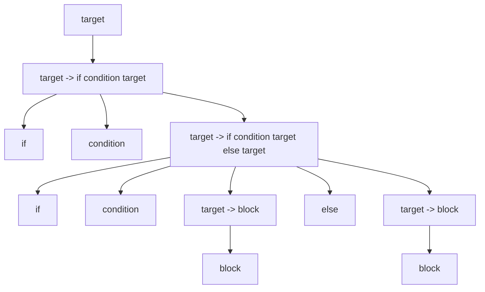
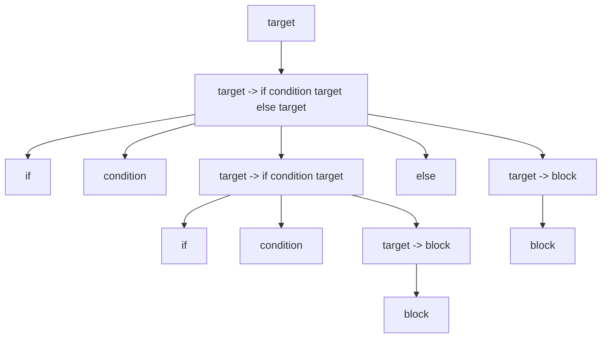
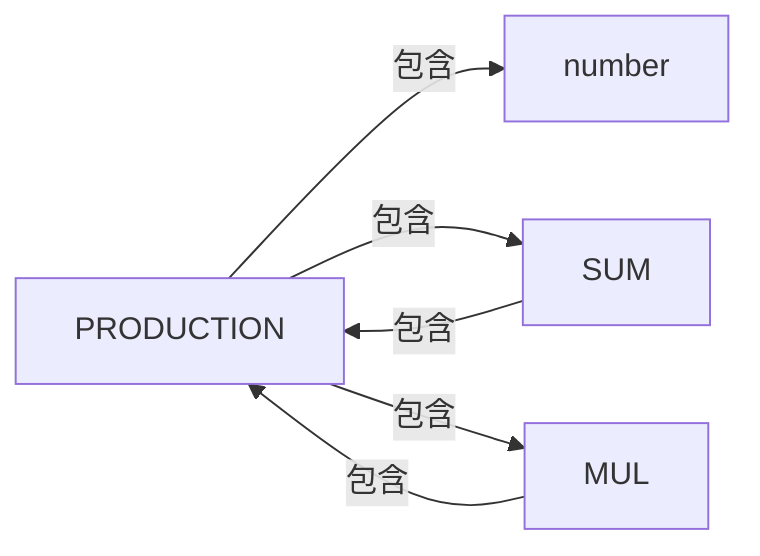
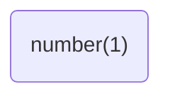
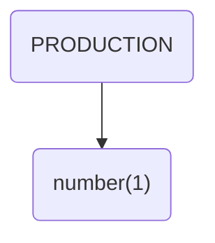
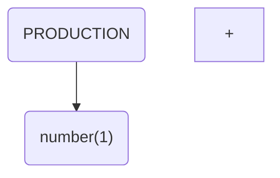
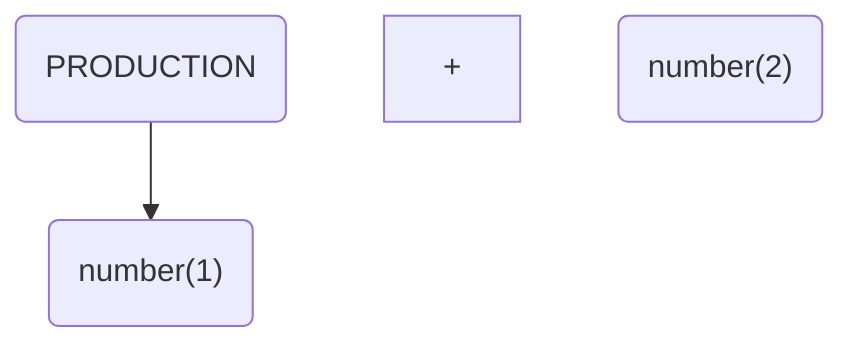
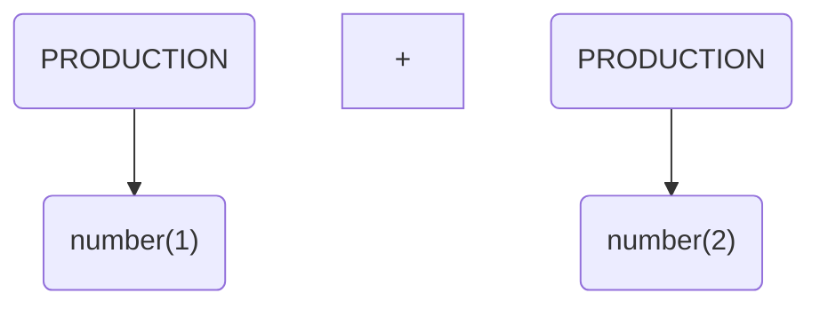
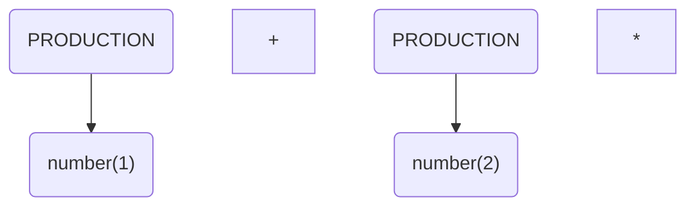
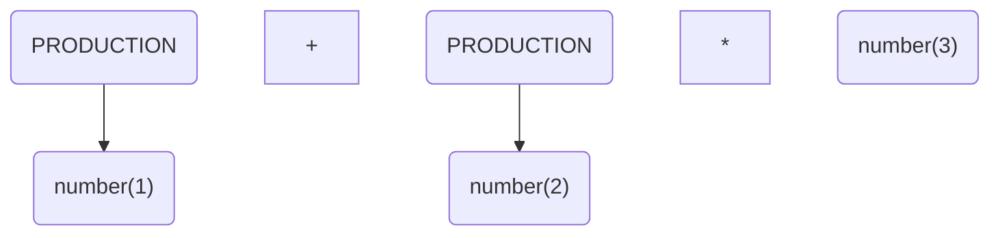

# 1. 引言

想做编译器很久了，大学期间留下了不少遗憾，没有实现自己的编译器，没有实现自己的`JVM`，没有实现自己的数据库，当然这其中有很多原因，比如学院的要求太松，比如自己也不够主动，这篇`Blog`将引导读者一步一步构建一个自己的[编译器](https://github.com/fightinggg/compiler)。

# 2. 学习重点

开发编译器我能学到什么？编译器本身吗？其实不对，我们设计编译器的时候，会遇到很多问题，解决这些问题的方法才是最终重要的东西。


# 3. 编译器的流程

从头开发一个编译器是非常困难的，这涉及到很多知识点，这一部分主要介绍现代编译器的架构。

龙书上把编译器分为前端和后端两个部分，源代码首先经过前端转化为中间代码，中间代码经过后端转化为汇编文件。此后的工作就不是编译器的管理范围了，接下来由汇编器和链接器将汇编文件转化为可执行文件。


为什么编译器要分为两个部分？为什么要分出前端和后端？实际上这样的架构做好以后，只要我们为$m$种源代码编写一个前端，为$n$种架构的机器编写后端，则我们可以组成$n*m$种编译器。当一个新类型的源代码或者新架构的机器出现时，我们可以以更快的速度对编译器进行更新，从而支持这些源代码或机器。另一方面，如果想要对源程序进行优化，编译器前端负责优化吗？还是编译器后端负责优化？这其实是优化器的工作，优化器的输入是中间代码，输出也是中间代码。

<!-- more -->

接下来读者最关心的问题，应该是中间代码是什么样的？中间代码并不只是一种形式，如果我们忽略优化器，就可以认为中间代码就是一个固定的形式。这个形式就是三地址形式或四元组形式，至于三地址形式和四元式形式究竟是什么，我们后面再做介绍。


# 4. 编译器前端流程

从源代码到中间代码，编译器已经有了很成熟的架构，一般分为下面这几步。


# 5. 词法分析

词法分析，如其名，只分析词语，即token，词是一个文法的最小单元。至于什么是文法，后面会介绍，这里不需要过多忧虑。

## 5.1. 举个例子

比如我们有一个代码,这个代码和c/c++很相似（但是这个是pava代码，读者目前可以理解为c代码），这是一个计算斐波那契数列的代码，他的词法分析结果是什么呢？

```c++
int fib(int x){
    if(x<2) return 1;
    return fib(x-1) + fib(x-2);
}
int main(){
    int a = fib(5);
    return a;
}
```

下文的代码就是词法分析结果, 词法分析器从源文件依次读取，然后分割出最小的词法单元，

最开始词法分析器读到了字符`i`，然后读到了字符`n`，然后读到了字符`t`,紧接着读到了空格字符` `，这时候词法分析器发力，进行分割，将前三个字符`int`划为最小词法单元`符号`。

紧接着继续读取`f`,当他读入`f`这个字符的时候，词法分析器发力，将第四个字符` `(空格字符)划为词法单元`empty`,当然在下文中无法找到`emtpy`这个token，因为`empty`代表空字符，可有可无。

然后词法分析器继续分析，不断地解析，一直解析出`fib(符号)`， `((左括号)`， `int(符号)`,`x(符号)`,`)(右括号)`

```txt
"int"(symbol)
"fib"(symbol)
"("(leftBracket)
"int"(symbol)
"x"(symbol)
")"(rightBracket)
"{"(leftCurlyBracket)
"if"(if)
"("(leftBracket)
"x"(symbol)
"<"(lt)
"2"(number)
")"(rightBracket)
"return"(return)
"1"(number)
";"(semicolon)
"return"(return)
"fib"(symbol)
"("(leftBracket)
"x"(symbol)
"-"(sub)
"1"(number)
")"(rightBracket)
"+"(add)
"fib"(symbol)
"("(leftBracket)
"x"(symbol)
"-"(sub)
"2"(number)
")"(rightBracket)
";"(semicolon)
"}"(rightCurlyBracket)
"int"(symbol)
"main"(symbol)
"("(leftBracket)
")"(rightBracket)
"{"(leftCurlyBracket)
"int"(symbol)
"a"(symbol)
"="(eq)
"fib"(symbol)
"("(leftBracket)
"5"(number)
")"(rightBracket)
";"(semicolon)
"return"(return)
"a"(symbol)
";"(semicolon)
"}"(rightCurlyBracket)
"$END"($END)
```


## 5.2. 识别词法单元

编译器的第一步就是词法分析，他需要从待分析的文本中，逐字符读取，并分割词法单元。一种高效而有简单的方式就是使用正则表达式构建NFA模型，然后优化为DFA，此后对文本进行分割。

这里可能有一些抽象，突然来了这么多概念，下面一个一个来解释。

## 5.3. 确定有限状态自动机

[确定有限状态自动机](https://zh.wikipedia.org/wiki/%E7%A1%AE%E5%AE%9A%E6%9C%89%E9%99%90%E7%8A%B6%E6%80%81%E8%87%AA%E5%8A%A8%E6%9C%BA) 被称为DFA

> 确定有限状态自动机${\displaystyle {\mathcal {A}}}$是由
>
> - 一个非空有限的[状态](https://zh.wikipedia.org/wiki/状态)集合${\displaystyle Q}$
> - 一个输入[字母表](https://zh.wikipedia.org/wiki/字母表_(计算机科学))${\displaystyle \Sigma }$（非空有限的字符集合)
> - 一个转移[函数](https://zh.wikipedia.org/wiki/函数)${\displaystyle \delta :Q\times \Sigma \rightarrow Q}$（例如：${\displaystyle \delta \left(q,\sigma \right)=p,\left(p,q\in Q,\sigma \in \Sigma \right)}$)
> - 一个开始状态${\displaystyle s\in Q}$
> - 一个接受状态的集合${\displaystyle F\subseteq Q}$
>
> 所组成的5-[元组](https://zh.wikipedia.org/wiki/多元组)。因此一个DFA可以写成这样的形式：${\displaystyle {\mathcal {A}}=\left(Q,\Sigma ,\delta ,s,F\right)}$。

## 5.4. 非确定有限状态自动机

非确定有限状态自动机又被称为NFA，与DFA不同的是他的转移是不确定的，他的转移不唯一。


## 5.5. 正则表达式识别原理

### 5.5.1. 正则例1

首先给出一个正则表达式`a`， 这个正则表达式能识别，且仅能识别字符串`a`，那么如何来表示呢?下图是这个正则表达式所对应的nfa，最开始我们在状态`start`， 当我们读取字符a以后，会转移到`end`，当我们到达end的时候如果输入结束，自动机就输出匹配成功。所以该自动机能使被字符串`a`，如果输入为`b`， 自动机在start时，会因为没有`b`这个转移而直接输出匹配失败，如果输入为`ab`自动机会因为在end处无法找到转移`b`而输出匹配失败.


### 5.5.2. 正则例2

考虑串联，来正则表达式`ab`， 这里如何构建呢，首先我们分别构建两个自动机。


然后将他们组装在一起， 注意到这里出现了一个`空`，这就意味着，当我们处于状态`end1`的时候可以不输入任何字符，直接转移到状态`start2` ，于是这个自动机最开始在`start1` 处，当他输入字符`a`，他会转移到`end1` 以及`start2`，当继续输入字符`b`，会转移到`end2`（end1无法转移,start2可转移）


### 5.5.3. 正则例3

考虑并联,来正则表达式`a|b`， 这里如何构建? 依然构建两个自动机


然后串联， 这里不用再解释了


### 5.5.4. 正则例4

考虑自循环， 来正则表达式`a+`, 加号表示出现最少一次,可以为多次, 只需要引一条从end到start的边即可


至此我们已经分析完了所有的正则单元，复杂的正则表达式均可由此合并而成。


## 5.6. NFA转DFA

nfa转dfa算法涉及到一个闭包，我们直接对这个nfa来计算闭包


最开始位于状态`start`， 当输入a以后，进入状态`end`， 计算end的空闭包`[start,end]`，当从状态`[start,end]`输入a以后，进入状态`end`，也就是`[start,end]`, 于是最终我们得到了这个dfa


## 5.7. DFA识别

如何为一门语言设计他的dfa呢？实际上一门语言涉及到多个token，每个token都会由一个正则，那么就会出现正则冲突，即一个字符串可以被识别为多种token，这时候就定义优先级即可。

另一种情况，即是否贪婪，如果一个字符串的前缀可以被识别为一个token，即字符串`ifhaha`的前缀`if`可以被识别为token`if` ,而他自身可以被识别为token`symbol`，这时候，我们需要选择最长的那个，即最长匹配即可。


## 5.8. 效果展示

笔者的项目中又涉及到一款c类语言(pava语言)的token配置

```json
{
    "tokens": [
        {"number": "0|[123456789]\\d*"},
        {"doubleQuotes": "\""},
        {"blank": "\\s+"},
        {"leftCurlyBracket": "\\{"},
        {"rightCurlyBracket": "\\}"},
        {"string": "\"[\\s\\w\\d]*\""},
        {"include": "#include"},
        {"while": "while"},
        {"if": "if"},
        {"for": "for"},
        {"return": "return"},
        {"break": "break"},
        {"continue": "continue"},
        {"do": "do"},
        {"goto": "goto"},
        {"else": "else"},
        {"comma": ","},
        {"leftBracket": "\\("},
        {"rightBracket": "\\)"},
        {"add": "\\+"},
        {"sub": "\\-"},
        {"mul": "\\*"},
        {"div": "/"},
        {"mod": "%"},
        {"doubleEq": "=="},
        {"eq": "="},
        {"ne": "!="},
        {"leftShift": "<<"},
        {"rightShift": ">>"},
        {"be": ">="},
        {"le": "<="},
        {"bt": ">"},
        {"lt": "<"},
        {"semicolon": ";"},
        {"symbol": "[_\\w][_\\w\\d]*"}
      ]
}
```

该配置在经过自动构建工具[compiler/Reg.java at master · fightinggg/compiler · GitHub](https://github.com/fightinggg/compiler/blob/master/main/src/main/java/com/example/lang/reg/Reg.java)构建以后得到了下图的nfa, 如果此图太小，读者可以右键点击到新页面查看，此处不对此工具进行解释，因为它涉及到更深层次的内容，笔者将在后面的章节中予适当的时候对此工具进行描述，另一方面由于此dfa也不是很大，人工绘制也不是不可能，综上此处不做解析了。


# 6. 语法分析

## 6.1. 文法

文法的种类有很多，正则文法，上下文无关文法，上下文有关文法。

### 6.1.1. 正则文法

这一块内容就是我们平时所用到的正则表达式的文法，他的词是各个字符。

### 6.1.2. 上下文无关文法

上下文无关文法涉及到4个定义

- 终结符： 文法的基本单元，词
- 非终结符： 文法的中间变量，一些词按顺序排列构成的符号
- 产生式： 连接非终结符和终结符的等式，产生式表明了一些终结符和非终结符如何排列可以得到新的非终结符
- 开始： 文法开始的非终结符，他表明了什么样的非终结符满足当前文法

例子

```
加法：
  终结符: number, +
  非终结符: SUM
  产生式： SUM -> number + number | SUM + number
  开始： SUM
```

上诉文法可以接受 1+2， 我们只需要把1和2视为number，即可，此时的词法单元就是1，2，+

由于高级程序设计语言基本可以被视为上下文无关文法，文法的语法分析有很多算法，后面会依次对他们进行介绍。

### 6.1.3. 上下文有关文法

在上下文无关文法中，产生式左部都是单个非终结符，如果放开这个限制，那么就成了上下文有关文法。这里不是重点，直接跳过，有兴趣的读者可以自行[学习](https://zh.wikipedia.org/wiki/%E4%B8%8A%E4%B8%8B%E6%96%87%E6%9C%89%E5%85%B3%E6%96%87%E6%B3%95)。


## 6.2. 最左递归下降

递归下降算法可以解析一部分上下文无关文法，递归下降其实就是枚举，他是一种自顶向下的算法，从文法的`开始`开始， 逐渐替换最左侧的非终结符为新的符号列表，直到匹配成功,其代码为:

```txt
匹配(参数1： deque, 参数2： 当前匹配的下标i)
	如果双端队列deque[e1,e2,e3...]的最左侧e1是终结符
    	从双端队列deque[terminalSymbol,e2,e3,e4...]取出并删除最左侧的终结符terminalSymbol
       	如果 terminalSymbol和当前第i个token不相等， 返回失败
       	否则 返回 继续匹配(deque,i+1)
    如果双端队列deque[e1,e2,e3...]的最左侧e1是非终结符
       	从双端队列deque[noTerminalSymbol,e2,e3,e4...]取出并删除最左侧的非终结符noTerminalSymbol
       	枚举以非终结符noTerminalSymbol为左部的产生式production
           将production右部的所有符号[s1,s2,s3...]顺序不变放在deque[e1,e2,e3...]左侧得到[s1,s2,s3...e1,e2,e3...]
           如果 继续匹配(deque,i) 成功 返回成功
    	返回失败
```

这样的一个算法，

第一，他的时间复杂度是指数的，非常慢

第二，如果文法存在左递归，则算法死循环

第三，如果文法二义，则算法输出的语法树不确定


## 6.3. 左递归文法

如果一个文法中存在产生式`A -> A * * *`则这个文法为直接左递归文法，比如下面这个文法为左递归文法, 因为`SUM -> SUM + number`

```
加法：
  终结符: number, +
  非终结符: SUM
  产生式: SUM -> number + number | SUM + number
  开始： SUM
```

如果一个文法在经过有限次产生式替换以后，出现了`A -> A * * *`则这个文法为间接左递归文法。如下面的文法, 因为`SUM -> S + S -> SUM + S`

```
加法：
  终结符: number, +
  非终结符: SUM, S
  产生式:  SUM -> S + S
  		  S -> SUM | number
  开始： SUM
```

当文法中存在左递归时，将最左侧的非终结符替换为符号数组将导致无穷无尽的循环、


## 6.4. 二义性文法

如果一个token流，对应于一个文法存在不止一棵语法树，则该文法为二义性文法，下面的文法为二义性文法

```
ifelse:
  终结符: if, else, condition, block
  非终结符: target
  产生式: target -> block | if condition target | if condition target else target
  开始： target
```

考虑`if condition if condition block else block`他有两颗语法树






## 6.5. 乔姆斯基范式

> 在[计算机科学](https://zh.wikipedia.org/wiki/计算机科学)中，一个[形式文法](https://zh.wikipedia.org/wiki/形式文法)是 **Chomsky 范式**的，[当且仅当](https://zh.wikipedia.org/wiki/当且仅当)所有产生规则都有如下形式：
>
> *A* → *BC* 或
>
> *A* → α 或
>
> *S* → ε
>
> 这里的 *A*, *B* 和 *C* 是非终结符，α 是[终结符](https://zh.wikipedia.org/wiki/终结符)（表示常量值的符号），*S* 是开始符号，而 ε 是[空串](https://zh.wikipedia.org/wiki/空字元串)。还有，*B* 和 *C* 都不可以是开始符号。
>
> 所有的 Chomsky 范式的文法都是[上下文无关](https://zh.wikipedia.org/wiki/上下文无关文法)，反过来，所有上下文无关文法都可以有效的变换成等价的 Chomsky 范式的文法。
>
> 引用： [乔姆斯基范式](https://zh.wikipedia.org/wiki/%E4%B9%94%E5%A7%86%E6%96%AF%E5%9F%BA%E8%8C%83%E5%BC%8F)

将一个上下文无关文法转化为乔姆斯基范式也非常简单，这不做赘述。


## 6.6. CYK算法

> **CYK算法**（[英语](https://baike.baidu.com/item/英语/109997)：Cocke–Younger–Kasami algorithm，缩写为CYK algorithm）是由[约翰·科克](https://baike.baidu.com/item/约翰·科克/7868274)，Younger和嵩忠雄共同研究出来大约发表于1965年的一个算法，它是一个用来判定任意给定的字符串 是否属于一个[上下文无关文法](https://baike.baidu.com/item/上下文无关文法/2001908)的算法。
>
> 引用： [CYK算法](https://baike.baidu.com/item/CYK%E7%AE%97%E6%B3%95/15817539)

这是一种`dp`算法，基于乔姆斯基范式，`dp[i,j]`代表`子串(i:j)`能被识别为哪些非终结符，这是只需要在`i`和`j`中间枚举`k`, 由`dp[i,k]` 和`dp[k+1,j]`转移即可。


## 6.7. FIRST集

每个非终结符都能够识别一些文本，这些文本的第一个字符就是这个非终结符的FIRST集的一员。

换句话说，非终结符的FIRST集就是该非终结符经过产生式转换以后形成的序列的第一个元素（该元素必须为终结符）

### 6.7.1. 例子1

先给出文法

```加法：
加法：
  终结符: number, +
  非终结符: SUM
  产生式: SUM -> number + number | SUM + number
  开始： SUM
```

该文法有非终结符SUM，根据产生式`SUM->number+number`，得出`number`在SUM的FIRST集中，根据产生式`SUM->SUM+number`我们无法得出任何信息。

综上，SUM的FIRST集为`{number}`

### 6.7.2. 例子2

```
加法和乘法：
  终结符: number, +, *
  非终结符: SUM, MUL, PRODUCTION
  产生式: SUM -> PRODUCTION + PRODUCTION
  	     MUL -> PRODUCTION * PRODUCTION
  	     PRODUCTION -> number | SUM | MUL
  开始： PRODUCTION
```

根据产生式`SUM -> PRODUCTION + PRODUCTION`推断出PRODUCTION的FIRST集都在SUM的FIRST集中

根据产生式`MUL -> PRODUCTION * PRODUCTION`推断出PRODUCTION的FIRST集都在MUL的FIRST集中

根据产生式`PRODUCTION -> number | SUM | MUL`推断出number在PRODUCTION的FIRST集中，SUM的FIRST集和MUL的FIRST集在PRODUCTION的FIRST集中。

根据上面三个结论，我们可以构造一个图。



聪明的读者可以直接看出，其实他们三个非终结符的FIRST集都是`{number}`.

### 6.7.3. FIRST集计算算法（简单版）

如何计算FIRST集？我们直接考虑产生式 `A-->B...`， 显然A一定是非终结符，

如果B也是非终结符，则B的first集都在A的first集中，

如果B是终结符，则B在A的first集中。

借此，我们可以构造出一个有向图，该图上每个节点按照有向边能到达的终结符，就是该节点所代表的非终结符的FIRST集的一员。其实这本质上是一个有向图闭包问题。


### 6.7.4. 复杂一点的FIRST集例子

`ε`代表可以为空，即什么也没有

```
变量声明：
  终结符: type, symbol, visibility, staticable
  非终结符: staticableOPT, visibilityOPT, TARGET
  产生式: TARGET -> visibilityOPT staticableOPT type symbol
  		 visibilityOPT -> visibility | ε
  		 staticableOPT -> staticable | ε
  开始： TARGET
```

根据`TARGET -> visibilityOPT staticableOPT type symbol`得出visibilityOPT的FIRST集在TARGET的FIRST集中，考虑到visibilityOPT可以为空，所以当visibilityOPT为空时，staticableOPT的FIRST集在TARGET的FIRST集中，同理，type也在TARGET的FIRST集中。

visibilityOPT的first集为`{visibility}`

staticableOPT的first集为`{staticable}`

最终`TARGET`的first集为`{visibility,staticable,type}`


### 6.7.5. FIRST计算方法（最终版）

如何计算FIRST集？我们直接考虑产生式 `A-->BCDE...`， 显然A一定是非终结符，

如果B也是非终结符，则B的first集都在A的first集中，然后根据B能否为空判断C

若B可为空，则C的first集都在A的first集中，然后根据C能否为空判断D，依次递推

如果B是终结符，则B在A的first集中。

借此，我们可以构造出一个有向图，该图上每个节点按照有向边能到达的终结符，就是该节点所代表的非终结符的FIRST集的一员。其实这本质上是一个有向图闭包问题。

### 6.7.6.  可达闭包之SPFA算法

```
将所有的有向边(from,to)入队queue，
只要queue非空:
	取出并删除queue队首top
	用top.to的可达集合合并到top.from的可达集合中，如果此过程对top.from的可达集合造成了修改:
		将所有以top.from为有向边终点的边edge入队queue
```

该算法时间复杂度为`O(VE)`, (V为顶点数，E为边数)

### 6.7.7. 可达闭包之Tarjan算法

```
首先使用Tarjan三大算法中的有向图强连通缩图，在同一个强连通分量的点，他们的可达集合相同
缩图以后得到的是DAG有向无环图，在有向无环图上按照拓扑序进行DP，计算所有结果
```

该算法时间复杂度为`O(V+V)` (V为顶点数，E为边数)

### 6.7.8. 总结

实际上，一般的文法都不会很复杂，其依赖图的顶点数不会超过200，边数不会超过1000，所以SPFA算法足以解决问题。 

## 6.8. FOLLOW集计算


在产生式中，经过一定次数的替换以后，如果某个终结符出现在了某个非终结符的后面，则这个终结符被计入这个非终结符的FOLLOW集。


 ### 6.8.1. 例子

```txt
加法：
  终结符: number, +
  非终结符: SUM
  产生式: SUM -> number + number | SUM + number
  开始： SUM
```

我们发现SUM的后面可以跟上`+`，所以SUM的FOLLOW集就是`+`


### 6.8.2. 例子

```txt
加法和乘法：
  终结符: number, +, *
  非终结符: SUM, MUL, PRODUCTION
  产生式: SUM -> PRODUCTION + PRODUCTION
  	     MUL -> PRODUCTION * PRODUCTION
  	     PRODUCTION -> number | SUM | MUL
  开始： PRODUCTION
```

`SUM -> PRODUCTION + PRODUCTION`可以得到`PRODUCTION `的FOLLOW集中有`+`,同理`MUL -> PRODUCTION * PRODUCTION`得出有`*`

`SUM`的FOLLOW集中有`*`和`+`,因为`SUM -> PRODUCTION + PRODUCTION`，即PRODUCTION的FOLLOW集都在SUM中。

同理`MUL`的FOLLOW集中有`*`和`+`


### 6.8.3 算法

考虑非终极符`A`, 如果存在产生式`S->*AB**`,则`B`的FIRST集在`A`的FOLLOW集中

若B可为空，则看B后的下一个符号，其FIRST集在A的FOLLOW集中


如果存在产生式`S->**A`，则S的FOLLOW集都在A的FOLLOW集中。


如此构成了依赖图，又是可达闭包计算。计算步骤参见`FIRST`集算法。


## 6.9. LL语法分析

LL语法分析指的是从左向右最左推导，是一种自顶向下的算法，实际上，所有的自顶向下算法都无法解决左递归文法。进行LL分析，需要提前计算FIRST集和FOLLOW集。

LL算法进行自顶向下分析，自顶向下分析的核心步骤有两个，一个是匹配，另一个是展开。

当从左到右自顶向下分析时，如果当前的符号为终结符，此时只能走匹配，而且当前符号必须和输入的符号匹配。

如果当前符号为非终结符，此时只能 展开，但是用哪个产生式展开，往往不好选择，LL算法则根据FIRST集和FOLLOW集来进行选择。


 ### 6.9.1 例子

```
加法：（注意这里的产生式被我换成了右结合，且提取了公因式）
  终结符: number, +
  非终结符: SUM, ADD
  产生式: SUM -> number ADD
         ADD -> + SUM | ε
  开始： SUM
```

待识别字符串1+2+3+4

第一步计算FIRST集，SUM的FIRST集为： `number`

ADD的FIRST集为`+`

第二步计算FOLLOW集，SUM的FOLLOW集为： `$,+`

ADD的FOLLOW集为	`$`

最开始的时候，有一个队列，其中包含一个开始的符号`SUM`

然后我们进行输入，输入字符`1`,这是一个number，number和SUM无法匹配，所以必须把SUM用产生式替换，SUM只有一个产生式，于是SUM被换成了`number ADD`,此时的队列的操作就是从左边 弹出SUM，再放入`number ADD`

替换以后，字符1就可以和number匹配了，于是输入字符成功，队列弹出`number`

紧接着，输入字符`+`, 这时候队列中只有一个`ADD`,`ADD`和`+`无法匹配，于是需要用产生式替换，用哪个换呢？显然用`+ SUM`换，因为`ε`的FIRST集为空，所以此时替换以后，队列变为`+ SUM`

替换以后，字符`+`就可以和队列的队首匹配，输入成功....

然后算法不断迭代，直到完成输入。


### 6.9.2 总结

其实LL语法分析就是前面介绍的最左递归下降算法的特殊情况，当文法没有二义性，文法不能在进行合并公因式，文法没有左递归时，文法就不需要递归分解了。

LL语法分析有很多局限性，他能解决的文法少的可怜，虽然后面有办法通过文法的等价转化，把一个左递归文法转化为非左递归，提取公因式，消除二义性，但是这样做的代价非常大，这样的工作往往会导致文法变得特别复杂，特别不好理解，就问下吗这两个文法你喜欢哪一个？

```
加法：（注意这里的产生式被我换成了右结合，且提取了公因式）
  终结符: number, +
  非终结符: SUM, ADD
  产生式: SUM -> number ADD
         ADD -> + SUM | ε
  开始： SUM
```

```
加法：
  终结符: number, +
  非终结符: SUM
  产生式: SUM -> number | SUM + SUM
  开始： SUM
```

## 6.10. LR语法分析

经过了前面的LL语法分析，现在我们进入到了LR语法分析，LR语法分析也是一套算法，这里主要介绍两个，一个是SLR算法，领个是LR1算法。

LR语法分析本质上为从左到右自底向上算法，从左到右一个一个读入字符，然后按照产生式进行规约，直到规约出文法开始的符号。


### 6.10.1. LR算法

LR语法分析最重要的就是移入和规约。下面举一个例子来理解移入和规约。

```
加法：（
  终结符: number, +, *
  非终结符: PRODUCTION
  产生式: PRODUCTION -> number | PRODUCTION + PRODUCTION | PRODUCTION * PRODUCTION | (PRODUCTION)
  开始： PRODUCTION
```

老规矩，直接来输入`1+2*3*(4+5)`

首先输入1，这时候选择移入



然后遇到`+`,选择规约`PRODUCTION -> number`



然后输入`+`,选择移入



然后输入字符`2`, 选择移入



然后遇到字符`*`,选择规约 `PRODUCTION -> number`



输入字符`*`, 选择移入



输入字符`3`,选择移入




遇到字符`*`, 选择规约`PRODUCTION -> number`

```mermaid
graph TD
  pro1("PRODUCTION") --> number("number(1)")
  +
  pro2("PRODUCTION") --> number2("number(2)")
  *
  pro3("PRODUCTION") --> number3("number(3)")
```

遇到字符`*`,选择规约`PRODUCTION -> PRODUCTION * PRODUCTION`

```mermaid
graph TD
  pro1("PRODUCTION") --> number("number(1)")
  +
  pro2("PRODUCTION") --> number2("number(2)")
  *
  pro3("PRODUCTION") --> number3("number(3)")
  proMum(PRODUCTION) --> pro2 & pro3 & *
```

读取字符`*`,选择移入

```mermaid
graph TD
  pro1("PRODUCTION") --> number("number(1)")
  +
  pro2("PRODUCTION") --> number2("number(2)")
  *
  pro3("PRODUCTION") --> number3("number(3)")
  proMum(PRODUCTION) --> pro2 & pro3 & *
  mul2("*")
```

读取字符`(` 选择移入

```mermaid
graph TD
  pro1("PRODUCTION") --> number("number(1)")
  +
  pro2("PRODUCTION") --> number2("number(2)")
  *
  pro3("PRODUCTION") --> number3("number(3)")
  proMum(PRODUCTION) --> pro2 & pro3 & *
  mul2("*")
  left("(")
```

读取字符`4`, 选择移入

```mermaid
graph TD
  pro1("PRODUCTION") --> number("number(1)")
  +
  pro2("PRODUCTION") --> number2("number(2)")
  *
  pro3("PRODUCTION") --> number3("number(3)")
  proMum(PRODUCTION) --> pro2 & pro3 & *
  mul2("*")
  left("(")
  n4("number(4)")
```

遇到字符`+`，选择规约`PODUCTION -> number`

```mermaid
graph TD
  pro1("PRODUCTION") --> number("number(1)")
  +
  pro2("PRODUCTION") --> number2("number(2)")
  *
  pro3("PRODUCTION") --> number3("number(3)")
  proMum(PRODUCTION) --> pro2 & pro3 & *
  mul2("*")
  left("(")
  pro4(PRODUCTION) --> n4("number(4)")
```

读入字符`+`, 选择移入

```mermaid
graph TD
  pro1("PRODUCTION") --> number("number(1)")
  +
  pro2("PRODUCTION") --> number2("number(2)")
  *
  pro3("PRODUCTION") --> number3("number(3)")
  proMum(PRODUCTION) --> pro2 & pro3 & *
  mul2("*")
  left("(")
  pro4(PRODUCTION) --> n4("number(4)")
  add2(+)
```

读入字符`5`, 选择移入

```mermaid
graph TD
  pro1("PRODUCTION") --> number("number(1)")
  +
  pro2("PRODUCTION") --> number2("number(2)")
  *
  pro3("PRODUCTION") --> number3("number(3)")
  proMum(PRODUCTION) --> pro2 & pro3 & *
  mul2("*")
  left("(")
  pro4(PRODUCTION) --> n4("number(4)")
  add2(+)
  n5("number(5)")
```

遇到字符`)`选择规约`PRODUCTION -> number`

```mermaid
graph TD
  pro1("PRODUCTION") --> number("number(1)")
  +
  pro2("PRODUCTION") --> number2("number(2)")
  *
  pro3("PRODUCTION") --> number3("number(3)")
  proMum(PRODUCTION) --> pro2 & pro3 & *
  mul2("*")
  left("(")
  pro4(PRODUCTION) --> n4("number(4)")
  add2(+)
  pro5(PRODUCTION) -->n5("number(5)")
```

遇到字符`)`选择规约`PRODUCTION -> PRODUCTION + PRODUCTION`

```mermaid
graph TD
  pro1("PRODUCTION") --> number("number(1)")
  +
  pro2("PRODUCTION") --> number2("number(2)")
  *
  pro3("PRODUCTION") --> number3("number(3)")
  proMum(PRODUCTION) --> pro2 & pro3 & *
  mul2("*")
  left("(")
  pro4(PRODUCTION) --> n4("number(4)")
  add2(+)
  pro5(PRODUCTION) -->n5("number(5)")
  proSum2(PRODUCTION) --> pro4 & add2 & pro5
```

读入字符`)` , 选择移入

```mermaid
graph TD
  pro1("PRODUCTION") --> number("number(1)")
  +
  pro2("PRODUCTION") --> number2("number(2)")
  *
  pro3("PRODUCTION") --> number3("number(3)")
  proMum(PRODUCTION) --> pro2 & pro3 & *
  mul2("*")
  left("(")
  pro4(PRODUCTION) --> n4("number(4)")
  add2(+)
  pro5(PRODUCTION) -->n5("number(5)")
  proSum2(PRODUCTION) --> pro4 & add2 & pro5
  right(")")
```

遇到字符`$`,选择规约`PRODUCTION -> ( PRODUCTION )`

```mermaid
graph TD
  pro1("PRODUCTION") --> number("number(1)")
  +
  pro2("PRODUCTION") --> number2("number(2)")
  *
  pro3("PRODUCTION") --> number3("number(3)")
  proMum(PRODUCTION) --> pro2 & pro3 & *
  mul2("*")
  left("(")
  pro4(PRODUCTION) --> n4("number(4)")
  add2(+)
  pro5(PRODUCTION) -->n5("number(5)")
  proSum2(PRODUCTION) --> pro4 & add2 & pro5
  right(")")
  proLeftRight(PRODUCTION) --> left & proSum2 & right
```

遇到字符`$`,选择规约`PRODUCTION -> PRODUCTION*PRODUCTION`

```mermaid
graph TD
  pro1("PRODUCTION") --> number("number(1)")
  +
  pro2("PRODUCTION") --> number2("number(2)")
  *
  pro3("PRODUCTION") --> number3("number(3)")
  proMum(PRODUCTION) --> pro2 & pro3 & *
  mul2("*")
  left("(")
  pro4(PRODUCTION) --> n4("number(4)")
  add2(+)
  pro5(PRODUCTION) -->n5("number(5)")
  proSum2(PRODUCTION) --> pro4 & add2 & pro5
  right(")")
  proLeftRight(PRODUCTION) --> left & proSum2 & right
  pro2LeftRight --> proLeftRight & proMum & mul2
```

遇到字符`$`,选择规约`PRODUCTION -> PRODUCTION+PRODUCTION`


```mermaid
graph TD
  pro1("PRODUCTION") --> number("number(1)")
  +
  pro2("PRODUCTION") --> number2("number(2)")
  *
  pro3("PRODUCTION") --> number3("number(3)")
  proMum(PRODUCTION) --> pro2 & pro3 & *
  mul2("*")
  left("(")
  pro4(PRODUCTION) --> n4("number(4)")
  add2(+)
  pro5(PRODUCTION) -->n5("number(5)")
  proSum2(PRODUCTION) --> pro4 & add2 & pro5
  right(")")
  proLeftRight(PRODUCTION) --> left & proSum2 & right
  pro2LeftRight --> proLeftRight & proMum & mul2
  summm(PRODUCTION) --> pro1 & + & pro2LeftRight
```

至此，结束

### 6.10.2. 移入还是规约

现在读者应该明白，LR算法是非常强大的，但是当碰到一个字符的时候，要选择移入还是规约呢，当选择规约的时候，要用哪个产生式规约呢？

当LR分析表表明，可以同时移入和规约时，这被称为移入规约冲突

当LR分析表表明，可以同时多个产生式规约时，这被称为规约规约冲突


### 6.10.3. SLR算法介绍

SLR算法是最简单的LR算法，首先当然是需要计算FIRST集和FOLLOW集的。然后就是计算增广文法，这里涉及到项集的概念。


### 6.10.4. SLR项集

增广产生式，产生式的形式为`A -> B1 B2 B3 B4`, 他仅能代表替换规则，无法代表当前匹配到哪个地方了，增广产生式向其中加了一个标记位，用来表示当前匹配到了哪个地方。

比如`A -> · B1 B2 B3 B4`代表刚刚开始匹配，`A -> B1 · B2 B3 B4`代表已经识别了符号`B1`

借此概念，引入项集，项集就是一个产生式以及他的匹配标记位上经过产生式替换之后得到的闭包。

```
加法：
  终结符: number, +
  非终结符: SUM
  产生式: SUM -> number | SUM + number
  开始： SUM
```

开始的产生式为下文， 这里已经构成了闭包。我们定义这个产生式集合为项集1。

```
SUM -> · number
SUM -> · SUM + number
```

项集1在读入number以后，得到了项集2

```
SUM -> number ·
```

项集1在读入SUM以后，得到了项集3

```
SUM -> SUM · + number
```

项集3读入`+`以后，得到了项集4

```
SUM -> SUM + · number
```

项集4读入number以后，得到了项集5

```
SUM -> SUM + number ·
```

于是我们整理一下

```mermaid
graph TD
  I1("SUM -> · number<br/>SUM -> · SUM + number")
  I2("SUM -> number ·")
  I3("SUM -> SUM · + number")
  I4("SUM -> SUM + · number")
  I5("SUM -> SUM + number ·")
  I1 -->|number| I2
  I1 -->|SUM| I3
  I3 -->|+| I4
  I4 -->|number| I5
```


接下来我们看一个闭包的问题

```
加法乘法：
  终结符: number, +, *
  非终结符: SUM, MUL, PRODUCTION
  产生式: SUM -> PRODUCTION + MUL
  		 MUL -> MUL * number | number
  		 PRODUCTION -> SUM | MUL
  开始： PRODUCTION
```

开始的产生式为下文

```
PRODUCTION -> · SUM
PRODUCTION -> · MUL
```

但是他没有构成闭包，需要进行闭包替换，即展开标记位后的非终结符， 下文是项集1

```
PRODUCTION -> · SUM
PRODUCTION -> · MUL
SUM -> · PRODUCTION + MUL
MUL -> · MUL * number
MUL -> · number
```

项集1读入number转为项集2

```
MUL -> number ·
```

项集1读入SUM转为项集3

```
PRODUCTION -> SUM · 
```

项集1读入MUL转为项集4

```
PRODUCTION -> MUL · 
MUL -> MUL · * number
```

项集1读入PRODUCTION 转为项集5

```
SUM -> PRODUCTION · + MUL
```

项集4读入 `*`  到项集6

```txt
MUL -> MUL * · number
```

项集6读入number，得到项集7

```
MUL -> MUL * number · 
```

项集5读入+得到项集8，

```
SUM -> PRODUCTION + · MUL
MUL -> · MUL * number
MUL -> · number
```

项集8读入MUL到项集9

```
SUM -> PRODUCTION + MUL ·
MUL -> MUL · * number
```


下图是全流程

```mermaid
graph TD
  I1("状态1<br/>PRODUCTION -> · SUM<br/>PRODUCTION -> · MUL<br/>SUM -> · PRODUCTION + MUL<br/>MUL -> · MUL * number<br/>MUL -> · number")
  I2("状态2<br/>MUL -> number ·")
  I3("状态3<br/>PRODUCTION -> SUM · ")
  I4("状态4<br/>PRODUCTION -> MUL · <br/>MUL -> MUL · * number")
  I5("状态5<br/>SUM -> PRODUCTION · + MUL")
  I6("状态6<br/>MUL -> MUL * · number")
  I7("状态7<br/>MUL -> MUL * number · ")
  I8("状态8<br/>SUM -> PRODUCTION + · MUL<br/>MUL -> · MUL * number<br/>MUL -> · number")
  I9("状态9<br/>SUM -> PRODUCTION + MUL ·<br/>MUL -> MUL · * number")
  I10("状态10<br/>MUL -> number ·")
  I1 -->|number| I2
  I1 -->|SUM| I3
  I1 -->|MUL| I4
  I1 -->|PODUCTION| I5
  I4 -->|*| I6
  I6 -->|number| I7
  I5 -->|+| I8
  I8 -->|MUL| I9
  I8 -->|number| I10
  I9 -->|*| I6
  
```


### 6.10.5. SLR表生成算法


当我们计算出项集以后，就可以根据项集、FIRST集、FOLLOW集构建SLR表了，具体构造方式如下，对于项集中的每个项，就是SLR表的行，也即状态。这次我们直接看这个复杂的例子(见6.10.4)

```
加法乘法：
  终结符: number, +, *
  非终结符: SUM, MUL, PRODUCTION
  产生式: SUM -> PRODUCTION + MUL
  		 MUL -> MUL * number | number
  		 PRODUCTION -> SUM | MUL
  开始： PRODUCTION
```


状态中的边就对应着移入，下面我们首先按照边填充所有的移入指令,移入指令针对于终结符，状态1下的s2,就对应着移入字符number，然后跳转到状态2


| 状态 | number |  +   |  *   | SUM  | MUL  | PRODUCTION |  $   |
| :--: | :----: | :--: | :--: | :--: | :--: | :--------: | :--: |
|  1   |   s2   |      |      |      |      |            |      |
|  2   |        |      |      |      |      |            |      |
|  3   |        |      |      |      |      |            |      |
|  4   |        |      |  s6  |      |      |            |      |
|  5   |        |  s8  |      |      |      |            |      |
|  6   |   s7   |      |      |      |      |            |      |
|  7   |        |      |      |      |      |            |      |
|  8   |  s10   |      |      |      |      |            |      |
|  9   |        |      |  s6  |      |      |            |      |
|  10  |        |      |      |      |      |            |      |


然后按照边填充goto，对于非终结符，按照边进行填写（和移入一致），goto3意味着状态1下，碰到SUM后，跳转到状态3

| 状态 | number |  +   |  *   |  SUM  |  MUL  | PRODUCTION |  $   |
| :--: | :----: | :--: | :--: | :---: | :---: | :--------: | :--: |
|  1   |   s2   |      |      | goto3 | goto4 |   goto5    |      |
|  2   |        |      |      |       |       |            |      |
|  3   |        |      |      |       |       |            |      |
|  4   |        |      |  s6  |       |       |            |      |
|  5   |        |  s8  |      |       |       |            |      |
|  6   |   s7   |      |      |       |       |            |      |
|  7   |        |      |      |       |       |            |      |
|  8   |  s10   |      |      |       | goto9 |            |      |
|  9   |        |      |  s6  |       |       |            |      |
|  10  |        |      |      |       |       |            |      |

第三步注意到状态3和状态4较为特殊，他们包含了终结态，所以在状态3和状态4下输入`$`则表明识别完成

| 状态 | number |  +   |  *   |  SUM  |  MUL  | PRODUCTION |  $   |
| :--: | :----: | :--: | :--: | :---: | :---: | :--------: | :--: |
|  1   |   s2   |      |      | goto3 | goto4 |   goto5    |      |
|  2   |        |      |      |       |       |            |      |
|  3   |        |      |      |       |       |            | ACC  |
|  4   |        |      |  s6  |       |       |            | ACC  |
|  5   |        |  s8  |      |       |       |            |      |
|  6   |   s7   |      |      |       |       |            |      |
|  7   |        |      |      |       |       |            |      |
|  8   |  s10   |      |      |       | goto9 |            |      |
|  9   |        |      |  s6  |       |       |            |      |
|  10  |        |      |      |       |       |            |      |

最后一步，根据FOLLOW集处理规约，先想想规约是什么，就是碰到一个无法识别的字符以后，需要将以前的数据进行规约，状态2，3，4，7，9，10都存在规约的情况，

先来计算FOLLOW集，能发现MUL的FOLLOW集为`*, +,$`, SUM的FOLLOW集为`+,$`，PRODUCTION的FOLLOW集为`+,$`


先看状态2，明显可以使用产生式`MUL -> number`规约，但是在状态2碰到哪些字符才能规约呢？其实就是MUL的FOLLOW集,于是有了下表,r代表规约，其右边的括号内写着产生式

| 状态 | number |       +        |       *        |  SUM  |  MUL  | PRODUCTION |       $        |
| :--: | :----: | :------------: | :------------: | :---: | :---: | :--------: | :------------: |
|  1   |   s2   |                |                | goto3 | goto4 |   goto5    |                |
|  2   |        | r(MUL->number) | r(MUL->number) |       |       |            | r(MUL->number) |
|  3   |        |                |                |       |       |            |      ACC       |
|  4   |        |                |       s6       |       |       |            |      ACC       |
|  5   |        |       s8       |                |       |       |            |                |
|  6   |   s7   |                |                |       |       |            |                |
|  7   |        |                |                |       |       |            |                |
|  8   |  s10   |                |                |       | goto9 |            |                |
|  9   |        |                |       s6       |       |       |            |                |
|  10  |        |                |                |       |       |            |                |


后面的状态3，4，7，9，10同理了，剩下的没有填充的地方就是报错了，注意到状态2和3，碰到`$`时要特殊判断，直接ACC


| 状态 | number |             +              |            *            |  SUM  |  MUL  | PRODUCTION |             $              |
| :--: | :----: | :------------------------: | :---------------------: | :---: | :---: | :--------: | :------------------------: |
|  1   |   s2   |                            |                         | goto3 | goto4 |   goto5    |                            |
|  2   |        |       r(MUL->number)       |     r(MUL->number)      |       |       |            |       r(MUL->number)       |
|  3   |        |    r(PRODUCTION -> SUM)    |                         |       |       |            |            ACC             |
|  4   |        |    r(PRODUCTION -> MUL)    |           s6            |       |       |            |            ACC             |
|  5   |        |             s8             |                         |       |       |            |                            |
|  6   |   s7   |                            |                         |       |       |            |                            |
|  7   |        |  r(MUL -> MUL * number )   | r(MUL -> MUL * number ) |       |       |            |  r(MUL -> MUL * number )   |
|  8   |  s10   |                            |                         |       | goto9 |            |                            |
|  9   |        | r(SUM -> PRODUCTION + MUL) |           s6            |       |       |            | r(SUM -> PRODUCTION + MUL) |
|  10  |        |       r(MUL->number)       |     r(MUL->number)      |       |       |            |       r(MUL->number)       |


接下来我们根据SLR表来跑一下LR算法验证一下输入`1+2*3`

| 步骤 | 状态                                   | 操作                                                         | 状态栈               | 符号栈                               |
| ---- | -------------------------------------- | ------------------------------------------------------------ | -------------------- | ------------------------------------ |
| 1    |                                        | 最开始有一个状态栈，其中包含状态1<br />一个符号栈，为空      | `[栈底,1]`           | ` [栈底]`                            |
| 2    | 从状态栈顶读取状态<br />现在位于状态1  | 读入字符`number1`, 执行`s2` <br />则状态2入栈，字符number1入栈 | `[栈底,1,2]`         | `[栈底,number1]`                     |
| 3    | 从状态栈顶读取状态<br />现在位于状态2  | 遇到字符`+`不读入, 执行`r(MUL->number)` <br />状态栈弹出状态2，符号栈弹出`number1`<br />然后`MUL`符号准备入栈, 入栈时状态栈顶为1<br />于是执行`goto4` | `[栈底,1,4]`         | `[栈底,MUL]`                         |
| 4    | 从状态栈顶读取状态<br />现在位于状态4  | 遇到字符`+`不读入, 执行`r(PRODUCTION -> MUL)`<br /> 状态4弹出，符号MUL弹出，<br />然后PRODUCTION符号准备入栈，此时栈顶为1 <br />于是执行`goto5` | `[栈底,1,5]`         | `[栈底,PRODUCTION]`                  |
| 5    | 从状态栈顶读取状态<br />现在位于状态4  | 读入字符`+`， 执行`s8`                                       | `[栈底,1,5,8]`       | ` [栈底,PRODUCTION,+]`               |
| 6    | 从状态栈顶读取状态<br />现在位于状态8  | 读入字符`number2`,执行`s10`                                  | `[栈底,1,5,8,10]`    | ` [栈底,PRODUCTION,+,number2]`       |
| 7    | 从状态栈顶读取状态<br />现在位于状态10 | 遇到字符`*`不读入,于是弹栈、`goto9`                          | `[栈底,1,5,8,9]`     | ,`[栈底,PRODUCTION,+,MUL]`           |
| 8    | 从状态栈顶读取状态<br />现在位于状态9  | 读入字符`*`，执行`s6`                                        | `[栈底,1,5,8,9,6]`   | ` [栈底,PRODUCTION,+,MUL,*]`         |
| 9    | 从状态栈顶读取状态<br />现在位于状态6  | ,读入字符`number3`， 执行`s7`                                | `[栈底,1,5,8,9,6,7]` | ` [栈底,PRODUCTION,+,MUL,*,number3]` |
| 10   | 从状态栈顶读取状态<br />现在位于状态7  | 遇到字符`$`不读入,执行`r(MUL -> MUL * number )`<br />符号栈弹出三个，状态栈弹出三个<br />然后处于状态8，按照发现遇到MUL<br />执行`goto9` | `[栈底,1,5,8,9] `    | `[栈底,PRODUCTION,+,MUL]`            |
| 11   | 从状态栈顶读取状态<br />现在位于状态9  | 遇到字符`$`不读入, 执行`r(SUM -> PRODUCTION + MUL)`<br />两个栈都是弹出三个，处于状态1<br />遇到SUM,执行`goto3` | `[栈底,1,3] `        | `[栈底,SUM]`                         |
| 12   | 从状态栈顶读取状态<br />现在位于状态3, | 读入字符`$`，结束                                            |                      |                                      |


### 6.10.6 SLR算法伪代码

1. 构造文法的规范LR(0) 项集簇 C = ${I_0, I_1, ... I_n}$. 
2. 对于状态i，  
   ① 如果[A->α·aβ]在状态中，a为终结符且GOTO(i,a)=j， 则ACTION[i,a]为: "移入j"   
   ② 如果[A->α·]在状态中且A不为开始符号，则对于所有的FOLLOW(A)的字符a，将ACTION[i,a]设为: "规约A->α"  
   ③ 如果[A->α·]在状态中且A为开始符号，则将ACTION[i,$]设为: "接受" 
3. 对于状态i，如果A为非终结符且 GOTO(i,A)=j 则GOTO[i,A]=j 
4. 剩下的地方就是报错 5. 起点是[S'->·S]

### 6.10.7 冲突与规约

由于SLR文法很简单，他能识别的文法其实很少很少，大部分文法在他这里都会冲突，也就是一张SLR表中，一个状态遇到了同一个符号时，表要求进行多种操作。

但是SLR文法也容易实现，所以在笔者的compiler项目中，很多地方都直接执行了SLR算法

所以我们还需要对文法进行进一步增广，后面提出LR1算法。


### 6.10.8 LR1 增广文法

LR1在SLR的基础上继续进行增广，继续引入了end集合，下面继续回忆一下文法和项集

```
加法乘法：
  终结符: number, +, *
  非终结符: SUM, MUL, PRODUCTION
  产生式: SUM -> PRODUCTION + MUL
  		 MUL -> MUL * number | number
  		 PRODUCTION -> SUM | MUL
  开始： PRODUCTION
```


```mermaid
graph TD
  I1("状态1<br/>PRODUCTION -> · SUM<br/>PRODUCTION -> · MUL<br/>SUM -> · PRODUCTION + MUL<br/>MUL -> · MUL * number<br/>MUL -> · number")
  I2("状态2<br/>MUL -> number ·")
  I3("状态3<br/>PRODUCTION -> SUM · ")
  I4("状态4<br/>PRODUCTION -> MUL · <br/>MUL -> MUL · * number")
  I5("状态5<br/>SUM -> PRODUCTION · + MUL")
  I6("状态6<br/>MUL -> MUL * · number")
  I7("状态7<br/>MUL -> MUL * number · ")
  I8("状态8<br/>SUM -> PRODUCTION + · MUL<br/>MUL -> · MUL * number<br/>MUL -> · number")
  I9("状态9<br/>SUM -> PRODUCTION + MUL ·<br/>MUL -> MUL · * number")
  I10("状态10<br/>MUL -> number ·")
  I1 -->|number| I2
  I1 -->|SUM| I3
  I1 -->|MUL| I4
  I1 -->|PODUCTION| I5
  I4 -->|*| I6
  I6 -->|number| I7
  I5 -->|+| I8
  I8 -->|MUL| I9
  I8 -->|number| I10
  I9 -->|*| I6
  
```


关注状态1· 

```
PRODUCTION -> · SUM
PRODUCTION -> · MUL
SUM -> · PRODUCTION + MUL
MUL -> · MUL * number
MUL -> · number
```

对于其中的`PRODUCTION -> · SUM`，我们发现，其后紧跟着的因该是`$`，  

由`SUM -> · PRODUCTION + MUL`得出，`PRODUCTION -> · SUM`后可为`+`

注意产生式`MUL -> · number`，他的后面是`*`

```
PRODUCTION -> · SUM, $/+
PRODUCTION -> · MUL, $/+
SUM -> · PRODUCTION + MUL, $/+
MUL -> · MUL * number, $/+
MUL -> · number, *
```


然后是状态2

```
MUL -> number · , *
```

状态3

```
PRODUCTION -> SUM · , $/+
```

状态4

```
PRODUCTION -> MUL · , $/+
MUL -> MUL · * number, $/+
```

状态5

```
SUM -> PRODUCTION · + MUL, $/+
```

状态8

```
SUM -> PRODUCTION + · MUL, $/+
MUL -> · MUL * number, $/+
MUL -> · number, *
```

状态9

```
SUM -> PRODUCTION + MUL · , $/+
MUL -> MUL · * number, $/+
```

状态10

```
MUL -> number · , *
```

状态6

```
MUL -> MUL * · number, $/+
```

状态7

```
MUL -> MUL * number ·, $/+
```


```mermaid
graph TD
  I1("状态1<br/>PRODUCTION -> · SUM, $/+<br/>PRODUCTION -> · MUL, $/+<br/>SUM -> · PRODUCTION + MUL, $/+<br/>MUL -> · MUL * number, $/+<br/>MUL -> · number, *")
  I2("状态2<br/>MUL -> number · , *")
  I3("状态3<br/>PRODUCTION -> SUM · , $/+")
  I4("状态4<br/>PRODUCTION -> MUL · , $/+<br/>MUL -> MUL · * number, $/+")
  I5("状态5<br/>SUM -> PRODUCTION · + MUL, $/+")
  I6("状态6<br/>MUL -> MUL * · number, $/+")
  I7("状态7<br/>MUL -> MUL * number ·, $/+")
  I8("状态8<br/>SUM -> PRODUCTION + · MUL, $/+<br/>MUL -> · MUL * number, $/+<br/>MUL -> · number, *")
  I9("状态9<br/>SUM -> PRODUCTION + MUL ·, $/+<br/>MUL -> MUL · * number, $/+")
  I10("状态10<br/>MUL -> number ·, *")
  I1 -->|number| I2
  I1 -->|SUM| I3
  I1 -->|MUL| I4
  I1 -->|PODUCTION| I5
  I4 -->|*| I6
  I6 -->|number| I7
  I5 -->|+| I8
  I8 -->|MUL| I9
  I8 -->|number| I10
  I9 -->|*| I6
  
```


### 6.10.9 LR1表生成算法伪代码

当读者理解了SLR表生成的伪代码后，LR1迎刃而解，只有2.2不一样， 可以发现LR1甚至都不需要使用FOLLOW集。

1. 构造文法的规范LR(0) 项集簇 C = ${I_0, I_1, ... I_n}$. 
2. 对于状态i，  
   ① 如果[A->α·aβ]在状态中，a为终结符且GOTO(i,a)=j， 则ACTION[i,a]为: "移入j"   
   ② 如果[A->α·]在状态中且A不为开始符号，则对于**此时的增广文法中的end集**的字符a，将ACTION[i,a]设为: "规约A->α"  
   ③ 如果[A->α·]在状态中且A为开始符号，则将ACTION[i,$]设为: "接受" 
3. 对于状态i，如果A为非终结符且 GOTO(i,A)=j 则GOTO[i,A]=j 
4. 剩下的地方就是报错 5. 起点是[S'->·S]

### 6.10.10 LR1算法与SLR算法比较

可以看到LR1算法比SLR算法更加严格，LR1的end集往往会比FOLLOW集中的字符少。

### 6.10.11 二义性文法

回到最初的起点，LR算法使用移入和规约来完成语法树的构建，如果文法二义，则对于所生成的LR分析表，会有冲突的现象，即同时要求移入和规约，或者要求使用多种产生式进行规约，这时候一种解决办法是消除二义性，但是消除二义性的代价太高，往往导致文法难以理解。

于是可以采取另一种方案，例如指定优先级。

二义例子1,移入规约冲突

```
ifelse:
  终结符: if, else, condition, block
  非终结符: target
  产生式: target -> block | if condition target | if condition target else target
  开始： target
```

在面对这个文法时，在碰到终结符`else`时，` target -> if condition target`要求规约，`target -> if condition target else target`而要求移入，实际上，正确的做法为要求移入，所以我们只需要给前一个产生式更高的优先级即可解决问题。


二义例子2,移入规约冲突

```
加法：
  终结符: number, +
  非终结符: SUM
  产生式: SUM -> number | SUM + SUM
  开始： SUM
```

当栈中已有1+2后，如果又碰到了加号，这时候时移入还是规约呢？ 对于左结合性文法，应该选择规约，对于右结合性文法，应该选择移入。

二义例子3， 移入规约冲突

```
加法乘法：
  终结符: number, +
  非终结符: E
  产生式: E -> number | E + E | E * E
  开始： E
```

当栈中已有1+2后，如果又碰到了乘号， 这是要移入还是规约呢，`E->E +E `要求规约,`E->E * E `要求移入,这时应该选择移入, 即给后者更高的优先级。


### 6.10.12 总结


至此，大部分二义性问题已被解决，编译器的前端流程也以语法树的成功生成而告一段落了。


# 7. 编译器后端流程

```mermaid
graph LR
  语法树  --中间代码生成器--> 中间代码1 --机器无关优化--> 中间代码2 --机器有关优化--> 中间代码3 --汇编代码生成器--> 汇编代码
```


# 8. 语义分析

## 8.1. 语法制导翻译

语法制导翻译分为两类，一类是S型语法制导翻译，另一类是L型语法制导翻译。这里我们主要介绍S型语法制导翻译，因为他更简单，更加适用于语法树。

## 8.2. S型语法制导翻译

当我们构建出语法书以后，其每个节点与自己的子节点的关系就是产生式的关系，对语法树进行DFS就是遍历整个语法树，很多信息可以在遍历的过程中自底向上进行逐步翻译。


## 8.3. 正则文法语法制导翻译

这里列举一个笔者的项目compiler中一个有趣的子模块，[正则子模块](https://github.com/fightinggg/compiler/blob/master/main/src/main/java/com/example/lang/reg/RegSyntaxDirectedTranslation.java)，

直接看代码, 这里是一个语法制导翻译片段，在产生式`unit -> char`下， 

其中有四个参数，fa是上下问信息，rt是当前节点，sonlist是子节点数组，accessAllSon是一个子树分析的接口。

首先调用` accessAllSon.run();`将子树进行翻译

当子树翻译完成以后，sonlist中会有子节点的所有信息，这时候我们只需要将子树所生产的nfa放入当前节点的nfa即可

```java
Map.entry("unit -> char", (fa, rt, sonList, accessAllSon) -> {
    accessAllSon.run();
    rt.put("nfa", sonList.get(0).get("nfa"));
}),
```

然后看星号片段，一个正则后面紧跟着一个add代表这个正则可以出现1次或者多次，所以我们只需要先对子树进行翻译，然后取出翻译后的unit的nfa，对他进行自循环操作。何为自循环可见`5.5.4. 正则例4`

```java
Map.entry("unit -> unit add", (fa, rt, sonList, accessAllSon) -> {
    accessAllSon.run();
    Nfa<Object, String> nfa = toNfa(sonList.get(0).get("nfa"));
    rt.put("nfa", NfaUtils.series(nfa, NfaUtils.selfLoop(nfa, Nfa.EMPTY_TRANS), Nfa.EMPTY_TRANS));
}),
```


## 8.4. JSON文法语法制导翻译

然后来看笔者i项目中另一个有趣的子模块，[JSON子模块](https://github.com/fightinggg/compiler/blob/master/main/src/main/java/com/example/lang/json/JsonSyntaxDirectedTranslation.java), 这部分代码非常短，我们就直接全部贴过来，

`object -> string | array | leftCurlyBracket kvs rightCurlyBracket  `等 则直接将子树的结果放入当前的obj

`kv -> string colon object`则将子树的string变为key，obj当作value，制造一个map

`kvs -> kvs comma kv`则合并子树的map

```java
Map<String, SyntaxDirectedTranslationUtils.SyntaxDirectedTranslationConsumer> innerNodeConfig = Map.ofEntries(
    Map.entry("object -> string", (fa, rt, son, accessAllSon) -> {
        accessAllSon.run();
        rt.put("object", son.get(0).get("tokenRaw"));
    }),
    Map.entry("object -> number", (fa, rt, son, accessAllSon) -> {
        throw new RuntimeException();
    }),
    Map.entry("object -> array", (fa, rt, son, accessAllSon) -> {
        accessAllSon.run();
        rt.put("object", son.get(0).get("object"));
    }),
    Map.entry("object -> leftCurlyBracket kvs rightCurlyBracket", (fa, rt, son, accessAllSon) -> {
        accessAllSon.run();
        rt.put("object", son.get(1).get("object"));
    }),
    Map.entry("object -> leftCurlyBracket rightCurlyBracket", (fa, rt, son, accessAllSon) -> {
        accessAllSon.run();
        rt.put("object", Map.of());
    }),
    Map.entry("target -> object", (fa, rt, son, accessAllSon) -> {
        accessAllSon.run();
        rt.put("object", son.get(0).get("object"));
    }),
    Map.entry("array -> leftSquareBracket objects rightSquareBracket", (fa, rt, son, accessAllSon) -> {
        accessAllSon.run();
        rt.put("object", son.get(1).get("object"));
    }),
    Map.entry("array -> leftSquareBracket rightSquareBracket", (fa, rt, son, accessAllSon) -> {
        accessAllSon.run();
        rt.put("object", List.of());
    }),
    Map.entry("kvs -> kv", (fa, rt, son, accessAllSon) -> {
        accessAllSon.run();
        rt.put("object", son.get(0).get("object"));
    }),
    Map.entry("kvs -> kvs comma kv", (fa, rt, son, accessAllSon) -> {
        accessAllSon.run();
        Map<String, Object> kvs = toMap(son.get(0).get("object"));
        Map<String, Object> kv = toMap(son.get(2).get("object"));
        rt.put("object", MergeableMap.merge(kvs, kv));
    }),
    Map.entry("kv -> string colon object", (fa, rt, son, accessAllSon) -> {
        accessAllSon.run();
        String key = toString(son.get(0).get("tokenRaw"));
        Object value = son.get(2).get("object");
        rt.put("object", Map.of(key, value));
    }),
    Map.entry("objects -> object", (fa, rt, son, accessAllSon) -> {
        accessAllSon.run();
        rt.put("object", List.of(son.get(0).get("object")));
    }),
    Map.entry("objects -> objects comma object", (fa, rt, son, accessAllSon) -> {
        accessAllSon.run();
        Collection<Object> l1 = toList(son.get(0).get("object"));
        Collection<Object> l2 = List.of(son.get(2).get("object"));
        rt.put("object", MergeableCollection.merge(l1, l2));
    })
```

## 8.5. Pava子项目语法制导翻译

pava语言是一门类c语言，其支持函数、整形、字符串、加减乘除等运算、for、if、while等循环。

pava项目非常复杂，其中涉及到了三地址代码、作用域、CPU抽象、寄存器分配等信息，这里不打算展开，笔者会在另一篇Blog中进行详细分析。这里只做简要介绍。

### 8.5.1. 三地址代码

三地址代码是一种类似于汇编的代码，每个代码最多只有三个地址，一个运算，往往为第二和第三个地址操作以后，其值存入地址1。

### 8.5.2. 变量定义

当定义一个变量时，将其作用域提升至函数入口，具体方案为在语法制导翻译的时候将子树的作用域合并到自己身上

###  8.5.3. 变量计算

按照语法制导翻译，所有的二元运算、一元运算，都需要新建一个临时变量来储存

### 8.5.4. if 条件分支

if只需要支持jump指令即可翻译，先计算if的条件的值，将其结果放入临时变量，然后使用jumpIfTrue这种指令来进行跳转。

### 8.5.5. for/while循环

稍微改改if的跳转即可实现

### 8.5.6. 函数

函数是一个很复杂的东西，当调用一个函数的时候，需要保存当前所有的变量，然后参数入栈，跳转，

当一个函数执行时， 需要从栈中取出变量，执行函数体以后，需要从栈中取出返回地址（PC指针），将返回值存入寄存器，然后返回。


## 8.6. IF条件分支翻译

查看下面的代码

```
if condititon code1 else code2
```


假设condition的代码为conditon.code,这段代码执行完以后值保留在地址condition.address中，

假设code1的代码为code1.code, code2的代码为code2.code，

这是的代码布局为四段，第一段对应if，先执行完condition.code，然后根据conditon.address来决定是否跳转到code2Begin，

如果为真则跳转，否则继续向下执行

注意到code1.code和code2.code执行完以后，都会跳转的到LABEL IFEND

```
${conditon.code}
JUMIFFALSE conditon.address code2Begin

LABEL code1Begin
${code1.code}
JUMP IFEND

LABEL code2Begin
${code2.code}
JUMP IFEND

LABEL IFEND
```


## 8.7. WHILE循环翻译

还是一样

假设condition的代码为conditon.code,这段代码执行完以后值保留在地址condition.address中，

假设code的代码为code.code

```
while condititon code
```

代码分为四段

第一段为while的开始，

第二段为条件判断，如果为真则跳转到whileEnd，否则向下执行

第三段为code，执行以后跳转到whileBegin进行重新循环

第四段为whlieEnd,是while循环的出口

```
LABEL whileBegin

${conditon.code}
JUMIFFALSE conditon.address whileEnd

${code1.code}
JUMP whileBegin

LABEL whileEnd
```


## 8.8. FOR/DOWHILE循环

和while一样


# 9. Pava子项目介绍

## 9.1. pava

[github link](https://github.com/fightinggg/compiler)

[pdk in dockerhub link](https://hub.docker.com/r/fightinggg/pdk)

[pre in dockerhub link](https://hub.docker.com/r/fightinggg/pre)

## 9.2. pdk1.0.0 preview

what is pdk ?

pdk is a pava language development kits, in pdk , you can use command `pava` and command `pavac`

step1. run pdk container

```
$ docker run -it fightinggg/pdk:1.0.0 sh
```

step2. look the pava code

```
$ cat code.pava
int fib(int x){
    if(x<2) return 1;
    return fib(x-1) + fib(x-2);
}
int main(){
    int a = fib(5);
    return a;
}
```

step3. look the pavac

```
$ pavac
```

then you can see this output

```
welcome to pavac 1.0 ...
you can compile pavac code like this :
$ pavac -pava code.pava
you can debug pava code like this :
$ pavac -pava code.pava -debug
you can output to file like this :
$ pavac -pava code.pava -output code.par
```

step4. compile pava code using pavac

```
$ pavac -pava code.pava -output code.par
```

step5. look the PVM (Pava Virtual Machine)

```
$ pava
```

then you can see this output

```
welcome to pava 1.0 ...
you can run pava code like this :
$ pava -par code.par
you can debug pava code like this :
$ pava -par code.par -debug
```

step6. run par code using Pava Virtual Machine

```
$ pava -par code.par
```

then you can see the output

```
return: 8
```

so , is it amazing ? the code code.pava is a pava code and it compute the fifth Fibonacci Number,

Fibonacci Number is 1 2 3 5 8 13 21 34 ...

enjoy the pdk 1.0.0 and pre 1.0.0

for more study about pdk , just see [fightinggg's blog](https://fightinggg.github.io/QV7MPO.html)


# 11. 参考文献

[一个项目](https://github.com/DoctorWkt/acwj)

龙书


