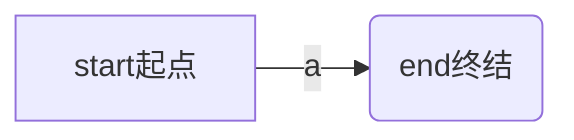
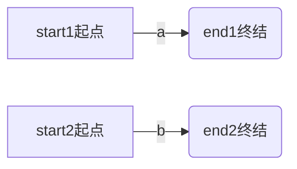
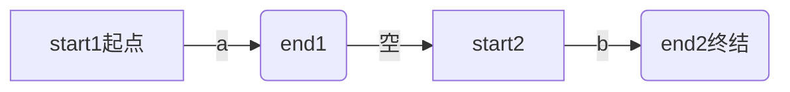
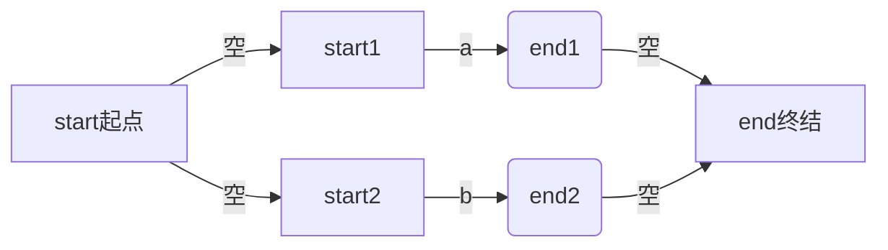
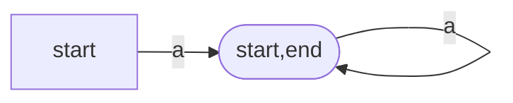

# 5. 词法分析

词法分析，如其名，只分析词语，即token，词是一个文法的最小单元。至于什么是文法，后面会介绍，这里不需要过多忧虑。

# 5.1. 举个例子

比如我们有一个代码,这个代码和c/c++很相似（但是这个是pava代码，读者目前可以理解为c代码），这是一个计算斐波那契数列的代码，他的词法分析结果是什么呢？

```c++
int fib(int x){
    if(x<2) return 1;
    return fib(x-1) + fib(x-2);
}
int main(){
    int a = fib(5);
    return a;
}
```

下文的代码就是词法分析结果, 词法分析器从源文件依次读取，然后分割出最小的词法单元，

<!-- more -->

最开始词法分析器读到了字符`i`，然后读到了字符`n`，然后读到了字符`t`,紧接着读到了空格字符` `，这时候词法分析器发力，进行分割，将前三个字符`int`划为最小词法单元`符号`。

紧接着继续读取`f`,当他读入`f`这个字符的时候，词法分析器发力，将第四个字符` `(空格字符)划为词法单元`empty`,当然在下文中无法找到`emtpy`这个token，因为`empty`代表空字符，可有可无。

然后词法分析器继续分析，不断地解析，一直解析出`fib(符号)`， `((左括号)`， `int(符号)`,`x(符号)`,`)(右括号)`

```txt
"int"(symbol)
"fib"(symbol)
"("(leftBracket)
"int"(symbol)
"x"(symbol)
")"(rightBracket)
"{"(leftCurlyBracket)
"if"(if)
"("(leftBracket)
"x"(symbol)
"<"(lt)
"2"(number)
")"(rightBracket)
"return"(return)
"1"(number)
";"(semicolon)
"return"(return)
"fib"(symbol)
"("(leftBracket)
"x"(symbol)
"-"(sub)
"1"(number)
")"(rightBracket)
"+"(add)
"fib"(symbol)
"("(leftBracket)
"x"(symbol)
"-"(sub)
"2"(number)
")"(rightBracket)
";"(semicolon)
"}"(rightCurlyBracket)
"int"(symbol)
"main"(symbol)
"("(leftBracket)
")"(rightBracket)
"{"(leftCurlyBracket)
"int"(symbol)
"a"(symbol)
"="(eq)
"fib"(symbol)
"("(leftBracket)
"5"(number)
")"(rightBracket)
";"(semicolon)
"return"(return)
"a"(symbol)
";"(semicolon)
"}"(rightCurlyBracket)
"$END"($END)
```


# 5.2. 识别词法单元

编译器的第一步就是词法分析，他需要从待分析的文本中，逐字符读取，并分割词法单元。一种高效而有简单的方式就是使用正则表达式构建NFA模型，然后优化为DFA，此后对文本进行分割。

这里可能有一些抽象，突然来了这么多概念，下面一个一个来解释。

# 5.3. 确定有限状态自动机

[确定有限状态自动机](https://zh.wikipedia.org/wiki/%E7%A1%AE%E5%AE%9A%E6%9C%89%E9%99%90%E7%8A%B6%E6%80%81%E8%87%AA%E5%8A%A8%E6%9C%BA) 被称为DFA

> 确定有限状态自动机${\displaystyle {\mathcal {A}}}$是由
>
> - 一个非空有限的[状态](https://zh.wikipedia.org/wiki/状态)集合${\displaystyle Q}$
> - 一个输入[字母表](https://zh.wikipedia.org/wiki/字母表_(计算机科学))${\displaystyle \Sigma }$（非空有限的字符集合)
> - 一个转移[函数](https://zh.wikipedia.org/wiki/函数)${\displaystyle \delta :Q\times \Sigma \rightarrow Q}$（例如：${\displaystyle \delta \left(q,\sigma \right)=p,\left(p,q\in Q,\sigma \in \Sigma \right)}$)
> - 一个开始状态${\displaystyle s\in Q}$
> - 一个接受状态的集合${\displaystyle F\subseteq Q}$
>
> 所组成的5-[元组](https://zh.wikipedia.org/wiki/多元组)。因此一个DFA可以写成这样的形式：${\displaystyle {\mathcal {A}}=\left(Q,\Sigma ,\delta ,s,F\right)}$。

# 5.4. 非确定有限状态自动机

非确定有限状态自动机又被称为NFA，与DFA不同的是他的转移是不确定的，他的转移不唯一。


# 4.5. 正则表达式识别原理

## 4.5.1. 正则例1

首先给出一个正则表达式`a`， 这个正则表达式能识别，且仅能识别字符串`a`，那么如何来表示呢?下图是这个正则表达式所对应的nfa，最开始我们在状态`start`， 当我们读取字符a以后，会转移到`end`，当我们到达end的时候如果输入结束，自动机就输出匹配成功。所以该自动机能使被字符串`a`，如果输入为`b`， 自动机在start时，会因为没有`b`这个转移而直接输出匹配失败，如果输入为`ab`自动机会因为在end处无法找到转移`b`而输出匹配失败.




## 4.5.2. 正则例2

考虑串联，来正则表达式`ab`， 这里如何构建呢，首先我们分别构建两个自动机。



然后将他们组装在一起， 注意到这里出现了一个`空`，这就意味着，当我们处于状态`end1`的时候可以不输入任何字符，直接转移到状态`start2` ，于是这个自动机最开始在`start1` 处，当他输入字符`a`，他会转移到`end1` 以及`start2`，当继续输入字符`b`，会转移到`end2`（end1无法转移,start2可转移）



## 4.5.3. 正则例3

考虑并联,来正则表达式`a|b`， 这里如何构建? 依然构建两个自动机


然后串联， 这里不用再解释了




## 4.5.4. 正则例4

考虑自循环， 来正则表达式`a+`, 加号表示出现最少一次,可以为多次, 只需要引一条从end到start的边即可


至此我们已经分析完了所有的正则单元，复杂的正则表达式均可由此合并而成。


# 4.6. NFA转DFA

nfa转dfa算法涉及到一个闭包，我们直接对这个nfa来计算闭包


最开始位于状态`start`， 当输入a以后，进入状态`end`， 计算end的空闭包`[start,end]`，当从状态`[start,end]`输入a以后，进入状态`end`，也就是`[start,end]`, 于是最终我们得到了这个dfa



# 4.7. DFA识别

如何为一门语言设计他的dfa呢？实际上一门语言涉及到多个token，每个token都会由一个正则，那么就会出现正则冲突，即一个字符串可以被识别为多种token，这时候就定义优先级即可。

另一种情况，即是否贪婪，如果一个字符串的前缀可以被识别为一个token，即字符串`ifhaha`的前缀`if`可以被识别为token`if` ,而他自身可以被识别为token`symbol`，这时候，我们需要选择最长的那个，即最长匹配即可。


# 4.8. 效果展示

笔者的项目中又涉及到一款c类语言(pava语言)的token配置

```json
{
    "tokens": [
        {"number": "0|[123456789]\\d*"},
        {"doubleQuotes": "\""},
        {"blank": "\\s+"},
        {"leftCurlyBracket": "\\{"},
        {"rightCurlyBracket": "\\}"},
        {"string": "\"[\\s\\w\\d]*\""},
        {"include": "#include"},
        {"while": "while"},
        {"if": "if"},
        {"for": "for"},
        {"return": "return"},
        {"break": "break"},
        {"continue": "continue"},
        {"do": "do"},
        {"goto": "goto"},
        {"else": "else"},
        {"comma": ","},
        {"leftBracket": "\\("},
        {"rightBracket": "\\)"},
        {"add": "\\+"},
        {"sub": "\\-"},
        {"mul": "\\*"},
        {"div": "/"},
        {"mod": "%"},
        {"doubleEq": "=="},
        {"eq": "="},
        {"ne": "!="},
        {"leftShift": "<<"},
        {"rightShift": ">>"},
        {"be": ">="},
        {"le": "<="},
        {"bt": ">"},
        {"lt": "<"},
        {"semicolon": ";"},
        {"symbol": "[_\\w][_\\w\\d]*"}
      ]
}
```

该配置在经过自动构建工具[compiler/Reg.java at master · fightinggg/compiler · GitHub](https://github.com/fightinggg/compiler/blob/master/main/src/main/java/com/example/lang/reg/Reg.java)构建以后得到了下图的nfa, 如果此图太小，读者可以右键点击到新页面查看，此处不对此工具进行解释，因为它涉及到更深层次的内容，笔者将在后面的章节中予适当的时候对此工具进行描述，另一方面由于此dfa也不是很大，人工绘制也不是不可能，综上此处不做解析了。


