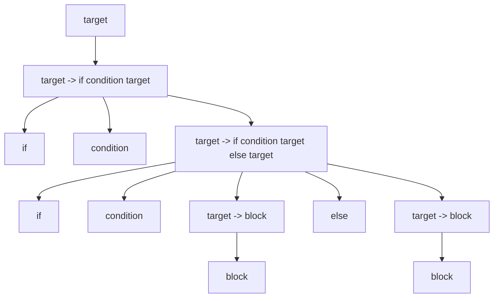
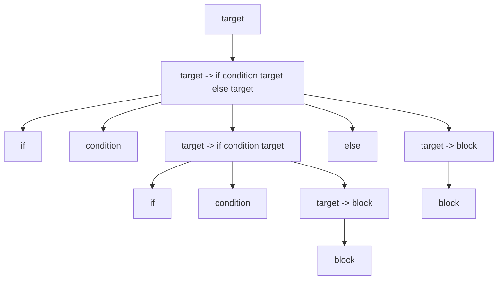
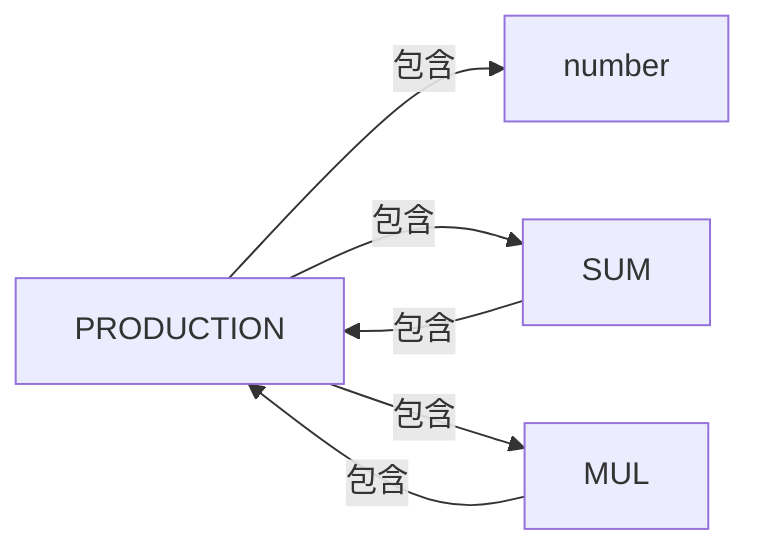

# 5. 语法分析

# 5.1. 文法

文法的种类有很多，正则文法，上下文无关文法，上下文有关文法。

## 5.1.1. 正则文法

这一块内容就是我们平时所用到的正则表达式的文法，他的词是各个字符。

## 5.1.2. 上下文无关文法

上下文无关文法涉及到4个定义

- 终结符： 文法的基本单元，词
- 非终结符： 文法的中间变量，一些词按顺序排列构成的符号
- 产生式： 连接非终结符和终结符的等式，产生式表明了一些终结符和非终结符如何排列可以得到新的非终结符
- 开始： 文法开始的非终结符，他表明了什么样的非终结符满足当前文法

例子

```
加法：
  终结符: number, +
  非终结符: SUM
  产生式： SUM -> number + number | SUM + number
  开始： SUM
```

上诉文法可以接受 1+2， 我们只需要把1和2视为number，即可，此时的词法单元就是1，2，+

由于高级程序设计语言基本可以被视为上下文无关文法，文法的语法分析有很多算法，后面会依次对他们进行介绍。

<!-- more -->

## 5.1.3. 上下文有关文法

在上下文无关文法中，产生式左部都是单个非终结符，如果放开这个限制，那么就成了上下文有关文法。这里不是重点，直接跳过，有兴趣的读者可以自行[学习](https://zh.wikipedia.org/wiki/%E4%B8%8A%E4%B8%8B%E6%96%87%E6%9C%89%E5%85%B3%E6%96%87%E6%B3%95)。


# 5.2. 最左递归下降

递归下降算法可以解析一部分上下文无关文法，递归下降其实就是枚举，他是一种自顶向下的算法，从文法的`开始`开始， 逐渐替换最左侧的非终结符为新的符号列表，直到匹配成功,其代码为:

```txt
匹配(参数1： deque, 参数2： 当前匹配的下标i)
	如果双端队列deque[e1,e2,e3...]的最左侧e1是终结符
    	从双端队列deque[terminalSymbol,e2,e3,e4...]取出并删除最左侧的终结符terminalSymbol
       	如果 terminalSymbol和当前第i个token不相等， 返回失败
       	否则 返回 继续匹配(deque,i+1)
    如果双端队列deque[e1,e2,e3...]的最左侧e1是非终结符
       	从双端队列deque[noTerminalSymbol,e2,e3,e4...]取出并删除最左侧的非终结符noTerminalSymbol
       	枚举以非终结符noTerminalSymbol为左部的产生式production
           将production右部的所有符号[s1,s2,s3...]顺序不变放在deque[e1,e2,e3...]左侧得到[s1,s2,s3...e1,e2,e3...]
           如果 继续匹配(deque,i) 成功 返回成功
    	返回失败
```

这样的一个算法，

第一，他的时间复杂度是指数的，非常慢

第二，如果文法存在左递归，则算法死循环

第三，如果文法二义，则算法输出的语法树不确定


# 5.3. 左递归文法

如果一个文法中存在产生式`A -> A * * *`则这个文法为直接左递归文法，比如下面这个文法为左递归文法, 因为`SUM -> SUM + number`

```
加法：
  终结符: number, +
  非终结符: SUM
  产生式: SUM -> number + number | SUM + number
  开始： SUM
```

如果一个文法在经过有限次产生式替换以后，出现了`A -> A * * *`则这个文法为间接左递归文法。如下面的文法, 因为`SUM -> S + S -> SUM + S`

```
加法：
  终结符: number, +
  非终结符: SUM, S
  产生式:  SUM -> S + S
  		  S -> SUM | number
  开始： SUM
```

当文法中存在左递归时，将最左侧的非终结符替换为符号数组将导致无穷无尽的循环、


# 5.4. 二义性文法

如果一个token流，对应于一个文法存在不止一棵语法树，则该文法为二义性文法，下面的文法为二义性文法

```
ifelse:
  终结符: if, else, condition, block
  非终结符: target
  产生式: target -> block | if condition target | if condition target else target
  开始： target
```

考虑`if condition if condition block else block`他有两颗语法树






# 5.5. 乔姆斯基范式

> 在[计算机科学](https://zh.wikipedia.org/wiki/计算机科学)中，一个[形式文法](https://zh.wikipedia.org/wiki/形式文法)是 **Chomsky 范式**的，[当且仅当](https://zh.wikipedia.org/wiki/当且仅当)所有产生规则都有如下形式：
>
> *A* → *BC* 或
>
> *A* → α 或
>
> *S* → ε
>
> 这里的 *A*, *B* 和 *C* 是非终结符，α 是[终结符](https://zh.wikipedia.org/wiki/终结符)（表示常量值的符号），*S* 是开始符号，而 ε 是[空串](https://zh.wikipedia.org/wiki/空字元串)。还有，*B* 和 *C* 都不可以是开始符号。
>
> 所有的 Chomsky 范式的文法都是[上下文无关](https://zh.wikipedia.org/wiki/上下文无关文法)，反过来，所有上下文无关文法都可以有效的变换成等价的 Chomsky 范式的文法。
>
> 引用： [乔姆斯基范式](https://zh.wikipedia.org/wiki/%E4%B9%94%E5%A7%86%E6%96%AF%E5%9F%BA%E8%8C%83%E5%BC%8F)

将一个上下文无关文法转化为乔姆斯基范式也非常简单，这不做赘述。


# 5.6. CYK算法

> **CYK算法**（[英语](https://baike.baidu.com/item/英语/109997)：Cocke–Younger–Kasami algorithm，缩写为CYK algorithm）是由[约翰·科克](https://baike.baidu.com/item/约翰·科克/7868274)，Younger和嵩忠雄共同研究出来大约发表于1965年的一个算法，它是一个用来判定任意给定的字符串 是否属于一个[上下文无关文法](https://baike.baidu.com/item/上下文无关文法/2001908)的算法。
>
> 引用： [CYK算法](https://baike.baidu.com/item/CYK%E7%AE%97%E6%B3%95/15817539)

这是一种`dp`算法，基于乔姆斯基范式，`dp[i,j]`代表`子串(i:j)`能被识别为哪些非终结符，这是只需要在`i`和`j`中间枚举`k`, 由`dp[i,k]` 和`dp[k+1,j]`转移即可。


# 5.7. FIRST集

每个非终结符都能够识别一些文本，这些文本的第一个字符就是这个非终结符的FIRST集的一员。

换句话说，非终结符的FIRST集就是该非终结符经过产生式转换以后形成的序列的第一个元素（该元素必须为终结符）

## 5.7.1. 例子1

先给出文法

```加法：
加法：
  终结符: number, +
  非终结符: SUM
  产生式: SUM -> number + number | SUM + number
  开始： SUM
```

该文法有非终结符SUM，根据产生式`SUM->number+number`，得出`number`在SUM的FIRST集中，根据产生式`SUM->SUM+number`我们无法得出任何信息。

综上，SUM的FIRST集为`{number}`

## 5.7.2. 例子2

```
加法和乘法：
  终结符: number, +, *
  非终结符: SUM, MUL, PRODUCTION
  产生式: SUM -> PRODUCTION + PRODUCTION
  	     MUL -> PRODUCTION * PRODUCTION
  	     PRODUCTION -> number | SUM | MUL
  开始： PRODUCTION
```

根据产生式`SUM -> PRODUCTION + PRODUCTION`推断出PRODUCTION的FIRST集都在SUM的FIRST集中

根据产生式`MUL -> PRODUCTION * PRODUCTION`推断出PRODUCTION的FIRST集都在MUL的FIRST集中

根据产生式`PRODUCTION -> number | SUM | MUL`推断出number在PRODUCTION的FIRST集中，SUM的FIRST集和MUL的FIRST集在PRODUCTION的FIRST集中。

根据上面三个结论，我们可以构造一个图。



聪明的读者可以直接看出，其实他们三个非终结符的FIRST集都是`{number}`.

## 5.7.3. FIRST集计算算法（简单版）

如何计算FIRST集？我们直接考虑产生式 `A-->B...`， 显然A一定是非终结符，

如果B也是非终结符，则B的first集都在A的first集中，

如果B是终结符，则B在A的first集中。

借此，我们可以构造出一个有向图，该图上每个节点按照有向边能到达的终结符，就是该节点所代表的非终结符的FIRST集的一员。其实这本质上是一个有向图闭包问题。


## 5.7.4. 复杂一点的FIRST集例子

`ε`代表可以为空，即什么也没有

```
变量声明：
  终结符: type, symbol, visibility, staticable
  非终结符: staticableOPT, visibilityOPT, TARGET
  产生式: TARGET -> visibilityOPT staticableOPT type symbol
  		 visibilityOPT -> visibility | ε
  		 staticableOPT -> staticable | ε
  开始： TARGET
```

根据`TARGET -> visibilityOPT staticableOPT type symbol`得出visibilityOPT的FIRST集在TARGET的FIRST集中，考虑到visibilityOPT可以为空，所以当visibilityOPT为空时，staticableOPT的FIRST集在TARGET的FIRST集中，同理，type也在TARGET的FIRST集中。

visibilityOPT的first集为`{visibility}`

staticableOPT的first集为`{staticable}`

最终`TARGET`的first集为`{visibility,staticable,type}`


## 5.7.5. FIRST计算方法（最终版）

如何计算FIRST集？我们直接考虑产生式 `A-->BCDE...`， 显然A一定是非终结符，

如果B也是非终结符，则B的first集都在A的first集中，然后根据B能否为空判断C

若B可为空，则C的first集都在A的first集中，然后根据C能否为空判断D，依次递推

如果B是终结符，则B在A的first集中。

借此，我们可以构造出一个有向图，该图上每个节点按照有向边能到达的终结符，就是该节点所代表的非终结符的FIRST集的一员。其实这本质上是一个有向图闭包问题。

## 5.7.6.  可达闭包之SPFA算法

```
将所有的有向边(from,to)入队queue，
只要queue非空:
	取出并删除queue队首top
	用top.to的可达集合合并到top.from的可达集合中，如果此过程对top.from的可达集合造成了修改:
		将所有以top.from为有向边终点的边edge入队queue
```

该算法时间复杂度为`O(VE)`, (V为顶点数，E为边数)

## 5.7.7. 可达闭包之Tarjan算法

```
首先使用Tarjan三大算法中的有向图强连通缩图，在同一个强连通分量的点，他们的可达集合相同
缩图以后得到的是DAG有向无环图，在有向无环图上按照拓扑序进行DP，计算所有结果
```

该算法时间复杂度为`O(V+V)` (V为顶点数，E为边数)

## 5.7.8. 总结

实际上，一般的文法都不会很复杂，其依赖图的顶点数不会超过200，边数不会超过1000，所以SPFA算法足以解决问题。 

# 5.8. FOLLOW集计算


在产生式中，经过一定次数的替换以后，如果某个终结符出现在了某个非终结符的后面，则这个终结符被计入这个非终结符的FOLLOW集。


 ## 5.8.1. 例子

```txt
加法：
  终结符: number, +
  非终结符: SUM
  产生式: SUM -> number + number | SUM + number
  开始： SUM
```

我们发现SUM的后面可以跟上`+`，所以SUM的FOLLOW集就是`+`


## 5.8.2. 例子

```txt
加法和乘法：
  终结符: number, +, *
  非终结符: SUM, MUL, PRODUCTION
  产生式: SUM -> PRODUCTION + PRODUCTION
  	     MUL -> PRODUCTION * PRODUCTION
  	     PRODUCTION -> number | SUM | MUL
  开始： PRODUCTION
```

`SUM -> PRODUCTION + PRODUCTION`可以得到`PRODUCTION `的FOLLOW集中有`+`,同理`MUL -> PRODUCTION * PRODUCTION`得出有`*`

`SUM`的FOLLOW集中有`*`和`+`,因为`SUM -> PRODUCTION + PRODUCTION`，即PRODUCTION的FOLLOW集都在SUM中。

同理`MUL`的FOLLOW集中有`*`和`+`


## 5.8.3 算法

考虑非终极符`A`, 如果存在产生式`S->*AB**`,则`B`的FIRST集在`A`的FOLLOW集中

若B可为空，则看B后的下一个符号，其FIRST集在A的FOLLOW集中


如果存在产生式`S->**A`，则S的FOLLOW集都在A的FOLLOW集中。


如此构成了依赖图，又是可达闭包计算。计算步骤参见`FIRST`集算法。


# 5.9. LL语法分析

LL语法分析指的是从左向右最左推导，是一种自顶向下的算法，实际上，所有的自顶向下算法都无法解决左递归文法。进行LL分析，需要提前计算FIRST集和FOLLOW集。

LL算法进行自顶向下分析，自顶向下分析的核心步骤有两个，一个是匹配，另一个是展开。

当从左到右自顶向下分析时，如果当前的符号为终结符，此时只能走匹配，而且当前符号必须和输入的符号匹配。

如果当前符号为非终结符，此时只能 展开，但是用哪个产生式展开，往往不好选择，LL算法则根据FIRST集和FOLLOW集来进行选择。


 ## 5.9.1 例子

```
加法：（注意这里的产生式被我换成了右结合，且提取了公因式）
  终结符: number, +
  非终结符: SUM, ADD
  产生式: SUM -> number ADD
         ADD -> + SUM | ε
  开始： SUM
```

待识别字符串1+2+3+4

第一步计算FIRST集，SUM的FIRST集为： `number`

ADD的FIRST集为`+`

第二步计算FOLLOW集，SUM的FOLLOW集为： `$,+`

ADD的FOLLOW集为	`$`

最开始的时候，有一个队列，其中包含一个开始的符号`SUM`

然后我们进行输入，输入字符`1`,这是一个number，number和SUM无法匹配，所以必须把SUM用产生式替换，SUM只有一个产生式，于是SUM被换成了`number ADD`,此时的队列的操作就是从左边 弹出SUM，再放入`number ADD`

替换以后，字符1就可以和number匹配了，于是输入字符成功，队列弹出`number`

紧接着，输入字符`+`, 这时候队列中只有一个`ADD`,`ADD`和`+`无法匹配，于是需要用产生式替换，用哪个换呢？显然用`+ SUM`换，因为`ε`的FIRST集为空，所以此时替换以后，队列变为`+ SUM`

替换以后，字符`+`就可以和队列的队首匹配，输入成功....

然后算法不断迭代，直到完成输入。


## 5.9.2 总结

其实LL语法分析就是前面介绍的最左递归下降算法的特殊情况，当文法没有二义性，文法不能在进行合并公因式，文法没有左递归时，文法就不需要递归分解了。

LL语法分析有很多局限性，他能解决的文法少的可怜，虽然后面有办法通过文法的等价转化，把一个左递归文法转化为非左递归，提取公因式，消除二义性，但是这样做的代价非常大，这样的工作往往会导致文法变得特别复杂，特别不好理解，就问下吗这两个文法你喜欢哪一个？

```
加法：（注意这里的产生式被我换成了右结合，且提取了公因式）
  终结符: number, +
  非终结符: SUM, ADD
  产生式: SUM -> number ADD
         ADD -> + SUM | ε
  开始： SUM
```

```
加法：
  终结符: number, +
  非终结符: SUM
  产生式: SUM -> number | SUM + SUM
  开始： SUM
```


