# TCP-IP详解


# 慎重

这是一本工具书！！！！！！！！！！

这本书和我想象中的不太一样，他不偏向于技术，他更加注重细节，更像是一本工具书，先到这里了，不细看了，有需要再补充

- 21/4/2 新建 ARP协议、IP协议

- 21/4/4 补充 DNS协议

<!-- more -->

# 第二章 Internet 地址结构

>当一台设备连接到全球性的 Internet时,为它们分配地址就必须经过协调,这样就不会重复使用网络中的其他地址。对于专用网络,使用的IP地址必须经过协调,以避免在专用网络中出现类似的重复。成组的IP地址被分配给用户和组织。这些地址的拥有者再将它们分配给设备,这通常根据某些“编号方案”进行。对于全球性的 Internet地址,一个分层结构管理实体帮助用户和服务提供商分配地址。个人用户通常由 Internet服务提供商(ISP)分配地址,通过支付费用来获得地址和执行路由。
>
>Page: 31


## IPv6

>在IPv6中,地址的长度是128位,是IPv4地址长度的4倍。一般来说,大多数用户对它不太熟悉。IPv6地址的传统表示方法是采用称为块或字段的四个十六进制数,这些被称为块或字段的数由冒号分隔。例如,一个包含8个块的IPv6地址可写为5m05:2000:80ad:5800:0058:0800:2023:1d71。虽然不像用户熟悉的十进制数,但将十六进制数转换为二进制更容易。另外,一些已取得共识的IPv6地址简化表示法已被标准化[RFC42911]:
>1.一个块中前导的零不必书写。在前面的例子中,地址可写为5f05:200080ad:5800:58:800:2023:1d7l
>2.全零的块可以省略,并用符号::代替。例如,IPv6地址0:0:0:0:0:0:0:1可简写为::1同样,地址2001:0db8:0:0:0:0:0:2可简写为2001:db8::2。为了避免出现歧义,一个IPv6地址中符号::只能使用一次。

在某些情况下，可以使用[]来包裹IPv6，比如url:

http://[2001:0db8:85a3:08d3:1319:8a2e:0370:7344]:443/

## IPv4地址分类

在最初，IPv4被分为这5类

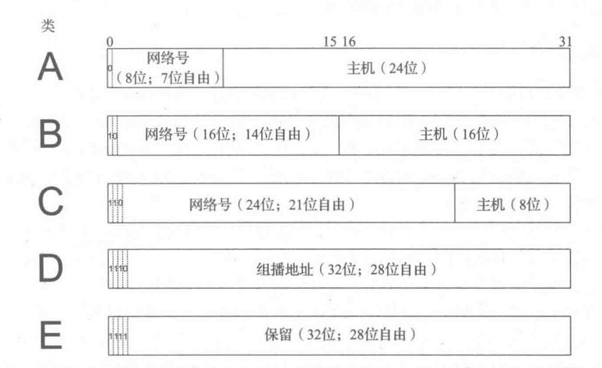

20世纪90年代以后，Internet遇到了新的问题：

>1.到1994年,一半以上的B类地址已被分配。预计,B类地址空间大约在1995年将被用尽。
>
>2.32位的IPv4地址被认为不足以应付 Internet在21世纪初的预期规模。
>
>3.全球性路由表的条目数(每个网络号对应一条),1995年大约为65000个条目,目前仍在增长中。随着越来越多A类、B类和C类路由条目的出现,路由性能将受到影响。
>
>Page: 46

## CIDR

无类别域间路由，使用CIDR，任何位定义的地址范围都可以作为一个类的一部分，但是需要提供子网掩码（IP前缀长度）

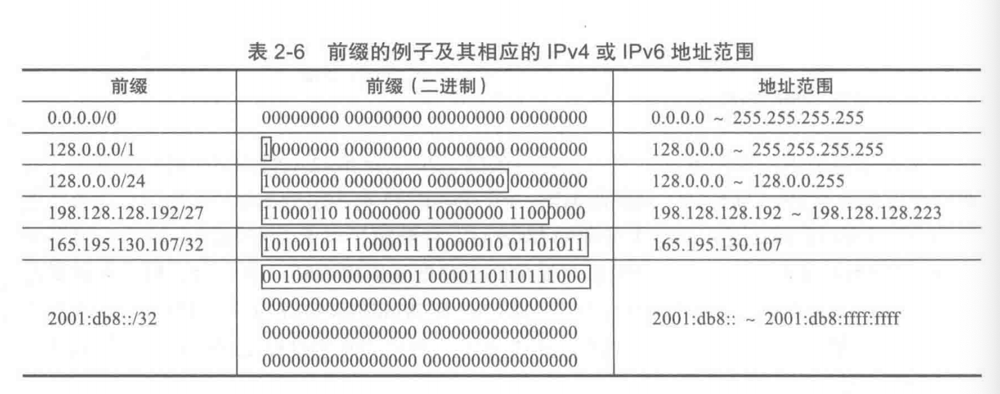

无类别域间路由解决了问题1，IPv6解决了问题2，问题3没办法了。

## 聚合

Kleinrock和Kamoun提出使用分层路由，树形拓扑网络

如果我们按照地址对IP进行聚合，就能让路由表中的条目变少，下图左中的路由表有9个条目，右中的路由器只有三个条目且不随树的生长变化。

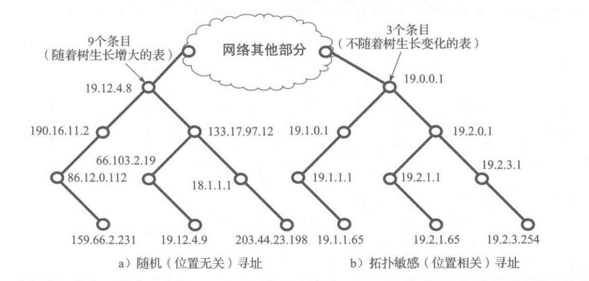

## 特殊用途的地址

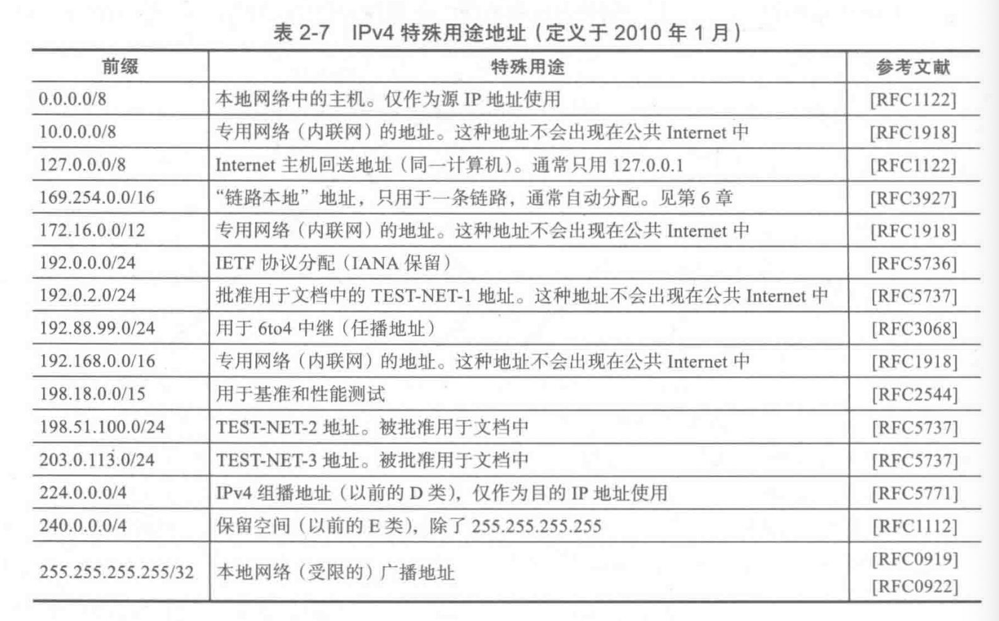


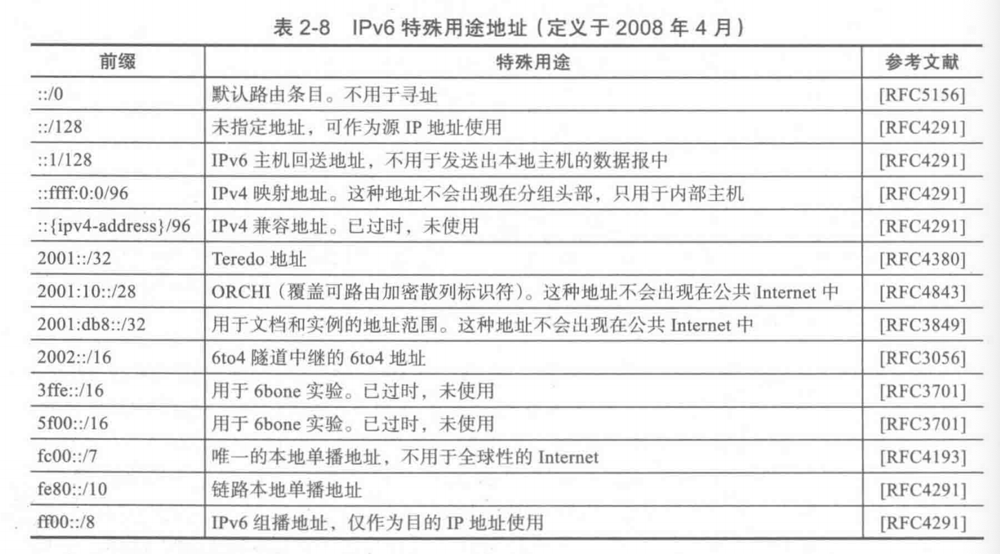


# 第四章： 地址解析协议

arp协议能够把IP地址转换为物理地址。在linux上执行命令

```shell
arp
```

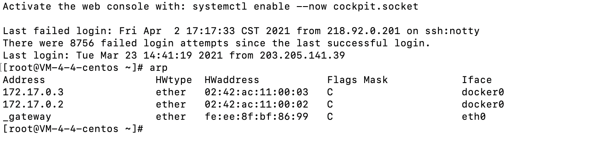

我们可以看到这里有5列，第一列Address即IP地址，HWtype是硬件类型，HWaddress是硬件地址，Flags是标志，包括C、M、P，C代表由arp协议动态学习，M为手动输入，P是发布（主机对ARP请求的应答），Iface是本地网络接口（网卡）

我们使用docker启动一个centos8容器，安装好需要的网络工具，然后执行命令

```shell
tcpdump -vve
```

然后对这个容器再启动一个bash执行

```shell
telnet fightinggg.top 80
```

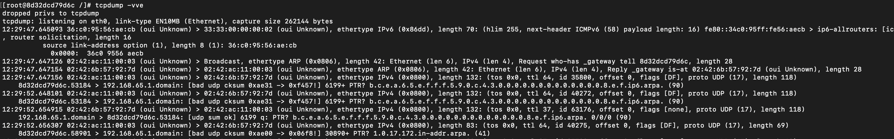

注意到有着两行出现

```txt
12:29:47.647126 02:42:ac:11:00:03 (oui Unknown) > Broadcast, ethertype ARP (0x0806), length 42: Ethernet (len 6), IPv4 (len 4), Request who-has _gateway tell 8d32dcd79d6c, length 28
12:29:47.647154 02:42:6b:57:92:7d (oui Unknown) > 02:42:ac:11:00:03 (oui Unknown), ethertype ARP (0x0806), length 42: Ethernet (len 6), IPv4 (len 4), Reply _gateway is-at 02:42:6b:57:92:7d (oui Unknown), length 28
```

第一行的意思是mac为02:42:ac:11:00:03的主机发布了一个广播：谁知道\_gateway的mac地址，请告诉8d32dcd79d6c(docker 容器的host)

第二行的意思是mac为02:42:6b:57:92:7d的主机向02:42:ac:11:00:03发送了单播：\_gateway的mac地址为02:42:6b:57:92:7d

## 代理ARP

> 代理ARP[RFC1027使一个系统(通常是一台专门配置的路由器)可回答不同主机的ARP请求。它使ARP请求的发送者认为做出响应的系统就是目的主机,但实际上目的主机可能在其他地方(或不存在)。ARP代理并不常见,通常应尽量避免使用它。

## 免费ARP

当一台主机启动的时候，他会发送一个ARP请求，寻找自己的地址，通常他不期待得到回答。

这样做有两个好处：

1. 确定网络中不存在另一台主机和自己的IP地址相同
2. 如果主机已经改变了自己的MAC地址，这个ARP报文会让其他主机更新这台主机的MAC地址

# 第五章：Internet协议


## IP报文

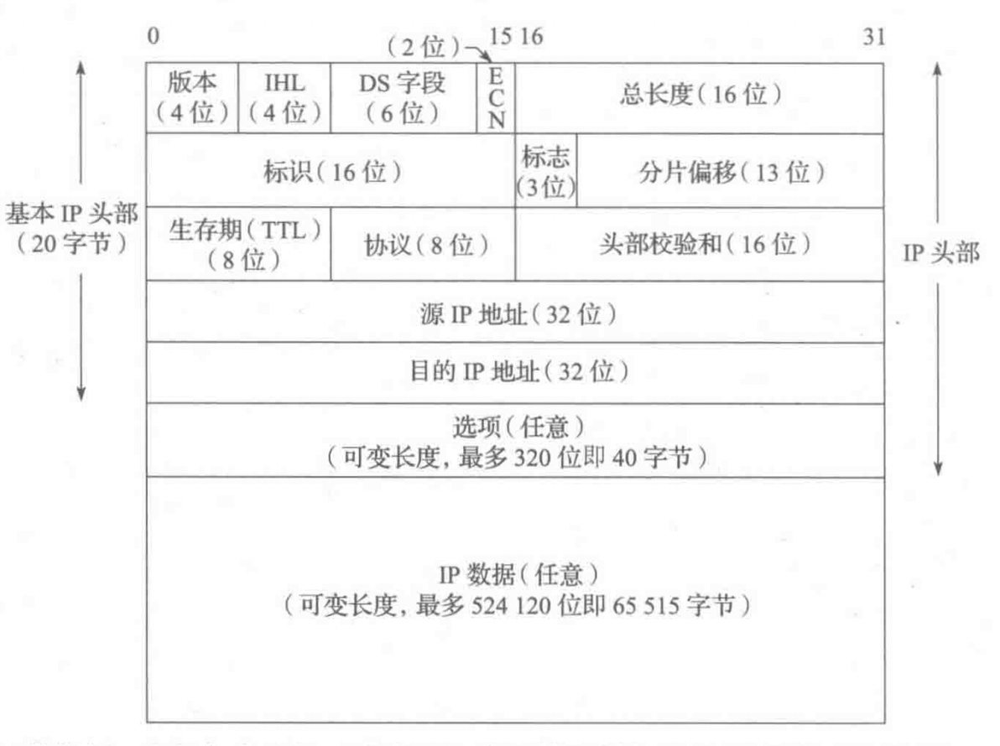

细节参考[这里](/QQTKJ0.html#IPv4)

DS字段细节

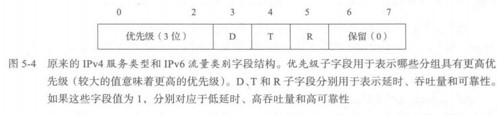

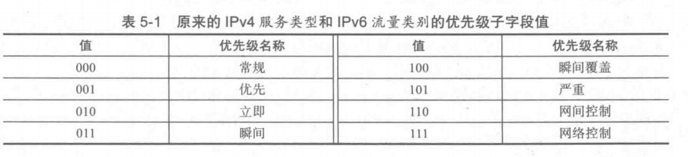


协议详见

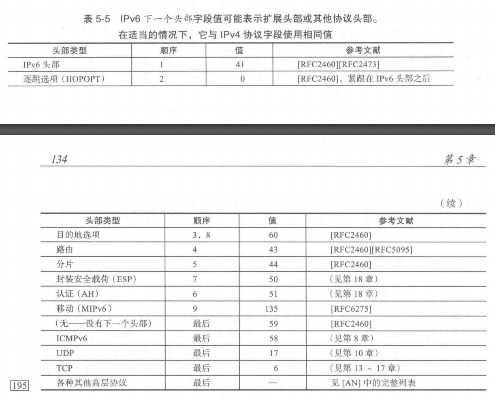


## IPv6头部

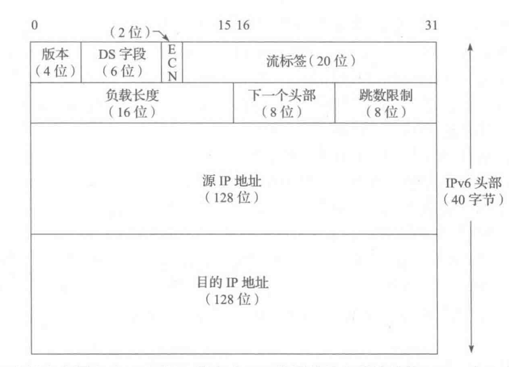

下一个头部具体的情况


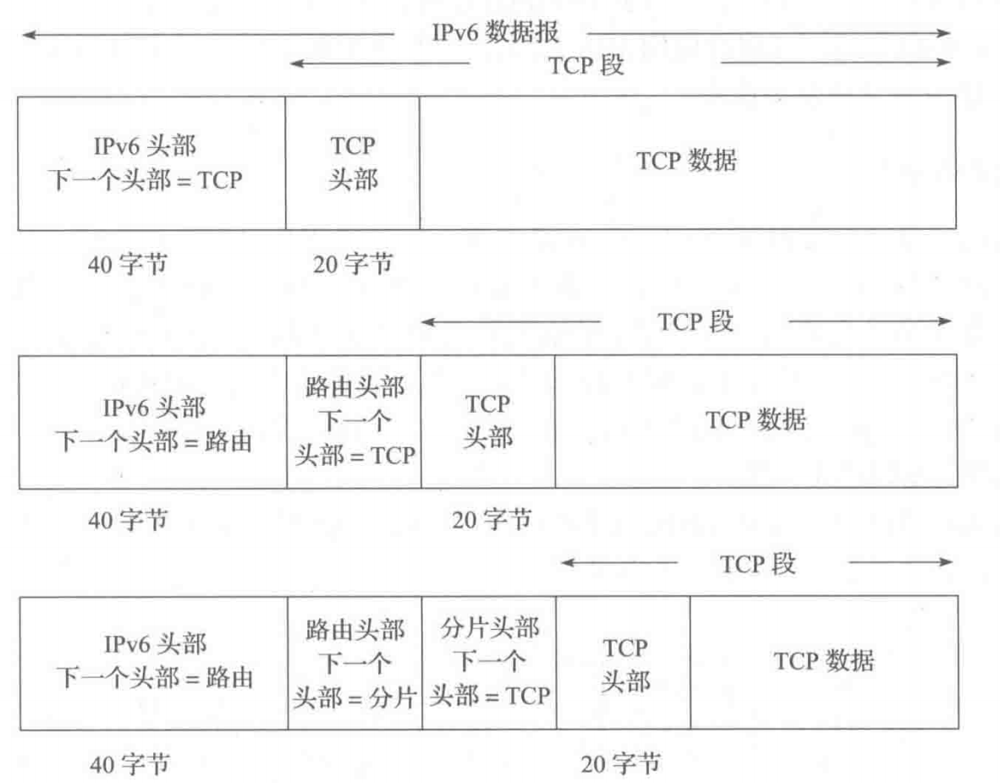


# 第11章 名称解析和域名系统


## DNS消息格式


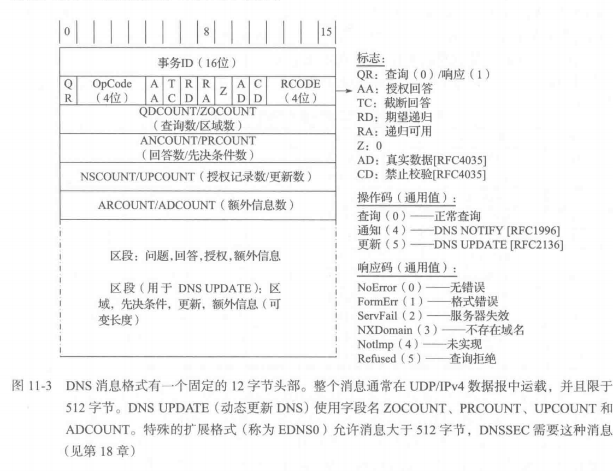


| 名称                      | 备注                                                         | 位数 |
| :------------------------ | :----------------------------------------------------------- | ---- |
| 事务ID                    | 客户端设置，服务器返回                                       | 16   |
| QR                        | 决定是响应还是回复                                           | 1    |
| OpCode                    | 0正常查询<br />4通知<br />5更细<br />1-3弃用                 | 4    |
| AA（authoritative anwer） | 授权回答，与缓存回答相对                                     | 1    |
| TC（truncated）           | 可截断，在UDP中标识是否截断                                  | 1    |
| RD（recursion desired）   | 期望递归，参考[递归DNS](/Q7EBAW.html#%E9%80%92%E5%BD%92%E8%BF%98%E6%98%AF%E9%9D%9E%E9%80%92%E5%BD%92) 如果回答是，则服务器会返回递归的DNS地址 | 1    |
| RA（递归可用）            | 表明该服务器是否支持递归，根服务器不支持RA                   | 1    |
| Z                         | 保留，一定是0                                                | 1    |
| AD                        | 是否授权                                                     | 1    |
| CD                        | 是否禁用安全检查（随缘补充这部分）                           | 1    |
| RCODE                     | 见👇                                                          | 4    |
| QDCOUNT/ZOCOUNT           | 查询数/区域数👇                                               | 16   |
| ANCOUNT/PRCOUNT           | 回答数/先决条件数👇                                           | 16   |
| NSCOUNT/UPCOUNT           | 授权记录数/更新数👇                                           | 16   |
| ARCOUNT/ADCOUNT           | 额外信息数👇                                                  | 16   |


### RCODE


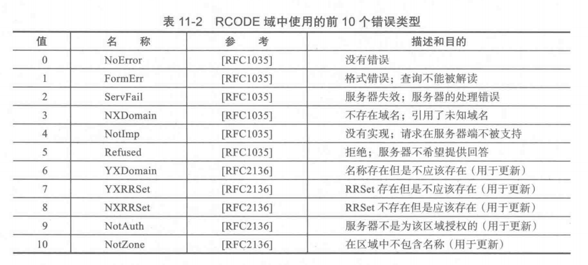


### QDCOUNT/ZOCOUNT

查询类16位， 1代表互联网类， 254代表没有类， 255代表所有类

查询类型16位， 一般为A（IPv6为AAAA）

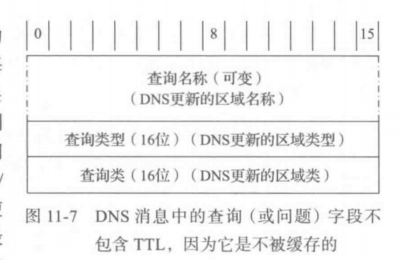


### 回答，授权，额外信息


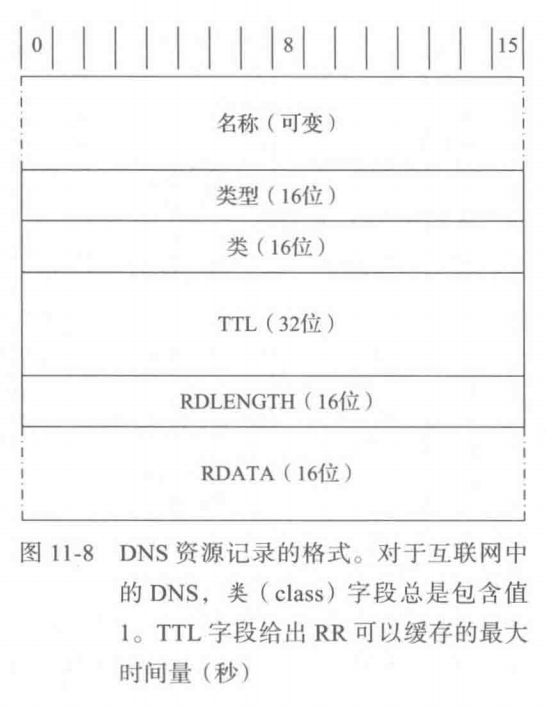


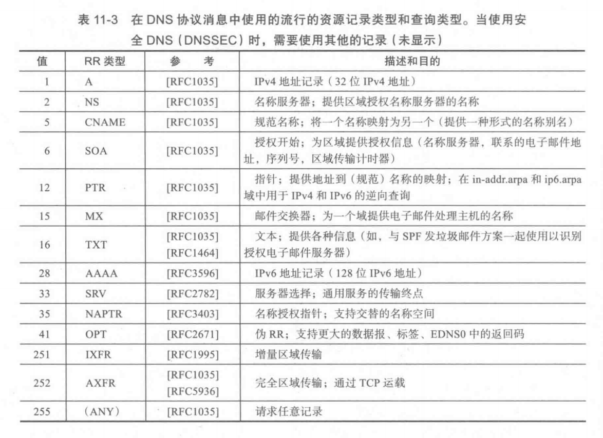


