# 深入理解Kafka: 核心设计与原理实践

# 5.1 文件目录布局

kafka文件目录中有很多文件，一般情况下我们只需要掌握`*.index`, `*.log`,`*.timeindex*`即可

<!-- more -->

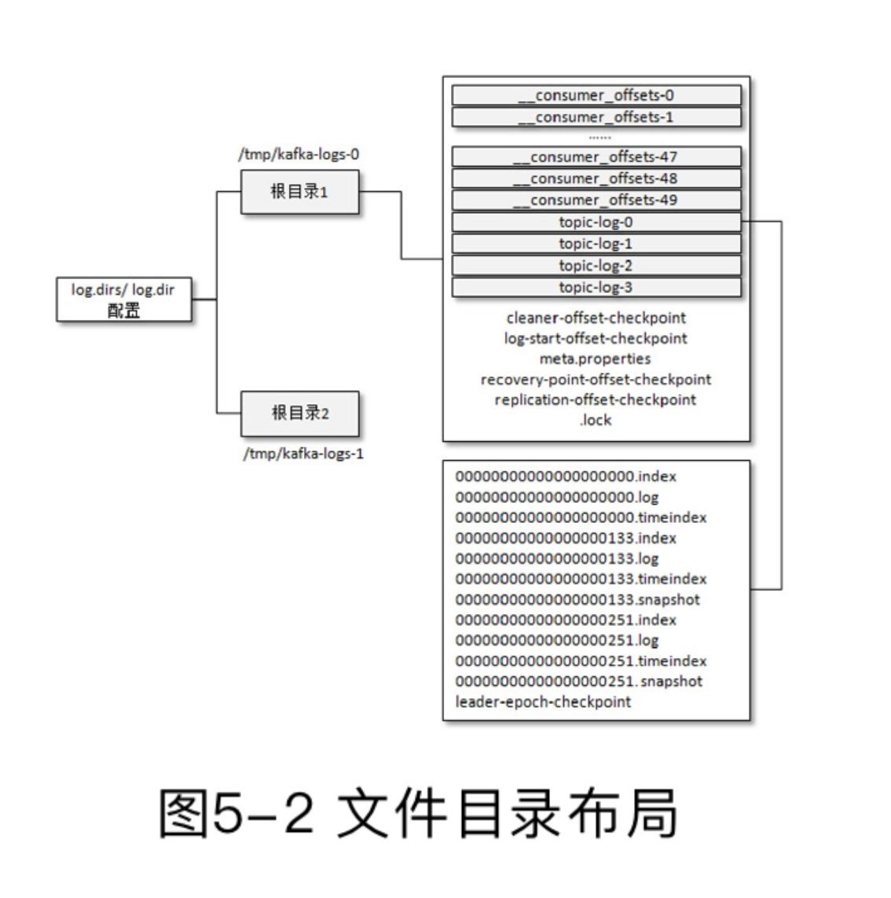

# 5.2 日志格式的演变

> 从0.8.x版本开始到现在的2.0.0版本，Kafka的消息格式也经历了3个版本：v0版本、v1版本和v2版本。

分区由一条条消息组成，如果消息设计的不够合理，分区的功能和性能会受到影响，过多的冗余导致储存增加、网络开销大、性能降低，缺少字段又会影响到日志的保存、切分策略。

## V0版本的消息

右边是消息集，每个Record是一条消息，offset是偏移量，messagesize代表消息的长度。

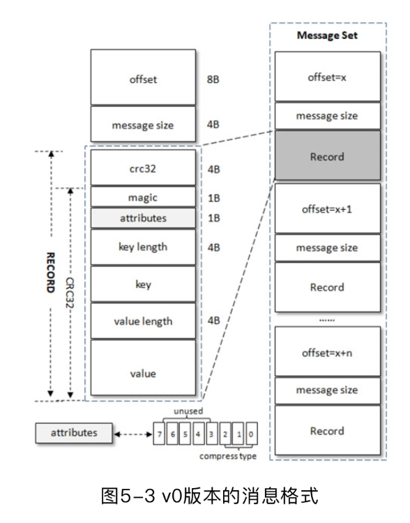

对于每个RECORD，他的字段如下

|     名称     |           功能           | 大小 |
| :----------: | :----------------------: | :--: |
|    crc32     | 消息内容的循环冗余校验值 |  4B  |
|    magic     |        消息版本号        |  1B  |
|  attributes  |       消息压缩算法       |  1B  |
|  key length  |        key的长度         |  4B  |
|     key      |           key            |  ？  |
| value length |       value的长度        |  4B  |
|    value     |          value           |  ？  |

我们注意到这里有一个压缩算法，这里其实很有趣，这个压缩算法指的是value的压缩算法，对于一条消息而言，什么时候需要压缩呢？

kafka不会对一条数据进行压缩,因为一条消息往往很小，压缩也不划算，kafka会对多条消息进行压缩，然后封装为一条新的消息。这时的key是无用的。

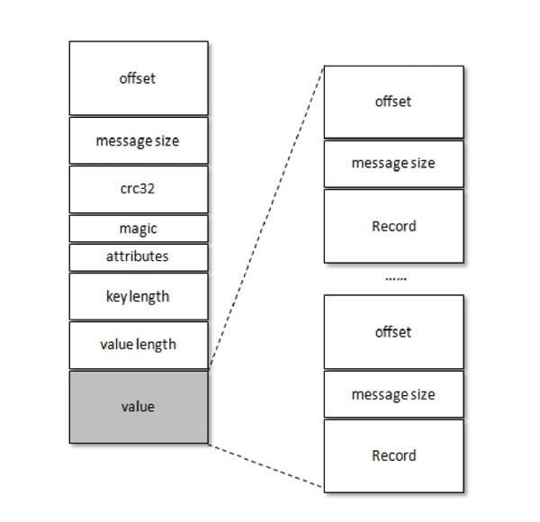

另外内层消息的offset又可以从0开始编号了。

## V1版本消息

就多了一个时间戳

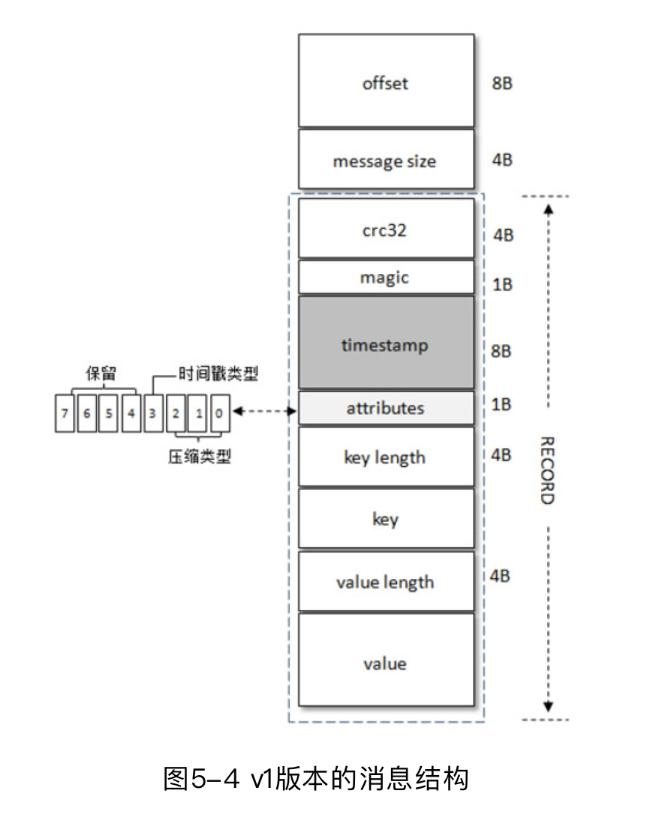

## V2版本消息

V2版本引入了变长整型varints以及zigzag编码，这种编码对于越小的数据，他所占的空间越少，对于较大的数据，他所占的空间较多。有兴趣的读者可以自行查阅

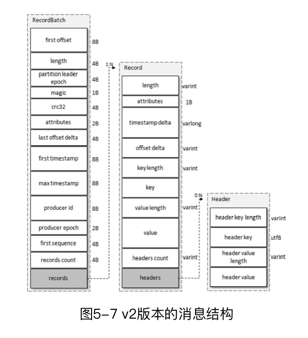

在v2版本中，message set改名为recordBatch，他也拥有了自己的头，在recordBatch中包含了多个record，其中的每个record与v1版本并无太大差异，我们注意到，他使用了大量的varint和delta，这个意思是很多数据是基于recordBatch中数据的相对值，这也导致了这些数往往很小，所以varint能发挥它最大的作用。

| 名称            |     状态     |              解释              | 大小   |
| --------------- | :----------: | :----------------------------: | ------ |
| length          | message size |           消息总长度           | 变长   |
| attributes      |     弃用     |                                | 1B     |
| timestamp delta |  timestamp   |           相对时间戳           | 变长   |
| offset delta    |    offset    |           相对offset           | 变长   |
| key length      |  key length  |                                | 变长   |
| key             |     key      |                                | 未知   |
| value length    | value length |                                | 变长   |
| value           |    value     |                                | 未知   |
| headers         |     新增     | 应用级拓展（可以储存了多个kv） | varint |

# 5.3 日志索引

> 偏移量索引文件用来建立消息偏移量（offset）到物理地址之间的映射关系，方便快速定位消息所在的物理文件位置；时间戳索引文件则根据指定的时间戳（timestamp）来查找对应的偏移量信息。

> Kafka 中的索引文件以稀疏索引（sparse index）的方式构造消息的索引，它并不保证每个消息在索引文件中都有对应的索引项。

## 日志分段切分

>
>
>- 当前日志分段文件的大小超过了 broker 端参数log.segment.bytes 配置的值。log.segment.bytes参数的默认值为1073741824，即1GB。
>
>- 当前日志分段中消息的最大时间戳与当前系统的时间戳的差值大于 log.roll.ms或log.roll.hours参数配置的值。如果同时配置了log.roll.ms和log.roll.hours参数，那么log.roll.ms的优先级高。默认情况下，只配置了log.roll.hours参数，其值为168，即7天。
>- 偏移量索引文件或时间戳索引文件的大小达到broker端参数log.index.size.max.bytes配置的值。log.index.size.max.bytes的默认值为10485760，即10MB。
>- 追加的消息的偏移量与当前日志分段的偏移量之间的差值大于Integer.MAX_VALUE，即要追加的消息的偏移量不能转变为相对偏移量（offset-baseOffset＞Integer.MAX_VALUE）。

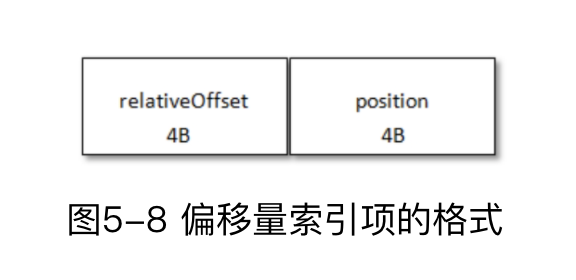

时间撮索引和偏移量索引是类似的

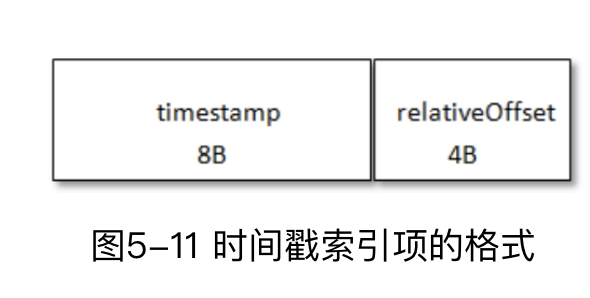

# 5.4 日志清理

## 日志删除

按照一定的保留策略直接删除不符合条件的日志分段。

### 基于时间

查找是否有保留时间超过设定的阈值的分段

### 基于日志大小

查找是否有超过设定阈值的分段

### 基于偏移量

基于logStartOffset，如果一个分段的的最后一条日志的偏移量小于logStartOffset，这个分段可以删除。

即一个分段的起始偏移量小于等于logStartOffset，则这个分段前的分段都可以删除，因为低于logStartOffset的日志不会被消费了。

## 日志压缩

针对每个消息的key进行整合，对于有相同key的不同value值，只保留最后一个版本。

参考redis的模式kv

# 5.5 磁盘存储

## 顺序写

> Kafka 在设计时采用了文件追加的方式来写入消息，即只能在日志文件的尾部追加新的消息，并且也不允许修改已写入的消息，这种方式属于典型的顺序写盘的操作，所以就算 Kafka使用磁盘作为存储介质，它所能承载的吞吐量也不容小觑。但这并不是让Kafka在性能上具备足够竞争力的唯一因素，

## 页缓存

操作系统把磁盘缓存到内存中，以便减少对磁盘的IO

> 对一个进程而言，它会在进程内部缓存处理所需的数据，然而这些数据有可能还缓存在操作系统的页缓存中，因此同一份数据有可能被缓存了两次。并且，除非使用Direct I/O的方式，否则页缓存很难被禁止。此外，用过Java的人一般都知道两点事实：对象的内存开销非常大，通常会是真实数据大小的几倍甚至更多，空间使用率低下；Java的垃圾回收会随着堆内数据的增多而变得越来越慢。基于这些因素，使用文件系统并依赖于页缓存的做法明显要优于维护一个进程内缓存或其他结构，至少我们可以省去了一份进程内部的缓存消耗，同时还可以通过结构紧凑的字节码来替代使用对象的方式以节省更多的空间。如此，我们可以在 32GB 的机器上使用28GB至30GB的内存而不用担心GC所带来的性能问题。此外，即使Kafka服务重启，页缓存还是会保持有效，然而进程内的缓存却需要重建。这样也极大地简化了代码逻辑，因为维护页缓存和文件之间的一致性交由操作系统来负责，这样会比进程内维护更加安全有效。

Kafka大量使用了页缓存，当然他也提供同步刷盘和间断性刷盘的功能。

## 零拷贝

从磁盘读取文件，然后发送到网卡，这是一个很复杂的功能，读取数据时，数据不会从磁盘直接读取到进程的地址空间，发送数据时数据也不会直接从进程的地址空间发送出去，他们都需要先经过内核。详见[这一篇blog](/QPI740.html#more)

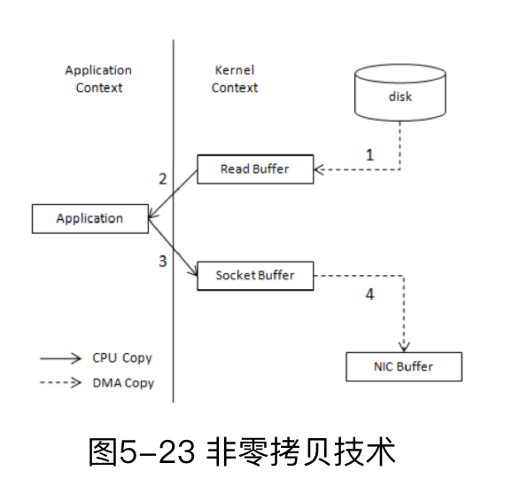

> 从上面的过程可以看出，数据平白无故地从内核模式到用户模式“走了一圈”，浪费了 2次复制过程：第一次是从内核模式复制到用户模式；第二次是从用户模式再复制回内核模式，即上面4次过程中的第2步和第3步。而且在上面的过程中，内核和用户模式的上下文的切换也是4次。

如果使用零拷贝技术，操作2和3就可以省去了，并节省了CPU大部分的时间，如下图

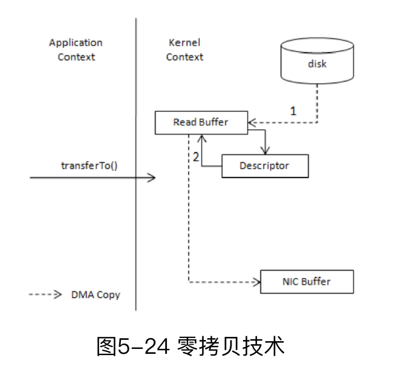

# 6.1 协议设计

Kafka的每一个请求都用公共的请求头

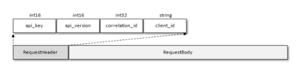

请求头有四个部位

| Field          | 备注                                 | 大小  |
| -------------- | ------------------------------------ | ----- |
| api_key        | API标识                              | int16 |
| api_vesion     | API版本号                            | int16 |
| correlation_id | 请求ID，服务端会在回复中加入相同的ID | int16 |
| client_id      | 客户端ID                             | 未知  |

响应头就很简单了，就一个correlation_id

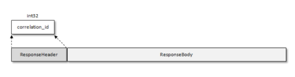

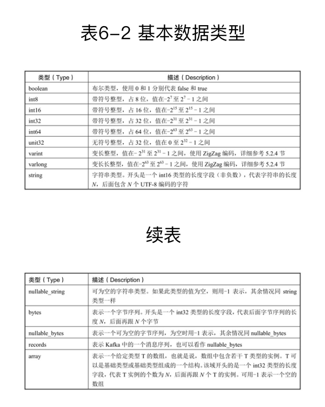

# 6.2 时间轮

[这里介绍的很详细](/QR4S3C.html)

# 6.4 控制器

> 在 Kafka 集群中会有一个或多个 broker，其中有一个 broker 会被选举为控制器（KafkaController），它负责管理整个集群中所有分区和副本的状态。当某个分区的leader副本出现故障时，由控制器负责为该分区选举新的leader副本。当检测到某个分区的ISR集合发生变化时，由控制器负责通知所有broker更新其元数据信息。当使用kafka-topics.sh脚本为某个topic增加分区数量时，同样还是由控制器负责分区的重新分配。

Controller 需要负责监听分区的相关变化、监听主题相关变化、监听broker变化等

>在Kafka的早期版本中，并没有采用Kafka Controller这样一个概念来对分区和副本的状态进行管理，而是依赖于ZooKeeper，每个broker都会在ZooKeeper上为分区和副本注册大量的监听器（Watcher）。当分区或副本状态变化时，会唤醒很多不必要的监听器，这种严重依赖ZooKeeper 的设计会有脑裂、羊群效应，以及造成 ZooKeeper 过载的隐患（旧版的消费者客户端存在同样的问题，详细内容参考7.2.1节）。在目前的新版本的设计中，只有Kafka Controller在ZooKeeper上注册相应的监听器，其他的broker极少需要再监听ZooKeeper中的数据变化，这样省去了很多不必要的麻烦。不过每个broker还是会对/controller节点添加监听器，以此来监听此节点的数据变化（ControllerChangeHandler）。

# 8.1 副本剖析(较难)

> Kafka从0.8版本开始为分区引入了多副本机制，通过增加副本数量来提升数据容灾能力。同时，Kafka通过多副本机制实现故障自动转移，在Kafka集群中某个broker节点失效的情况下仍然保证服务可用。在 1.1 节中我们已经简要介绍过副本的概念，并且同时介绍了与副本相关的AR、ISR、HW和LEO的概念，这里简要地复习一下相关的概念：
>
> - 副本是相对于分区而言的，即副本是特定分区的副本。
> - 一个分区中包含一个或多个副本，其中一个为leader副本，其余为follower副本，各个副本位于不同的broker节点中。只有leader副本对外提供服务，follower副本只负责数据同步。
> - 分区中的所有副本统称为 AR，而ISR 是指与leader 副本保持同步状态的副本集合，当然leader副本本身也是这个集合中的一员。
> - LEO标识每个分区中最后一条消息的下一个位置，分区的每个副本都有自己的LEO，ISR中最小的LEO即为HW，俗称高水位，消费者只能拉取到HW之前的消息。

## 副本失效

从0.9x开始，通过唯一的broker端参数replica.lag.time.max.ms来抉择，如果ISR中一个follower副本滞后leader的时间超过这个参数，则副本失效。

在0.9x以前，kafka还有一个参数replica.lag.max.messages， 如果ISR的副本滞后消息数量超过这个值，也会失效，但是

> 若设置得太大，则这个参数本身就没有太多意义，若设置得太小则会让follower副本反复处于同步、未同步、同步的死循环中，进而又造成ISR集合的频繁伸缩。而且这个参数是broker级别的，也就是说，对broker中的所有主题都生效。以默认的值4000为例，对于消息流入速度很低的主题（比如TPS为10），这个参数并无用武之地；而对于消息流入速度很高的主题（比如TPS为20000），这个参数的取值又会引入ISR的频繁变动。所以从0.9.x版本开始，Kafka就彻底移除了这一参数，相关的资料还可以参考KIP16[1]。

## ISR伸缩

既然判断失效的参数只有一个，那么有关ISR伸缩的参数也和他有关，与ISA相关的定时任务有两个“isr-expiration”和“isr-change-propagation”。

### isr-expiration

isr-expiration周期性（间隔为replica.lag.time.max.ms/2）检查每个分区，如果ISR副本失效，则把收缩ISR的信息写入zk（此时还没有进行伸缩）

### isr-change-propagation

isr-change-propagation周期性检查isr-expiration写入的信息，如果发生变化且满足以下之一

- 上一次ISR集合发生变化距离现在已经超过5s。
- 上一次写入ZooKeeper的时间距离现在已经超过60s。

isr-change-propagation会写入zk执行收缩ISR的信息，这个节点的信息会被[Controller](#6-4-%E6%8E%A7%E5%88%B6%E5%99%A8)监听，剩下的事情就交给controller了

### 何时扩张

follower副本的LEO追赶上leader副本的HW时即可扩张。

## HW 与 LEO 的更新

每一个副本（leader副本、follower副本）都有LEO，leader处的副本管理器还会储存所有follower的LEO（这个LEO往往和follower不一致）

1. 先来看一个状况，这里灰色broker为leader，此时follower向leader发起同步请求，并携带自己的LEO，leader会根据请求的LEO更新自己的HW，当然这是第一轮，还不需要更新

   

2. leader回复follower的同步请求，并返回自己的HW以及follower所需要的数据，follower即可借此更新自己的HW和LEO

   

3. 随着时间流逝，leader中被生产者插入了数据，一段时间后follower发起了新的一轮同步请求，当然继续携带自己的LEO，leader接收到请求以后，更新自己的HW为3

   

4. leader准备好自己的HW，follower需要的数据，返回给他们，follower此时即可借助leader 返回的HW更新自己的HW

   

这里我们意识到一个问题，注意到笔者对刚刚发生对四个步骤标了号，仔细观察步骤2和步骤4之后的情况，我们发现HW似乎并不是所有副本（leader副本+follower副本）的LEO的最小值，HW的更新要慢一个请求周期。

## 消息丢失

我们注意步骤3过后，步骤4以前，leader的HW要比follower高，除非leader回复follower的同步请求。

如果此时leader发生了宕机。更特殊的，右边的follower发生宕机，则左边的follower称为新的leader

当新leader上任以后会截断HW到LEO的数据，HW后的数据都删掉了。

随后所有broker恢复服务，旧leader发现新leader的HW比自己小，旧leader只能截断自己的HW，此时数据就丢失了。

书上的图很蠢，知乎上看到一个讲的很好的图：

>①数据丢失【Scenario 1: High Watermark Truncation followed by Immediate Leader Election】
>
>假设有A、B两个Broker，初始时B为leader，A从B中取到消息m2，所以A中有消息m2了，但是由于在下一轮RPC中，A才会更新自己的HW，所以此时A的HW没变。如果这时候A重启了，他截取自己的日志到HW并发送一个fetch request到B。不幸的是，B这时宕机了，A成了新的leader，那么此时消息m2就会永久的丢失了。
>
>
>
>原文链接： https://zhuanlan.zhihu.com/p/46658003

## 消息不一致

考虑数据丢失的情况，如果宕机的机器恢复的时间更晚一些，新leader写入了新数据，HW后移，旧leader恢复时，会发生数据不一致。

还是知乎的图

> ②数据不一致：【Scenario 2: Replica Divergence on Restart after Multiple Hard Failures】
>
> 假设我们有两个Broker，初始时A是leader，B是follower。A接收到m2消息，但B还没来得及复制时，断电了。过了一会，B重启了，成为了leader，接收了m3消息，HW+1。然后A重启了，截断日志到高水位，但是此时的消息却出现了不一致。
>
> 
>
> 原文链接： https://zhuanlan.zhihu.com/p/46658003

## Leader Epoch

>造成上述两个问题的根本原因在于HW值被用于衡量副本备份的成功与否以及在出现failture时作为日志截断的依据，但HW值的更新是异步延迟的，特别是需要额外的FETCH请求处理流程才能更新，故这中间发生的任何崩溃都可能导致HW值的过期。鉴于这些原因，Kafka 0.11引入了leader epoch来取代HW值。Leader端多开辟一段内存区域专门保存leader的epoch信息，这样即使出现上面的两个场景也能很好地规避这些问题。
>
>所谓leader epoch实际上是一对值：（epoch，offset）。epoch表示leader的版本号，从0开始，当leader变更过1次时epoch就会+1，而offset则对应于该epoch版本的leader写入第一条消息的位移。因此假设有两对值：
>
>(0, 0)
>
>(1, 120)
>
>则表示第一个leader从位移0开始写入消息；共写了120条[0, 119]；而第二个leader版本号是1，从位移120处开始写入消息。
>
>leader broker中会保存这样的一个缓存，并定期地写入到一个checkpoint文件中。
>
>当leader写底层log时它会尝试更新整个缓存——如果这个leader首次写消息，则会在缓存中增加一个条目；否则就不做更新。而每次副本重新成为leader时会查询这部分缓存，获取出对应leader版本的位移，这就不会发生数据不一致和丢失的情况。
>
>原文链接： https://www.cnblogs.com/huxi2b/p/7453543.html

kafka0.11以后引入leader epoch，每条消息被设置了纪元信息（epoch），在遇到换代时，新leader不会截断HW到LEO的数据，而是去请求旧leader上一个纪元的HW是多少。

备注： 万一旧leader宕机了，还不是会丢数据？？？？？

### 解决换代丢数据问题

新leader会发送纪元信息询问请求给旧leader ，这时候旧leader返回他的HW，新leader旧不截断了

> 
>
> 图片来源： https://zhuanlan.zhihu.com/p/46658003

### 应对数据不一致

A恢复的时候，会对B发起纪元请求，截断LE=0时代的消息1，即用这条消息丢失换取数据的一致性。

> 
>
> 图片来源： https://zhuanlan.zhihu.com/p/46658003

## 读写分离

kafka不支持读写分离，主要是读写分离有几个缺点

> （1）数据一致性问题。数据从主节点转到从节点必然会有一个延时的时间窗口，这个时间窗口会导致主从节点之间的数据不一致。某一时刻，在主节点和从节点中A数据的值都为X，之后将主节点中A的值修改为Y，那么在这个变更通知到从节点之前，应用读取从节点中的A数据的值并不为最新的Y，由此便产生了数据不一致的问题。
>
> （2）延时问题。类似Redis这种组件，数据从写入主节点到同步至从节点中的过程需要经历网络→主节点内存→网络→从节点内存这几个阶段，整个过程会耗费一定的时间。而在Kafka中，主从同步会比 Redis 更加耗时，它需要经历网络→主节点内存→主节点磁盘→网络→从节点内存→从节点磁盘这几个阶段。对延时敏感的应用而言，主写从读的功能并不太适用

其次是kafka使用分区的方式来解决负载均衡。

