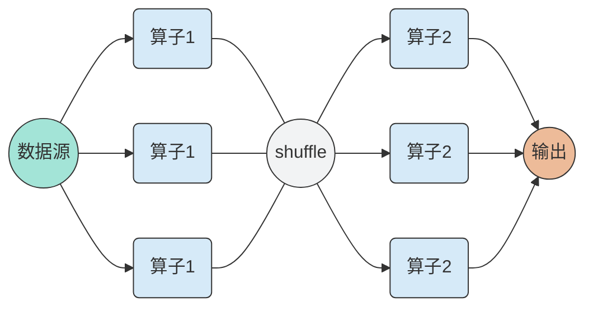

# 测试公式
公式前面加文字$\begin{aligned}\sum_{i=1}^{123} f(x)\end{aligned}$公式后面文字
$$
\begin{aligned}\sum_{i=1}^{123} f(x)\end{aligned}
$$

<!-- more -->

# 测试Mermaid

```mermaid
graph LR
  %% style
  classDef green fill:#a3e4d7,stroke:#333,stroke-width:1px
  classDef blue fill:#d6eaf8,stroke:#333,stroke-width:1px
  classDef brown fill:#edbb99,stroke:#333,stroke-width:1px
  classDef grey fill:#f2f3f4,stroke:#333,stroke-width:1px
  
  %% point
  start((数据源)):::green
  op1(算子1):::blue
  op2(算子1):::blue
  op3(算子1):::blue
  op4(算子2):::blue
  op5(算子2):::blue
  op6(算子2):::blue
  output((输出)):::brown
  shuffle((shuffle)):::grey
  
  %% edge
  start --> op1 & op2 & op3 --- shuffle --> op4 & op5 & op6 --> output
```

# 别忘了最后还有一个评论系统
