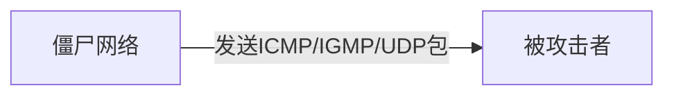
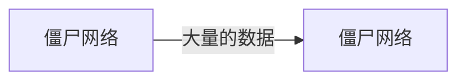

# 1. 笔者序

这篇Blog记录了笔者对《破坏之王： DDoS攻击与防范深度剖析》的学习记录，贡献出来和大家一起学习。

为什么学这个，笔者的服务在2021年9月4日晚上遭受了惨重的DDoS攻击，攻击者使用了100多台肉鸡，对笔者对服务进行了持续的CC攻击，最终导致产生了18TB的流量，这部分费用总计高达4000元人民币，当然在腾讯工作人员的积极帮助下，对这笔费用进行了处理，笔者也不用对这些费用进行支付，所以笔者在此由衷地感谢腾讯云团队，另外也感谢笔者的大学室友，谢谢你们的帮助。

<!-- more -->

# 2. DDoS攻击的来源

## 2.1. 僵尸程序与僵尸网络

僵尸程序就是可以控制计算机的一些程序，这些程序不一定是恶意的。僵尸程序可以自发性的进行传播，高度可控，且自带加密。

由分布在大面积计算机上的僵尸程序组合在一起所形成的大型网络。僵尸主人可以控制整个僵尸网络。

>僵尸网络的另一个特点是，控制者在发布指令后，就可以断开与僵尸网络的连接。之后，控制指令会在僵尸程序之间自行传播和执行。因此，僵尸主机能够在控制者很少或不插手的情况下协同合作，共同完成一项任务。

## 2.2. 僵尸网络的组建

- 感染传播，僵尸程序的感染手段和蠕虫、木马等无差别。
- 安装执行， 僵尸程序会进行自我复制，开机自启，隐藏自身。

- 接入僵尸网络， 当僵尸程序安装并隐藏以后，就会构建`C&C`通道加入僵尸网络。
- 命令执行，接入僵尸网络的僵尸程序就开始执行僵尸主人的指令，或者向僵尸主人发送心跳以等待僵尸主人的命令。

## 2.3. 僵尸网络的类型

### 2.3.1. IRC型僵尸网络

僵尸网络的拓扑图如下，僵尸主人和C&C服务器进行通信，僵尸网络和C&C服务器进行通信。僵尸主人向C&C服务下发指令，C&C服务器向僵尸网络下发指令。

> 

当然呢这个架构有很多问题，首先C&C服务器存在单点故障问题，然后防御者可以伪装成IRC僵尸网络的一员，从而监控整个僵尸网络。

### 2.3.2. HTTP型僵尸网络

HTTP型僵尸网络的拓扑如下，对于IRC型僵尸网络，HTTP型可以选择更多的通信端口（IRC通信端口是固定的）， 另外僵尸网络的控制流量（心跳）会淹没在大量的WEB通信中。

> 

### 2.3.3. P2P型僵尸网络

P2P型僵尸网络有了很大的提升，首先C&C服务器不再存在单点故障问题，P2P协议也没有什么特征，很难发现僵尸网络的踪迹。

P2P型僵尸网络中有4个角色，僵尸主人，C&C服务器，Servent服务器，Client服务器。

Servent服务器主要负责执行指令和分发指令，因为他们具有公网IP

Client服务器主要负责执行指令。

> 

主要介绍一下半分布式P2P僵尸网络，Servent会维护一个有限的链表，其中写着其他Servent的IP

在Servent被感染时，需要攻击者将通过硬编码的方式将一部分其他Servent的IP写入，当Servent启动以后，会去连接自己已知的Servent，并将他们所知道的其他的Servent写入自己的链表，当链表满了的时候，会直接覆盖最老的IP，这样可以保证链表中都是比较新的IP。

这有点像IP协议了，IP协议中每台机器都没有全局路由表，但是他们可以通过局部路由表实现所有的寻路功能。

当僵尸主人下发指令的时候，有C&C服务器下发，进而Servent互相下发（重复则丢弃），最后到Client

这样的架构，如果一个僵尸节点被捕获，也无法窥探整个僵尸网络的全貌，就是一些僵尸主机被封杀，也不会影响到僵尸网络。这就是集群。

## 2.4. 僵尸网络的用途

DDoS、发垃圾邮件、窃取隐私、抢占系统资源（挖矿）

# 3. DDoS攻击的方法

## 3.1. 攻击网络资源

攻击网络资源，是对被攻击者的网络服务进行攻击，这些攻击会导致用户的请求将在到达被攻击者的业务处理前就被拒绝。

### 3.1.1. 直接攻击

使用僵尸网络向被攻击者发送大量的网络数据包，以占满目标的带宽，从而达到拒绝服务的效果。

这些攻击手段主要包括ICMP/IGMP洪水攻击和UDP洪水攻击两种。

- 在ICMP洪水攻击中，直接发送大量ICMP包

- 在IGMP洪水攻击中，直接发送大量IGMP包

- 在UDP洪水攻击中，因为UDP包的大小是不固定的，所以分为小包和大包攻击，小包攻击指的是使用64字节（以太网上传输的最小数据帧）的数据包，小包攻击将导致各种网络设备对数据包进行检查、校验，这直接消耗了基础网络设备的处理能力。大包攻击指的是使用1500字节的数据包，这个大小将导致UPD包被网络设备进行分片重组，也消耗了基础网络设备的处理能力。

### 3.1.2. 反射和放大攻击

反射的原理主要是依靠IP欺骗，利用一些网络协议中的应答数据包来实施攻击。

// TODO 开Blog介绍NTP协议，介绍DNS协议, 介绍SNMP协议

- ACK反射攻击，直接作用于TCP协议，发送SYN消息，反射器就向被攻击者发送了ACK应答。
- DNS放大攻击，作用于DNS协议，僵尸网络发送dig查询命令，DNS服务器就向被攻击者产生了应答，由于DNS的应答数据包要比请求包大，所以僵尸网络的流量将被DNS服务器进行放大，这个倍率一般为2-10倍
- NTP放大攻击，僵尸网络发送monlist请求，NTP服务器产生的应答数据包要比请求大700倍，这将导致一次非常恐怖的袭击。
- SNMP放大攻击，同上

### 3.1.3. 攻击链路

链路层攻击指的是占用链路资源，直接导致被攻击者的网络拥堵。

通常将僵尸网络分为两组，其中一组向另一组发送大量的数据包，这些数据包都会途径用户到被攻击者的链路，导致用户到被攻击者的链路被阻塞，产生了拒绝服务。

分组通常使用traceroute工具来完成。

## 3.2. 攻击系统资源

于攻击网络资源不同，攻击系统资源往往专注于对被攻击者的服务器性能的消耗，通过占用服务器资源来达到拒绝服务的目的。

### 3.2.1. 攻击TCP连接

// TODO 开Blog介绍TCP协议

1. TCP连接洪水攻击

   僵尸网络中的大量受控主机向被攻击者发起大量的TCP连接，并完成三次握手（每台主机都发起大量的TCP连接），被攻击者在TCP连接表中维护TCP连接，僵尸网络中的TCP连接占满了被攻击者的连接表，最后用户无法建立TCP连接，产生了拒绝服务。

   

   > 

2. SYN洪水攻击

   由于TCP连接建立的时候需要三次握手，且TCP采用ACK机制，如果受控主机在进行TCP握手的时候，只发送一个SYN，然后忽略掉服务端返回的SYN+ACK,那么这将导致服务器认为这次答复产生了丢包，而不断进行重发，最终服务器的资源被消耗，导致了拒绝服务。

   当然SYN洪水攻击也可以伪装IP，从而达到隐藏的效果。

   > 

3. PSH+ACK洪水攻击

   > 由于带有PSH标志位的TCP数据包会强制要求接收端将接收缓冲区清空并将数据提交给应用服务进行处理，因此当攻击者利用受控主机向攻击目标发送大量的PSH+ACK数据包时，被攻击目标就会消耗大量的系统资源不断地进行接收缓冲区的清空处理，导致无法正常处理数据，从而造成拒绝服务

   > 

4. RST洪水攻击

   RST洪水攻击比较有意思，僵尸网络中的主机可以关闭正常用户与服务器的连接。

   在TCP连接中，TCP挥手的时候有好几种情况（不要以为一定是四次挥手），其中如果发生了异常，则发送RST报文，发送端此时不需要等待缓冲区的数据全部发送完毕，而是直接丢弃它们，然后关闭TCP连接，接收端也会清除缓冲区并关闭连接，并且不需要回复ACK。

   攻击者利用这个特性，伪造自己的IP和端口，向服务器发送RST包，这时只要这个包的序列号在服务器的接受窗口中，则RST生效，用户的连接被迫关闭。

   在内网中，可以通过嗅探的技术来获取序列号

   
   
   > 
   
   在外网中可以通过大量的猜测尝试来解决

   > 

5. Sockstress攻击

   Sockstress不是洪水攻击，相反而是一种慢速攻击(Low and Slow Attack)。

   TCP连接传输数据的时候，会先把数据储存到缓冲区，接收端会有一个接受缓冲区剩余可用窗口大小，如果这个值为0，则表明接收端的缓存区已经满了，发送端应该停止发送数据，直到窗口变化。

   Sockstress三次握手时，在最后一次ACK应答的时候，将他的TCP接受窗口大小改为0，此后攻击目标就会不断的询问攻击者其TCP窗口是否有更新，但是攻击者不会修改自己的窗口，所以这样的询问会一直持续，直到占满服务器的资源。

   >  
   
   > Sockstress攻击的另一种方式是将TCP窗口设置为一个非常小的值，例如4字节。这样攻击目标将不得不把需要发送的数据切分成大量4字节大小的分片，这会极大地消耗目标的内存和处理器资源，造成系统响应缓慢和拒绝服务。

### 3.2.2. 攻击SSL连接

在SSL协议中，有这样一个现象，服务端和客户端的CPU计算资源消耗时不一样的，特别是RSA 4096算法，服务器消耗的CPU资源要比客户端高出25倍。

1. THC SSL DoS攻击

   在SSL协议中，一旦完成了密钥协商以后，就会使用对称加密，对称加密是不存在CPU计算消耗不对等的情况的，所以突破点在非对称加密。

   SSL协议中有一个Renegotiation选项可以重新进行密钥协商，攻击者不断的发送Renegotiation选项，最终通过CPU消耗的不对等，从而拖垮服务器。

   如果不支持Renegotiation选项，攻击者也可以通过建立大量的SSL连接实现相同的效果。

   > 

2. SSL洪水攻击

   在SSL握手阶段，由于服务器需要对客户端发送的数据进行解密以及校验，这个过程很消耗CPU资源，如果客户端发送错误的数据（伪造不耗CPU），则服务器就被淹没在大量的解密和校验中了。

   >  

## 3.3. 攻击应用资源

### 3.3.1. 攻击DNS服务

1. DNS Query洪水攻击

   DNS QUery洪水攻击选择大量的不同的域名去请求DNS服务器，让他内置的缓存无效化，并增加他的负担，直到拖垮。

   > 在DNS解析的过程中，客户端发起一次查询请求，DNS服务器可能需要进行额外的多次查询才能完成解析的过程并给出应答，在这个过程中会消耗一定的计算和网络资源。如果攻击者利用大量受控主机不断发送不同域名的解析请求，那么DNS服务器的缓存会被不断刷新，而大量解析请求不能命中缓存又导致DNS服务器必须消耗额外的资源进行迭代查询，这会极大地增加DNS服务器的资源消耗，导致DNS响应缓慢甚至完全拒绝服务。

2. DNS NXNOMAIN洪水攻击

   DNS NXNOMAIN洪水攻击选择使用不存在的域名去请求，DNS服务器无法解析这个域名，会想上一级DNS服务器进行请求，攻击者因此可以进一步消耗DNS服务器的资源。

### 3.3.2. 攻击Web服务

1. HTTP洪水攻击

   注意到HTTP协议是基于TCP协议的，在握手以后才开始HTTP通信，所以HTTP洪水攻击无法伪造源IP地址。攻击者通常使用HTTP代理服务器进行攻击。

2. Slowloris攻击

   HTTP协议规定，HTTP报文分为请求行、请求头和请求体，其中请求头和请求体间有一个空行，所以如果没有请求体，则HTTP报文以两个`\n`或者`\r\n`结尾。

   如果攻击者在GET请求中一直不发送`\n`且缓慢地发送HTTP头，则服务器的资源会一直被占用，最终导致拒绝服务。

   >  

3. 慢速POST请求攻击

   在POST请求的Body中，一个字节一个字节地发送HTTP Body,这样缓慢地传输会一直占用服务器的资源，最终导致拒绝服务。

## 3.4. 混合攻击

对不同的攻击方法进行分类，然后混合多种攻击，这些攻击相辅相成。

|  攻击分类  |                           洪水攻击                           |              慢速攻击               |
| :--------: | :----------------------------------------------------------: | :---------------------------------: |
| 网络层攻击 |                      ICMP/IGMP洪水攻击                       |                                     |
| 传输层攻击 | UDP洪水攻击 TCP连接洪水攻击 SYN洪水攻击 PSH+ACK洪水攻击 ACK反射攻击 RST洪水攻击 SSL洪水攻击 | Sockstress攻击 THC SSL DoS攻击 |
| 应用层攻击 | DNS QUERY洪水攻击 DNS NXDOMAIN洪水攻击 DNS 放大攻击 HTTP洪水攻击 SNMP放大攻击 NTP放大攻击 |   Slowloris攻击 慢速POST攻击   |

混合攻击可以绕过一些防护设备

> 例如，将SYN洪水攻击与ACK洪水攻击组合在一起，SYN请求包及与之匹配的ACK应答包，就能够绕过一些防护设备的反向探测算法

混合攻击可以掩盖拒绝服务的真正原因

> 将Slowloris攻击和慢速POST请求攻击混入到HTTP洪水攻击中，攻击目标在发现攻击并进行处理时，大量的洪水攻击会淹没了慢速请求攻击，而无法发现被拒绝服务的真正原因

# 4. DDoS攻击的治理和缓解

下图是针对DDoS各个步骤的治理和缓解方法。

> 

## 4.1. 僵尸网络的治理

- 编写僵尸程序清除工具，拦截C&C服务器的通信，但这样往往只能清除冰山一角
- 接管或者摧毁僵尸网络，如Nitol僵尸网络，僵尸程序需要与3322.org服务器进行通信，于是微软直接点名指控3322.org域名的所有者，最后接管了该域名，Nitol僵尸网络被摧毁。

## 4.2. 地址伪造攻击的治理

- CERT， 需要ISP配合，ISP过滤掉下面的流量

  > 从外部接口进入内部网络的数据包，但源地址属于内部网络；
  >
  > 由内部网络向外发送的数据包，但是源地址不属于内部网络。

- RFC 2827,需要基础网络设施支持，如路由器，这些设备要对网段中发出的包的源IP进行校验
- Unicast Reverse Path Forwarding, 详见BCP84， 也要求对基础网络设施进行升级
- 分布式过滤，路由器根据数据包的源地址和目的地址判断其转发路径是否经过自己。如果不经过，则丢弃该数据包

## 4.3. 攻击反射点的治理

- Open Resolver Project ， 这是一个国际组织，可以帮助使用者判断某个DNS服务器是否可以作为反射器，其原理是从多个地方对该DNS服务器进行请求，观察该DNS服务器的响应情况

  > 如果一个DNS服务器可以被从任意地址访问，并无限速地回应查询请求，那么它就可以被用作DDoS攻击的反射点。

- RRL(Responsee Rate Limiting), 限制DNS服务器的响应速度
- NIST， 这是一本名为《安全域名系统部署指南》的书

## 4.4. 流量稀释

流量稀释本质上只是使用了更多的机器来处理DDoS攻击。

- CDN技术（这里不展开了，这个是计算机网络基础知识）

- Anycast 任播技术，任拨技术可以让一组主机使用同一个IP地址，一般是无状态服务使用的，可保证高可用性和负载均衡，通常由一个路由器下连接多个主机，请求报文会转发到最近的那个主机。

  

## 4.5. 流量清洗

- IP信誉检查，对互联网的IP地址分配一个信誉值，当发生网络拥堵的时候，优先丢弃信誉值低的包。
- 攻击特征匹配，发动DDoS攻击往往需要工具，这些包有时会有一些工具的特性，比如THC SSL DoS攻击时，反复地协商密钥
- 速度检查与限制，一些攻击发生的时候，他的包很多，如各种洪水攻击
- TCP代理和验证，使用代理服务器进行流量清洗，即可缓解SYN洪水攻击，见图

   > 

   >  

- 协议完整性验证，有一些攻击只发送包，但不自己解析，比如HTTP攻击时，发一个HTTP请求，服务器返回一个302后就结束了。

   > 

   > 

- 客户端真实性验证，可以使用图片验证码、动态执行js等等来处理。

