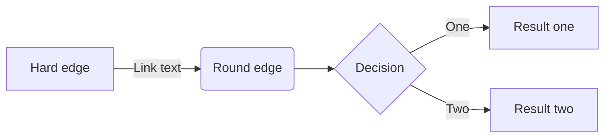

# 这里是测试页面

测试mermaid

```mermaid
flowchart LR
    A[Hard edge] -->|Link text| B(Round edge)
    B --> C{Decision}
    C -->|One| D[Result one]
    C -->|Two| E[Result two]
```

```mermaid
-version
```

测试公式
$$
f(x) = \frac{1}{\sqrt{x}}
$$
测试行内公式$f(x) = \frac{1}{\sqrt{x}}$

测试图片
