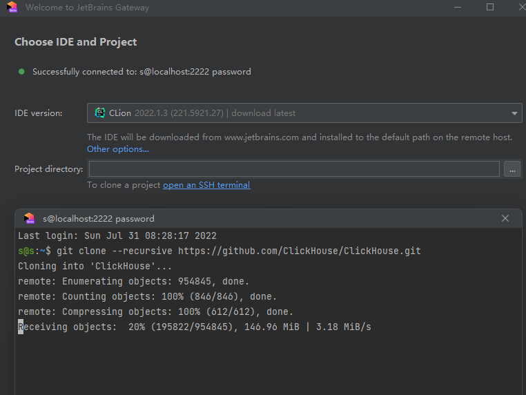

# 搭建Clickhouse源码学习环境
Clickhouse源码不是比较好运行，强烈建议大家专门为Clickhouse搭建一套学习环境，笔者这里选用的是[VirutalBox虚拟机](https://www.virtualbox.org/)搭建[Ubuntu22.04-server环境](https://ubuntu.com/download/server)

注意CPU给多一点，不然太卡；注意储存空间不要分配太小，笔者第一次空间就分配少了，只给了25GB的磁盘，后来很难受；宿主机必须要有[VPN网络](https://fightinggg.github.io/RFJ220.html)，虚拟机选择NAT网络模式共享VPN,否则不论是前期的操作系统安装（在线更新），还是后期的源码下载、依赖下载，都会非常非常慢

通过 VirtualBox 的NAT端口转发，将虚拟机的22端口暴露到宿主机的2222端口(你也可以使用其他宿主机端口)

使用[JetBrains Gateway](https://www.jetbrains.com/remote-development/gateway/)的Clion客户端，通过SSH连接虚拟机的Shell,并下载Clickhouse源码(这一步由于我们连接过VPN，速度会非常快)
```
git clone --recursive https://github.com/ClickHouse/ClickHouse.git
```


此后使用[JetBrains Gateway](https://www.jetbrains.com/remote-development/gateway/)执行shell指令，不再直接通过virtualbox的窗口执行指令。


至此，开发环境基本搭建完成，接下来我们准备安装Clickhouse相关依赖


