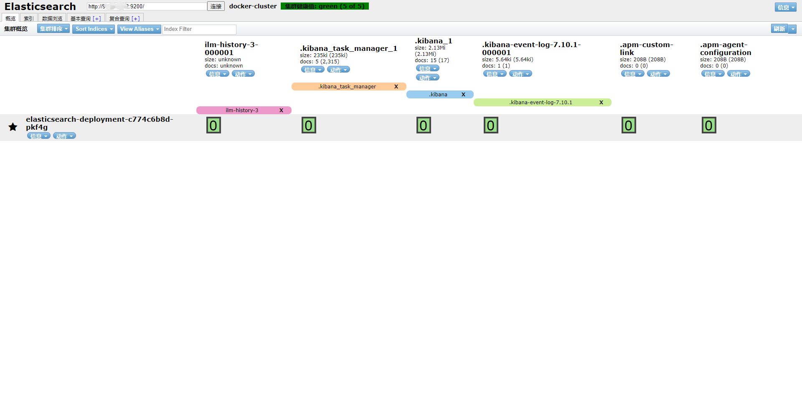

## Elasticsearch

### 文档

https://www.elastic.co/guide/en/elasticsearch/reference/current/elasticsearch-intro.html

<!-- more -->

### Install ES

#### Docker Install ES

```sh
# see https://www.elastic.co/guide/en/enterprise-search/current/docker.html
docker rm -f elasticsearch kibana enterprise-search

docker run -d \
--name elasticsearch \
-p 9200:9200 \
-p 9300:9300 \
-e "discovery.type=single-node" \
-e "ES_JAVA_OPTS=-Xms512m -Xmx512m" \
-e "xpack.security.enabled=true" \
-e "xpack.security.authc.api_key.enabled=true" \
-e "ELASTIC_PASSWORD=changeme" \
docker.elastic.co/elasticsearch/elasticsearch:7.10.1

# username enterprise_search
# password changeme
docker run -d \
--name enterprise-search \
-p 3002:3002 \
--link elasticsearch:elasticsearch \
-e "JAVA_OPTS=-Xms512m -Xmx512m" \
-e "ENT_SEARCH_DEFAULT_PASSWORD=changeme" \
-e "elasticsearch.username=elastic" \
-e "elasticsearch.password=changeme" \
-e "elasticsearch.host=http://elasticsearch:9200" \
-e "allow_es_settings_modification=true" \
-e "secret_management.encryption_keys=[4a2cd3f81d39bf28738c10db0ca782095ffac07279561809eecc722e0c20eb09]" \
-e "elasticsearch.startup_retry.interval=15" \
docker.elastic.co/enterprise-search/enterprise-search:7.10.1

docker run -d \
--name kibana \
--link elasticsearch:elasticsearch \
--link enterprise-search:enterprise-search \
-e "ELASTICSEARCH_HOSTS=http://elasticsearch:9200" \
-e "ENTERPRISESEARCH_HOST=http://enterprise-search:3002" \
-e "ELASTICSEARCH_USERNAME=elastic" \
-e "ELASTICSEARCH_PASSWORD=changeme" \
-e "secret_management.encryption_keys=[4a2cd3f81d39bf28738c10db0ca782095ffac07279561809eecc722e0c20eb09]" \
-p 5601:5601 \
docker.elastic.co/kibana/kibana:7.10.1 \
/usr/local/bin/kibana-docker \
--enterpriseSearch.host=http://enterprise-search:3002
```

#### K8s Install ES


```sh
echo -e "===prepare workspace==="
if [ ! -d "workspace" ]; then
echo "create new workspace"
mkdir workspace
fi
cd workspace

echo -e "===goto current space==="
version=$[$(ls | sort -n | tail -n 1)+1]
mkdir $version
cd $version
echo "Version: $version"
echo "Space: $(pwd)"

echo -e "===deploy to k8s==="
mkdir deploy
cd deploy
cat>elasticsearch-deployment.yaml<<EOF
apiVersion: apps/v1
kind: Deployment
metadata:
  name: elasticsearch-deployment
  labels:
    app: elasticsearch
spec:
  replicas: 1
  selector:
    matchLabels:
      app: elasticsearch
  template:
    metadata:
      labels:
        app: elasticsearch
    spec:
      containers:
      - name: elasticsearch
        image: elasticsearch:7.5.1
        imagePullPolicy: IfNotPresent
        env: 
        - name: "discovery.type"
          value: "single-node"
        ports:
        - containerPort: 9200
        - containerPort: 9300
        resources:
          limits: 
            cpu: 0.3
            memory: 2000Mi
          requests:
            cpu: 0.3
            memory: 300Mi
       # livenessProbe:
       #   httpGet:
       #     path: /
        #    port: 9200
       #   initialDelaySeconds: 10
       #   periodSeconds: 3
      - name: kibana
        image: kibana:7.5.1
        imagePullPolicy: IfNotPresent
        env:
        - name: "ELASTICSEARCH_HOSTS"
          value: "http://127.0.0.1:9200"
        ports:
        - containerPort: 5601
        resources:
          limits: 
            cpu: 0.3
            memory: 1000Mi
          requests:
            cpu: 0.3
            memory: 300Mi
        #livenessProbe:
        #  httpGet:
        #   port: 5601
        #  initialDelaySeconds: 10
        #  periodSeconds: 3
EOF

cat>elasticsearch-service.yaml<<EOF
apiVersion: v1
kind: Service
metadata:
  name: elasticsearch-service
spec:
  type: NodePort
  selector:
    app: elasticsearch
  ports:
    - port: 5601
      targetPort: 5601
      nodePort: 5601
      name: kibana-web
    - port: 9200
      targetPort: 9200
      nodePort: 9200
      name: es-http
    - port: 9300
      targetPort: 9300
      nodePort: 9300
      name: es-tcp
EOF

kubectl apply -f elasticsearch-deployment.yaml
kubectl apply -f elasticsearch-service.yaml
cd ..
```

### Chrome Head Plugin

[插件地址](https://chrome.google.com/webstore/detail/elasticsearch-head/ffmkiejjmecolpfloofpjologoblkegm/related)



### Shell 连接

```sh
curl -u 'password' IP:9200
```
